Test date: 2021 Feb 15


## should check to make sure that the owner of the contract is the msg.sender
[link to test...](http://github.com/cds-amal/crypto-fpl/blob/34472c11912f7281a066bfa50cc485d67a6b6112/test/cryptoFPLCards.test.js#L24)

##### d1, tx: 0x4cea443da5267247ea1c6ab1d17bce64344e2e47bdb030e1c3843c1b2b731a28

[SVG :telescope:](https://www.planttext.com/api/plantuml/svg/NLDHRzem47xthpXrBvkwRavYI40CbH2oLffKf5NQIwNAiIyGDJZ8SLRIil--8qG8wWUVVNV-xhlFDcEtjPFMDPkICTcuoZIR32shNmgpbLPkeCGL6XrBzRAoLMFql2eh2v_IHRgOBnYRrAujSSgW6skK6Ysyzrk0kyeMRvLnifoLnSfiq3X2pDqf8QNW4NBRs6s95u7VnHk29qw-fTIwC2lmUE_wrzd9zvu4w-lVcxfOhLqDMGkFjibpmcMkS2N2uyx0dQpNO-0xeL0A4MWvy8UXBqAKdXhApDDUc2aSYa08z564cSvumD5JGIG2vML-5WQUz2D6aYb7r1SFCv0rN96zOYIRArInbTJgtBPRLwNBNy_SwpBE7LUCTIVWPleX0DVNOr2LgPrj3WK-FvadDkar_zhRwVu7k7QBGDR8JMV_ohAXnI5z3qr13FRmJ9hRDaNoWy-FmI_m3lmRXvz_5lSaueVg1pv7OZTZOEpu0jZoh2-DJXPbVSOfuGdd_C29BfewfSMSRj2IG2TsCwqjrXGxdPlkE-retZcqHfPb2m-l1ZNCbABNTk3FTu6OnzoBL2f6F8cKac6Qv3pdyro867N2rGYzFEQNm1VQdsqxo84_qCCu6oLY8LGO9eD0ZFGezlqXfdawY7Ze9JA8CeAatdi5s2tDz5F-0m00)


## should allow the leagueAdmin to pause the contract
[link to test...](http://github.com/cds-amal/crypto-fpl/blob/34472c11912f7281a066bfa50cc485d67a6b6112/test/cryptoFPL.test.js#L40)

##### d1, tx: 0x7c83591b5a2229fe096357ac72b829197e2ba16b16e191225cbd4251bc6c65ff

[SVG :telescope:](https://www.planttext.com/api/plantuml/svg/NLFVRziW47xdhpXrBvkwRe1_4cLHuoHUAqrgf5NQIwKAOvnOTN24yHgtsV--YsD5INdWuExuxhiF8EIsSTAwTbCH8bjNctQJQKkQbz9ifPKRgFHAcpoHwcLbwzRaixggBNnA5-bYjY1atBYkqXC2_LXhcMiBxyCMuAwsvLjjdAocLRao6sqS8XRkb91Yy0YvRUssqXU1t-MR1kQVV4kPvwLP0QE3wrzlnzy74cIeVs-QShLs3MGTFDgsA12NkD9L6Xvt1kvainu1tKKgzWB1ia1opaMXgGYz898gubdC1HEHvfbaOSP2pGJZF51PxlE0PIfKOL0K12LJ3gal7gOW6xX2UqLGDbUgSYknrPdjjgvEbx-UAUippXrNXFGdu6Ro8G3NroDGjMcSRGy5FZ-P9p8UDFywsCd-1xXkgm6jaPlU_fLLYuj3-XxQ4XdiuHarjrsgqG-S7eDVu1teDme__opkKSGFrGzyZiHkHa38yGMGvLbVkNQoh9epJdCwfvGUEE55OwUucE4DMXJen6wQvrOt63kTc-nxxN3UEMsDhAeE7bwDpc6g5Bws0t-wy_nPGbciKb_GUQoKZD9vGGiwAtm_qVcSAg5PaT1Bu0ljpxOzP5e86ISX2oAFHu68kC-enpq_4TCeyLBXJwCy4d68aDZxe02vnHb_ody0)


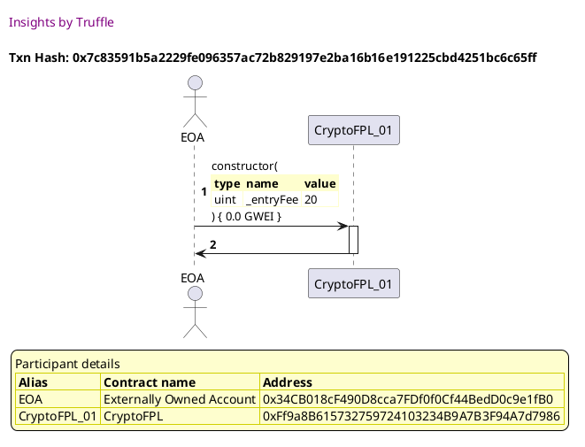

##### d2, tx: 0x105bb21b4c342bcc21728811ceb8fb1230c38497a07714c048c66156659abb51

[SVG :telescope:](https://www.planttext.com/api/plantuml/svg/NL9TR-CW47pdLwpInxOwi4cmgpIgxSJgIISrqlNzX04dLWcECDOblTv_xzQnegGyy36ppEuE4FBK1Ub3lxE4o3wqhjzLnfFkhN5xwUKEhDaOftEftZQ-xPqkMjjwk2bNvQfO4JBlmj6Q1O5XR8tKniE_yGZmtFhclNL1sims6xSpBg1Y7Su19P8doNtlzzPS4R-RTmECdx6rrBfn6s1qXFuFw_p7M0GPy_zqNRFPXWwg8xpwlgvHbuGcM0El1mVFiji-03qmEgsgY5LSnJogb8gOY9A4CMMgfAvO55CL9pmLaWh1kA8yKRCPcyvcqrHMrPGHj4m5B7trae7iO8BhXA1jeL7DNcAhXJ_kGrkkV_sXR8Yu12Q433VWVl6DWDlR1o3ViA-eK_WzakJqBcHzaKsR81lRaVduEdStIxgab2u-7W7jn_ouAT1NZsM3aplp1MHQUzCXTxwt-1WwmlaGZ7VIsYEy_7L6GwOK_e6053t4lCWfIrJ9KxfCb9AYNDQqfaNDUMxqaghKi3gdry9NZbmS1ycoJcMIeyKYZiGq5H5dD8vYdgUPoECovPdG8arcA8czZmwG9vpn_tu2)


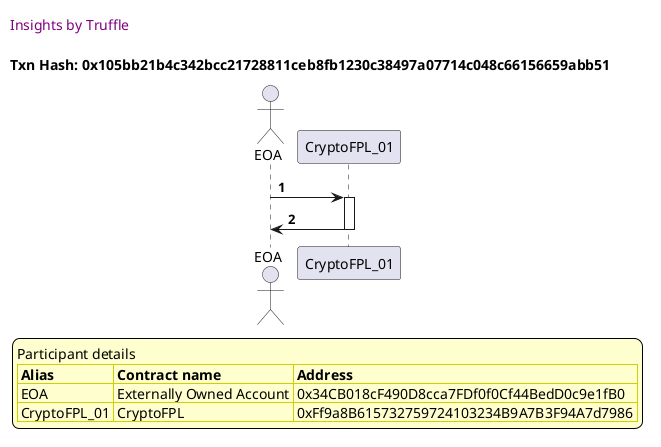


## should not let players call certain functions if the contact is currently paused
[link to test...](http://github.com/cds-amal/crypto-fpl/blob/34472c11912f7281a066bfa50cc485d67a6b6112/test/cryptoFPL.test.js#L46)

##### d1, tx: 0x762946009ea97c6acb39074ab1032acf8ff4fedb73636b431ea577d6644b6185

[SVG :telescope:](https://www.planttext.com/api/plantuml/svg/NLFRRjim37tNLn3TouQkcto9Bq4MD7RijS201bY1lHGeP5qIeuvioF8Qjzc_Zt6C8AaVH8ca3W-FQ49kMykCxROL8QopjUwsXJIaVIbrmmpRGYNNKek4yPUrgJijqhgg3NpAipnBCq9chUqhEISmV1l9X3JmFXu1xcfJljNQicfHbMkzbTeYehAdX1o3HyYcCqqbBmA_opS9Zd_ohPWGfLw3GqVNly7Eleyao5Z_NhVbUcDRA7fuD9rIY4jiQIi9ZpiDTwpTJ87kmi2D_O3IMB8uv07ZXHVJq6U5GpsNSHKfvIifYj0BlA3mFKUoIHYA8F3z8d2Y2K79k4NgsSC2M0jNQAy8ocPBNZOCMqrDtzWwN_rwfiwGSUwu8cIu0JVp3m6ulfu2htLhJNSeyFb9Fv7PgFdNqSxtFy3sZGIqccq7-vTL7MuEwNleIcImXsVKtFIvH3-uz1Zy0kz0lr7u-IUxHn4_L3_mEHAxcG8XnmaWgxE-XBIihDepJakwf9GUEE53OwUuIV453GfqOhSGmiWMOwTxy_sW7QuxAurcLTN3mwkM0XQSuxGT-DETvwS9TIAU-p5THfopC5yggcYgV3-HOabvB1sLq4lW2-tFZWEactfnxCOqYGgU-SKoAoOontb8ioncr0c2I7c9kmWH4diV5I2tkEAVyXy0)


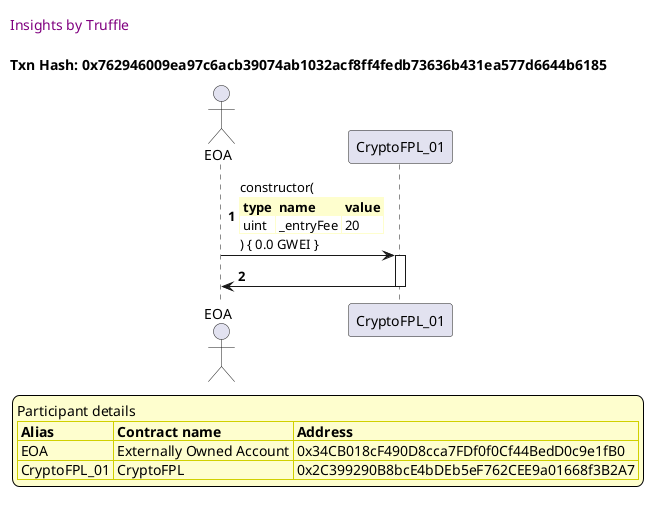

##### d2, tx: 0x372b61ffb363856f52f61e688a83442a3f7d1576266e59cccd8afa00a68f275a

[SVG :telescope:](https://www.planttext.com/api/plantuml/svg/NLB9Rjim4BtpAmR9CGrAxLBW6h4sf42166ZknOYBBKIc38f2xJJzzqnamR330vVtXczc7idOu-3Gkd7NCOQZwysuQvHbmsjhzcXn1vtQA2Dp5AyRsuz65dtNMxYjgxegAiOMWpjsQibW6bk5KbduDny1ddhRllN6ORVgsetPAUD8KRjpG4taIN8_sdsdheZVxPi2BpnZQvIoDHlm-0pzdzR5zxa8DkV_QOPsitK3D4TuiQFMfCjSwpe5BmS3JpXi7u0VWiHlOa_h9eY3D8frvElOKt6QOXg4eO-1JgGN9R4VnohAX10oHOsSOvngFucGaMN2KUdLymfmW1jQRnZPvbhHxf5QBUnnx_fw_UiFzwQ8I-26iUa6t2-_471tzm3i2_OPTGg_9vATteMjBx99vR3j1hQON-VRRSbBpldo_GUG_PIVDWNvQgbiCBXJdy1AIgi6uixtbkzJHpGVdB86k-u8pt-Dah0IWlw08uhS2ukSUwcemuoNgH2OrANccXSw37CbIouovUcSNmjVEN9nd2Jz8iWoF-DvseWgRCggYLHD_XTLbI7tOl8zoFrLGfBK--m0UwIP_ky7)


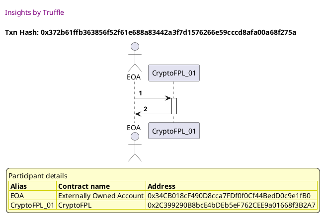

##### d3, tx: 0xe12093f5b3a02a6bd1785a7b0857bb4ce89be41b8dbfb5541c7f7efa96265d35

[SVG :telescope:](https://www.planttext.com/api/plantuml/svg/dLDjJzim4FxkNt623snYR7bftX2hIDCKa2Q1DgHz6DFabqiQBNKYnu4Mkl--QnjGOTzcMJxxxdn-xhapO-UTvSRsYventjj6zmk1XdM_AzromnTGOubQJRZyNPgcrofhwiR0uIoVvLdEs5bdLpME6Mp77Bb20q_34U2oCTLZeoslqxegzGArfOY5VN6OaN4NikrDM-ChmxVg4S4TlUXkk5ALBi5r1jMVhJpxD81Wm_jNkglAkUr0hE3Mz4L1SPcjR8rmkzHmoRlvAJXBT3qdyOj0-DpnU2YK6yK1ZuGJ1v4G8ubn8d3aYbY9GWJ1o9LH4M71az0B0-K7Z2YJbg3drodm3Wv87Z2YpLQoQZcbcfbLQvlPpPTVZhlrs5SSCBQz0IVZDmOuFZu5QP1RlE0BV7UdxzZPGFc7GOxNdy6kMWIIcfmsyfxNFMqsxcleAmAmXWTU4YDhuipPMTx34pWVdUrmuU9xVaKqldb_UVBZi35Sb_Xp0sw7ykGKlgBjZOR_0zHPiodU6cWUPLphnW8kKVOMmSwh3efUIrir6Xxcg45I0nZY5yZIyhv3TJGam1IIlhedUlvXTDUkx6Ql20ejh-fk3_3KcLBo6y3KbLGMscJFhpr3JvKos97jvTvulIqqhKkBHlEwNi7rWqO5gPJqDJPiEqilyhES-aDE9WxtS3Rb2IycAf5-F0qzaQLHwXVHTFGwyAj6sJlkGcP-adY9Cuc5p4TYcei0Pr7ePNcUSCSDmxZm9ruQKKZAVM20dTDAt_el)


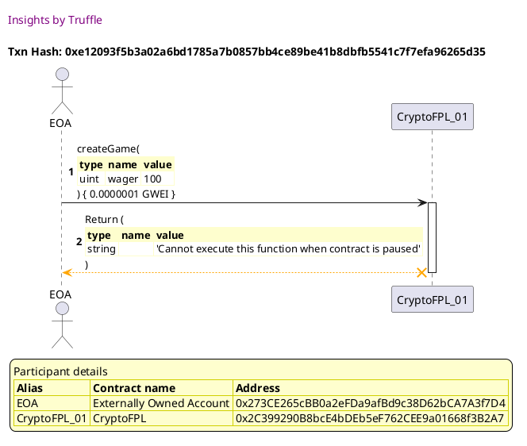


## viewGameDetails() should return correct game details
[link to test...](http://github.com/cds-amal/crypto-fpl/blob/34472c11912f7281a066bfa50cc485d67a6b6112/test/cryptoFPL.test.js#L68)

##### d1, tx: 0x740421b8552b2c557295ad3492a67cfb80bc49d54f1ec8470dd8cb154635c9a5

[SVG :telescope:](https://www.planttext.com/api/plantuml/svg/NLFVQzim47xNNt5qBnjTDzcHOpjaeOb_h8L10olifL1aIKvC7Td8yXgtsV--isD2KZtefBlJTzzzaWYvRImtjjsLXF3MLhhTPSgGvgNGDJTy1wNQA2rNNBniJDLg6LLbPU1JcgH9b10oRsnNgWM1OMmLbyh0-xW5kAjCyLPfoyjbMMpqJccBYBaz9QGOF4BMhQbBTH7uNRmfSDZ9j-PI5de33XrT_mOx_pwI86FzUzqKcwrj8ElWqRHvZhZ45hPKyBZNSCURxGpetcUKkKuMU9wRkSBpV3Vqk9omqELJN-HPG3F1Gkcnt54YO3wLCX2Pux7fn1CXzmXA9YnIJnwMm1kuGdj5K3PRYABcs6fakjfMwVhNCtM6Z7F75I732RXPV0Z0zVKCHAKRQzg-mESd_KJce-PVHxiu_03RrGhGQhuRx5zUjhZeqm_G5iZW0C-ekUbIXNvmwJ7u1Tw1VgFmyqzoZo9-gDxpEHAxcG4XnnT0rcTzIMLvKJPdd68QKqfxJdZHs2ak8hn1WmATs2sbDAh1sEdSuZ1eX_FUAgDvMNRmyAgLXAKG-Dfw_dG_OT6AEe58MKZZG0Zkft5ESnhbZAsKZAa8bPElw2NmXVPdsm5IJ0CdYcCfHSmyuKr35MG9ZnpNpnBcgM199MMSzv3O-wW0kSKPVyf_)


##### d2, tx: 0x62718cd0db734715611cc7ba19d659f017f35d3550585875c345cc1c06b5474f

[SVG :telescope:](https://www.planttext.com/api/plantuml/svg/fLDHRvim47xthpXbBvkwRdR0GA8iAW7ILfhKQAkqbqgJiKsAIanaJ9kqsN_VXR0ewUiivBFlpjzz_dmGSjKuOLsxgWWHhQjDkygr9SrJQTR2YXLKUgcDcWdvjBHrQrHILxM53_DidYKP8PF6RIiz9T2DHosKjl3MRm5kQbk-riQ9AgxAfLbfun2nSCU4EGOFaElMhYjz5lXPlcfW_j6t44gLPWcCzgu_dPryxKcGllwjQShbesiWtyAzROi2SOahNQNXVcFWHZIFOw2RO1YoI2ggyj3pGyO3ngGCSy56Ak2ZWhAmyBZoEASyub78fUTpAPcaGSxzq2y8IYOTKi_kOX0D3D0E2ChcIbck1LuriTkrg-UBxxyfwp9E7GD2kXDmENqNW8kBCKYhXTFNOgK_FfW7Ckab_zpRwUuRkErQ0rg3INlxBAeM5_lq7RGb4jZ1YrYY8ZlKZ1uYd-0Dw1VQ3GRNlx9RbF5T_JsZ0xNBCVpGhhK6_ei5Vl_A4t9eAR8u4Kff9yggES5FQOe4z_ZOEIWTBX9i2OkA7ol5IbdTOEnuRhhh7WFdZTFMYAhQmjsBqGfYAR5zzrpePXXwIJOCk9pDg1ZgUIf6efYfaVIYD1ZcIHp6NX6c_ZdmsMEUR3j86KGiILEbP8fDmeEHZl9C96mOvfdFTHHJHNqXK0I2T-yL85Suuw_t5m00)


##### d3, tx: 0x0b1a8d90713ff9127966a1f9b20e09cc41852fc199901238306c656919192f80

[SVG :telescope:](https://www.planttext.com/api/plantuml/svg/fLDHRzem47xthpYnbqrTDpia8K4CbIQXHPfKj5NQIwN9iPsGrJZ8SJPesN_V4I84VPqZ-MpV-RlFtrq8kMaSjwvTQq9uwshJhdDbIVDScGstV0rQbSh8MowUIrktHYQrhYsycsVpBCa8cJHkfzMKG3TMYajbuRNV0jpNjdgfZUDwfglIh9LnY5YuKy0SdKV8JMitMbqulbSl2fX_EbjoAIjJ0gFzqT_EJZxt94YVVs6Qgbov1l8TFDgsA12NkCff1OzR0_UyMOs1RcdEU2HZEcB3eeYPDuh3aBCYpZsgQ2o4pwB0AmIBuvWoRnWDQIZ288mPVbuHKOAI2OVKiuSPy0O6Q0S4PNELg3OSdvhOtSRLy-NNdvHr4US70qAw6t0zVUE0gwin_AehSyVNwlsJUIAJNl2FlPtklu3RRHIWDHXqiB-vRd5n2Dz3Ms7wFPJeMqXSqAFZ0xoYUltuHE7kHxP05T-aFn0wChiUmpVbMclWlsYS4I3as55aUQQJL8vNkZd3JscA30_us3Ye72uIx0YBWfyopQIqga7VwTvqtzK2vwrJrd2jT_3mnoW9Co6mUmzSw5QnKPg5GK17dWXexC-3OUZ7QHJuNi2Z9C8oH_Hsc5y2NzJoRDj1YZ1YIPfAAL8_4DWZAiepdc1FvPaVg6X69VKvHn48lhrNWDpWZ7_UFm00)


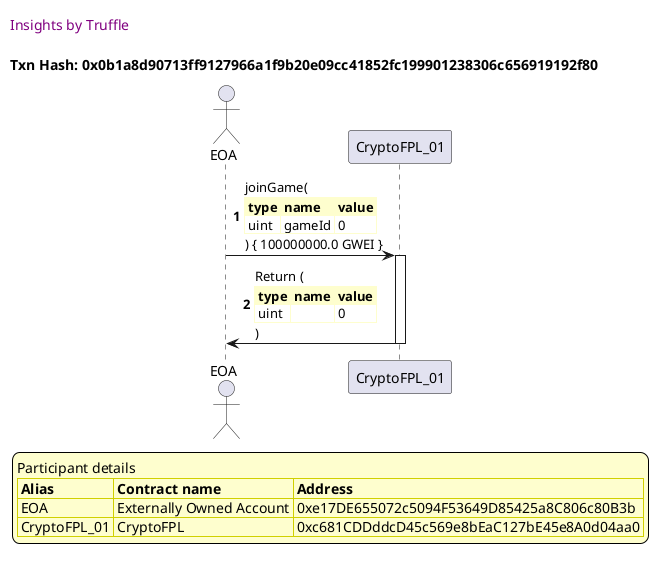


## should let game creators deposit an initial wager into the game
[link to test...](http://github.com/cds-amal/crypto-fpl/blob/34472c11912f7281a066bfa50cc485d67a6b6112/test/cryptoFPL.test.js#L81)

##### d1, tx: 0x9ceb0432e84697ba9d71ffc93c1bc2e64a6a417de414a6785621fab674872ef7

[SVG :telescope:](https://www.planttext.com/api/plantuml/svg/NLFRRjim37tNLn3TouQkc-Ju4WTPqCInrm836c05zbAWa7L9Z3go8Sjht6R_FiOnWgH-42cIEZmyaWcvRHothjsMXF3MLQRTvigIvgKmDRTy2wLQAoCNNBoiRTKQcLHbPU5JbcPfaX8oRLnNgXc1_jieBfM5zs4BS5VPugqoZfVpibYRhJ8E4RKx5MIOF4BMhQrBTP7uNRmfOFufjk9I5cODZ0wXVxsTVXz8aA7_lMcAzSOra7VmQ5kj4PUumfKA7dS6xdYpcG3TnKBbr1zvQko7SPJpM4PCQn6F1Ck5fqAVXzndaLG-GpSQ1w77DC_3o1z7dj8HGSc4G-hfmnnu0rTehmZAvWfHr1n7JMnNkofR_NgchAyu3rmHqf-0czc715nVJq1Kfd6sFJJu_6IUo7JG_EjWP_iVuBfQ0Lh3jxtzoyiMdKFv7je26UpX6JMtNQOm3Xuz9h_0Ez1l57x-IUzHn0_T3toEn6ucGCZn1P3LsLnIELwKpHcd9LrIIW-SyA9nKdGIl46B0ftOpQMqgi7SwTnitsk7wyufQtXPTl3mQfI4kH3usWxywMxa9mlAnYBpOxeS2y6ZRAcffeds_OMIIofYnVI2NW9VQ7-sxI6z85Zm96ESXrI5El92pc9VKneb8WZIqPm6oqm44Y5nza41Seih_Yd_0G00)


##### d2, tx: 0xb57730698ef26560dc74c52d0afec041a85803d31e9ba755319de2021b1d3422

[SVG :telescope:](https://www.planttext.com/api/plantuml/svg/fLDHRzem47xthpXrBvkwRav24a0TQWX9MsbIqLPfBvMcmxxGgC51ZjD2o_xx3iWGz7LMvBDzv-y-VtSHugfnQ5sxg8J0rjMcNSp8YkQfD4kqk82AvcJq6DNJtDQjqMbTrHO-v5cUfPaGburRLpGIi1kFX9eil7LRW9lQbg-rSLWbLJat2pAE4Gjt2CZPkOTSjdPPqOdZP_bAuFKEPrFKkZHpy6Htz6TdBxzs94IN_zOqvVpHDJ1RmxrjYu9nXIjTHN2_Cd23pUCGv6eMnd4Weq6V2ZyA8wbLt5EXhoKMf6JFmtxObu4EF1hCC0x3m1jeygNlpJmTz7nVi6JACVNiBW5iu8pjcM3PNAdA9V9JKxjUkZgVVlyjlLt4yS6P4BiRS35wvu3pyo4eI-Ze6XVqyS4yYCjEyi-T7Ms-WLil2TWQ3jhQPwnQNcp3Dz2MJ603BpXdHJQicTnxFi4Ro2zoDpou_fNTieplycyPxQbT3E47kTOQ-2yM_FrBByI-fSJqI2XD3ikgESAVo0aJtE9pvx1ql4Yv9ImhViYKQ6sfOT_XtcYpAmRFAqVMO5MjuUx5a8P4AMxVBHUvykCWpRZaQZoMw5C-mG4MOprGGNyI-RCqYPEWY2UzK-2JOXvjzv1XECOqzn0ZIL4H-n5wWruXPPogCCo2H8QJN8MQ8VdjdGBYYcV-zVu2)


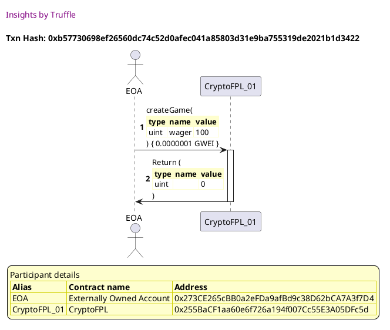


## should let a second user enter a game if the game is still open
[link to test...](http://github.com/cds-amal/crypto-fpl/blob/34472c11912f7281a066bfa50cc485d67a6b6112/test/cryptoFPL.test.js#L88)

##### d1, tx: 0xb0e736f9a39231dda18a1ba7a0b5a76fa56dbd97e15632eef91044b3063b0767

[SVG :telescope:](https://www.planttext.com/api/plantuml/svg/NLDDRzim3BthLn3TPKFNJOeTVmHPqCInrm836c05TYbGq9QS67LaGvRNkCt--nZ729Bg84eazVZu935ssrWqjjsMZ65hAzrkKsLOyrBe6WrkeLHhfUK2ivUrgLejewgi37nAuYIEOiQcZUrADMFGZur2gGoy3rk0kyeKRvMsMCxBOgstIbj2pEqf8Q7W4R9kJLsgYy3luas1S4--5KfPw3K8FhZ-zNRwVI31XlhtkYdM6zj0si6ZQVESS9ajRAdWSQVX3flD1FWkvSftl3n49nmvGaeK0OeKVUJf67qlnx4dKndwIemzPwHK7Whkkgd3FIVblkSpaYopH3r-c0CsS4NsYf5ijiYA6gdLo7IrhPBLhsSk-enpnnLZ_GcucNq8mFNr1B9ADzQqXmAVd_GJcmwQVntiRFy3R5Sh8Ajnszk_MBQqEAJleIs8mHwUINFJ9OhyCEB7u1Tu1_wDmyy_yJs9-A7wWS-HsCq463k-0BOwwqigYqNPd75QyYNd_C29BfewfKL4DsX8e1ExkPH6DHGxdPljU-retbbbD9Pb1m-lMacOPnczjWD_ldFSQC55a2Lko9T1bg6VB7EUyoXttOMIIvw5IkGBVWbyeVtPjeVqH13w8t-42vS714iWGHpbKIQa4xZ-N0IEbtgfIv3K-w00kwMPVif_)


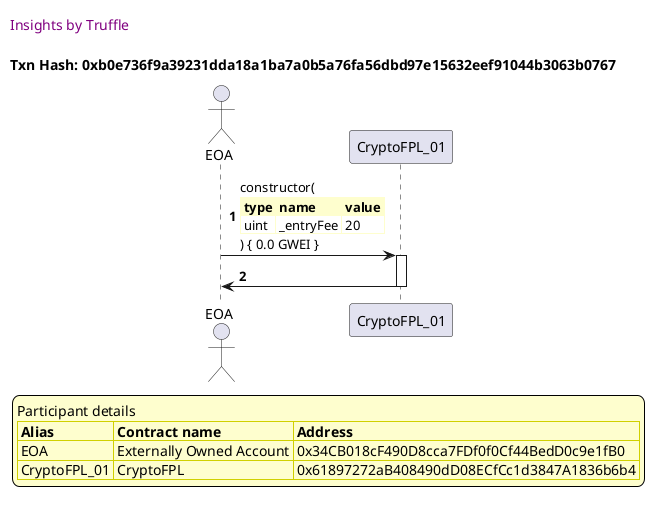

##### d2, tx: 0x23ada6f63862b9a2fe9c3ba60c0832232f45cddc4cf604007d5967e481fe97de

[SVG :telescope:](https://www.planttext.com/api/plantuml/svg/fLFVRzem47xtNt5YBvkwRiuFae0OQWYXhJIfQAkqbqhJOJjfrE0WnscXPV_xBY53qDTPaS_sdR_x_Ds5iQlQeh7DkcGC6rlfPhrIXjLFXTwWmJMKAbTQpb0yvQPgj4ogiZBmOP4kqYHbR5BRNQcc3Bhng50g0s_z5k2cCiLhfIsMSLdaUgsq9SJC7WCMv3n0RXgpATMPusVngi3nZsTBbBBGEJYyF_hJsSdNdWJhyz_gkiWVRGsh7ToR9ii8bzd2bWhkjnfki7uS0z-w7aeCii2B0dSrGZTJ8-6jCE22HvxhUcxc3uMKmXTPm7tEGpaS1Q7o8uSYGqcO38KbwkbT35Z3WEo0aMos4CK6wQc9sMrijLX-_ysTBkBqOC1OTmCkf-ySS74n1c4KMdMDQ_NnGJ-mII_vvzvEzz_0xZOAo6eAQkqpbWqjsl0zD0KHsCCBvgJ8dZJZ1yydU0F-XNV3WUjVwIt9-2v_o-X0xN8CFvHjZ8R_Oa7Vl_IC7LgABK-4aifYKTOd-7C-9u8jFdKEIKUBX5h2aEB7JB6KHjNaEzwRxhjYqBorocWiontSlMWb8HQ2shVbGeKFlIHrWw6OpJYwQZ774MOpITMFvjGAIHp6NXRE_NFWisAUR3l8m8b6eHkwEFDvv8-udFCeJR94EDAB_31s8YzO1QiMajxUAy2kQAPVxoy0)


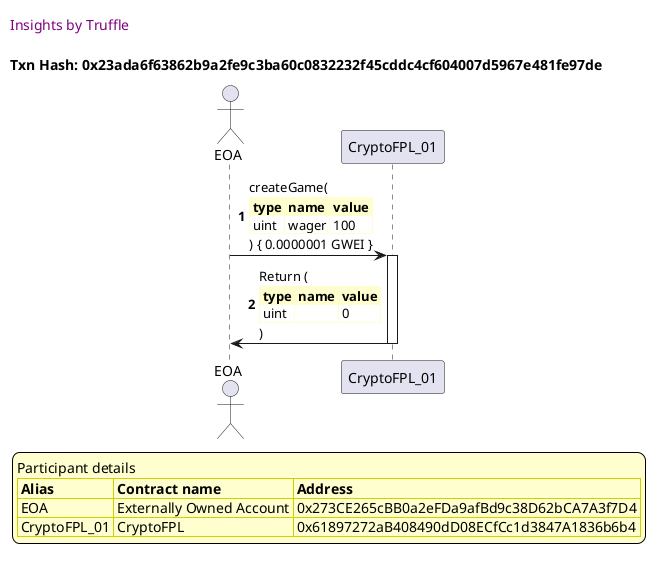

##### d3, tx: 0x430c13d4bc2cd17bbba234484a24513576107ded6e207ba81a2ccf2d671ea246

[SVG :telescope:](https://www.planttext.com/api/plantuml/svg/fLFVRzem47xtNt5YBvkwRdRY_00nL1f2YpIfQAkqbqgJOvkGDJYHuspGilzzHuWGz7L-y9rzv-y-VpuJSjCuOLsxAGaHhQjCkycq9SrpOMfXnGPAdMkZReLypctL6fLKPMNXtJoTfqbAoBXnkr9F27HZhONI5bxx9S1zPOkNoZXHJiiYDnjj72Akt2bXZi4ZPDtQkjGNWU_5YmR6JtjBeLHXSc2qt_hRsV7ddWJfwozCK-Hhrq2sWqVRhbQ8IrpXIWsFMmFtebcFW6wvJoNp5S-a9nMBiYmJdizvp8N70-O7KSXefBGAjKUZJCHCU5AkF1L6J6DAI50owP1w-Z05qS00xO2WRAwGHItmgedTrQwQBx_-fApBEDyO4DATWEl9cm1SNOtWLrMOEx7Hxv_C4ndtWd_ixMJ_1Tokre3MODB1_XPbYyuXVGzjWUNta6DieT2Xny07U0NwYNQ3mTsFT84QlYb-e7FaTJs2Rzgrri1_aJWhJyYndyZoJ2MbdIZAvWn_HcT8y82FROEwePDWFrYK-rHfgfJL3SPEvoRxxYLmtZfjZIZB7JpyCLh1L4hitGCNkjKicgLX4D38am4TyddWXtmuYmFk1I9EOXhAcDxwsINmnKkUBJl8aCN3o8iySSjfp8TKpMYS9gj4CkN7F9gos0-pCEC8YNVl5I0tEEE_-mS0)


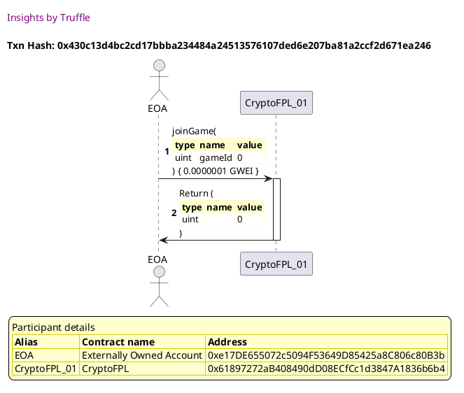


## should not let a third player into the game
[link to test...](http://github.com/cds-amal/crypto-fpl/blob/34472c11912f7281a066bfa50cc485d67a6b6112/test/cryptoFPL.test.js#L95)

##### d1, tx: 0x07abc0b15228f537f7571fa1cf2886d8f167aec08bed747eb456965fa21e47e1

[SVG :telescope:](https://www.planttext.com/api/plantuml/svg/NLDTQzim57tNhxXqBnjTDydnLq8McZZsMXWqiC9U2aMMfSHKaOqiht6R_VVTE2OazOEkxeVEFVT89kIsSTowTgi9uQshJBlDfINDIsbgRlaMj5nBKoouU5dRgZL5KkdAmgSipT8a9MJQk4xB6O7-sqXUI0llWmjmLzdohJAEwxakrsOhZKD4vKu56IQFa7LhQoql4h_BDmdCFyLMl2XAimP6Xz2_taw_3oJ8qF_UDELwunh8EtYqhLA8Irpfj8J7dO4xtcmcG7SquhcWEGiyBrR1A59H4375cL1U78T5h5WOSIbedCiYyYEP-q4u3WF5FIRHPGGb4mwffmzpu0rSeRqYA9ihHLbp73MnNUsgRFNhcRA-uZnmHKX_0cvc7n9mVJq1KPd6sVRGuFEJUIBJGVElWvtjVu3hQWbe3T_szY_NBMuEvNjeIsImXsVKt7QPn3Xuz9Zy0kz0lr7u-IUzHn4_T3_mEHAxcG0XnnT0LcTp5TBnKZTdd9PqIIazSCABnabna-0DMXJen6vU55Osc3kTc-rxxN3TEMaDrxg3XrSZ2vWBWQ_jm9_kHdwoe2mMcJ-corW87cLBHHLDbEylPB6aOYoPMj1Bu0ljpzmUqijzNmMvzEbynA9H7dfHc4fl5CI9JoEFAnK6oIXV82JEFYX0Rd75F-K_)


##### d2, tx: 0x4a1e1adf049a0a1449126fb817674f19184fcde64187ad175876f11ab7279259

[SVG :telescope:](https://www.planttext.com/api/plantuml/svg/fLDHJzim47xthpYnbqsCpKxSk46i8arJG9f4jI7j1Mcw97Q9I9tASQ25xh_lscPLuNLMvBFlpjzz_dnXxBBrw7otg1d3pZUsM-JQiVQniajqk81QpxKjnrWypbtJsJ9jwiR1XsaspTACiOlMhsizOh0R3nfBxU2rtm9SDwvwQQp7EgchkLrewmdH-4F2b89xo6NdbhL-4_XPlMWGyk2ROLbMTWw2zwu_EtlnjIV1-letjgtc3xw5V0rthZE6S9clVAtXRcNX6jk7S-0hYK8BB0sNCN8KKiOYY4m-52fIqeXO3AKfIXr9CLHO2ZKOgiW8WRaAL1mCOaQI5PwePxS9O0idP4yOoUQhebeYNJLrwwLlfhFllxdOPHmxJXZRdO2pqRi0d9wUG-4qUds52_tntjwpYrxopxqTRRw1NoyraBMKjBLFM7UqsAPleAk8m0QUSKwAR4WplezyWbVWN_Xk2BZwbTsGZE_gRndjgPsTmm_jEsVXlrZGzwyyO_kMOhCZeKhjiQhR8_m9dn31BJvr3ab7YvHQmf7YXqf9MJhTKknmRhJPFGRDAw-TnRfUm-sprIKaHK7jk-N2Lu4Aqoo81iLup37Gqmd6QCPbN8J3IHJaQQAIqAY9V0lyvZ6Fjdl8N4epoBNaIIXKc4U1YZ8TX8DXAhaAq9Xea8Rvc23fxhq2x99c-lN-0W00)


##### d3, tx: 0xec81857710fd46ac727dd8fdb7e5a6c39f23f1fd8be79594b98008325aeff294

[SVG :telescope:](https://www.planttext.com/api/plantuml/svg/fLDDRzim3BthLn3PPKFNJVwsWonewZXjW04DjWAx51XaItAyAh8XorlIPlzzZ6C4IQ_JGPH4wl7faIBafhNCs6wZ266ThNMtoOKXxNEb6sRO1fGeXUQth7WkJTrfdjQgDl1kaIsoD2DaqjgT4bC2_LWBneM1rs4BS5-RwgNMbgcPgagz4TeYehIdW0KwZv1DPnebBXpVgnS1ZdywMp7EArs2GuUZlxsTV1v8a27_KhTLkROjv3juD9sKY4jiPPM0nws6UzQknq2teeYTE8WYXqhkXwo8t8ZpMF8y4W4B2o-HhYSToUDSH4cG-7aIKnfxRi24b6xY4vIii4WzUvW1Qs64TaHGDbiLLSFmgQdPDRPUhBx-f4uVSNum8gI_0TVJDmwukXh3hxhITsmZtZ_f9p8P1FyusEd-2zXT8m2jng23_SrKXuj3-1ww2jFleKJVakE27XqVu1Ne9zeF1-v-P4lKy4to0vqZh-inV1EsCnh-YyHPUaAE_KHMPofnOLcbsZFyEPqZmGC-jWtgXeiK-y6WtATCCywDQD5tkZVTzvN0UMk5qKof7JpyqOB3h2YmTmzSiEfEDC_28A2HMmGqyHU15_h9F0vyB6oSnZGiOdhhvPV05vKys_QGRkxxCiY5JsUU4tbvw4PX9bmlY5CVqp0fmo3rybk4nBSF2f0RdF7V_GC0)


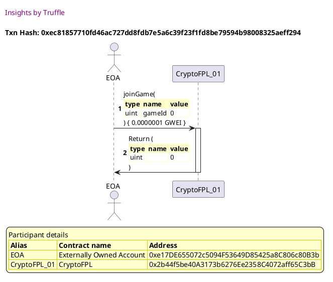

##### d4, tx: 0xc88f743fc66fe090a449642165b32f768d3ebb4433175d9f4ce43f19b1c85164

[SVG :telescope:](https://www.planttext.com/api/plantuml/svg/dLDjJzim4FxkNt623snYRCwRwo9M4Ve2bIQ1DgHz6DFan4xmS9tASQ25xh_laaPLOTzcHJxRTtxyt7CNGivhBvnl5eOGqVZADejCEL8_QBiKJYp0g59PUI7oXz9LZPNZobGE3cVJsNGy9UIizckZHWIwSQ-4L0vU-Yt0LUNqSsMzCAdHfLqewn6nyBk06JgtaCl6BOrwvVYcdnK4yUxiHaYfRGa1xO_-TFRiKq-2zE_FRQtBUrz3jePRrnG5uXAllL5mkx9m9UhxKw2hdFDY44T5pbYXw92AE1woE0nOaaLXCM1SHYhBuZYAWa4YXqMSAumEXbcGyoHWCK79Se_KfzSfY1eEq1uGbCthN2y5fZfswwMlPZTVVj6WYzW_E22akm4depSEE3u-XT-LjfTYeTxTsJjorWl-eRUZpMVmwwK2j1Q3MlieJ8EBDdm3ZSRdDr2YRovnGRUEz_02z2FjHW2NtwTprF3DuwkJ7uUL4xPKFrjcMuedf_1L-SPP-3y-jNTjvJQ0tr6R5kWQSbFLIXxrr8XKAAT-55xz8zIs2ydDdhPIUQ5DlKTbGYUOLai5cmtLniKOkyWXwevKAgLJDVfszqQRhduuhxnoLXYpXkidgoIaUOuTtyf8Lz4aPJJW4UCfZzb5mgCWuRCyf7p0XiKi2tZ68rfCNWE_gl_UjeCCiRMA95CnJR71eeo50pPLOPJmSKm7eIWAbeoZx08XCVTU0NAEC_wjVm40)


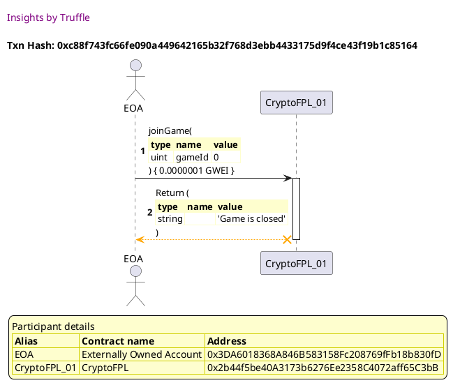


## should not let a second user enter a game with less than the required deposit
[link to test...](http://github.com/cds-amal/crypto-fpl/blob/34472c11912f7281a066bfa50cc485d67a6b6112/test/cryptoFPL.test.js#L101)

##### d1, tx: 0xa62ecadbf6ff719e74f8ac3a90ff40d24ae793cd362c3cf2564d0333303241ee

[SVG :telescope:](https://www.planttext.com/api/plantuml/svg/NLFRRjim37tNLn3TouQk6tt95LbGnvUrm806M86z52WKNHAZZXp8yXgtsR-FTemWgHv4YQGE3uyancuhnwshjmLZl7QbgRShPLdrafiTjtmBXLeh8nTSlAnjMHiPbqLfuLEMPccSCZQhN5EeEODkR1INoi9xlmMuAst-LXh7YwZ8rsQhZ2D4xKu96GMFaBlQxWfr4VYTlodmmfDloQNCpHeyx5t_EZlxtfDWVVrxK-NhZQjWrS2ZhRKcNEPoLoXut1kuuzLc2hZdGry9BbTwgFN8cwXHgCTS17o2MeSe_P2hqIGGCXZw8X3Q7mn3YG4D3FpGKuJ9k714FNs8W5TmHVQAaMmk5_cEKwknRNQkp9Q_dj7hCiuTLunr9-1c_Y40rzTJ4AMfdAtR0f-Vp1ERzPf_xUtyy0DSirD0rl1jP__oegP5ctw0EYS61tWcpMsJAVA3ZyVW5tW7_8RmyqzwJo9-gDxoEHAxcG9ZnnV0bcTzIULuNbHdd19C4B7bH1TDdT8YfXkq9D29NIIbLHN5JkVcXquxclTEMSEBee67LwCaH4BGQslvupu8umLwOv654qp6Gl1HbcZK6EimN2YPe9WeJo_m4lX2-xDj1vd6GJmO9sc6IJeSZmAK8QvYNqKyqG56ay4euTAFMaZglLU0tT9CF-K_)


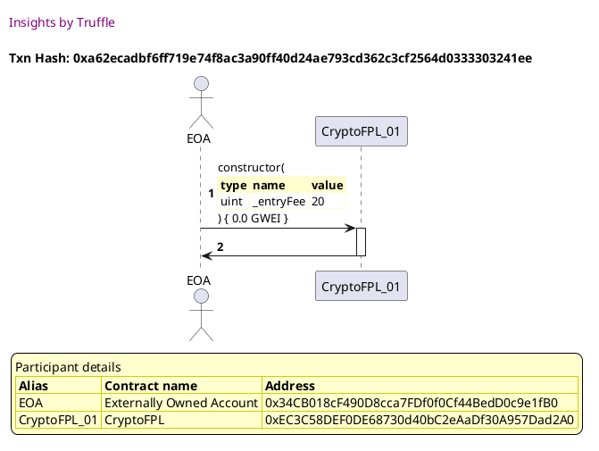

##### d2, tx: 0x3cd1f2df7a41a2c0e16fcbccd6db4e3a7ca13e50e7874e1d6c894197d3d803d0

[SVG :telescope:](https://www.planttext.com/api/plantuml/svg/fLFVRzem47xtNt7gNZPrtPmV440TQaX2MsbIqLPfBvMcmxxGgC51ZjD2o_xt7I53qDTPaS--Et_t-VD5YAlQeNNDiXG26rUPPZadA-gdmgpGuX9AMf3H4rHF2rirHYTLMLduCCscMP89SLcxJKbZ0Uru9DHauQtR0jnKjdYjZCCoBek5MP9nZ9YxGyAKWtl8LMDN9Pq4VXQl15vuyCrGwy8im9ETwqzhBxzs94HN_zRKnUBHrJ3VmBrjyfnnXIjSIN2_Dd23zUC8v3fGsijzdKSOUkWhILu_LtEbT5_FGmemKkW5r9CK3QAGFDrNWs7e3ICTw84Cj1GicN9CFRkB0MiuOticM3PNg6A5VDN4RbQkciw-_vPUct7iE1EYFG4NutS1E3yVWRA4ZgvnIHyVp8Eux2J_tDdnzXkupOg0hU6adNt6ik75BdqBJS44jl222rPaovh9VUGJl87y8jlXmVMlx9PbV5T_nsXFxM84FyWrri1_iU3lNtaXzYqbPaT2QN9ObFKHVYfJ9hZ3vyvXwNYHS4jOLlnGATRQKisnmxdnjdqCdjUEhC6otC3TYo4DiLBSlZikSkr7GPBv_PwQJ2JwD4rnYFb43rKmIFl-F8cZECYZD3m5FddCesqBcIL1qXkasLIcMNyG1LA7Sfxu56EQ1p8Uzg8KjH-p28BltYaWhdZcN-yl)


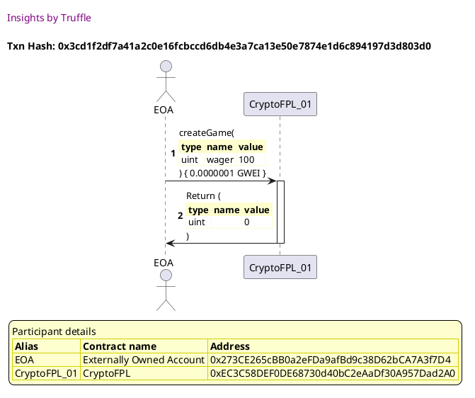

##### d3, tx: 0xcf32018ffcbbdd0785116410c9b38b68e1d015e41911620a862213bf2d31318d

[SVG :telescope:](https://www.planttext.com/api/plantuml/svg/dLFVRzem47xtNt5g7xgfOxFp0m9Yg6aIMgH9HLkbFQpJvCHEy1eSv3WjjEn_tmKY1DtRh2Xtzfq_V_xkJCXLRRcnpR8aX3UsqiqobORKZqglkE5BA6KXjRZcsMDXgaQBg2eh0-VJP9f42I7ZscvAEI6m6ml9XJJmsaq1RYkZNYfjUHcMgj1BgIqYvlQGCCNW7dBLc5KfJmBVr8i4vXtMvbm8fGjWj5lwixFZJnq9qfq_qxKg5hQ6T0Ftfibpn2LMsLB2_Lh3BQyN8w3hB7SToe8ypz9K23e8VCRw7gFPC7M3j1z89YZpfSU6kEvG7lGTXxbfxWYNkImG12NBB59FxaBWDPoXFICecrMPMd6yQcGsArjDvrz-KRRBE5uu8sIt0tgJDm6ul1p1xqhf6xwKxnxq0nbtWd_ex6Jx6Unc9G6jngJMFl6oGQTDtqAZyFWj51YR2NJeFl0UNe5-fDtmuUPxCaCLtno_xlquhmpNXVpPSjkJx8tWgxIDqV1_Z6fhsjfj0RyBh12M1MLg6oB7jggXRbtKw9aNqbnqT8cGAB5wubR-8zw-CydyI6yXBLTbVKGkfZ5Uj2M73OZew4JOMGPH3pH38OoiCNRODzdkQeh_jPL6yxBSmDspbWB2BCDNq4fBrv8DugJl-tJWP3uTUbFVxNl3EF0zn-T15D1-5j1hDpq5Fkc9e-aECedSo0_YP4eHEHYuL7WqZHmPyZXtQJZq1p4NJeZL97ZtJW5oXNzymNy1)


```plantuml


@startuml

autonumber
skinparam legendBackgroundColor #FEFECE

<style>
      header {
        HorizontalAlignment left
        FontColor purple
        FontSize 14
        Padding 10
      }
    </style>

header Insights by Truffle

title Txn Hash: 0xcf32018ffcbbdd0785116410c9b38b68e1d015e41911620a862213bf2d31318d


actor EOA as "EOA"
participant CryptoFPL_01 as "CryptoFPL_01"

"EOA" -> "CryptoFPL_01" ++: joinGame(\n\
<#FEFECE,#FEFECE>|= type |= name |= value |\n\
| uint | gameId | 0 |\n\
) { 0.000000005 GWEI }
"CryptoFPL_01" x-[#orange]-> "EOA" --: Return (\n\
<#FEFECE,#FEFECE>|= type |= name |= value |\n\
| string |  | 'Insufficient funds sent as wager' |\n\
)
deactivate "CryptoFPL_01"

legend
Participant details
<#FEFECE,#D0D000>|= Alias |= Contract name |= Address |
<#FEFECE>| EOA | Externally Owned Account | 0xe17DE655072c5094F53649D85425a8C806c80B3b |
<#FEFECE>| CryptoFPL_01 | CryptoFPL | 0xEC3C58DEF0DE68730d40bC2eAaDf30A957Dad2A0 |
endlegend

@enduml
```


## should give refunds if second user deposits more than the stated wager
[link to test...](http://github.com/cds-amal/crypto-fpl/blob/34472c11912f7281a066bfa50cc485d67a6b6112/test/cryptoFPL.test.js#L106)

##### d1, tx: 0x4b09346fd2b9c6764eea7e5df0b70e043da59ffeecf597cfb0fee1eecd945736

[SVG :telescope:](https://www.planttext.com/api/plantuml/svg/NLDHRzem47xthpXrBvkwRaum2K4C5GXPAqqgqYhjfLBbs6U86XpaE2kqxB_l2162vi5tlZj_zzrdXx7RsaldctN9c6nyPPjrZexLBuNTI2VNKE8IhPvAzR9qLMFrh2eh1v-oUJQVpHaRrNvNufX1-wrGQdJmtcq1xYfNl5NMot9I5akxHki9qVXJGKR98-IcSPiIBnA_YpU4G9nY2wbrOPSGy2xqhxMZxnq9rlM_jtMnNFaQyXqykiOOmcM-y2N2uzR2dQnNG-1RaVEa9oAZmpnHKHm9H1bZNnkUnnovw6dPJun1LAQVnChadFo0jZeH_RWNCP9CUQ8-VvY0hE6Ax1KZsNoXYesaKMTkj_5LjlZrp8EsuZnmnLXx0cx67n9mVJq4LTdQk-RGuFEJVMAZJlEldHtlVu3VRH38MhbkxLzPDkGSolVG5CHW3y-akTjbI748-J7v1Tw1V-Fmyy_ydaJyqFt0vqZiPWYC7Ly0MvpDfT7BegpFEAKyvPmVED55qwJapEW67GbqOZVHsc5DkTEvyRxLZjQjHsTbMUxWuTMYXebIzDeE_Fcs9sPJ7WnK9XAU3fIISPOQRlZC2355dNALO62c_1BuGlkpRGif8bGg2aISy5uGndEHXz4qZVBU90fr6eT14au7UPOG9CtUAS1kQQK_vJy0)


```plantuml


@startuml

autonumber
skinparam legendBackgroundColor #FEFECE

<style>
      header {
        HorizontalAlignment left
        FontColor purple
        FontSize 14
        Padding 10
      }
    </style>

header Insights by Truffle

title Txn Hash: 0x4b09346fd2b9c6764eea7e5df0b70e043da59ffeecf597cfb0fee1eecd945736


actor EOA as "EOA"
participant CryptoFPL_01 as "CryptoFPL_01"

"EOA" -> "CryptoFPL_01" ++: constructor(\n\
<#FEFECE,#FEFECE>|= type |= name |= value |\n\
| uint | _entryFee | 20 |\n\
) { 0.0 GWEI }
"CryptoFPL_01" -> "EOA" --: 

legend
Participant details
<#FEFECE,#D0D000>|= Alias |= Contract name |= Address |
<#FEFECE>| EOA | Externally Owned Account | 0x34CB018cF490D8cca7FDf0f0Cf44BedD0c9e1fB0 |
<#FEFECE>| CryptoFPL_01 | CryptoFPL | 0x46ecc6147903127E4b26BD6b3A62dD72192B8bF9 |
endlegend

@enduml
```

##### d2, tx: 0x670994552ee9a9680be0478862f31f695341517517f856ff5440ba436020e3e7

[SVG :telescope:](https://www.planttext.com/api/plantuml/svg/fLFVRvim47xtNt7ANZPrtSml4w8iAWdGLfhKQAkqbqgJWOEY4XCPqoPjzh_lGbYKz7MMvRDzv-y-VpupTjKQgKstgXcJdMbKjqfHi_QfKckfvGfgB57bSvazbRhfLBvewaR3XoHEuaNCsBGrsnfd3FhsY3973M_34k2cqTLheuoimxegrGgL8SJ270CISXuWrvrUrtZc-5cz8bZkSMyfyxnI9LXysFhJs-dNWGGRyj-gjYeVJGlf5kvrLnI4oqnbQeJxZO8RsJvEW6-4puF0zJmRCP216FCKkUkFny8k7AiGWUUubcVvr8kn9uh2SrsUIjSHtEReeCz8iimGzVWk1Dd2YEo8aMocoggrfAikz7PjccJv_JUt-eZJZH5Z_GcudBrpmCN513ADqk2rNE771_N0feFadmSxstq3irqZa5KKjBVFikveiW_VGLSHWHsyo98KsP5c_E3v16_0l_2-MN3zAxub6T_btpCwKBkSm0yqdLRmNooe_qlFsA6asF94g1oDhEhs13_Y4H7SurFba7GqML19Q5Byc2dCSuqj-OxdPhl-CMZS6DHArlKMxbuKvX1c6PNldWlVsBwpY6tXPVCvbpOcaGnaCS-3p1b7mauNeHywXH-vvy1dZtcox25TWLacBDSFk6FPVkocjfX78dL2OUUHRrk1FH-dIK2GTFT10NP58tszlm00)


```plantuml


@startuml

autonumber
skinparam legendBackgroundColor #FEFECE

<style>
      header {
        HorizontalAlignment left
        FontColor purple
        FontSize 14
        Padding 10
      }
    </style>

header Insights by Truffle

title Txn Hash: 0x670994552ee9a9680be0478862f31f695341517517f856ff5440ba436020e3e7


actor EOA as "EOA"
participant CryptoFPL_01 as "CryptoFPL_01"

"EOA" -> "CryptoFPL_01" ++: createGame(\n\
<#FEFECE,#FEFECE>|= type |= name |= value |\n\
| uint | wager | 100 |\n\
) { 0.0000001 GWEI }
"CryptoFPL_01" -> "EOA" --: Return (\n\
<#FEFECE,#FEFECE>|= type |= name |= value |\n\
| uint |  | 0 |\n\
)

legend
Participant details
<#FEFECE,#D0D000>|= Alias |= Contract name |= Address |
<#FEFECE>| EOA | Externally Owned Account | 0x273CE265cBB0a2eFDa9afBd9c38D62bCA7A3f7D4 |
<#FEFECE>| CryptoFPL_01 | CryptoFPL | 0x46ecc6147903127E4b26BD6b3A62dD72192B8bF9 |
endlegend

@enduml
```

##### d3, tx: 0x4dc2ece245ce83771527e3997685691925b7a439cc7485e8553b5149a0e505dc

[SVG :telescope:](https://www.planttext.com/api/plantuml/svg/fLFRRjim37tNLn3TouQkctoHBq4MD1Ud3J2WmLPWBmK6MM8IhuuSoFAMjDc_Zt6C8Edhz21I8dLuT4GnTbixQLspBXcJZQjCiyxHilgvC1jfvHfANABH8wcUbxPgZ1vNPMNXtJIRPkECiNxjTYKE6BHZXLAZXTTk2N1VsUAbCawMmx9OcZKQHuWBTqgOKl08kMdifiIBmFVY1S4BJtjpgNLXbk3nRkjlQ_kVEnAigpypTR5SkHho7JpQPh4WNEOALo8yRWtSothL0xuDjV9HeHyAXKaGnvxmOmpID8uI4QLUweiybc6GAXM7YS14Y20NNfXAZe8BhHX9fXnHpnw686ku8dl5I3PNg68ZwQfZkzkuQZh_-fDxRSRvnXLZxGcu6Rm9mFLr3tvLXRcJQtp_P9vOlnFyOsS7-o_WTXi4ieQI3lQtB1jo3kbxQ0egluSbnMQQ77uCV81Nu9zuEtou-v7DICCtnGzqZhnkUl0DNMCD_1U9i_AC7Vk9pSzKqkXaKTPd-1C-8O87V6eRqesSCVM39RbFbOPQMwmfTZetsBSlGVFMeJMoB7VmyCUWXg5IrBi7BdoBNZp98Y5ux2l1qt0gWYXC9ua8VI6JSS8ZbV1Ha5y2NxpasRA532DKAlB2EEM1vyTPcFlHQ1BbmJ3ozIJsgPL6IJvD2PBktYd0RcccV_SF)


```plantuml


@startuml

autonumber
skinparam legendBackgroundColor #FEFECE

<style>
      header {
        HorizontalAlignment left
        FontColor purple
        FontSize 14
        Padding 10
      }
    </style>

header Insights by Truffle

title Txn Hash: 0x4dc2ece245ce83771527e3997685691925b7a439cc7485e8553b5149a0e505dc


actor EOA as "EOA"
participant CryptoFPL_01 as "CryptoFPL_01"

"EOA" -> "CryptoFPL_01" ++: joinGame(\n\
<#FEFECE,#FEFECE>|= type |= name |= value |\n\
| uint | gameId | 0 |\n\
) { 0.0000002 GWEI }
"CryptoFPL_01" -> "EOA" --: Return (\n\
<#FEFECE,#FEFECE>|= type |= name |= value |\n\
| uint |  | 0 |\n\
)

legend
Participant details
<#FEFECE,#D0D000>|= Alias |= Contract name |= Address |
<#FEFECE>| EOA | Externally Owned Account | 0xe17DE655072c5094F53649D85425a8C806c80B3b |
<#FEFECE>| CryptoFPL_01 | CryptoFPL | 0x46ecc6147903127E4b26BD6b3A62dD72192B8bF9 |
endlegend

@enduml
```

##### d4, tx: 0xe7bd0c4b78a9a4585ad533fc3984b08730ba4202307ee20178cf64595c1b973b

[SVG :telescope:](https://www.planttext.com/api/plantuml/svg/RL9TQzim57tNhn39OnScsv9bbomqYMqw63Imleqnz1N7L963BBEaQ__xRbql96L-qCSvznxVUwuGkkk2yA7VMuH47rhNxwNng7jgt45uiSVMrCRfbL1FjMzxfzUjRJsULcLLhak4vbquMRD0UFXsHcZZyP_nYl5zwvldrWLXbxQftTwu08hRS0weW7oNFFJ-OCqLyRrvDZYYPsmZj6vSZICoGg_3Flyy5e76_tzrNLFlGeVb2J_wVhi5NHIQO0r-F3fyBxhTBIP7mwKcYagUYLnGbZ6XMP9iLP9dL9AC9qGA6fCu8ToOc4GyKzkKifofIEOyaGWiKm5ABn-MM7Hu0li4WMsXKSr1GAjhVpg4jjfy-qMY8U8Ic20qPE3PuWE1RsvkCVg0pNvCQs-C-_aMFkJz9-OVDPi1YTvdXpON5MaJH6CxD1yd-6bQa88GidZvWc54K2CSrk2zXzQm4tlp1YorzgO3xfotU1cwXlKOZ7V2sXD--EsCnakbu9q4eC3XY1TboXZXiM8afnLBKfeN6QCn4zaw8wdAo2gHry9NhbrS1qcQ6gNIYFAS957CIohZT5MaCbcciIvu7ENnAfDL3fBG--W0keCLtlXV)


```plantuml


@startuml

autonumber
skinparam legendBackgroundColor #FEFECE

<style>
      header {
        HorizontalAlignment left
        FontColor purple
        FontSize 14
        Padding 10
      }
    </style>

header Insights by Truffle

title Txn Hash: 0xe7bd0c4b78a9a4585ad533fc3984b08730ba4202307ee20178cf64595c1b973b


actor EOA as "EOA"
participant CryptoFPL_01 as "CryptoFPL_01"

"EOA" -> "CryptoFPL_01" ++: 
"CryptoFPL_01" -[#green]-> "EOA" : 
"CryptoFPL_01" -> "EOA" --: 

legend
Participant details
<#FEFECE,#D0D000>|= Alias |= Contract name |= Address |
<#FEFECE>| EOA | Externally Owned Account | 0xe17DE655072c5094F53649D85425a8C806c80B3b |
<#FEFECE>| CryptoFPL_01 | CryptoFPL | 0x46ecc6147903127E4b26BD6b3A62dD72192B8bF9 |
endlegend

@enduml
```


## should store the correct available payout for each game
[link to test...](http://github.com/cds-amal/crypto-fpl/blob/34472c11912f7281a066bfa50cc485d67a6b6112/test/cryptoFPL.test.js#L116)

##### d1, tx: 0xeb054e9ca88ee7099bb355344583e9f919a32f7b76144d3648f1c985d8dd9663

[SVG :telescope:](https://www.planttext.com/api/plantuml/svg/NLDDRzim3BthLn3TPKFNJOxb3mLPqCI9rm836c05TYbGo9AS67LaGvRNkCt--nZ729Bw84eazVZuA1DospXXNRij2H6jgqoxpRGbpKjXQc755agzraRDXNnPswerAgdAoiAdT9akaoKXayPrfPuIwB-D5afRU1-E07ULBTuguqGvAukrsMhZ435tfuGKWqV8khLrgIy2luit3Hux-LP2gSAimQE3wrzl9zy74cIeVs-QOhrn3MGTFDespn6NkCAL6Xvt1kv4ina3tUcC1anpAU9OwuXodcL-4FYC1R6lUSuzBlnH7cLHw36c_935kITv7AXOAHw6Fa79f4FgouSPY0Qkq5uHbCqLigW5jfhOhdPLklhrJBq-uznnHKX_0swc7m9mVJq6MPd6sVPGuFEJUIAJGVElWvtkVu3hQWreZTZszgyeMzmSqlVG5iXW3y-ekUrIZNuOqMFm2xm3_KRXvv_bFOhueVg1pv7OpHW8ERu0iZhhIsadYh8vuxIW2qhfWHCE6Zl5JO8Jj2ZGYTrCAQiRZ9tkJVUzThZkdBP6b6K73wz6AvX9YQ_jm9_kV9RCgHVBb76wYAKKKRh8QKwJdB6vLWigkVRoERq4lj3-xDX3HajFZFBGztCkKiLyclXXZ5EcCkBS2tYgUCH2do4azZueG6vnnJ_bFm00)


```plantuml


@startuml

autonumber
skinparam legendBackgroundColor #FEFECE

<style>
      header {
        HorizontalAlignment left
        FontColor purple
        FontSize 14
        Padding 10
      }
    </style>

header Insights by Truffle

title Txn Hash: 0xeb054e9ca88ee7099bb355344583e9f919a32f7b76144d3648f1c985d8dd9663


actor EOA as "EOA"
participant CryptoFPL_01 as "CryptoFPL_01"

"EOA" -> "CryptoFPL_01" ++: constructor(\n\
<#FEFECE,#FEFECE>|= type |= name |= value |\n\
| uint | _entryFee | 20 |\n\
) { 0.0 GWEI }
"CryptoFPL_01" -> "EOA" --: 

legend
Participant details
<#FEFECE,#D0D000>|= Alias |= Contract name |= Address |
<#FEFECE>| EOA | Externally Owned Account | 0x34CB018cF490D8cca7FDf0f0Cf44BedD0c9e1fB0 |
<#FEFECE>| CryptoFPL_01 | CryptoFPL | 0x7E1a2f633f9aFd430C3681440c799159Fd974634 |
endlegend

@enduml
```

##### d2, tx: 0xc0f1d997e736ac29e29e71c48bb12566c5365ad46dc3fe43dfbc5a908f0747c9

[SVG :telescope:](https://www.planttext.com/api/plantuml/svg/fLFVRzem47xtNt5YBvkwRiuF4e8OAeIahJIfQAkqbqhJOJjfrE0WnscXPV_xBY53qDTPbi_sdR_x_FdCs5LjqTXcNJA6ZQrqirufm-gdGc_Gu1fAbIijvoYUSbCrMiPLMHdua2Pf4YUCJMgxAzMKGTSU5KfbuArV0jnKfdYjjCLoLXQvNYjj2J6pnu2Kd0V8JMCsfJfp_2nU5JZ-SM-9KXOw1uVtMtywE_dQas1z_bjT5_cZhM6rWtlJP1dXCblOKi7zLiCDrezZu5l1CqT6KQX2Bq3XHefww0X_j5evxZ08nD0BXYZzG0elKxudivKOOiH76G_zK4IC91EMg2TtCy0Q1cG7Z6IpXIWsI5UDpMvZgtJv_JTtkeZJZG5ZtGcudBvpmCN568HHQDKrhjN71_t09htadtixtNy3kzie8AifgBNFM3OqQSFtq1H4O0ylc9CYUzAC7poVu0tu5zur1wv_9RSauxlyBQC3jSin_52sCHh-YmNrV-aPEvGKMvu89PN5egnFy1TyGGHRVAeSaeucCPM48SMFcMPI6bMJxtXkkkyUWyQjLKPZMUxWxaKh2JCXg7nRBdphXbwSkC5GpESSNPKkCC9iBYFXZHQ1kufduSpBmeL_3dpsc2VB3Z9C77IpmFEo25FfUppsWf7Z-ro4KUGCerH6eHzuBIJTlLU0NT58N-yl)


```plantuml


@startuml

autonumber
skinparam legendBackgroundColor #FEFECE

<style>
      header {
        HorizontalAlignment left
        FontColor purple
        FontSize 14
        Padding 10
      }
    </style>

header Insights by Truffle

title Txn Hash: 0xc0f1d997e736ac29e29e71c48bb12566c5365ad46dc3fe43dfbc5a908f0747c9


actor EOA as "EOA"
participant CryptoFPL_01 as "CryptoFPL_01"

"EOA" -> "CryptoFPL_01" ++: createGame(\n\
<#FEFECE,#FEFECE>|= type |= name |= value |\n\
| uint | wager | 100 |\n\
) { 0.0000001 GWEI }
"CryptoFPL_01" -> "EOA" --: Return (\n\
<#FEFECE,#FEFECE>|= type |= name |= value |\n\
| uint |  | 0 |\n\
)

legend
Participant details
<#FEFECE,#D0D000>|= Alias |= Contract name |= Address |
<#FEFECE>| EOA | Externally Owned Account | 0x273CE265cBB0a2eFDa9afBd9c38D62bCA7A3f7D4 |
<#FEFECE>| CryptoFPL_01 | CryptoFPL | 0x7E1a2f633f9aFd430C3681440c799159Fd974634 |
endlegend

@enduml
```

##### d3, tx: 0x5e3b74a29ce2ba1fc1c90dd02a36f325cc80a51e7df9e4455349a4189ad9ed67

[SVG :telescope:](https://www.planttext.com/api/plantuml/svg/fLDDRzim3BthLn3PPKFNJRRb3mLPqDInsm036cm5TYamA9RiU7LaGvQtfCt--nZ7299UfuD8YTJZqnD5o4rhXR7TfY94TBRMtMQb36cVIzq88pPGgK9fUIkovyBKdPPnNTK6tgL9ciG98PFMxYer9T2FjH9I6NWTbW3tjIbVQcr5DQlAGc-KjeYOsrD2Yi4ZPDEPfb8NWU_bYmA7dVQMGifI5-3GOUjlRoUV1n9agB_GRLciRGkh7JoQBiyHbzZILWeUjnhkHRiU0ztwobk5JBWyK-vAE7dcP9nAILtX1Rdd-baMKU4xAfGvLupvliUuO4x4XUHA1Y51oJABr9E76OWMHcX716MpPLOs0gyQcrrZwtJvzITr-eppZH4X_Gcudhu9mDNL67xLfRuJ6_N-IJ-HoI3uny5Ezr_0xXe5Q3Kc7UnlKNNe7DBtq9LOVWy5nXOI7NeCV81Ne9zeFnou-v4iKCCtnGzqZhokn_1DsSve-2yIP-K9EVOJMPwf99KLPTMUuS_f70aUyB5jK3TqOkm7WtAVAisaDAh5sEdSTD-_1CvRgumMLRM3XpzQIPXb6VRkWGlTAYUS9u7lqz3DVCfPwdi1u_F8PwuleZYY0JxxhRUw1BvuoRDb3nacZd3pmFDoBbB9F1fxGUGmHhEGSyVdgUGX2po6a7ZtGG5oWpF-kty0)


```plantuml


@startuml

autonumber
skinparam legendBackgroundColor #FEFECE

<style>
      header {
        HorizontalAlignment left
        FontColor purple
        FontSize 14
        Padding 10
      }
    </style>

header Insights by Truffle

title Txn Hash: 0x5e3b74a29ce2ba1fc1c90dd02a36f325cc80a51e7df9e4455349a4189ad9ed67


actor EOA as "EOA"
participant CryptoFPL_01 as "CryptoFPL_01"

"EOA" -> "CryptoFPL_01" ++: joinGame(\n\
<#FEFECE,#FEFECE>|= type |= name |= value |\n\
| uint | gameId | 0 |\n\
) { 0.0000001 GWEI }
"CryptoFPL_01" -> "EOA" --: Return (\n\
<#FEFECE,#FEFECE>|= type |= name |= value |\n\
| uint |  | 0 |\n\
)

legend
Participant details
<#FEFECE,#D0D000>|= Alias |= Contract name |= Address |
<#FEFECE>| EOA | Externally Owned Account | 0xe17DE655072c5094F53649D85425a8C806c80B3b |
<#FEFECE>| CryptoFPL_01 | CryptoFPL | 0x7E1a2f633f9aFd430C3681440c799159Fd974634 |
endlegend

@enduml
```


## should return the correct number of games that have ever been created
[link to test...](http://github.com/cds-amal/crypto-fpl/blob/34472c11912f7281a066bfa50cc485d67a6b6112/test/cryptoFPL.test.js#L123)

##### d1, tx: 0x0564db2dfb8bf2181c1212c3e4f510be0c2f648a03433f9bce1e4e17dcfa45cf

[SVG :telescope:](https://www.planttext.com/api/plantuml/svg/NLF1Rjim3BthAuZkic7hHjbEuXHTqCI9rm83Mc05TYbGo1AL6dNaG9QtfCt-VOnZ16bz42MIUdnyeeMuQeBoeLrLGgWsrAvT5UH5yrowjV9g1HKjoPcPqizBNxVEP7LLU_YGB_95jX3YiWdRYYO2kk-9b24Fh_qHuBhsvKljWggcLRbqAtA14Mqu9kGSF42kMx-kw4tWL_b289EZxquPKxebIEnT_pfx-Qqd8VhwDwufbq-XWM8Bzxwrbd55A4D5SBznSAsQfml03Gw6YIaYOukqi95CfPQHZ7HCYHr8B0XrP8T9gZ1EujYE2qsI4f8ZewrA1jeAbam7fhwudO9gu8pjcM3PGgdBjU9MCxzTXpg_-_c8iiiuTPm9qTs0yycx07p-V06wTatmxRx0nmVt82vxpR_qThBx3c6x9c3hrAgpVrJLycQVleEsP0OxU6JD_JOdzaE4X-0dU0NyYl3Zz-A6HNnNVS_dGEpy0eGuJ82uE-dBK51brPnmckCS4VUS-A6vKzva_8AU1JgocnhZgU7OyTvarsd7woQGTwggjd3xrv61gTOyRNl-k8cJR8OorNaondcgjHhbSuiMCviaCp9pr6EITePlWTzeVtBi86c0yJWVoHbEYpYbOJQQywlpDAIZV813BABHGCgnOaZklLT0NF7AVyf_)


```plantuml


@startuml

autonumber
skinparam legendBackgroundColor #FEFECE

<style>
      header {
        HorizontalAlignment left
        FontColor purple
        FontSize 14
        Padding 10
      }
    </style>

header Insights by Truffle

title Txn Hash: 0x0564db2dfb8bf2181c1212c3e4f510be0c2f648a03433f9bce1e4e17dcfa45cf


actor EOA as "EOA"
participant CryptoFPL_01 as "CryptoFPL_01"

"EOA" -> "CryptoFPL_01" ++: constructor(\n\
<#FEFECE,#FEFECE>|= type |= name |= value |\n\
| uint | _entryFee | 20 |\n\
) { 0.0 GWEI }
"CryptoFPL_01" -> "EOA" --: 

legend
Participant details
<#FEFECE,#D0D000>|= Alias |= Contract name |= Address |
<#FEFECE>| EOA | Externally Owned Account | 0x34CB018cF490D8cca7FDf0f0Cf44BedD0c9e1fB0 |
<#FEFECE>| CryptoFPL_01 | CryptoFPL | 0xe5039F71B0Ab38e6C7De4f4db87F5060b275119a |
endlegend

@enduml
```

##### d2, tx: 0xd01b61f925f2365cde120997ab1cb709b4be437fec8a6b602dd4d96a8b37a1e2

[SVG :telescope:](https://www.planttext.com/api/plantuml/svg/fLDHRzem47xthpYnbqrTDpk4X2262e6qbIOLRPNsKcbox4iQDJZ8SLfesN_V4J84VPqL-UoxytUVFryOkwgTjAvPbOp9nbMcMQLeMVrKcBMqSWKbvcZqJAgdt5QDqN5LLXO-98ja4IyO6zTkM-A4GJiUKMgqyDPj0MugMxnMniboMXQvMQ5nX9YvOq92mGFakh7h4iy2FujN1E4VVKkfTM5o4Bnp_Mdj-6j7WdNrRqrTv8-kXdGBzxR9Ci9bhd0bmlt6m8si7qV0DvgBD11Pv0qohnyCb4RXyIWAPIfK6l8ezLFq-s66QYY3DE2UrhwE0ZbC-w4Kw36IJ3cYlhYRWgoXHxR7I3PNg68jwQgntQvTbIo__-QYpJXrz1XhJy3bv5q0BYv6e2nAXzToXHyVp0CRTv9_xknazmtSTer0rb3ItZxBig75Fdq7JK44Tl0YSr9aHvhnG-GJl07_mjiXuFhNufPaV5T_p-X0xN84Fz0rri1_iQ3lNtd63Yt5bYT2QNIoAEiJ_3cV4y4zFdKEIKUBc5h2akB7IbEjBTOKEvwRxDh7e7dZq1fPbbkuUp6eOQeKjU-U2z_q_NZ6nL0bViJdGwLacCmpdl4uy_qPwZbN4Ofini-1pnxpPDj2ue3teoGKCpvD-qCCud2EVkRhT1Wc0nxmr0i7GaII8EdkdGBiYcRwzVu2)


```plantuml


@startuml

autonumber
skinparam legendBackgroundColor #FEFECE

<style>
      header {
        HorizontalAlignment left
        FontColor purple
        FontSize 14
        Padding 10
      }
    </style>

header Insights by Truffle

title Txn Hash: 0xd01b61f925f2365cde120997ab1cb709b4be437fec8a6b602dd4d96a8b37a1e2


actor EOA as "EOA"
participant CryptoFPL_01 as "CryptoFPL_01"

"EOA" -> "CryptoFPL_01" ++: createGame(\n\
<#FEFECE,#FEFECE>|= type |= name |= value |\n\
| uint | wager | 100 |\n\
) { 0.0000001 GWEI }
"CryptoFPL_01" -> "EOA" --: Return (\n\
<#FEFECE,#FEFECE>|= type |= name |= value |\n\
| uint |  | 0 |\n\
)

legend
Participant details
<#FEFECE,#D0D000>|= Alias |= Contract name |= Address |
<#FEFECE>| EOA | Externally Owned Account | 0x34CB018cF490D8cca7FDf0f0Cf44BedD0c9e1fB0 |
<#FEFECE>| CryptoFPL_01 | CryptoFPL | 0xe5039F71B0Ab38e6C7De4f4db87F5060b275119a |
endlegend

@enduml
```

##### d3, tx: 0x67086bde682a67bb1b09c1d75858c1cf7cfd8b39a2599af8d90c4dd8d8f914c3

[SVG :telescope:](https://www.planttext.com/api/plantuml/svg/fLDHRzem47xthpYnbqrTDni2IH13XK3QIfEAjafxgJGvzYL43Gvod1LQzjzt2H62liuFFllk_DtdpsV6RYedhQit1MEoTgMfDmbQLZtdPYkjt4216Hezb-evisLjT5GMfOKFyJ9UHal69fNR5pXbq8urIeqMthejm5rfyzVIE5dCYZmp6pIE45DtIeWfU8JSrdPRu4NWP_wA8BoJRoMrpaq6WdUklwsTVEr8iAx-lQdoREqgIFRmQEiq9LpcSbSWFEuCtCbgFGQ-6_ay62KQHq5VZlma4GaFbT3-C1W6IgZKLwaEaa4e-yCmb6cWGwuyhGCTfA7mr82HPCeHzUN336G5FR8zHhAvNELRILUDx7xhodZr_JSNRSQveyTOUmAkf-y2S7Kr1cLHEhoL6_puP9xOf9FySsUdXs_Wzbi4ieQI6lj75ZKjclG3r3aHEC2Bp4YH0sd6Zv5Fy0Ry2s-7WDjVotkIyLtzXj6HslKOVg2hhO7_Oj4GwCepTcmfjZeJIgEJUL6TuI_uWWWs-DGv91qj8ce9IugVAisqjbXHx7HkUcWVW-QTGsjaKUpXuSMWXfbIrBuD5xuRUD6SYq35NiWNWLBIZnSfJtcKUjuSzOAh44KwvvV05uzvjcqXSSW7OUoBEPybWm17aRz0B_Lq4lZna8zuqlU7GeII8EdkdGBiXcRwUly0)


```plantuml


@startuml

autonumber
skinparam legendBackgroundColor #FEFECE

<style>
      header {
        HorizontalAlignment left
        FontColor purple
        FontSize 14
        Padding 10
      }
    </style>

header Insights by Truffle

title Txn Hash: 0x67086bde682a67bb1b09c1d75858c1cf7cfd8b39a2599af8d90c4dd8d8f914c3


actor EOA as "EOA"
participant CryptoFPL_01 as "CryptoFPL_01"

"EOA" -> "CryptoFPL_01" ++: createGame(\n\
<#FEFECE,#FEFECE>|= type |= name |= value |\n\
| uint | wager | 100 |\n\
) { 0.0000001 GWEI }
"CryptoFPL_01" -> "EOA" --: Return (\n\
<#FEFECE,#FEFECE>|= type |= name |= value |\n\
| uint |  | 1 |\n\
)

legend
Participant details
<#FEFECE,#D0D000>|= Alias |= Contract name |= Address |
<#FEFECE>| EOA | Externally Owned Account | 0x34CB018cF490D8cca7FDf0f0Cf44BedD0c9e1fB0 |
<#FEFECE>| CryptoFPL_01 | CryptoFPL | 0xe5039F71B0Ab38e6C7De4f4db87F5060b275119a |
endlegend

@enduml
```

##### d4, tx: 0xa59c46c6c260b949075ffeaf59e1791ab86b1e0b83919e3c37c55cbbd936f665

[SVG :telescope:](https://www.planttext.com/api/plantuml/svg/fLFVQzim47xNNt5aBnjTDpd-7RBGn8xRmg1XA-obC6Jvx9Wwif7bDMcp_tqNnuIahnD69-bEtttwxipOJMk4DjscOanqfbRT9aNDskTIDKAB3LHOeCeMGZuNkkvK5jLLhU53iaoMqPAnQMjs5SuOz6ED8aCDRyCMuAxMvMkjZAZcLLce3If3YBav1IJaF48sdMugl73yB5yHBETqjX9PLge2B3uS_UtjzEj0WWtvxrLR5clJGhg3HztbEU4oKveAuN6hu4wqwmdmhN13wNZIasEFfw4JSj_DSnIv6wBbXvP80o-raAU17LeXsjBsfUlADCr2syizpsKacJH4VVam1z72YEo8aMocb6KZwAcHtZMcJbRVVtEhZpW_637Mtu3hsJi7N5rDG6eK1c_51Zy-gISs7IJ_FDZP_XkONOD0Lb7GmVuHLKUBG_WUkf88xE555AJ8dZJZHyydU0F-XVV3WjjVotkIyLt-0wCZjUi9_43JQGN_nOA-yP2UiMDBiTMPK1aQKLRj6NxCOo9umAVE8Ube4L5BQ5Byb6cUPHfRyftkpVPzCMZU6jHALDKE7buKPZ2Najhtm8LlRITQS2kG2TKy3gGKVXBdFETHxZWBp68kgGFo1Ry4lYZcsRQ7H9VROU9R2pvFxG2zo8_HoPqi3Vp4vTHVOz-rh50G9BrzK83Tq4o_tZy0)


```plantuml


@startuml

autonumber
skinparam legendBackgroundColor #FEFECE

<style>
      header {
        HorizontalAlignment left
        FontColor purple
        FontSize 14
        Padding 10
      }
    </style>

header Insights by Truffle

title Txn Hash: 0xa59c46c6c260b949075ffeaf59e1791ab86b1e0b83919e3c37c55cbbd936f665


actor EOA as "EOA"
participant CryptoFPL_01 as "CryptoFPL_01"

"EOA" -> "CryptoFPL_01" ++: createGame(\n\
<#FEFECE,#FEFECE>|= type |= name |= value |\n\
| uint | wager | 100 |\n\
) { 0.0000001 GWEI }
"CryptoFPL_01" -> "EOA" --: Return (\n\
<#FEFECE,#FEFECE>|= type |= name |= value |\n\
| uint |  | 2 |\n\
)

legend
Participant details
<#FEFECE,#D0D000>|= Alias |= Contract name |= Address |
<#FEFECE>| EOA | Externally Owned Account | 0x34CB018cF490D8cca7FDf0f0Cf44BedD0c9e1fB0 |
<#FEFECE>| CryptoFPL_01 | CryptoFPL | 0xe5039F71B0Ab38e6C7De4f4db87F5060b275119a |
endlegend

@enduml
```

##### d5, tx: 0xe93ca6e1e98b556c0bb05f6f18ebf5c060252db770b1ab9c00b3815aa66bfd83

[SVG :telescope:](https://www.planttext.com/api/plantuml/svg/fLFRRjim37tNLn3TouQkczJu6dH14oTk2mnei1NOIu515perwiY1BAz9c_tx6CS8ahvEC4I9f0wFZcZ6hXildM-N5MEozRLjbmeTQvvBkv9EBg721LepaVfvuUhMcgokQWSVyba-osQCNJL-K-68GJUUK1fqyDPl0MvhLxxMrijgN9KBkqJh2R7mXuISWdl8LUjM5Pu4VfQl228u-ERIcD8kGF3UzRUpLrzx4golVsURSl7a6r0RU71jKH0kywMl41xM5cvbypG4liPqe6M40jD4XM6akL8yBA929AYAKFE8NuQNHiKnLqAgL7Ek1ea8fOmYLPXam4WoxOdwx7uCie4picUCPFEbBbUIhfgvpShN-VpxRowwZ6F76MFT2RWOlGl0-VaGj4FfyKOkyUEZVMHNlUIVUplQVWE_MI6GjPIqitzarT9Ybxw5jYG2MtYH2r9aIvhnVUGJl07_mhiXuERNx8vaV5T_nsXFxM88Fz2tpi9_iQ1lq9TdRDzIR7uab44lowevmf_oAH7SuLFda7IqoAWb72b-g3Gsnc53iSEvqRPx39hN7fsLLRM1-nUB1iPQK_lkkF3r8CWcN2Gw3r8-JRIMSJujUC6p8WWcQAPSfoYA2Jy5FddCesq7YI4Vf7ai9dnCJO9H5aynA0AZaZWFgPFKPHmAaKg2fBlt2h1hckdN-mS0)


```plantuml


@startuml

autonumber
skinparam legendBackgroundColor #FEFECE

<style>
      header {
        HorizontalAlignment left
        FontColor purple
        FontSize 14
        Padding 10
      }
    </style>

header Insights by Truffle

title Txn Hash: 0xe93ca6e1e98b556c0bb05f6f18ebf5c060252db770b1ab9c00b3815aa66bfd83


actor EOA as "EOA"
participant CryptoFPL_01 as "CryptoFPL_01"

"EOA" -> "CryptoFPL_01" ++: createGame(\n\
<#FEFECE,#FEFECE>|= type |= name |= value |\n\
| uint | wager | 100 |\n\
) { 0.0000001 GWEI }
"CryptoFPL_01" -> "EOA" --: Return (\n\
<#FEFECE,#FEFECE>|= type |= name |= value |\n\
| uint |  | 3 |\n\
)

legend
Participant details
<#FEFECE,#D0D000>|= Alias |= Contract name |= Address |
<#FEFECE>| EOA | Externally Owned Account | 0x34CB018cF490D8cca7FDf0f0Cf44BedD0c9e1fB0 |
<#FEFECE>| CryptoFPL_01 | CryptoFPL | 0xe5039F71B0Ab38e6C7De4f4db87F5060b275119a |
endlegend

@enduml
```

##### d6, tx: 0xbfe1b835182c42922c0bb3204c355164878183242dd7cb78b2fae616221aae7a

[SVG :telescope:](https://www.planttext.com/api/plantuml/svg/fLFVRzem47xtNt5YBvkwRdP-a80OAWJILffKj5NQIwN9iIyGDJZ8SLPesV--8qG8-Zehyjbtv-y-VxumTbCxQLspBXcJZQjCiyxGilgvC1jfvHfANABHKwcUbxPgZ4wgihBm8PsdysJEsAXsknB73DgnGgdHmbkt1RYhRF5Q6IVBILaipHgD8yJSdH9I2XuXDutTb7WH-5cy8eZWv5j8hGkp1C4xrz_MZhvs95XN_zxKnNBbQiXsy6YRF2TSvWfN8Znk3Tp9UZK4liro55diXoBsLE0DF4_nBFCz7YW_34K_YADOnBuNU5f7AelYpCibzaNVyuIK64b6aYb7rESF4v0rzCZs6Cdc2bLi95qriRkDgzB5zzzSj1ddZXvZxGcu7hyBmDNL49H5wV1Mhl7ZatbYeqxopvqTxx-1ssqGo1fAEjW_icneSKZVGrCGWJsyo2KfiYVD-37o2Tw0V-7j473xQtvFChwhVs1qf7OzX1_e6clWlrZG5tJb6Jks55kS2QNHoQAip_1dV4O43_ZKEIGTBH9g2KkAdofDjBPOK-nqRhnl7uFchKDhP5dkuE75e8Q9KjI-1ovywmV9b8jOfS60psAbP9JESfxp90-2AUePLmCK-PHV0byyvjcsXSIG-uCq4bC-oVmO-qaqmo0FT1P7QSZxFFEYK8Y194YwUwS0kw6PVhr_)


```plantuml


@startuml

autonumber
skinparam legendBackgroundColor #FEFECE

<style>
      header {
        HorizontalAlignment left
        FontColor purple
        FontSize 14
        Padding 10
      }
    </style>

header Insights by Truffle

title Txn Hash: 0xbfe1b835182c42922c0bb3204c355164878183242dd7cb78b2fae616221aae7a


actor EOA as "EOA"
participant CryptoFPL_01 as "CryptoFPL_01"

"EOA" -> "CryptoFPL_01" ++: createGame(\n\
<#FEFECE,#FEFECE>|= type |= name |= value |\n\
| uint | wager | 100 |\n\
) { 0.0000001 GWEI }
"CryptoFPL_01" -> "EOA" --: Return (\n\
<#FEFECE,#FEFECE>|= type |= name |= value |\n\
| uint |  | 4 |\n\
)

legend
Participant details
<#FEFECE,#D0D000>|= Alias |= Contract name |= Address |
<#FEFECE>| EOA | Externally Owned Account | 0x34CB018cF490D8cca7FDf0f0Cf44BedD0c9e1fB0 |
<#FEFECE>| CryptoFPL_01 | CryptoFPL | 0xe5039F71B0Ab38e6C7De4f4db87F5060b275119a |
endlegend

@enduml
```

##### d7, tx: 0x55be746af8cd071a89a70ab44e7919e78f5e9f3a432d578791d7ab3cbee8cfdf

[SVG :telescope:](https://www.planttext.com/api/plantuml/svg/fLDHJzim47xthpYnbqsCpQ49IQgkeaqRG9e4sf3sWZHTx7E9I9tASKOBtN_VDOsgmkkio6VVdR_x_FaYn6NZqVbsMGc1hQzjkop8YUQfj2jqk8IA5cJr5DNJmjMjrLbTrGu-vFDydis563L-Kz5OG3SU2JKvUEst0DUrArzgwx6QLEN2BibwHZJ-a91pS0-vQjsgeZU1d-KBGH0UV7UeTMaN4CZUzRUpewyz2T7Nlx5DkNZq3HGRk7UjCOmhVEahWlkrXMji7eSWrr5KK1nUe4cKbd60IOgnn28CAKw3bEB4H9IQ0OQ3Snt52JjrZCL05KI9Cje8banvfZw_dG0sSCBsHB1ilbJb2lcgcTkiV9tVVVyjWoxZs74YH7S2piRl0d1wEWJb23rTuP8-FjW7CUeb_zpRyVOR-CsAWAtbf9tzWrNBYrtw5jgI2MpX6HUio9Ora_l89tW5-KLs8u2hN_CRbl5T_HsZFRMp8VmWtpeB_yM2lwWlByI-fSJTaL2QF9PLSuG_apCckCFdpc7fU95nIpXM_51fehMZXcE7S-DjznWyhpqvYrMrWTjdInecId7xxhZ8zI3CfZ98L1wcSfOeXN4-CzB8p8JXbFHCgfG2CvLlWTyyvj6sWwH83j8y3gPoKWmIkiZY6OKcr4KIvv6yaCLv70L1YWp9T-yL49Syyw_t3m00)


```plantuml


@startuml

autonumber
skinparam legendBackgroundColor #FEFECE

<style>
      header {
        HorizontalAlignment left
        FontColor purple
        FontSize 14
        Padding 10
      }
    </style>

header Insights by Truffle

title Txn Hash: 0x55be746af8cd071a89a70ab44e7919e78f5e9f3a432d578791d7ab3cbee8cfdf


actor EOA as "EOA"
participant CryptoFPL_01 as "CryptoFPL_01"

"EOA" -> "CryptoFPL_01" ++: createGame(\n\
<#FEFECE,#FEFECE>|= type |= name |= value |\n\
| uint | wager | 100 |\n\
) { 0.0000001 GWEI }
"CryptoFPL_01" -> "EOA" --: Return (\n\
<#FEFECE,#FEFECE>|= type |= name |= value |\n\
| uint |  | 5 |\n\
)

legend
Participant details
<#FEFECE,#D0D000>|= Alias |= Contract name |= Address |
<#FEFECE>| EOA | Externally Owned Account | 0x34CB018cF490D8cca7FDf0f0Cf44BedD0c9e1fB0 |
<#FEFECE>| CryptoFPL_01 | CryptoFPL | 0xe5039F71B0Ab38e6C7De4f4db87F5060b275119a |
endlegend

@enduml
```

##### d8, tx: 0x22e2344a7ea507b13fc4df9dc22464b82d328db7b7aa0ac13667726de9e6c0d3

[SVG :telescope:](https://www.planttext.com/api/plantuml/svg/fLDjRzem4FxkNt5YNpPrtPmNye8OAYIahJIfQAkqBvKcnxv0rE0WnrcXPVzzHuWGzEkio6VVdPzx_FZ2s4rZXR7jkc9CjBRMxJf7mvhdKc-44MkeS8bQpOHyNfgwrIgfgzh0XsoUpPCvO-F6xYgSCEZ62eL20s_z5k2kDkLhhQsefbMvr6lKbX0BUqh8A7Y4tBHcK-55u6VvYk3u9zz2A5Ng9JYyT_tjxFXhJuBrzUzrKovNje5y1u-cBGh2PRQq5SBZLiETQ5OZu5lNHTVpVH6Y6F8mTxn2-gg8bNHTF_3po5MU6wayp4CXk92E5mHXw0OAOmmaLnuZoQGbwlE7AOW61cG7Z6IpfImtWgwQcDt6rjdY-s_kT1ddZW5ZtGcudhmBmDNL2AH1OV5MhF7ZatvYurxopxsTxB-1tMqGo6fAEjW_ecffSKZVGriIWJsyY2KfiYVD-37o2Tw0V-7TSE3sr_oUP7nN_y3eIErw13_GjaR3Vx6WB-ZBCtPiAROu4qgX5MNLdE6dF2M21tpg79AE5WcrX275JvMcIXbiA7OwDzbtZq7prgBHegfsyF2YKS5KIchV0nU-zVnanfr8PdxCqqXA4MPfmGkU5Bu_GvLo6QDJpFWbyCLZdcqxI1noByv2PyQdkHTXa8Gf-eMlyYZCXZpWkHiE7ISM14btxnLWDpJJh_SF)


```plantuml


@startuml

autonumber
skinparam legendBackgroundColor #FEFECE

<style>
      header {
        HorizontalAlignment left
        FontColor purple
        FontSize 14
        Padding 10
      }
    </style>

header Insights by Truffle

title Txn Hash: 0x22e2344a7ea507b13fc4df9dc22464b82d328db7b7aa0ac13667726de9e6c0d3


actor EOA as "EOA"
participant CryptoFPL_01 as "CryptoFPL_01"

"EOA" -> "CryptoFPL_01" ++: createGame(\n\
<#FEFECE,#FEFECE>|= type |= name |= value |\n\
| uint | wager | 100 |\n\
) { 0.0000001 GWEI }
"CryptoFPL_01" -> "EOA" --: Return (\n\
<#FEFECE,#FEFECE>|= type |= name |= value |\n\
| uint |  | 6 |\n\
)

legend
Participant details
<#FEFECE,#D0D000>|= Alias |= Contract name |= Address |
<#FEFECE>| EOA | Externally Owned Account | 0x34CB018cF490D8cca7FDf0f0Cf44BedD0c9e1fB0 |
<#FEFECE>| CryptoFPL_01 | CryptoFPL | 0xe5039F71B0Ab38e6C7De4f4db87F5060b275119a |
endlegend

@enduml
```

##### d9, tx: 0x12456984609ea315d0e0be6c8dd51251d04ed2f23c062adf038880b221c5deb5

[SVG :telescope:](https://www.planttext.com/api/plantuml/svg/fLDHRzem47xthpYnbqrTDpia92262e6qbIOLRPNsKcbox4k86XpaE2kqxB_l2162liwAVFRT-RlFdo-CtTHEMjUiIyPauohJh5Eqh7ukp4PQkOOISpHw9jLpRgl6wBWgAmiVaaMoY1UCZMktAt72e1qhb1ejl7LRWBlA5g-LSRASbaLkrcWS8MRkb91Gy0YvQUocn8l0p-8LGVWdtr9gNPWS1EzSVrix_jgHO5tzUrCN-ShLaExWqJPPHhZC5Qv4UDmQk9FrQWHyApm_60mZVy27AFiYq1nvYWCLQHq8Bn2Q-wYzpEihFl2apdW_YYAUUfvGWSOqO2IPSaHzyJ05MKEFR8-HRAvGnKRILMExsxWgMNx_pKMRSUxeCTQUWEl9km1SNOr0MPGER-KQFpwP9pRk9F_SsSd-6xZT1e6ieQI3_IFBXXQ7z3qq1H7OmulCIP4zQSQFaK_m1lmBRuU0sr-BUvBnNVq3eoErwn7yGDTO0__5WhwmAy_OiQNOyameZKuMPNs6F-Tp8dZ0fyuXwMWHKqjOKlnKQQgrnPfYftEJVViOD6yTMYFBSWSFBmOrJ9MYzZrmuTk-7y-uY5JY3_ayKag6oJpZ6Oyptv-XddCrH97D-2NmnMEURLj837X_c8HYngTfFy917CxHptoTHc4Iy05rJHW8CPG4INVl560tDDElzmy0)


```plantuml


@startuml

autonumber
skinparam legendBackgroundColor #FEFECE

<style>
      header {
        HorizontalAlignment left
        FontColor purple
        FontSize 14
        Padding 10
      }
    </style>

header Insights by Truffle

title Txn Hash: 0x12456984609ea315d0e0be6c8dd51251d04ed2f23c062adf038880b221c5deb5


actor EOA as "EOA"
participant CryptoFPL_01 as "CryptoFPL_01"

"EOA" -> "CryptoFPL_01" ++: createGame(\n\
<#FEFECE,#FEFECE>|= type |= name |= value |\n\
| uint | wager | 100 |\n\
) { 0.0000001 GWEI }
"CryptoFPL_01" -> "EOA" --: Return (\n\
<#FEFECE,#FEFECE>|= type |= name |= value |\n\
| uint |  | 7 |\n\
)

legend
Participant details
<#FEFECE,#D0D000>|= Alias |= Contract name |= Address |
<#FEFECE>| EOA | Externally Owned Account | 0x34CB018cF490D8cca7FDf0f0Cf44BedD0c9e1fB0 |
<#FEFECE>| CryptoFPL_01 | CryptoFPL | 0xe5039F71B0Ab38e6C7De4f4db87F5060b275119a |
endlegend

@enduml
```

##### d10, tx: 0xcad887db4812e2361ec751a5e4d9df483fc4312f28a9bf5b25b10a3d6e22b05e

[SVG :telescope:](https://www.planttext.com/api/plantuml/svg/fLFVRzem47xtNt5YBvkwRdP-G88OAWJILffKj5NQIwN9iIyGDJZ8SLPesV--8qG8-Zehyjbtv-y-VxumTbCxQLspBXcJZQjCiyxGilgvC1jfvHfANABHKwcUbxPgZ4wgihBm8PsdysJEsAXsknB73DgnGgdHmbkt1RYhRF5Q6IVBILaipHgD8yJSdH9I2XuXDutTb7WH-5cy8eZWv5j8hGkp1C4xrz_MZhvs95XN_zxKnNBbQiXsy6YRF2TSvWfN8Znk3Tp9UZK4lbLIHz50Pq4aFFJyla0r28KCCT2npeF8prNW2o_t8XbdUPXvOIQuz7KVFI_Z8M4ogHnHdpzCGDRG8zjZ99ihLB6HTDN4xZQkIXVVVtFHPfmxUeor9-1w_2u0LrT3K1QbmrkvnezFvecDEia_TtQy_mPkjq4WQoZfOF_8ig758NqFJK44zl0YbwJ8dZJZnyWdU0F-XRT3mEsl-Jt9-Ax-WT6HslKGVg1hh87_Oa5Vr9LdxDXIR74cb4OdYx8-mv_n6H4yu5Fda7IqIAWbB2b-gZJHsc9DiTEvyRvz39gt3gsHPRc3XnU36YPAKViUkF2j7oHJBYAL1Z6VHKh9GJhBUSwJF0Ycg6TSnIZoARy4ldZCisqBYI7tutGWfdoI-H7say4CWppGMJH8GzxdcKUj9M99a7JtJW5sGpFzUly0)


```plantuml


@startuml

autonumber
skinparam legendBackgroundColor #FEFECE

<style>
      header {
        HorizontalAlignment left
        FontColor purple
        FontSize 14
        Padding 10
      }
    </style>

header Insights by Truffle

title Txn Hash: 0xcad887db4812e2361ec751a5e4d9df483fc4312f28a9bf5b25b10a3d6e22b05e


actor EOA as "EOA"
participant CryptoFPL_01 as "CryptoFPL_01"

"EOA" -> "CryptoFPL_01" ++: createGame(\n\
<#FEFECE,#FEFECE>|= type |= name |= value |\n\
| uint | wager | 100 |\n\
) { 0.0000001 GWEI }
"CryptoFPL_01" -> "EOA" --: Return (\n\
<#FEFECE,#FEFECE>|= type |= name |= value |\n\
| uint |  | 8 |\n\
)

legend
Participant details
<#FEFECE,#D0D000>|= Alias |= Contract name |= Address |
<#FEFECE>| EOA | Externally Owned Account | 0x34CB018cF490D8cca7FDf0f0Cf44BedD0c9e1fB0 |
<#FEFECE>| CryptoFPL_01 | CryptoFPL | 0xe5039F71B0Ab38e6C7De4f4db87F5060b275119a |
endlegend

@enduml
```

##### d11, tx: 0x4e92f936949ae3f266f499765964d079bf39abc8d62e7014d2e72391d4e35aef

[SVG :telescope:](https://www.planttext.com/api/plantuml/svg/fLDHQzim47xNhpYwbuskcnmhTbIwqCI9syAWOIlifJ1aw-IQEdAGvJLfi_--YsD2qjS9evFkJjzz-dHcxBhnolbsMJ6cMb_RTfcXOyrpQLVAgILKMA3LKvK_5wvkhKxggdRm8PsdysJEs5NZDnME6NJZ2PL61s_z5k2sTkLhRRsg9bLPs2LQJuZ67n9I2kuXLwrRLNWI-5c-8WJYu5iehKjRGC1xrz_ENdtjIR2-_frjokB9Dv1juC6rnX0kywMl41xM5cvLytG9V2rG3emC8ocamj0CeiW8AUDeA2EXUImp4qgLvICT3J3cWT1a1g4CjC1mgD0maYptH7r-Fm7Lm1dPCqQo-J8lLugkchZDojVfuljl7dGPnuupnheJS35-5u3pyql87IgFDsg97n_j8xlg9V_Ss_7s6_ZD2e6ifQIT_QEgbXQxz2sq9H7OmeigI94jQSRtaK_m1lmBxqO0Dx_cToJZk_exHdjg5vVm0tthBFmN2_faNvwnVKknnP5G6hqgg-O8VyPdH727Jvr3qj4YePPmfFYXqaHhXmt53kV6s-unQ5vxT5PLrGRkNongcEGvjU-E2r-78fdoO9IdGlBPACzLdCuCDpmnGanHptWkCJ1JVWfyyfX7smuIXpoKQHnC-IGBHnWbyGo54JeRnUcGHpmRnCCWa8eWwUwz0koQPlhr_W40)


```plantuml


@startuml

autonumber
skinparam legendBackgroundColor #FEFECE

<style>
      header {
        HorizontalAlignment left
        FontColor purple
        FontSize 14
        Padding 10
      }
    </style>

header Insights by Truffle

title Txn Hash: 0x4e92f936949ae3f266f499765964d079bf39abc8d62e7014d2e72391d4e35aef


actor EOA as "EOA"
participant CryptoFPL_01 as "CryptoFPL_01"

"EOA" -> "CryptoFPL_01" ++: createGame(\n\
<#FEFECE,#FEFECE>|= type |= name |= value |\n\
| uint | wager | 100 |\n\
) { 0.0000001 GWEI }
"CryptoFPL_01" -> "EOA" --: Return (\n\
<#FEFECE,#FEFECE>|= type |= name |= value |\n\
| uint |  | 9 |\n\
)

legend
Participant details
<#FEFECE,#D0D000>|= Alias |= Contract name |= Address |
<#FEFECE>| EOA | Externally Owned Account | 0x34CB018cF490D8cca7FDf0f0Cf44BedD0c9e1fB0 |
<#FEFECE>| CryptoFPL_01 | CryptoFPL | 0xe5039F71B0Ab38e6C7De4f4db87F5060b275119a |
endlegend

@enduml
```

##### d12, tx: 0xd368308311da617e97702c19232d479aa5483e3a2c354395530b53a4daf64ea3

[SVG :telescope:](https://www.planttext.com/api/plantuml/svg/fLF1Rjim3BthAuZkig7h9aLsR1TTqCI9sm83Mcm5TYamC1QT6dNaG9RNfCt-VOnZ16clqq6KI8hlwOaIuhBnw7oxh8J0rjUsNSx9YUQfj2jqk8IA5cJD1FEdXQjRQzAwgXryo6RPB9q9ST7uJKKZ0Tru93JauBNV0bpNhdofhSTgN9KBkoJhkMBX3maP1_SbLwrRLVGcyBDy8L31mNU7nfHs0Khshh-TlVZQan0z_erjoiMZRs2-WNlN5WNN5Rxq5S7zsi8rDe_d8DT63sCjOwsKmQ6AA8aYESXLCj034qG9OXZ4cZGESXq6EWb3BUUXni1WCGm8jM39Si_KPxTZm0PEs9u8bisNURb2lchgDYjVPtVVVqlLPHmxJeJeJi3Pw5q0Ja_F8NU4dgvmIHyVx8Euw2N_tDlHzXlupOg0hUMadVs3LSkBNVeMsf89RE4P5wp8bZMJ-yWdU0NvHNP3mTMlsGtB-0v_nsXFxUmSVf1ldON_Oj4HwF65sFUKk3jIof37icgE0APooWnt0Dmwh1qlKku9nv8VeCR6E6euTZWtsdQlmVFQaxDOLHkuVRPaO9pdtByxCdAjWtGYLPndGIAdSPvZb4qBMSYq2889cQdC4rB5HBuj_EOrZxPTIGgbJh98JUHuhcCQfj6KWY8mypZAGZcKyq4KAfKWb-Ixzmg8Ivxvx_q3)


```plantuml


@startuml

autonumber
skinparam legendBackgroundColor #FEFECE

<style>
      header {
        HorizontalAlignment left
        FontColor purple
        FontSize 14
        Padding 10
      }
    </style>

header Insights by Truffle

title Txn Hash: 0xd368308311da617e97702c19232d479aa5483e3a2c354395530b53a4daf64ea3


actor EOA as "EOA"
participant CryptoFPL_01 as "CryptoFPL_01"

"EOA" -> "CryptoFPL_01" ++: createGame(\n\
<#FEFECE,#FEFECE>|= type |= name |= value |\n\
| uint | wager | 100 |\n\
) { 0.0000001 GWEI }
"CryptoFPL_01" -> "EOA" --: Return (\n\
<#FEFECE,#FEFECE>|= type |= name |= value |\n\
| uint |  | 10 |\n\
)

legend
Participant details
<#FEFECE,#D0D000>|= Alias |= Contract name |= Address |
<#FEFECE>| EOA | Externally Owned Account | 0x34CB018cF490D8cca7FDf0f0Cf44BedD0c9e1fB0 |
<#FEFECE>| CryptoFPL_01 | CryptoFPL | 0xe5039F71B0Ab38e6C7De4f4db87F5060b275119a |
endlegend

@enduml
```

##### d13, tx: 0x059ada2e193dfb91e3ad63781ebf764a821ab5d249603e9dba7fcbde0771bd67

[SVG :telescope:](https://www.planttext.com/api/plantuml/svg/fLDHRzem47xthpYnbqrTDvi4GX13XK3QIfEAjafxgJHTuWj43Gvod1LQzjztX0X1N-S7dtrtlk_pvxCGDvL3w-fr8GJMhZJrEY4hgkVSRD3Y6WfQaj5JJ9-NjgoDZigYjF0XdiVpQ2x4g7AxWiO2ch4Yr6JXhTq2t9KsVosDms9Iv4kp9kEuOkPE2J47ZoKtjTqKT17ucRyIAF_aMw3MkLc2agthRsD7NriIeiM_DrM-NBaAaXqysZhBkAvmkIi87hS6xh1Q3K5kPIz4ZLrIeQUp95JaeUvxmK1HaWLz7mTTXKbFT_smBpqATO91bYQQP12eHFS3mPAbZgdF7oQ05NJOTWJBvl8qto1VDRAxZIlZnVVVKZKPvuwE4Cq9k1w_2y3LrH1II-Ze5jVqySayYL4h-UVMZlVVmEqs16mD9nti7ongNXpIzr3dJ60FBxXaHVQicJn6Fi4Ro2-o6GfkVytlMSPt-0T6HshNG_X1hhO6_el5WO1gyOKuzfHOd2cboM5UL6S0CpbZXWS0RXtMZXSHzuHboKzG4wqjLHmxdHllczVWUUl86YoA7Joy6D8mILFktmCPkVNyQ2hL88tzKCu6QOf1FCja9gFCzwUaPp8DIMLJULduuZNFjar9waalZ0CrbPF46r0_2cRaPxvE1a7SatsPT8EUKY5oIRvxgu2uuPd_tZy0)


```plantuml


@startuml

autonumber
skinparam legendBackgroundColor #FEFECE

<style>
      header {
        HorizontalAlignment left
        FontColor purple
        FontSize 14
        Padding 10
      }
    </style>

header Insights by Truffle

title Txn Hash: 0x059ada2e193dfb91e3ad63781ebf764a821ab5d249603e9dba7fcbde0771bd67


actor EOA as "EOA"
participant CryptoFPL_01 as "CryptoFPL_01"

"EOA" -> "CryptoFPL_01" ++: createGame(\n\
<#FEFECE,#FEFECE>|= type |= name |= value |\n\
| uint | wager | 100 |\n\
) { 0.0000001 GWEI }
"CryptoFPL_01" -> "EOA" --: Return (\n\
<#FEFECE,#FEFECE>|= type |= name |= value |\n\
| uint |  | 11 |\n\
)

legend
Participant details
<#FEFECE,#D0D000>|= Alias |= Contract name |= Address |
<#FEFECE>| EOA | Externally Owned Account | 0x34CB018cF490D8cca7FDf0f0Cf44BedD0c9e1fB0 |
<#FEFECE>| CryptoFPL_01 | CryptoFPL | 0xe5039F71B0Ab38e6C7De4f4db87F5060b275119a |
endlegend

@enduml
```


## should not let players create more games if they already have 3 open games
[link to test...](http://github.com/cds-amal/crypto-fpl/blob/34472c11912f7281a066bfa50cc485d67a6b6112/test/cryptoFPL.test.js#L131)

##### d1, tx: 0x367183ccc45d1f609dde3bc3664bd7285740f6c3da5b96cdf669f1e39b7a50d4

[SVG :telescope:](https://www.planttext.com/api/plantuml/svg/NLDDRzim3BthLn3TPKFNJOhbho0BwjZnMc100wp0BWKAHP8JeuvioFAQjDb_7-COGL8VH8ca7XyVPK9kMoUiwpOL8Q9pjUasIsr9-rAQHbYnWKglj54p8LzMjkwCIkkgjl0fd-VpT4x8f7MxIay9zDzQ2wKjl0z7WBlQbc-rSQ9Agd9bDjeuH2pSAI77u16owMnJwOl0x_9D0-Cdtq8eLPeLC3gu_lLsydqWGORwzwOjLslNmd87ZxOh2iGbhdILXiUjWJlHhiT0jruGiiYJKd9ViIAWiLBQMqel2FXIXQF83paj0kafuI_ZGAeY2EA2QIzUXiAdYXEKJ3gaFdz8GBHmXVQAe6okb6KZiDNKxXfNvujVpvJr6UUEAqBw6t0p_H20w-inoDgqpdQ70f-Vp1EP39f_7Unq_mFShj60reXDR_-AgiFD8NqFNOaCzl2CcjjThj4F8teCVe5teDye_FmplqSHFrG_y3aIkna38SSNG1PdVIdjH5crPvmocb5A3vnmqDWfRbASe4M1JkmIfQnkCNQwDzttsk6wTTeQKLKxU7WrMa4Y9Rws0t-S4qzdb4Kovp7D8Yb5c6S5BMXQS3xJAgCorgoOqKlW2-tFZZqa7nMSHO7qMHZDQCAKP3A9U1nmIfd7PPndVfg4EK9YxuC2v1PN_5F-0m00)


```plantuml


@startuml

autonumber
skinparam legendBackgroundColor #FEFECE

<style>
      header {
        HorizontalAlignment left
        FontColor purple
        FontSize 14
        Padding 10
      }
    </style>

header Insights by Truffle

title Txn Hash: 0x367183ccc45d1f609dde3bc3664bd7285740f6c3da5b96cdf669f1e39b7a50d4


actor EOA as "EOA"
participant CryptoFPL_01 as "CryptoFPL_01"

"EOA" -> "CryptoFPL_01" ++: constructor(\n\
<#FEFECE,#FEFECE>|= type |= name |= value |\n\
| uint | _entryFee | 20 |\n\
) { 0.0 GWEI }
"CryptoFPL_01" -> "EOA" --: 

legend
Participant details
<#FEFECE,#D0D000>|= Alias |= Contract name |= Address |
<#FEFECE>| EOA | Externally Owned Account | 0x34CB018cF490D8cca7FDf0f0Cf44BedD0c9e1fB0 |
<#FEFECE>| CryptoFPL_01 | CryptoFPL | 0x42f4186c5178B0A1dc1cA8496400134c9FD5CA7F |
endlegend

@enduml
```

##### d2, tx: 0x9222d7afd8c13eb4123c9db7b0b2a81a202ed0cf25bfca88097ba686578d1cee

[SVG :telescope:](https://www.planttext.com/api/plantuml/svg/fLFRRjim37tNLn3PouQkcwmulWHPKEVYji201bk1lHGOQ4bEZJfo8CjjqcR_FiRnWgIl4mnH8gd3eoEQiQlQeNNDgcGC6rUPPfLfo-gdmgpHuWfAlTH6JL0-BMtL63Mjoih2XtIUpgTpnaQrsvPwpA0TZngLjl3MRG5kAbkyLiPXcPJ5qgoqSOIOksD2Ii43vBgnwrAV1NuMhney_-XRe5A5MOB7EzUVrew-TYHOL__MrCNoqTMGRU7UDdbEkCmLhjHmlp5mW_NZ4FWc5aAe47CLIQ-lCzyJVHchBCnu9Z3oK72X5PUv66Ivn2ZYSPXX40M3C5AUr8J9K3gYFhzB06leaUqnaiqLibWZNNLgjsjNfOlllxdNPfmwUeor9-1o_2u05nT3a5QZqzUuqXyVp0CRTP9_xknuzmtSTgs1hA6alNt6ig75Fdq7JK44Tl22Ir9aHvhnG-GJl07_mjlXmVMl-It9-Ax-dj61skKGVcZNM0F_nOA-V-KPExGKMvm8fRJ3egnFy6TyHWJt-DGv91qjfjGIbXG_LagKihgcsF7SUDS-1iqRfwt1ijp2tOlH2X8fgNttNFX6XFtfN0G3EPbm53gTOOpvHCMo7yq2aKsJCEdduSm_1pvxp9Dj2-cBtFUYG0wyC9hmn5FIaqdanu5FAlTz6QUp0U6c14btxnHWLpJJh_SN)


```plantuml


@startuml

autonumber
skinparam legendBackgroundColor #FEFECE

<style>
      header {
        HorizontalAlignment left
        FontColor purple
        FontSize 14
        Padding 10
      }
    </style>

header Insights by Truffle

title Txn Hash: 0x9222d7afd8c13eb4123c9db7b0b2a81a202ed0cf25bfca88097ba686578d1cee


actor EOA as "EOA"
participant CryptoFPL_01 as "CryptoFPL_01"

"EOA" -> "CryptoFPL_01" ++: createGame(\n\
<#FEFECE,#FEFECE>|= type |= name |= value |\n\
| uint | wager | 100 |\n\
) { 0.0000001 GWEI }
"CryptoFPL_01" -> "EOA" --: Return (\n\
<#FEFECE,#FEFECE>|= type |= name |= value |\n\
| uint |  | 0 |\n\
)

legend
Participant details
<#FEFECE,#D0D000>|= Alias |= Contract name |= Address |
<#FEFECE>| EOA | Externally Owned Account | 0x273CE265cBB0a2eFDa9afBd9c38D62bCA7A3f7D4 |
<#FEFECE>| CryptoFPL_01 | CryptoFPL | 0x42f4186c5178B0A1dc1cA8496400134c9FD5CA7F |
endlegend

@enduml
```

##### d3, tx: 0x5dee1f457e89429b603d62ba0a68f8998ce04af38579067ad2c3935091a4d139

[SVG :telescope:](https://www.planttext.com/api/plantuml/svg/fLDDRzim3BthLn3PPKFNJVwsWooey-6sm806Mu5T2WoC92T67TcGvJLfi_y-nZ62fDVf84eazVZqH35sqrWqjjsKZ65hAzrkbigmvhdGDHhSGAbMIii9YkULgLejfrLP6VYGpRFvTCxOgB6xKeqPT6EjK2e3R_qMuAuonMkbBPPfMQpqHcbBYBaz9MGKF4BMhQbBTH7uMRmgSFoJRu5I5de53kzTVpix-jgJO7tzUzqKgxLjOBc3HzFcEU4oMzXImUDMmnqswo7mRI2LSd8_Y5IS-6wo3BadGtU97CCuZvCa5ehxc7jn42KyZ52wmakyW2SE-jBn4aQI2KlKvmyfO0C3iWD6ijb253NILQTcLzigMtp_pPqkuzmnOAmx0TVZTm6ukXg2C0gjkiMD-lYadzYeb_npRyVxRs1tjGAocf8EzW-MBIqEwNje2oAmXnTSaI9xqemV8v_W3VWNtWq7Rd_Dxqd6T_KFZ8xKheVmGzdMQFWl5WS2VNd6ZYt55cT2IMMnA9ip_1cV4S43FdKEIKUBARM48SLFbL8fZMeeTZettdUFGVFMAgEnB7VmyAALX5G8Qjy35xvr8sywTyD0J2OSNPNDCC5y8XFXnJDgW6aQfLuUpVnBu8l7FDjsaBwR-quSYi29uWbF7IaSaSP-4lgaikUB99i5X9iH9DszLu3Tq4nVxny0)


```plantuml


@startuml

autonumber
skinparam legendBackgroundColor #FEFECE

<style>
      header {
        HorizontalAlignment left
        FontColor purple
        FontSize 14
        Padding 10
      }
    </style>

header Insights by Truffle

title Txn Hash: 0x5dee1f457e89429b603d62ba0a68f8998ce04af38579067ad2c3935091a4d139


actor EOA as "EOA"
participant CryptoFPL_01 as "CryptoFPL_01"

"EOA" -> "CryptoFPL_01" ++: createGame(\n\
<#FEFECE,#FEFECE>|= type |= name |= value |\n\
| uint | wager | 100 |\n\
) { 0.0000001 GWEI }
"CryptoFPL_01" -> "EOA" --: Return (\n\
<#FEFECE,#FEFECE>|= type |= name |= value |\n\
| uint |  | 1 |\n\
)

legend
Participant details
<#FEFECE,#D0D000>|= Alias |= Contract name |= Address |
<#FEFECE>| EOA | Externally Owned Account | 0x273CE265cBB0a2eFDa9afBd9c38D62bCA7A3f7D4 |
<#FEFECE>| CryptoFPL_01 | CryptoFPL | 0x42f4186c5178B0A1dc1cA8496400134c9FD5CA7F |
endlegend

@enduml
```

##### d4, tx: 0x6203c85f7530d10c87f6fcd82c72a7107f660b5d1a406f61fefa8970812a67cd

[SVG :telescope:](https://www.planttext.com/api/plantuml/svg/fLDjQzim4FwkNt5aNpQwRfBZjuGirF5BMnWqR8LzAGn5aXrJHpQol2PjzjztSKn8-dN2w7IwqtEF7fq9kMajDxRRL8JmpjQwswoK8UrpgHjk-0OgLIWj5rmy5wRkj8phgZRm8KkpD4u9cRLsLwavWNwi5PVAmDlW0jpLfdojjULLL9M5tYXj4J6tfuGCWqV8fZDDfIu2FyjN1SmzxIsvbAKkWD5XwszlPry74cIeVw_RibZR5bOxU3HTdYCkiQMj53nkDTpnTZq5klKTEXQXbmVUc4f6HHZaVYvaw8Z0uG6ZwFfqvKd6NUhdFijLpiD9G4FcS3yGag1amYBrz242ti88xOYWRBOKPSFngh7PDRREbjz_KzPdd6-C2EbFmFNyNG2khgOWZE9MtVAD-lYadyXiaFppOEVxRs1tZGAq6fCEzW-lEbmSqlVGbKXW3o-yG4Nsg1azHZx16z0lj1yCRd-bzoZZk_e7HaTgrrFueMndDFmN2_oSeJmXnvOYopEXfBAyhDep_8GcIF20Zvs3qk4YnfOmgFYfKYIbKIt6JkVc-_unSDvQPJIlgXqyl6Wb8H82s_V0XMwTO1odZk-9nO9oHsK9d_1y8ITY72Q-iugZ81hdGU9U0byyvfdRGxfExhBG5nuBmWMDc1HCHA4xyLrKUUoAIPPuY9iX9DvzK83Su8o_tZy0)


```plantuml


@startuml

autonumber
skinparam legendBackgroundColor #FEFECE

<style>
      header {
        HorizontalAlignment left
        FontColor purple
        FontSize 14
        Padding 10
      }
    </style>

header Insights by Truffle

title Txn Hash: 0x6203c85f7530d10c87f6fcd82c72a7107f660b5d1a406f61fefa8970812a67cd


actor EOA as "EOA"
participant CryptoFPL_01 as "CryptoFPL_01"

"EOA" -> "CryptoFPL_01" ++: createGame(\n\
<#FEFECE,#FEFECE>|= type |= name |= value |\n\
| uint | wager | 100 |\n\
) { 0.0000001 GWEI }
"CryptoFPL_01" -> "EOA" --: Return (\n\
<#FEFECE,#FEFECE>|= type |= name |= value |\n\
| uint |  | 2 |\n\
)

legend
Participant details
<#FEFECE,#D0D000>|= Alias |= Contract name |= Address |
<#FEFECE>| EOA | Externally Owned Account | 0x273CE265cBB0a2eFDa9afBd9c38D62bCA7A3f7D4 |
<#FEFECE>| CryptoFPL_01 | CryptoFPL | 0x42f4186c5178B0A1dc1cA8496400134c9FD5CA7F |
endlegend

@enduml
```

##### d5, tx: 0xd1fbf7c27f75ba9354e466e84c54e406091098e12f5275d5eb1d9205614b80d5

[SVG :telescope:](https://www.planttext.com/api/plantuml/svg/dLDjJzim4FxkNt623snYR4wQLyGgqfS0qYIg3MaVnZGvjfD6k4xbED10-U-xf55LsBTPKSw-Epz-xl6PaClQCcERbIA4DRRIpIgJXjGFfLupmrQWP26rc33-K9YgqM9QgSh0SJfFvzCv8HUrRPKS4-Z7KZ8X3RmCIu3hofJFbRPC9Qeiz4fgYuYvtIUa6Dn1hXkpLl9Du4VvBC7nzhu54wBK1JXqSBtszkBBG88Cvz_ekYoMjeQiXJlJv3dY4bjQ9U5ke-6QrSjpe1lXv5aUSZVCGpzZySZtf1S4Cl9uDwC1ZHqQHz9nSzyDVU7Bp16nI_t0yRA82f-WPDmYzVbj0go68xH716Mp9I_N34kTcdPjgtJnxGzr-en3nn4X_Guu6xyBmEdfEN0ZcPLNR2K_tEjxSZ58_ccmu-rNiErQ0bgDIPrzPAh1IPU-XQP40bjuOWKgiaNDw2xo4Lw0VgRzSE3gv_m6PNnt_kRirt5bc2xaxuxSZkNPENoNjZ4Q_ezGRKrtULl0xsIXM8kycC8gHGjB56S4g6RvAA70tVN9m9O8sRjHYt_as_KcMHmeBgHbfQeFsCte32ljs64BuZ4ucM9l6KJTyqo4CBB6s7xVUDlVAlutLXhDb6hXzabB0Gdd-0uwQUd63KVJkHluV3AXp9NfZCKiduYOZw9Pu6RJ94n6UJZptWA_wOg3PG_fkRddH07tdJ2QqCGHtE59vCM1XzSrydYSpdp4JH4IQnyK89VunpVy5m00)


```plantuml


@startuml

autonumber
skinparam legendBackgroundColor #FEFECE

<style>
      header {
        HorizontalAlignment left
        FontColor purple
        FontSize 14
        Padding 10
      }
    </style>

header Insights by Truffle

title Txn Hash: 0xd1fbf7c27f75ba9354e466e84c54e406091098e12f5275d5eb1d9205614b80d5


actor EOA as "EOA"
participant CryptoFPL_01 as "CryptoFPL_01"

"EOA" -> "CryptoFPL_01" ++: createGame(\n\
<#FEFECE,#FEFECE>|= type |= name |= value |\n\
| uint | wager | 100 |\n\
) { 0.0000001 GWEI }
"CryptoFPL_01" x-[#orange]-> "EOA" --: Return (\n\
<#FEFECE,#FEFECE>|= type |= name |= value |\n\
| string |  | 'Player already has 3 active games' |\n\
)
deactivate "CryptoFPL_01"

legend
Participant details
<#FEFECE,#D0D000>|= Alias |= Contract name |= Address |
<#FEFECE>| EOA | Externally Owned Account | 0x273CE265cBB0a2eFDa9afBd9c38D62bCA7A3f7D4 |
<#FEFECE>| CryptoFPL_01 | CryptoFPL | 0x42f4186c5178B0A1dc1cA8496400134c9FD5CA7F |
endlegend

@enduml
```


## should emit events for games that the player is currently active in
[link to test...](http://github.com/cds-amal/crypto-fpl/blob/34472c11912f7281a066bfa50cc485d67a6b6112/test/cryptoFPL.test.js#L142)

##### d1, tx: 0xd2d351ac3126331aca228566e444c0d04d550cb1c8e3456e755a957b8c243e49

[SVG :telescope:](https://www.planttext.com/api/plantuml/svg/NLDHRzem47xthpXrBvkwRWvnGe8OAeHahJIfIAkqbqgLiIyGDJZ8SLRIil--8qG8cWVV-UxytNUV7SPkQoUjQpObOx9nbMasIxIiVYdCLbgvWH9NQFHCgfULhHgZawgiB7pAqYnDKiR6jMjBd33elZLAZHRU-ot0NMMBjyeuMKxBOcKsQ1mXvkvKa57o2BbjxBR4YyJluWt14wVOGcfTc1Lul0_zw-puUq-2zVtlJLsirgw6PGkFjibpmcMkS2N2uyx0dQpN8-0xFT1-u4dbUuFGzycHWq4KX24A8HJNNEWWu6hfgGXz4OGu308P1yDbf0R2Hn4paamvefu-J47MS4NsYf5ihb35LjAeYMsthieMlvwvrrMS1wuOwqx0pUH30gwlHw0gKplR71fyVZ9FRDnh_hMta_qFSEqMWQoHcyx-bML3pg5y3qr13FRmJ9hRDaEAmu0Var_W7VWt3Z__fFSaueVk1pv7OZSZOEpu0jZYR2wDJXPbVSPfpkUSymCdkcYQb9o4Rj2IG2TsKwqjrfGxdPliE-retJcqHfPb2m-l1ZLCbQBNTk3FTxv8PjoBL2PYFe-KaiDidlES9xaGCzHphcBqyXc_1BxG_cpRGMOyzECq2lnKO3ABFJqDXrwMSrHnCjUX5d4GuL1gWgJPUmNOBQtqf_m7)


```plantuml


@startuml

autonumber
skinparam legendBackgroundColor #FEFECE

<style>
      header {
        HorizontalAlignment left
        FontColor purple
        FontSize 14
        Padding 10
      }
    </style>

header Insights by Truffle

title Txn Hash: 0xd2d351ac3126331aca228566e444c0d04d550cb1c8e3456e755a957b8c243e49


actor EOA as "EOA"
participant CryptoFPL_01 as "CryptoFPL_01"

"EOA" -> "CryptoFPL_01" ++: constructor(\n\
<#FEFECE,#FEFECE>|= type |= name |= value |\n\
| uint | _entryFee | 20 |\n\
) { 0.0 GWEI }
"CryptoFPL_01" -> "EOA" --: 

legend
Participant details
<#FEFECE,#D0D000>|= Alias |= Contract name |= Address |
<#FEFECE>| EOA | Externally Owned Account | 0x34CB018cF490D8cca7FDf0f0Cf44BedD0c9e1fB0 |
<#FEFECE>| CryptoFPL_01 | CryptoFPL | 0xF0639E853E4eCB91dA671Ff0ec9CDd6d4958e7ad |
endlegend

@enduml
```

##### d2, tx: 0x4056d1ddc6d1cb5b62957be768cfc4c41a0ccf5805f1953662f236d0ae586a25

[SVG :telescope:](https://www.planttext.com/api/plantuml/svg/fLFVRzem47xtNt5YBvkwRivlWXXg24bRQLBHLcalbIPZNsZKu237QQ5b__kEa27ewwp8Pz-Tl_ly-SBOLME5iUsgOaoqjjRjQe66DK-bNWiZLb3X4hMQ2lcqD7MhLLfNjO4FUPPdQSROkB7R2YSCkl68Gg61jtuBS5ERyhNMLbH9LIxr2hKbnC8U4t8A7Y3NhLbNU1RuMRuYEFxHDnTAbNe93kzTVpex_jgJO7tzMzsKoqVRm68BzwOj2i9bjhGLmlr6mure7aV0DpuFGkKe9McMYs0Hkd4GBJ0AXxAGllGTmQKiWY4F2YSEl31q2zSB5HSO34FX1emaavQePtS9Y0O6P0UCPBEbBDU2hfgQxThM-VpxR-vq6QUE0MFT2RYSl0l0nSK8f45XyLgiyEE3Vc3ZNlBFlPtile7ThX78QahQssTHjRJOf--WBOd03bx4aXJPaMRy4Fa4Ry2_y6uuSFqhkoKPtzNVCpfGknp13xIjqV1VBEZxLvwnGqkn-ObG2gqeg-O4VyPdH72FJvr3qj4YfPOmfFYnKgAKmOPYntEJNVSOD6yi6YsgQWjtBneL959I--wvy8qRUMdcXe6SJhbmCP-9M1HJ5KjlE0lTHPf4YLT4C_yS-EmnJxOTPCv3Byw6WPVvc4vZHoLXvEG5HncdCnKgFmw660b5a7JtNW5sHJFzUdy1)


```plantuml


@startuml

autonumber
skinparam legendBackgroundColor #FEFECE

<style>
      header {
        HorizontalAlignment left
        FontColor purple
        FontSize 14
        Padding 10
      }
    </style>

header Insights by Truffle

title Txn Hash: 0x4056d1ddc6d1cb5b62957be768cfc4c41a0ccf5805f1953662f236d0ae586a25


actor EOA as "EOA"
participant CryptoFPL_01 as "CryptoFPL_01"

"EOA" -> "CryptoFPL_01" ++: createGame(\n\
<#FEFECE,#FEFECE>|= type |= name |= value |\n\
| uint | wager | 100 |\n\
) { 0.0000001 GWEI }
"CryptoFPL_01" -> "EOA" --: Return (\n\
<#FEFECE,#FEFECE>|= type |= name |= value |\n\
| uint |  | 0 |\n\
)

legend
Participant details
<#FEFECE,#D0D000>|= Alias |= Contract name |= Address |
<#FEFECE>| EOA | Externally Owned Account | 0x273CE265cBB0a2eFDa9afBd9c38D62bCA7A3f7D4 |
<#FEFECE>| CryptoFPL_01 | CryptoFPL | 0xF0639E853E4eCB91dA671Ff0ec9CDd6d4958e7ad |
endlegend

@enduml
```

##### d3, tx: 0xd9bac70fed2f67a96ae7623156e5cc1141268d738db45ee47fda9a82dc604746

[SVG :telescope:](https://www.planttext.com/api/plantuml/svg/fLFVRzem47xtNt5YBvkwRivlWXXg24bRQLBHLcalbIPZNo1gS93ZhD2o_tr7Y13qTNxmsNVdxpv_FZDsqrXXRBkk61EjhNMxNg1XpNEfDyA8DLIuHAscGZulJTrgbTPLRU13dkLPcZ4sRkokmWc3RgnGA3Jmrcy1xcfJljRQYYgfogLUexQ4MDXJGax18-IcDPiABm8_orS4np_vvaAfKY_1uRthRsV7NtiIhAz_hvjokR8DB7RmQDgY85ncIriXF6urt8bcDGA-LV52o8WNgDmYZ4GS2en2rtE240Cf7STtt72e8c-e5dw0w4U54h4Okag6t8_ya95aqXBrx241qS20x82HRBQKvKRGLLEpszWwdt__pPqkuzmnOAmx0TUJTm6ukXg1D2WiteerVdpIJspSI_wvjvFzDx2x3G9PJKa7-qTKBIqEwNjeIoAmXnUn94Nsf1a_HZx16_0ll1iEtFxAxad6T_KFZ8xKhaVm0srhDFmNYmE1lZnZnvPYypEX55fHLiqP_epFYE01dpg7fAD5IYrXIF5JfKGfWmt5JkSc--unQDvQD5fKrGuUNZGgIAIazZrmuLityjBC3GCvdNBXOZwZPoscAfRUS1QwYpI94g-8PlubyCLZdcqxo9o7NfmD0o_pCPt6Zah2oCaBZZ9EPofKVXmCCHAA8EdklGBiXcRwUly0)


```plantuml


@startuml

autonumber
skinparam legendBackgroundColor #FEFECE

<style>
      header {
        HorizontalAlignment left
        FontColor purple
        FontSize 14
        Padding 10
      }
    </style>

header Insights by Truffle

title Txn Hash: 0xd9bac70fed2f67a96ae7623156e5cc1141268d738db45ee47fda9a82dc604746


actor EOA as "EOA"
participant CryptoFPL_01 as "CryptoFPL_01"

"EOA" -> "CryptoFPL_01" ++: createGame(\n\
<#FEFECE,#FEFECE>|= type |= name |= value |\n\
| uint | wager | 100 |\n\
) { 0.0000001 GWEI }
"CryptoFPL_01" -> "EOA" --: Return (\n\
<#FEFECE,#FEFECE>|= type |= name |= value |\n\
| uint |  | 1 |\n\
)

legend
Participant details
<#FEFECE,#D0D000>|= Alias |= Contract name |= Address |
<#FEFECE>| EOA | Externally Owned Account | 0x273CE265cBB0a2eFDa9afBd9c38D62bCA7A3f7D4 |
<#FEFECE>| CryptoFPL_01 | CryptoFPL | 0xF0639E853E4eCB91dA671Ff0ec9CDd6d4958e7ad |
endlegend

@enduml
```

##### d4, tx: 0x88b3527d63e67cffbfa1243dcf20d797aeb7e1c8706dd416b29a1916c5ae10c8

[SVG :telescope:](https://www.planttext.com/api/plantuml/svg/fLFVRzem47xtNt5YBvkwRau2-O4OQWX9MsbIqLPfBvKcnxv0rE0WnrcXPV_xZX0XwEkio6VVdR_x_Fd2s4rZXR7jkc9CjBRMxJf7mvhdKc-44MkeS8bQpOHyNfgwrIgfgzh0XopDqYHbRDBONOLJ1jrOeL1euAtV0jpLfdojjHLLN9LBlKPj2R6mfuICWaV8JMis5Lu4VfQl2Cxmv5i8fKgz18Vthh-TdNpjIR2-_hrkokNADf3luD6qHK6up9QsGdZSQhWJpMeCV1k6kJTo0-Lxw0UoAF92EExGKx9mkGgYG60Ue2F3WFjA3Hq_ToFXH8ulHm8TBaD6aabBrDE764G30x83HhBPKfORGLTDp6vZwspn_JTtkenpnu2nxWHSJzy5uEfg3DAWi7WhrlZnIJ-nII_vvzvEzz_0xZO8P3Kb7UmVKRMqEAJleIs9m1vUn98KsPDc_1Zv16_0l_1kE73xAxqd6T_LFp0wKhiUmm-qhT7mNopeS_loZ1rRYYtEX59eHLarP_XpFYU21tpg79AE5WcrX275JvLYfGms53kTc-wxnw1vQz5eKLKxU7ZHg22Majhtm8LltS1BKjSVoTcC2nUpkOX4CLEHzCAvx-P97CHU4So7by0NZtcsxI0pxdjH6ewyT8Z9B79Kx0TELd2KKJ9NlXf6en03eGYIxjuhm6vefb_l7m00)


```plantuml


@startuml

autonumber
skinparam legendBackgroundColor #FEFECE

<style>
      header {
        HorizontalAlignment left
        FontColor purple
        FontSize 14
        Padding 10
      }
    </style>

header Insights by Truffle

title Txn Hash: 0x88b3527d63e67cffbfa1243dcf20d797aeb7e1c8706dd416b29a1916c5ae10c8


actor EOA as "EOA"
participant CryptoFPL_01 as "CryptoFPL_01"

"EOA" -> "CryptoFPL_01" ++: createGame(\n\
<#FEFECE,#FEFECE>|= type |= name |= value |\n\
| uint | wager | 100 |\n\
) { 0.0000001 GWEI }
"CryptoFPL_01" -> "EOA" --: Return (\n\
<#FEFECE,#FEFECE>|= type |= name |= value |\n\
| uint |  | 2 |\n\
)

legend
Participant details
<#FEFECE,#D0D000>|= Alias |= Contract name |= Address |
<#FEFECE>| EOA | Externally Owned Account | 0x273CE265cBB0a2eFDa9afBd9c38D62bCA7A3f7D4 |
<#FEFECE>| CryptoFPL_01 | CryptoFPL | 0xF0639E853E4eCB91dA671Ff0ec9CDd6d4958e7ad |
endlegend

@enduml
```

##### d5, tx: 0xb599b8599518bf741a5ca3e32cfa13a3d9b926591039a0771103cb7f8a27e7e8

[SVG :telescope:](https://www.planttext.com/api/plantuml/svg/fLDDRzim3BthLn3PPKFNJVwGFu8iQEhORO013RO2knGOP4jsj3fo8CjRqcR_VOnZ14clqq6aHEhnwOaYvAQrtDXkNHF2EzleRfrBGzfdfJVSy3NKif9QtFBYkJ9DfqNIr8s1TrcQfKbAoAIrkrfE2VHZ9RcG1bw79S1zOzHBeoslPxMgz5fgYuYbFILa63n2RZgpgUL5uBjwaU3ufxqb5qBf2XmwRFtjxUJpG88CzHUwLTNAjf3luD5qPOcun2fRItZSQhZdxMeCT9kpECuZd9WJvMNeEvmLt9EUMvJSyRWduZns0nOxr8iv3KC7dI8FouYxeGnbH52omYBrz646l8KHsX51sQmgr8RZLHEpszWcMtxzIPq-utnZH4X_0gwdRm9mTJM6NutITtmjtp_f9p8P1FyusEd-2zZTHW9QZKa7-vlN7Jg7z3rq2illeSBOGg3Z7WCVu1Ne9zeF1-v-f0lKy4tn0vqZh-inV9EsCnh-YyHPUKAE_KIMPoe9QRcgspFyEPqZmGC-jWtgXaw2_M1GxbEbcH16jXWxdPlk-vV0UMkbqRokT_3mHqi1iwB0tZrmeLlfXFCqO8o6Ri5ex6VC2_nu7Z7VPJnA8XeK4RtryalWYvSyM_QG6GsyE8sOb_eokOqTCGj29okfBE9aBWBXnooI8STt87ZtGG5oWpF-kty0)


```plantuml


@startuml

autonumber
skinparam legendBackgroundColor #FEFECE

<style>
      header {
        HorizontalAlignment left
        FontColor purple
        FontSize 14
        Padding 10
      }
    </style>

header Insights by Truffle

title Txn Hash: 0xb599b8599518bf741a5ca3e32cfa13a3d9b926591039a0771103cb7f8a27e7e8


actor EOA as "EOA"
participant CryptoFPL_01 as "CryptoFPL_01"

"EOA" -> "CryptoFPL_01" ++: joinGame(\n\
<#FEFECE,#FEFECE>|= type |= name |= value |\n\
| uint | gameId | 2 |\n\
) { 0.0000001 GWEI }
"CryptoFPL_01" -> "EOA" --: Return (\n\
<#FEFECE,#FEFECE>|= type |= name |= value |\n\
| uint |  | 2 |\n\
)

legend
Participant details
<#FEFECE,#D0D000>|= Alias |= Contract name |= Address |
<#FEFECE>| EOA | Externally Owned Account | 0xe17DE655072c5094F53649D85425a8C806c80B3b |
<#FEFECE>| CryptoFPL_01 | CryptoFPL | 0xF0639E853E4eCB91dA671Ff0ec9CDd6d4958e7ad |
endlegend

@enduml
```


## should let users commit their selected team
[link to test...](http://github.com/cds-amal/crypto-fpl/blob/34472c11912f7281a066bfa50cc485d67a6b6112/test/cryptoFPL.test.js#L157)

##### d1, tx: 0x952d812a59a9946e3aaeca4565f68d65a444da46e91bce5785fcf9776846f044

[SVG :telescope:](https://www.planttext.com/api/plantuml/svg/NLFRRjim37tNLn3TouQkcvp8jo0B6j_M0WCQO0NsKg2G9JanwiY6BAznc_tx6CS8alf1b7Weyl1G9kIsjTpORbiHmZjRwswRAqFQbr8ttF0jL6gjj8ouU5cRkjCohglQmASipT8u9MJUshvI2mB3jr5SAWFlun7WhZRbMwqjhvPLkTPRfIrcBEmf84FmcBBfJ5Ef2-1t-QR0OIVVYajPwZKuT7Jz6-py-qY2ZFNlTLkkDxQ5l8T7qnK5vYMsj9M2nvs6EzvkPa1teJkHWJFXRiZ3a7bgohaIdBcUMtY1z5pE69CSWT39XNBzm2r44Vg-5p2le8mHb4nOf9u-B86tS8NsYg1ijXHbmx7LsFIDhRFLhsVg317dZYj2XXjmi_W0mFNr34IjMskwGu7FJ_g9p4VDluvsiVy1jcyKeDLyEzY_lEfmSmZVGrSYWpqye-QcpnJwOKAFu1Tu1_gDmiy_wJsA-A7wWS-HsCqC23c-0B8wwqigoykgFUEKq8HIUk24WyPESHFZ10qAT6AtbDAe5h7JlSL-q0xNdLL6ywhguU5LAmbB8V2r7VZJtPJ54NK2aR6G9e4GtC-IWXOqBXYBb4oe29LJHFGoyONsPySX9MLP7Zff8gRJDCZ3t9y6WUD7I-vD58vt4aK5Cg0UfiJUHmN8BQxuf_m7)


```plantuml


@startuml

autonumber
skinparam legendBackgroundColor #FEFECE

<style>
      header {
        HorizontalAlignment left
        FontColor purple
        FontSize 14
        Padding 10
      }
    </style>

header Insights by Truffle

title Txn Hash: 0x952d812a59a9946e3aaeca4565f68d65a444da46e91bce5785fcf9776846f044


actor EOA as "EOA"
participant CryptoFPL_01 as "CryptoFPL_01"

"EOA" -> "CryptoFPL_01" ++: constructor(\n\
<#FEFECE,#FEFECE>|= type |= name |= value |\n\
| uint | _entryFee | 20 |\n\
) { 0.0 GWEI }
"CryptoFPL_01" -> "EOA" --: 

legend
Participant details
<#FEFECE,#D0D000>|= Alias |= Contract name |= Address |
<#FEFECE>| EOA | Externally Owned Account | 0x34CB018cF490D8cca7FDf0f0Cf44BedD0c9e1fB0 |
<#FEFECE>| CryptoFPL_01 | CryptoFPL | 0x04Fb91EDc33E8b9b738817BAa62e6842BBfAcc06 |
endlegend

@enduml
```

##### d2, tx: 0x05f369b05d235ba136b244627c89c9e2469c2efbf28606082550fd5a9c8f6212

[SVG :telescope:](https://www.planttext.com/api/plantuml/svg/fLHRRzCm57xthx36mq1Zr4cTDAb6jIPfs2JG9XZYPTBas4uRpNKYss7jLluxfsbKxGOFa0SVvvpZpz-v6Q5JwvXnxL8Xn5fNwtPPI8FiRQKRPjWIApcNMYICtyvDtMgHrges-4q-osVf3A4JwzPAJX3kleLaGXhyqFzYV5QRwhxMZgcfgkPwARK3nDBj7N8mxY2RrZHAFZ5yg-ubzkXUTyc4gFGSUwHN_UhaoQ0dWVhxpxMjvWjdSR76LwOjIy15hd9AugkLncVCBiQOh4XG3iEu887mXq71l65O-9I6_eX7CO-bJyEO-x8iIZyAIKWYFmX8AG8MywWCVSz7a3BkWFhiOegPnGSW3n2apLMyQXY4cffru-hyydFAZB0tnElSNcWF4EhEukF9QrPyT3J6lDRMcNPxtzjhVOrE-XAyx-Layn6xTICnICsMdVp9L0kRhVi6jnKGsk0RAvcjDUoyo8jtndVu0PCF17_wCJk7dBv6uI_C0D4bpCelqZ717Fl-zVpV649ys-e2HotldY62zd3XN3CU35JDcLhKreqf8Tw0DTMWh6jNCAMaiOF3_utf-7YC_-Y_AzFM0-qc0rq-ghS0mfMoZqBFI4O8sOOE0m35XqqAdMsWSVP9c0fXf0NR_jnaq_KKh2idZOR8rlZYJak1fvp356uBILP3cYR4YtXEOv95dBDHdfMa96b9QI95Hg29lJ8XJu5VzkHpNGVkZqOqZr8_Y4WQvdIOXN2NJxCqzfFO7mqzEaeoBwG03bdeSu5EOOMtv3S0)


```plantuml


@startuml

autonumber
skinparam legendBackgroundColor #FEFECE

<style>
      header {
        HorizontalAlignment left
        FontColor purple
        FontSize 14
        Padding 10
      }
    </style>

header Insights by Truffle

title Txn Hash: 0x05f369b05d235ba136b244627c89c9e2469c2efbf28606082550fd5a9c8f6212


actor EOA as "EOA"
participant CryptoFPLCards_01 as "CryptoFPLCards_01"

"EOA" -> "CryptoFPLCards_01" ++: constructor(\n\
<#FEFECE,#FEFECE>|= type |= name |= value |\n\
| uint | _season | 1819 |\n\
) { 0.0 GWEI }
"CryptoFPLCards_01" -> "CryptoFPLCards_01" ++: _setBaseMetadataURI(\n\
<#FEFECE,#FEFECE>|= type |= name |= value |\n\
| string | _newBaseMetadataURI | 'http://localhost:4001/api/footballers/' |\n\
) { 0.0 GWEI }
"CryptoFPLCards_01" -> "CryptoFPLCards_01" --: 
"CryptoFPLCards_01" -> "EOA" --: 

legend
Participant details
<#FEFECE,#D0D000>|= Alias |= Contract name |= Address |
<#FEFECE>| EOA | Externally Owned Account | 0x34CB018cF490D8cca7FDf0f0Cf44BedD0c9e1fB0 |
<#FEFECE>| CryptoFPLCards_01 | CryptoFPLCards | 0x2774F8C2580C6F43D6B0124DC92B9273147BD164 |
endlegend

@enduml
```

##### d3, tx: 0xfc94ff591d2795354ff5aa7ae3192eeeb2210ff2f88ed3e1343b724ddd581917

[SVG :telescope:](https://www.planttext.com/api/plantuml/svg/xPTjRvim4CVV-rESkZURccuy9K3LHGqGragR6csHzcAT8WUR11KCCcPhskoxxqXfrgUiMzAfKrMKOB3Fn_r_jk2EaFrIKQcgB2M4LYeNLJRcafGdYIYef1caVC85ysXqCf5v9PYVfxc45s4_xFjzGlPADKjvby3Yc7BAk8JpvXRW89V9MIuKJNjfCX4P5mezncff4EBWXSkYaaNAhmryIiuuwDQoRq0PIyG4TAtf-h5ezzuqGP3c-OUYJ2PJLS9u1aDPnJ7w9IfHAOVXgO03MavtGJkD8zUAuxQhCyDsssQxlg7KfjpKNODpFZOCNOjZ8tOSpaokcvOvjWsBCTPsT5Ut2IAB58RUF-e1BM4Bsos2s5GI9GL5gRwS5IeF1-zzAbavqlI5sQtUBK8MSs6dUzSeR6_lGfO8DUGqUtaiZibUmx_LjDtvMr2pWWEsWcQBzXjDAxoepUU0u2GlIvZ3AFyk4D4SzHkswVUDJZloF8qQF0oeIsEFkP7f11rZxFVidXdRWRLq8YMTuSo4rOw-WDu2emLc2opuUjEcIEcCoq5U9Yh9nVtsDCFDfPPspU_IxXMSuw8tnsiDtdtk7-BYtyNgDmX7I66Odt1H3lEDCQfy8uOu7mCvN4coLhoUqfsTNVXhCcEgeka7t6AFpkLFDjVe_jso_Yv1BUj1g11VlPDh_JVwnlZN7s9XFt9LIG4R1NWbbcSspsoUsJmUcxNUrLN1gEANdzQDmcu-Gh-YNuuKZVk7Wln_g3HMgpIUZafpjKhpwQYqLgkq_gdAYqozjY0NnH4PN4dv6LSqISih0WCjmAor5eWr4ER_UE5ZSIEnTbXAxLqcKCjvtVcYhC3pgU9Iq3ITmH6cxWnwKLHdFuiqoxHyJzETABHSBN2YYDfX46knviUMvN4MQ97BzTZJhZk-NPRSx6joEDiA7TzeEvhV2IqpwE2p32lmNSDpCS7JBTiBz0xI9aYXOK7syOpbv4y0)


```plantuml


@startuml

autonumber
skinparam legendBackgroundColor #FEFECE

<style>
      header {
        HorizontalAlignment left
        FontColor purple
        FontSize 14
        Padding 10
      }
    </style>

header Insights by Truffle

title Txn Hash: 0xfc94ff591d2795354ff5aa7ae3192eeeb2210ff2f88ed3e1343b724ddd581917


actor EOA as "EOA"
participant CryptoFPLCards_01 as "CryptoFPLCards_01"

"EOA" -> "CryptoFPLCards_01" ++: mintTeam(\n\
<#FEFECE,#FEFECE>|= type |= name |= value |\n\
| address | _owner | 0x273CE265cBB0a2eFDa9afBd9c38D62bCA7A3f7D4 |\n\
| array | ids | [ 1, 2, 3, 4 ] |\n\
| array | playerPositions | [ 1, 2, 3, 4 ] |\n\
| array | amounts | [ 1, 1, 1, 1 ] |\n\
) { 100000000.0 GWEI }
"CryptoFPLCards_01" -> "CryptoFPLCards_01" ++: _addTokensTo(\n\
<#FEFECE,#FEFECE>|= type |= name |= value |\n\
| address | _to | 0x273CE265cBB0a2eFDa9afBd9c38D62bCA7A3f7D4 |\n\
| array | _tokenIds | [ 1, 2, 3, 4 ] |\n\
) { 0.0 GWEI }
"CryptoFPLCards_01" -> "CryptoFPLCards_01" --: 
"CryptoFPLCards_01" -> "CryptoFPLCards_01" ++: _batchMint(\n\
<#FEFECE,#FEFECE>|= type |= name |= value |\n\
| address | _to | 0x273CE265cBB0a2eFDa9afBd9c38D62bCA7A3f7D4 |\n\
| array | _ids | [ 1, 2, 3, 4 ] |\n\
| array | _amounts | [ 1, 1, 1, 1 ] |\n\
) { 0.0 GWEI }
"CryptoFPLCards_01" -> "CryptoFPLCards_01" ++: add(\n\
<#FEFECE,#FEFECE>|= type |= name |= value |\n\
| uint | a | 0 |\n\
| uint | b | 1 |\n\
) { 0.0 GWEI }
"CryptoFPLCards_01" -> "CryptoFPLCards_01" --: Return (\n\
<#FEFECE,#FEFECE>|= type |= name |= value |\n\
| uint |  | 1 |\n\
)
"CryptoFPLCards_01" -> "CryptoFPLCards_01" ++: add(\n\
<#FEFECE,#FEFECE>|= type |= name |= value |\n\
| uint | a | 0 |\n\
| uint | b | 1 |\n\
) { 0.0 GWEI }
"CryptoFPLCards_01" -> "CryptoFPLCards_01" --: Return (\n\
<#FEFECE,#FEFECE>|= type |= name |= value |\n\
| uint |  | 1 |\n\
)
"CryptoFPLCards_01" -> "CryptoFPLCards_01" ++: add(\n\
<#FEFECE,#FEFECE>|= type |= name |= value |\n\
| uint | a | 0 |\n\
| uint | b | 1 |\n\
) { 0.0 GWEI }
"CryptoFPLCards_01" -> "CryptoFPLCards_01" --: Return (\n\
<#FEFECE,#FEFECE>|= type |= name |= value |\n\
| uint |  | 1 |\n\
)
"CryptoFPLCards_01" -> "CryptoFPLCards_01" ++: add(\n\
<#FEFECE,#FEFECE>|= type |= name |= value |\n\
| uint | a | 0 |\n\
| uint | b | 1 |\n\
) { 0.0 GWEI }
"CryptoFPLCards_01" -> "CryptoFPLCards_01" --: Return (\n\
<#FEFECE,#FEFECE>|= type |= name |= value |\n\
| uint |  | 1 |\n\
)
"CryptoFPLCards_01" -> "CryptoFPLCards_01" --: 
"CryptoFPLCards_01" -> "CryptoFPLCards_01" ++: _updatePosition(\n\
<#FEFECE,#FEFECE>|= type |= name |= value |\n\
| uint | tokenId | 1 |\n\
| uint | position | 1 |\n\
) { 0.0 GWEI }
"CryptoFPLCards_01" -> "CryptoFPLCards_01" --: 
"CryptoFPLCards_01" -> "CryptoFPLCards_01" ++: _updatePosition(\n\
<#FEFECE,#FEFECE>|= type |= name |= value |\n\
| uint | tokenId | 2 |\n\
| uint | position | 2 |\n\
) { 0.0 GWEI }
"CryptoFPLCards_01" -> "CryptoFPLCards_01" --: 
"CryptoFPLCards_01" -> "CryptoFPLCards_01" ++: _updatePosition(\n\
<#FEFECE,#FEFECE>|= type |= name |= value |\n\
| uint | tokenId | 3 |\n\
| uint | position | 3 |\n\
) { 0.0 GWEI }
"CryptoFPLCards_01" -> "CryptoFPLCards_01" --: 
"CryptoFPLCards_01" -> "CryptoFPLCards_01" ++: _updatePosition(\n\
<#FEFECE,#FEFECE>|= type |= name |= value |\n\
| uint | tokenId | 4 |\n\
| uint | position | 4 |\n\
) { 0.0 GWEI }
"CryptoFPLCards_01" -> "CryptoFPLCards_01" --: 
"CryptoFPLCards_01" -> "EOA" --: 

legend
Participant details
<#FEFECE,#D0D000>|= Alias |= Contract name |= Address |
<#FEFECE>| EOA | Externally Owned Account | 0x34CB018cF490D8cca7FDf0f0Cf44BedD0c9e1fB0 |
<#FEFECE>| CryptoFPLCards_01 | CryptoFPLCards | 0x2774F8C2580C6F43D6B0124DC92B9273147BD164 |
endlegend

@enduml
```

##### d4, tx: 0x3f6d33add8bbfddb60aaf607d1dbb749d93697bf4338e21bd40264738f4bc5c7

[SVG :telescope:](https://www.planttext.com/api/plantuml/svg/fLDjRvim4FxkNt7AlcpgkfcNyX9bKO50MsbIewtIlbIQR6m8AZ78c3Pfi_--2s5Hqg-paC--Ep_t-F51o7Ldc3RzkYQ4zQPH_PfBJRgdIhLCipNKifHAn2n_AdNJAv4qTQFXGvPcQP8ICklCjfPp0iDOIIQaXhTn2t3RwEgrKORLKLsLQYsLGSJ271Co31uWsrwtjJmB_AnU9LZkqRTaGbIg18kEhZ-3dNqTIP2n_ftggd9bEk1RUD1zKI0kCPMf9Jni5DooRZK5kd4AJpWEOWQS5q9mZp9MUDGNbk3STqCHEbxeyy9rd43Q5XSkjJtNTuB2vVbLxXEKB3T8FRsFW7KmGJiXA9kfygfbUDL4RrlJPClllwarP9mw9eGC9-1o_Yu05nTJoBLaHjwmjVpug1x9R9JyysZdkszWjgq4j0gJzlQPrJqkzkaxw2iai8CNLg8YEzIC7YAVu0te5peC2sv-fNSeuxlwUqO7QfTJ-25DhnNy5mly_fKdvD1IP7aYb926LNLtWh-W2oIunyVEGUbmaM1BQ5JyM2aIGiiEOyTpyztm63XlZDIArVKMxb-K513bERRldWlTsBwJfBPtbSSnPRRC5YnaHIp2t0aMdisJo8-Smb-uvy1dZtco7I2fc_7GIXUvuwG13pbsIM3vSSGyMtg1QyTnWGoeXv1uzr41Seqp_df_0G00)


```plantuml


@startuml

autonumber
skinparam legendBackgroundColor #FEFECE

<style>
      header {
        HorizontalAlignment left
        FontColor purple
        FontSize 14
        Padding 10
      }
    </style>

header Insights by Truffle

title Txn Hash: 0x3f6d33add8bbfddb60aaf607d1dbb749d93697bf4338e21bd40264738f4bc5c7


actor EOA as "EOA"
participant CryptoFPL_01 as "CryptoFPL_01"

"EOA" -> "CryptoFPL_01" ++: createGame(\n\
<#FEFECE,#FEFECE>|= type |= name |= value |\n\
| uint | wager | 100 |\n\
) { 0.0000001 GWEI }
"CryptoFPL_01" -> "EOA" --: Return (\n\
<#FEFECE,#FEFECE>|= type |= name |= value |\n\
| uint |  | 0 |\n\
)

legend
Participant details
<#FEFECE,#D0D000>|= Alias |= Contract name |= Address |
<#FEFECE>| EOA | Externally Owned Account | 0x273CE265cBB0a2eFDa9afBd9c38D62bCA7A3f7D4 |
<#FEFECE>| CryptoFPL_01 | CryptoFPL | 0x04Fb91EDc33E8b9b738817BAa62e6842BBfAcc06 |
endlegend

@enduml
```

##### d5, tx: 0x20532b4310953de5d531f5bfdb6f3f2c4fa33282be7f2a51e03b71523362b175

[SVG :telescope:](https://www.planttext.com/api/plantuml/svg/jLJVJzim47xtNt5YBviOcnF7YODOHTAc0saII4FQ2z9antQ9I9mgSKOBtV--QrfLXUUH1z_PT_voFxup8PUzbvqVcfeGEVZM3Oqo7UaVAxUKdMoWDWlZT2xBnqNN3avFsxhjuCEyc1VJWf2BtgzhCo4mVWz6QjF1otuBSDLsrNFhlAopkbgunZYFYDOV7EPet44kXsvPcrU6dzMpWI0wdDrAhIktW83kZ_wEykBhFWYo__-rwwl5W-z1hU6k6wn5NE8hNnkuMpcualt3ET1LI3aBLSG2cdAc3TUS1POhgrLicGtBo4h6GX4gazXGyi1GffA0Xup5eGeIJh1afSVGYviCP0ydA4y8birNPRMKcEgqMozzEx_zyPi6eyVnmGaXumqucxmnmEdfEPHjqrJ-piZcuxsx9nVxad_Uoydc6_ZrqW1A9vjH_f7rWChMVOEvUzF31XQFstnHeQjKCY6P5GApI-Cmban9mGMF4ss3KiIA9sMaHSHbP31XNIgkAKefae2fbBw5riQ-6tPJwNV3ja__7tkeiDzORMp5jTuYxmoVu0Ne5mhVVnNNIDStVTvsVaU1itCWP3ThvFQ8GTfuMTNzKVjdT4OftROVHmevXSeKPwL3AXw8a6dTcHvjXtkJpSXIN5VUT4xMzHfkdfpHa9KbphKVYn4cR5g4CI_pdChGp6SobJRNQSd433a_pPACsMGMlGP-nVAZxGX9exbAWs9MCbO8bQg42H4aUIRZqCGY2lFSOWGqHaZCVLy1Seahlad_0000)


```plantuml


@startuml

autonumber
skinparam legendBackgroundColor #FEFECE

<style>
      header {
        HorizontalAlignment left
        FontColor purple
        FontSize 14
        Padding 10
      }
    </style>

header Insights by Truffle

title Txn Hash: 0x20532b4310953de5d531f5bfdb6f3f2c4fa33282be7f2a51e03b71523362b175


actor EOA as "EOA"
participant CryptoFPL_01 as "CryptoFPL_01"

"EOA" -> "CryptoFPL_01" ++: commitTeam(\n\
<#FEFECE,#FEFECE>|= type |= name |= value |\n\
| bytes | gkHash | 0x9a38a3f883f29626a3ba858567df1c86b57c4d845a4e2a5dcb5d0a5da8713b90 |\n\
| bytes | defHash | 0x9a38a3f883f29626a3ba858567df1c86b57c4d845a4e2a5dcb5d0a5da8713b90 |\n\
| bytes | midHash | 0x9a38a3f883f29626a3ba858567df1c86b57c4d845a4e2a5dcb5d0a5da8713b90 |\n\
| bytes | fwdHash | 0x9a38a3f883f29626a3ba858567df1c86b57c4d845a4e2a5dcb5d0a5da8713b90 |\n\
| uint | gameId | 0 |\n\
) { 0.0 GWEI }
"CryptoFPL_01" -> "EOA" --: 

legend
Participant details
<#FEFECE,#D0D000>|= Alias |= Contract name |= Address |
<#FEFECE>| EOA | Externally Owned Account | 0x273CE265cBB0a2eFDa9afBd9c38D62bCA7A3f7D4 |
<#FEFECE>| CryptoFPL_01 | CryptoFPL | 0x04Fb91EDc33E8b9b738817BAa62e6842BBfAcc06 |
endlegend

@enduml
```


## should let users reveal their selected team if the submitted hashes are valid
[link to test...](http://github.com/cds-amal/crypto-fpl/blob/34472c11912f7281a066bfa50cc485d67a6b6112/test/cryptoFPL.test.js#L178)

##### d1, tx: 0x97450d60296ed0f312768feee1387b4bbd3bd855b16ef87f73f27c1bf0fe5709

[SVG :telescope:](https://www.planttext.com/api/plantuml/svg/NLDDRzim3BthLn3TPKFNJNRy6MH17ITU2mneW1NOfK0XItHYr943MLxZDlllOnmZIEg3A97Ku-EZpDXjOuMnxQPYJBIsrkqcHyEQbr9lXH4Rg725Mis4V5cPkjKghQlQmATiaItI1MEJndOLJXdqtng5GWFlmn7WhZRbMwsjg9AgNEaDQak8XJqbP1GyGcvRiwtm8l2xV4Dml9DlAPGgzGeSFhZ-zNRoVI31XlhtkYbNQzj0ti6ZQOk2S9ajRONmkDDm9vhr6FWk3ZsVgu2xSO2A5oF73OEeG4Hd58Mvb-TgbAl8ztCdm28AYt1KkA5qye8Nw8SyPYIPj4HzyP20QE2Ax1KZsMmfowsWLbFJRMsTBNyzSwVFE7TSCTRVW9lfXm1SNuz1rhgnfZqK-FoadzXaqFphOAVx7s2xBG9PBJQz_IkgbZQ7z3sq9J7OmpDfRheCoGykFmQ_m3lmRnn-_bdSauWVgX_u78dTZ86numjWoxE-55fHLiqPfpcVSyuFd6ZGr2bjKfgW8O5Ex1Ab33OKEzsRxdljQDrPD5fKLGSFhneL95BIQplmvxkHbywu4ydCY_ayabA4sPncmDF2ysQevbp6w1GpVWbyeVtPiOTqGiTD0nadJk9cKUm95NZ4d_kkdqGSFJTrPHY47a5IxuC2x9PM-bF-0m00)


```plantuml


@startuml

autonumber
skinparam legendBackgroundColor #FEFECE

<style>
      header {
        HorizontalAlignment left
        FontColor purple
        FontSize 14
        Padding 10
      }
    </style>

header Insights by Truffle

title Txn Hash: 0x97450d60296ed0f312768feee1387b4bbd3bd855b16ef87f73f27c1bf0fe5709


actor EOA as "EOA"
participant CryptoFPL_01 as "CryptoFPL_01"

"EOA" -> "CryptoFPL_01" ++: constructor(\n\
<#FEFECE,#FEFECE>|= type |= name |= value |\n\
| uint | _entryFee | 20 |\n\
) { 0.0 GWEI }
"CryptoFPL_01" -> "EOA" --: 

legend
Participant details
<#FEFECE,#D0D000>|= Alias |= Contract name |= Address |
<#FEFECE>| EOA | Externally Owned Account | 0x34CB018cF490D8cca7FDf0f0Cf44BedD0c9e1fB0 |
<#FEFECE>| CryptoFPL_01 | CryptoFPL | 0x1712C6c9A1A2F894ad640000525A80e42C2c7674 |
endlegend

@enduml
```

##### d2, tx: 0x4a2b089a136f19bdc76dc7fba705eff08eab0c6b6d77bf3b46f16ffce22b31e2

[SVG :telescope:](https://www.planttext.com/api/plantuml/svg/fLHRRzCm57xthx36mq1Zr6dIIwfHBLSs2RG9XdYPD3c-jD5S9x8TrcxbltEIHjLky02HukESS_pvExSWT6eTDQvPAOHeuohTh0fXaBqjTKqDNM4b5aBpcBBRXQaQpPDALGQ_oRCyIpA4JgpRA357k7kMWd9Xy4F_YV5PPShxIZkg8bKkz4fe1uZIxHroCEuWwyRKIZmnV2ll1VQ2lUwISbxg1VP8h_hLoPD1JmBrzvzhMowMpk9YWwzC8oNW8bSw9V3LMkCpQfSpJDO17HPa6bBF7qilB3YRZE6L1PsGaP2IJ0Kj21iNOpwP5D8l0d0RIyd4S5ZudXWYI1bpG3sxY32r-03a0OAqkPALDOLG4xEfNPLVVaweuVQ6U9tR2-q1GjrPV3n_pOgFZcQOLTewqxJtlRtMr-YaBy7xNiwt7x7Rr0A3r7JLoPzKDR1ftRUuAO7G5jzOGMsbOUTDlN1dV8SVCFb0yASVsJdaz3KAVs46Y2wcLdmHZdBgwFUlv__64E9hgmiSjRXxXWZQmwLpzMmmK1MZQbbPDmi8yGQqBWUogbn1bHB63Wx_DwRZund-e_-kJAq7saq6kdnKRmw4IsKVXPwIb13IXWu30CM7JGATRQ1nzac8E3V2Wcr_RhxjUWhMjHD6GsGRV76d1SSHOp25RI79sW-Ic7XJbWSXIQUCqKcUIY998eCW5ZmbB1IUZCbJu9Sz-LpNWGiH9C6G-5bEub6KP54QUiae3BaNa3WZVZGDqz0VjU2GXJuNw1HM-9Vy1W00)


```plantuml


@startuml

autonumber
skinparam legendBackgroundColor #FEFECE

<style>
      header {
        HorizontalAlignment left
        FontColor purple
        FontSize 14
        Padding 10
      }
    </style>

header Insights by Truffle

title Txn Hash: 0x4a2b089a136f19bdc76dc7fba705eff08eab0c6b6d77bf3b46f16ffce22b31e2


actor EOA as "EOA"
participant CryptoFPLCards_01 as "CryptoFPLCards_01"

"EOA" -> "CryptoFPLCards_01" ++: constructor(\n\
<#FEFECE,#FEFECE>|= type |= name |= value |\n\
| uint | _season | 1819 |\n\
) { 0.0 GWEI }
"CryptoFPLCards_01" -> "CryptoFPLCards_01" ++: _setBaseMetadataURI(\n\
<#FEFECE,#FEFECE>|= type |= name |= value |\n\
| string | _newBaseMetadataURI | 'http://localhost:4001/api/footballers/' |\n\
) { 0.0 GWEI }
"CryptoFPLCards_01" -> "CryptoFPLCards_01" --: 
"CryptoFPLCards_01" -> "EOA" --: 

legend
Participant details
<#FEFECE,#D0D000>|= Alias |= Contract name |= Address |
<#FEFECE>| EOA | Externally Owned Account | 0x34CB018cF490D8cca7FDf0f0Cf44BedD0c9e1fB0 |
<#FEFECE>| CryptoFPLCards_01 | CryptoFPLCards | 0xee4C4203EF0B5ACEAD91C599d140BE03A89D9350 |
endlegend

@enduml
```

##### d3, tx: 0xad710be0e00ea9ed2ac56ed311571468127904012e20c1f36e0b2612084cfb1e

[SVG :telescope:](https://www.planttext.com/api/plantuml/svg/xPTjRzCm4CVV-rESnXlGEh2Jz27Jg9QdiacWLL295mnLRkAqqL8dSXnOj_BTkNHPsLCPj4D3qw8sJktpzVw_d98xGlOBpPKkfoaXlDIPBASZeKXnaiYSApw5L8o5Z5mUdenLLih8oz9CmOjUq0kyW92zGizIqIMmE2Q2HqB1UVqJu21JoLacDK-TD1dBgP0QFSPwQT33nGkNUQdoL5nR-9IS2M3MSgxFeoYHOs2qdlgn6FVUr46G-lyFPP6C9xg0qGm6genZz4jqebC1WrC91xoOx08zvL6RqP6WWbB1RH4PF6osH6GorcmpgzLXHjkc5cM6C6Z8OhCbwCXeCODsh30UCVH9UAWnzE380Lx05evR1B7f94noZb8zDSjrrkk_zxYAYY5b2xDRirk4BFR2JlUkLTZUteLf8lL0yEdBOtbCzch-ZNhipj-2dkK2S9HykXY_yRJ4Yyfy3WXEYQA0EGopxn8HpL6_qJQzm6WrGzUbt10zdziyTYCxD3j-onXvJjinuxPlBPqenMUuCuagHr-0DS1eWDa02xxUjCbJFXEgdnM9JZ9vlpsVOdBffLtzkRHx1UTuq-lZDOLtduD3lFbtiVeDmY5I66GdGXQ3R6ECEjk88Ux7G0vNagmKhwTqPsSN_fhCYEjmyW5JxD6v_4bo3U_FblMp1BMi1w54V5KcL_flp8tmonxYnduKkbGIDWhmIYpFR9xPFBDvF3PhFQlBFE9QNBvQDmgxVWdzYdwvajVk7mho_w7IMAtIU3egpTKgpQUZqbgjqlgdAYygzSg2N3H7f7-bv8-4vabQN17eKn-hraeWza1O_-E5XysDmjvXATMvBA2M-xhpHLk1vrCjbEHfEeCZBDqZSCAmgduMPPPfUIvbdR1dsTJlX25lz_oOnjIBBSiLaKz3Mx3OfTSTtsvBRiujd0jXUPP1pQ17tQRZ1OvlCwzfsn6pg1jGq-dOlcqsA-T8eMP1zl6CxUHF)


```plantuml


@startuml

autonumber
skinparam legendBackgroundColor #FEFECE

<style>
      header {
        HorizontalAlignment left
        FontColor purple
        FontSize 14
        Padding 10
      }
    </style>

header Insights by Truffle

title Txn Hash: 0xad710be0e00ea9ed2ac56ed311571468127904012e20c1f36e0b2612084cfb1e


actor EOA as "EOA"
participant CryptoFPLCards_01 as "CryptoFPLCards_01"

"EOA" -> "CryptoFPLCards_01" ++: mintTeam(\n\
<#FEFECE,#FEFECE>|= type |= name |= value |\n\
| address | _owner | 0x273CE265cBB0a2eFDa9afBd9c38D62bCA7A3f7D4 |\n\
| array | ids | [ 1, 2, 3, 4 ] |\n\
| array | playerPositions | [ 1, 2, 3, 4 ] |\n\
| array | amounts | [ 1, 1, 1, 1 ] |\n\
) { 100000000.0 GWEI }
"CryptoFPLCards_01" -> "CryptoFPLCards_01" ++: _addTokensTo(\n\
<#FEFECE,#FEFECE>|= type |= name |= value |\n\
| address | _to | 0x273CE265cBB0a2eFDa9afBd9c38D62bCA7A3f7D4 |\n\
| array | _tokenIds | [ 1, 2, 3, 4 ] |\n\
) { 0.0 GWEI }
"CryptoFPLCards_01" -> "CryptoFPLCards_01" --: 
"CryptoFPLCards_01" -> "CryptoFPLCards_01" ++: _batchMint(\n\
<#FEFECE,#FEFECE>|= type |= name |= value |\n\
| address | _to | 0x273CE265cBB0a2eFDa9afBd9c38D62bCA7A3f7D4 |\n\
| array | _ids | [ 1, 2, 3, 4 ] |\n\
| array | _amounts | [ 1, 1, 1, 1 ] |\n\
) { 0.0 GWEI }
"CryptoFPLCards_01" -> "CryptoFPLCards_01" ++: add(\n\
<#FEFECE,#FEFECE>|= type |= name |= value |\n\
| uint | a | 0 |\n\
| uint | b | 1 |\n\
) { 0.0 GWEI }
"CryptoFPLCards_01" -> "CryptoFPLCards_01" --: Return (\n\
<#FEFECE,#FEFECE>|= type |= name |= value |\n\
| uint |  | 1 |\n\
)
"CryptoFPLCards_01" -> "CryptoFPLCards_01" ++: add(\n\
<#FEFECE,#FEFECE>|= type |= name |= value |\n\
| uint | a | 0 |\n\
| uint | b | 1 |\n\
) { 0.0 GWEI }
"CryptoFPLCards_01" -> "CryptoFPLCards_01" --: Return (\n\
<#FEFECE,#FEFECE>|= type |= name |= value |\n\
| uint |  | 1 |\n\
)
"CryptoFPLCards_01" -> "CryptoFPLCards_01" ++: add(\n\
<#FEFECE,#FEFECE>|= type |= name |= value |\n\
| uint | a | 0 |\n\
| uint | b | 1 |\n\
) { 0.0 GWEI }
"CryptoFPLCards_01" -> "CryptoFPLCards_01" --: Return (\n\
<#FEFECE,#FEFECE>|= type |= name |= value |\n\
| uint |  | 1 |\n\
)
"CryptoFPLCards_01" -> "CryptoFPLCards_01" ++: add(\n\
<#FEFECE,#FEFECE>|= type |= name |= value |\n\
| uint | a | 0 |\n\
| uint | b | 1 |\n\
) { 0.0 GWEI }
"CryptoFPLCards_01" -> "CryptoFPLCards_01" --: Return (\n\
<#FEFECE,#FEFECE>|= type |= name |= value |\n\
| uint |  | 1 |\n\
)
"CryptoFPLCards_01" -> "CryptoFPLCards_01" --: 
"CryptoFPLCards_01" -> "CryptoFPLCards_01" ++: _updatePosition(\n\
<#FEFECE,#FEFECE>|= type |= name |= value |\n\
| uint | tokenId | 1 |\n\
| uint | position | 1 |\n\
) { 0.0 GWEI }
"CryptoFPLCards_01" -> "CryptoFPLCards_01" --: 
"CryptoFPLCards_01" -> "CryptoFPLCards_01" ++: _updatePosition(\n\
<#FEFECE,#FEFECE>|= type |= name |= value |\n\
| uint | tokenId | 2 |\n\
| uint | position | 2 |\n\
) { 0.0 GWEI }
"CryptoFPLCards_01" -> "CryptoFPLCards_01" --: 
"CryptoFPLCards_01" -> "CryptoFPLCards_01" ++: _updatePosition(\n\
<#FEFECE,#FEFECE>|= type |= name |= value |\n\
| uint | tokenId | 3 |\n\
| uint | position | 3 |\n\
) { 0.0 GWEI }
"CryptoFPLCards_01" -> "CryptoFPLCards_01" --: 
"CryptoFPLCards_01" -> "CryptoFPLCards_01" ++: _updatePosition(\n\
<#FEFECE,#FEFECE>|= type |= name |= value |\n\
| uint | tokenId | 4 |\n\
| uint | position | 4 |\n\
) { 0.0 GWEI }
"CryptoFPLCards_01" -> "CryptoFPLCards_01" --: 
"CryptoFPLCards_01" -> "EOA" --: 

legend
Participant details
<#FEFECE,#D0D000>|= Alias |= Contract name |= Address |
<#FEFECE>| EOA | Externally Owned Account | 0x34CB018cF490D8cca7FDf0f0Cf44BedD0c9e1fB0 |
<#FEFECE>| CryptoFPLCards_01 | CryptoFPLCards | 0xee4C4203EF0B5ACEAD91C599d140BE03A89D9350 |
endlegend

@enduml
```

##### d4, tx: 0x92941f55184572e1a41405c99ffd0de8f882d20294106f842fdc86905b5d71ec

[SVG :telescope:](https://www.planttext.com/api/plantuml/svg/fLFVQzim47xNNt5aBnjTDrdrpv25EaxS5WODMs4lXQ58icFgo4QMswJD_lUT7IyaVPqmEkdkzDsdJsT2hXlBZMqt9I6yjPLkDojbIFDKw9eRle5IvKhB6HTFkQbQBPEgh0nyI1Vf8baGCcdihbHJ0lrOAowLWRTX2t1RcUArqfQNSLdaUgEqHSJC7XDI31uWwzRKfJeB_2nU5JZkqRVaKXOw1uSEhZ-zdNmTI92X_frkYdnj6rZjuC6qMOQun1QsLF2mrN3Bc_KOw3PYaUjadkU4hXSmvN3NSQadeYZB99KgpCAGIKQxBEfdeSioAK8_ejxAau6Z1479X4NgY_iOU0CZj2E2ijb253N7goPcLzigNNx_JPq-uzGn8gG_0PVJTm6uk1Y3C8fRTSCtwkEZVYIJGVBFWvtklu7TrGhGQapgx3ClMrnqwNje2oImXnUUeo9xr8mU8f_W3UWNsWy7Rdujxb36T_KxHWTgbsFueMnhDFmN2_p-bIVaq59aUIAKL9ONPNE2FwTp9DZXO-UWTBX8i2KCAdwi54jfL8EnuxdfldyCdBTM6StBSWVtBrf9Y8N0zksuq2qBhf85ypqncr7EL3hd4SzcCX9NuTndgoGEugiicBldm6UFURBj8Pt0OOalejY9MHf6BfU-sodiCIyEgN9PmaJW1nqatdrGW5pZZB_UNm00)


```plantuml


@startuml

autonumber
skinparam legendBackgroundColor #FEFECE

<style>
      header {
        HorizontalAlignment left
        FontColor purple
        FontSize 14
        Padding 10
      }
    </style>

header Insights by Truffle

title Txn Hash: 0x92941f55184572e1a41405c99ffd0de8f882d20294106f842fdc86905b5d71ec


actor EOA as "EOA"
participant CryptoFPL_01 as "CryptoFPL_01"

"EOA" -> "CryptoFPL_01" ++: createGame(\n\
<#FEFECE,#FEFECE>|= type |= name |= value |\n\
| uint | wager | 100 |\n\
) { 0.0000001 GWEI }
"CryptoFPL_01" -> "EOA" --: Return (\n\
<#FEFECE,#FEFECE>|= type |= name |= value |\n\
| uint |  | 0 |\n\
)

legend
Participant details
<#FEFECE,#D0D000>|= Alias |= Contract name |= Address |
<#FEFECE>| EOA | Externally Owned Account | 0x273CE265cBB0a2eFDa9afBd9c38D62bCA7A3f7D4 |
<#FEFECE>| CryptoFPL_01 | CryptoFPL | 0x1712C6c9A1A2F894ad640000525A80e42C2c7674 |
endlegend

@enduml
```

##### d5, tx: 0xfe18e5dc546a5d5236962178dbfd8366de255f79f55ab5dc1f31c90bdf846622

[SVG :telescope:](https://www.planttext.com/api/plantuml/svg/PLJRRjms47tdLn3kIuiqBU-Y3DU8l9V6G84Og86-12Y6v70jMD8k96xZJTn_x-m56zlL0uVa30yvPyw8iGzJWR5i-uuns9RriEq3ZcnwR8SDZD3p3bSuf1k8ZwjnlHtIRDsjH_x3Sh5Sp1QCNKrbr-4ruuVl0I7XoB-Tbfn_N8_jr_LGe6kwTZNqE1H2pEKSi2Jd4NAp7JSTldBysNv5BirvxmvIQeSLb-AqzU_1NlrwUWGxtNyxJEtgeKmyxFZzkCsPS5bfIuVy_cdW7s5wkEJYAQFqQ5Eqne5DLcbNEoKhdq9ENZkNK5cRgpfR2u7YPDOorYAax8rpIZ6YB1Pw-k9Jms7Y5sGl6D5MsjXkW5ATZRjDMI_l_lXRo4F4ouqBnWud-FlhDmx-xjqbZ-k-RyizGl_Zv-4pkpfH_lF9NZ__nijkWvpi0Ft1_WFTbYRxy6VAlU34d_dgSPylJSIJ18p2oAHTp9eIjYeaQuK9lWOVK_G-kbYbgaPZFKQTVSXIMBGnIP6hz1OwOJvZWyhU6YDDqE2bqH5L8j18DtfNAQqHh9GwWukUe2gDoI6WjX1L3GxUOlTj-euT8yX8jSe-9UUyys3gu6rmjVA0DiWgIk5C3D4RaOFtnakiin1UPCp_myvVlcChz1ca55X1gBsDEK2kKwgirPK6eu83RoBkQV11nqfgaakjSuOaeabdx6rBzIQsgHItQOzyTFp4lt7nY-2__xMu9Rc-gVE-yaS9lB_aZ1rxZTszK5320cqtlIZ_NCo54FloKqkHfcWoeruPIOfd8JGfZJYHxtpk-lcWKXgV2eu3TDsEV_eoOE9DZDJNvKX6fMSBvMoykH6WS3c76l9DggFsSwV2hAaQdQkvUGtyIkKlbaVDLLBDNAmRsQYbhmqaP-ZzWjJNU856pLIiNBM7fDnF3B0FDD8_wJy0)


```plantuml


@startuml

autonumber
skinparam legendBackgroundColor #FEFECE

<style>
      header {
        HorizontalAlignment left
        FontColor purple
        FontSize 14
        Padding 10
      }
    </style>

header Insights by Truffle

title Txn Hash: 0xfe18e5dc546a5d5236962178dbfd8366de255f79f55ab5dc1f31c90bdf846622


actor EOA as "EOA"
participant CryptoFPL_01 as "CryptoFPL_01"

"EOA" -> "CryptoFPL_01" ++: commitTeam(\n\
<#FEFECE,#FEFECE>|= type |= name |= value |\n\
| bytes | gkHash | 0x1aec041d36cf3d5252bd5504b89a8cdc88c6c7d79e458ec3f8bf105e5cd10f7d |\n\
| bytes | defHash | 0xa2f854414b3a8143ce2da8ccec0867233ea5113fa6c8f7d73ed6eae35ac29a6a |\n\
| bytes | midHash | 0xacca1c8e5f8dd66868a49b85b6928ae5b17c1064cbc840fb88481e9f0080fefa |\n\
| bytes | fwdHash | 0x2e8fa110e7ab985cfbaf9dd755373a42b6a84ce105e8b3c71354693ffad0c4da |\n\
| uint | gameId | 0 |\n\
) { 0.0 GWEI }
"CryptoFPL_01" -> "EOA" --: 

legend
Participant details
<#FEFECE,#D0D000>|= Alias |= Contract name |= Address |
<#FEFECE>| EOA | Externally Owned Account | 0x273CE265cBB0a2eFDa9afBd9c38D62bCA7A3f7D4 |
<#FEFECE>| CryptoFPL_01 | CryptoFPL | 0x1712C6c9A1A2F894ad640000525A80e42C2c7674 |
endlegend

@enduml
```

##### d6, tx: 0xb7ee7eff1647795a2a42de0dde5514c476db6373075bebc5ad21179356717ffd

[SVG :telescope:](https://www.planttext.com/api/plantuml/svg/tLTjQnj74Fv-ls99FwGbTRllksTS4rcM6aCX9ZRqIw3CpixAXqydSpebTkB-zuubOIod54fS6gmFjtixU_FsF3ixgghNom7wOJLlgmfMmw9RpHFrrVAowQwWXxbeQKPTFWAydFMBLPV7YtRHY--ca-baFAcgW-Lmqz9X9TQ_2u9ClVYyVHNYpQ9lFYsw0TfHsyowENK3Qop3_OOf2pSghrRzLKixWhFc4mbbxzTE8UUccmabjqj_hiU3dxTEL5lx9zsocLqCIv5kn7c_AeNrLaCpj2JEhpln1fON-q9Ufq0Kg1JbRGYr0mrMPv8vatFAeWq-9s-2aS4bIkWWQwL2RPmFAfIIAquP3kpwvEr8m5AyuF55nMaR6cokW4CTzpTNms9w-jiVKgrtF5nuKLNhByJUuIE1UFLgN_JqWQ0z9vX__xvxNnriK_xZTZoy_KKCDrSaUEnWlXu_GBlYoTtsMuvzeAMu5RFBTsjDFBsWwvUkK2Xr21HKJg095FX8MaaN4b5ATI8DQ2HwgoI0YTaMKn9PbP5ZrYyVwyzKTWmKJQGSWJTr2gQ0oQpJMD3MfLn0AeVQItHrJ9pELAG3HOWs6JB9bYyDp9kyOy3NQBGcesq4bmlgEWU3BaddJ98gEZ0EiqkCNVJ11gSOv40iPBTq35yOA1zt3HHZZO_AUfTgAXGrriQWeHXin20nHG3fdM4_lCgaPGcSHvIMWkUepRs1LSCSO0GOdfFC4_dOyXBQOMiK8zlA0CwYB5fYW5oyqZ7gN6JjP75GEyLq9Cc4n8p9eW-wQCvZJEWV6nqMVEZESD4p8OHo6-aFuhEGFqdnw--J4puyZrZtzpoSqN36RbA-EpPVHyKC0_nND7pwLFxRPEtjxOjtDApwJdnTckwOSgs0c54g6u_5PAUTJjavQLEi8RBFCQB7a4DDraL2Ks8gd3rYwYicPDx6y7zY_EILuBbX3Bf4PwtYY87hZK7IcS55HfuhbpQ6m2d5cVCO6T9WA7i2CWwuw867Rm3Z9o_6pmvZH50OoPMOi_VHHx1rYYxvMaSWbrH09Rt5XD7AacAqKL5Tf8ooKFaMC7wo-_2vOgmf5b1AKe1KHuSbGQbp3dm6Wk6cCdc85kckFCTaC2ZZhAzDAP0bslnF66yQHFQsgZQTU7NweB_CD43JBX-uVooFfPHtxdF3pHqdJyRSIVVSgDu7CigvfoNBxhyxl5ttiFoy7gZle6rlnDkF7MKnGkIkVzY46Snueht3eoF9L_Rq66eeHvbXZyTUf_4eZ4m9ntPNyKuF_E1rSyi5fSSUwv4QwMciBMHlsN_9zzqeIh9wh35mtM2L7Fis0zLhVl8_bhy0)


```plantuml


@startuml

autonumber
skinparam legendBackgroundColor #FEFECE

<style>
      header {
        HorizontalAlignment left
        FontColor purple
        FontSize 14
        Padding 10
      }
    </style>

header Insights by Truffle

title Txn Hash: 0xb7ee7eff1647795a2a42de0dde5514c476db6373075bebc5ad21179356717ffd


actor EOA as "EOA"
participant CryptoFPL_01 as "CryptoFPL_01"

"EOA" -> "CryptoFPL_01" ++: revealTeam(\n\
<#FEFECE,#FEFECE>|= type |= name |= value |\n\
| bytes | gkReveal | hex'5fe7f977e71dba2ea1a68e21057beebb9be2ac30c6410aa38d4f3fbe41dcffd2' |\n\
| bytes | defReveal | hex'f2ee15ea639b73fa3db9b34a245bdfa015c260c598b211bf05a1ecc4b3e3b4f2' |\n\
| bytes | midReveal | hex'69c322e3248a5dfc29d73c5b0553b0185a35cd5bb6386747517ef7e53b15e287' |\n\
| bytes | fwdReveal | hex'f343681465b9efe82c933c3e8748c70cb8aa06539c361de20f72eac04e766393' |\n\
| uint | gameId | 0 |\n\
| bytes | salt | hex'c89efdaa54c0f20c7adf612882df0950f5a951637e0307cdcb4c672f298b8bc6' |\n\
| uint | totalScore | 15 |\n\
) { 0.0 GWEI }
"CryptoFPL_01" -> "CryptoFPL_01" ++: getSaltedHash(\n\
<#FEFECE,#FEFECE>|= type |= name |= value |\n\
| bytes | data | hex'5fe7f977e71dba2ea1a68e21057beebb9be2ac30c6410aa38d4f3fbe41dcffd2' |\n\
| bytes | salt | hex'c89efdaa54c0f20c7adf612882df0950f5a951637e0307cdcb4c672f298b8bc6' |\n\
) { 0.0 GWEI }
"CryptoFPL_01" -> "CryptoFPL_01" --: Return (\n\
<#FEFECE,#FEFECE>|= type |= name |= value |\n\
| bytes |  | 0x1aec041d36cf3d5252bd5504b89a8cdc88c6c7d79e458ec3f8bf105e5cd10f7d |\n\
)
"CryptoFPL_01" -> "CryptoFPL_01" ++: getSaltedHash(\n\
<#FEFECE,#FEFECE>|= type |= name |= value |\n\
| bytes | data | hex'f2ee15ea639b73fa3db9b34a245bdfa015c260c598b211bf05a1ecc4b3e3b4f2' |\n\
| bytes | salt | hex'c89efdaa54c0f20c7adf612882df0950f5a951637e0307cdcb4c672f298b8bc6' |\n\
) { 0.0 GWEI }
"CryptoFPL_01" -> "CryptoFPL_01" --: Return (\n\
<#FEFECE,#FEFECE>|= type |= name |= value |\n\
| bytes |  | 0xa2f854414b3a8143ce2da8ccec0867233ea5113fa6c8f7d73ed6eae35ac29a6a |\n\
)
"CryptoFPL_01" -> "CryptoFPL_01" ++: getSaltedHash(\n\
<#FEFECE,#FEFECE>|= type |= name |= value |\n\
| bytes | data | hex'69c322e3248a5dfc29d73c5b0553b0185a35cd5bb6386747517ef7e53b15e287' |\n\
| bytes | salt | hex'c89efdaa54c0f20c7adf612882df0950f5a951637e0307cdcb4c672f298b8bc6' |\n\
) { 0.0 GWEI }
"CryptoFPL_01" -> "CryptoFPL_01" --: Return (\n\
<#FEFECE,#FEFECE>|= type |= name |= value |\n\
| bytes |  | 0xacca1c8e5f8dd66868a49b85b6928ae5b17c1064cbc840fb88481e9f0080fefa |\n\
)
"CryptoFPL_01" -> "CryptoFPL_01" ++: getSaltedHash(\n\
<#FEFECE,#FEFECE>|= type |= name |= value |\n\
| bytes | data | hex'f343681465b9efe82c933c3e8748c70cb8aa06539c361de20f72eac04e766393' |\n\
| bytes | salt | hex'c89efdaa54c0f20c7adf612882df0950f5a951637e0307cdcb4c672f298b8bc6' |\n\
) { 0.0 GWEI }
"CryptoFPL_01" -> "CryptoFPL_01" --: Return (\n\
<#FEFECE,#FEFECE>|= type |= name |= value |\n\
| bytes |  | 0x2e8fa110e7ab985cfbaf9dd755373a42b6a84ce105e8b3c71354693ffad0c4da |\n\
)
"CryptoFPL_01" -> "EOA" --: 

legend
Participant details
<#FEFECE,#D0D000>|= Alias |= Contract name |= Address |
<#FEFECE>| EOA | Externally Owned Account | 0x273CE265cBB0a2eFDa9afBd9c38D62bCA7A3f7D4 |
<#FEFECE>| CryptoFPL_01 | CryptoFPL | 0x1712C6c9A1A2F894ad640000525A80e42C2c7674 |
endlegend

@enduml
```


## should not let player reveal their team if revealHash is not valid
[link to test...](http://github.com/cds-amal/crypto-fpl/blob/34472c11912f7281a066bfa50cc485d67a6b6112/test/cryptoFPL.test.js#L196)

##### d1, tx: 0x99ac4db9f752ceae5ddaff60eea3b31f26ea455ae28049964f25895830fa07fe

[SVG :telescope:](https://www.planttext.com/api/plantuml/svg/NLDDRzim3BthLn3TPKFNJVwAuw8BcZZnMc100wp0BWKAHg9IeuuSoFAQjDb_7-COGLeTH8ca7X-V926k6u_EjwjA26nzRTlLWfnedakxHeShg6X9LazGFIzTtLgTrrNju5CnAsRvJ8Yhncyh6WdenXEX9WTl_HRWfdRbQsqzLkEgNDeLMS-8nXyJ2WuU8DUjMrVqBl2xV2K8ugDlZbgNTWc1x5t_EdlrlISX-lgtjYcNJxw1nHRkNMiCumfV-ehWVcFX1fkdIv2RB4CLwqLcqYHKX9HeZSOC9156YoWmuO0mJXAaS2ZZB1l49ao6MJACf46P6iOKg3nJdzsD0HiuOticM3PVgdADt6hkjcjV5_DVZpBeCauTPq9q9-1Yz240v-UNe6hRUDVk2tn-i0_YgjVyQsz7kn_Wjsi2jXPNdVsBLSkBVVeEsf8PxE2HDNVRWjWFeJm4ly0Ro6yIVlwPtRA87whl-Ho8NLo248SN8EOdVMdoM5RD2QUfd4efzvpuehbJNkHyWuu5Eh8RQ-seuTZnt6ZNQSVpnfEpM5LRk7knf66i5B-sFN-vYU9y8eEXAk9CJeTAOLfCZJGoDt4y8JsLAgF0JEHxu7VQdsmxo5JHD4XKa54-68w3A9I3C94fHk4uAXPPAiCqdOIOCIJttYiWhddcd_8V)


```plantuml


@startuml

autonumber
skinparam legendBackgroundColor #FEFECE

<style>
      header {
        HorizontalAlignment left
        FontColor purple
        FontSize 14
        Padding 10
      }
    </style>

header Insights by Truffle

title Txn Hash: 0x99ac4db9f752ceae5ddaff60eea3b31f26ea455ae28049964f25895830fa07fe


actor EOA as "EOA"
participant CryptoFPL_01 as "CryptoFPL_01"

"EOA" -> "CryptoFPL_01" ++: constructor(\n\
<#FEFECE,#FEFECE>|= type |= name |= value |\n\
| uint | _entryFee | 20 |\n\
) { 0.0 GWEI }
"CryptoFPL_01" -> "EOA" --: 

legend
Participant details
<#FEFECE,#D0D000>|= Alias |= Contract name |= Address |
<#FEFECE>| EOA | Externally Owned Account | 0x34CB018cF490D8cca7FDf0f0Cf44BedD0c9e1fB0 |
<#FEFECE>| CryptoFPL_01 | CryptoFPL | 0x7ceD15c19eC68A132062507a32A3Fb970277B2a9 |
endlegend

@enduml
```

##### d2, tx: 0x5eed34fb9df8228923b94e9261a88f7c383344462097df4fee3ec3abec58be59

[SVG :telescope:](https://www.planttext.com/api/plantuml/svg/fLJTRzCm47_tNs6DXu76g9EuQrADQctIi4gWJJ34owJ9iIzjjDI9R8UrM_dVkQPHjIzuW3pudBlppx_xCY5drWdZccL9Y6XSfPjb1eROsqBNmeWbBM4EMas4l9sRgj4ghihAq3VfD9t6Kq9EhLkNC2Aq_HOW51ZwqFrIUbwPuhxIJfJZifZh9MY7YBdREwHet47MZQbBU6BuLjm3zVXUTocKAlISUgnJ_MhbQQyZGRhxPzeMyuMpD5lJAzFaEU8ILxWIwDLAqtDX5qFALdq05V0yYrGU-duO-K4MSOZy4q-4OJwGGHW4dFCJdqK3bVCS800PY0naFyoW7n5CcNH8VNenfiBI0vG71DFc2bdK0aEDpRfsLNhvEHP6sHlcjMulj0U4j6VfyUWrApqw6b9PQUjCixtlxRM-9gTT2TvtShJvIDsw1efIYsKhVugomStMVKER0Wbjw8q5OIkDEo_qeftn7NsWx0EZdtvCPvZJroZyXHaYkecmy0MSKCA9xrzd_yOGuzjM5pbgk7k6YDh3XNFriDShAodAHMNTa3FczKHTzFAgSfaeIp2sT_Y_CHqV3-aV_NTbsdgGtMIGoqVrLaYuAEsZq1EMCCQseUC0OF5n4sDd6soSVHB6IXcmQDkV6stQdi9rvS1eZ6nDB-uqA3gM4gTmMqYs2dWyOLueKnwn99HI3D8aPpcBSyude18c8_3o2NiA_B8dd-jQS1XaKo-BFCwZY3FUPwcA_46II2-EFJNmK9ieFvmWE6QXomKvmnNVajy0)


```plantuml


@startuml

autonumber
skinparam legendBackgroundColor #FEFECE

<style>
      header {
        HorizontalAlignment left
        FontColor purple
        FontSize 14
        Padding 10
      }
    </style>

header Insights by Truffle

title Txn Hash: 0x5eed34fb9df8228923b94e9261a88f7c383344462097df4fee3ec3abec58be59


actor EOA as "EOA"
participant CryptoFPLCards_01 as "CryptoFPLCards_01"

"EOA" -> "CryptoFPLCards_01" ++: constructor(\n\
<#FEFECE,#FEFECE>|= type |= name |= value |\n\
| uint | _season | 1819 |\n\
) { 0.0 GWEI }
"CryptoFPLCards_01" -> "CryptoFPLCards_01" ++: _setBaseMetadataURI(\n\
<#FEFECE,#FEFECE>|= type |= name |= value |\n\
| string | _newBaseMetadataURI | 'http://localhost:4001/api/footballers/' |\n\
) { 0.0 GWEI }
"CryptoFPLCards_01" -> "CryptoFPLCards_01" --: 
"CryptoFPLCards_01" -> "EOA" --: 

legend
Participant details
<#FEFECE,#D0D000>|= Alias |= Contract name |= Address |
<#FEFECE>| EOA | Externally Owned Account | 0x34CB018cF490D8cca7FDf0f0Cf44BedD0c9e1fB0 |
<#FEFECE>| CryptoFPLCards_01 | CryptoFPLCards | 0xe7bE1b91449940450Fd927DDc1CC1d71994Dd28B |
endlegend

@enduml
```

##### d3, tx: 0x461e8488330a5e7c896eb28d880a66dc5876ce60dafb52b568e93bce6509414f

[SVG :telescope:](https://www.planttext.com/api/plantuml/svg/xPTjJzim4CVV-rESs9jDbCr9t3mWLj4cxK3Q1DegxSMOa1CxRKJgH8wpKUY--wubT3oEZJ8n8Q8sJi_dw_r_iP8xGhOhmxMf9paXl3Q5gYUnrAGwobJ9DPz0BaTIYHvFZaQwg9K8YxpGy6BG7_J3FY5RbPdciaDWSOmb5rB3QVCJOAVGsKcX3C-xUJPI4waCHapDqc60asSXorgNkRmqyIaxaM2nfMsV2v6f4LYqCVrOZ5jlcYH8y_-xgif6OrD1F8MXhjCKunAJcLp2y5Z13g_6cq2FcMj9d_c-ur3UbbxY1wwCRL_uFkMkAvAsxxc9TAdWQTosuxRhoy29qTAc0RDOIX1POZ3r_buNU0LhEAuHn6Qo92ivIWtrj3J5OFzzoBMe3gcrSBjcNIDaiHOsEZVDmlhw9amoPOQIJruUg0EorV1lDMDdzXRCj9I0e-AJnVYDvpLUpDrdWE2qh2gOmM7nNI6Y6UgtFIVissuxwVKej-KWuW5FUo9873zoxJZiUbqdzIAs3A8rd-BAJCm3VG6h1NOBd1Om-7hLfypvLEhzeifCLgYx_Va4DvTP-ZMVSxzNS8etlJbUKtZtkR-BD_ycLhz1U8WKXiMHLDMmM1cZALPYYEinaTrRISuLtq_fniOc_3MPc9ja_06tsADp-PFDTNZtRhd_Ba4jzuDG8xxvJfxhlsAByMizn8tzA4sj5QoKu8LSdjayitbcytXixlMihal1ZJn_jQwKTlCI-fNzSgPimZyKvFz3fNsxIllfg7HkL-ay7PNiTfNidweygzJd7kIiEIBx5qf-8GtFykg2m8X6MBNE1M8FXFK_NeJOt6Zi7PPIk-S5r79TPxPeA_1yRAHMFC-di8Ubku1kaiohdqMPvR2mHoq_6R20HdwIS6yGfJIbOSfOJug89e6qqXwz7FXwMtBLjWWklRXlnO75M10mojfq80BRYwB42aDBU1PQ8s7xFGoE51eMP1lFs4x-1000)


```plantuml


@startuml

autonumber
skinparam legendBackgroundColor #FEFECE

<style>
      header {
        HorizontalAlignment left
        FontColor purple
        FontSize 14
        Padding 10
      }
    </style>

header Insights by Truffle

title Txn Hash: 0x461e8488330a5e7c896eb28d880a66dc5876ce60dafb52b568e93bce6509414f


actor EOA as "EOA"
participant CryptoFPLCards_01 as "CryptoFPLCards_01"

"EOA" -> "CryptoFPLCards_01" ++: mintTeam(\n\
<#FEFECE,#FEFECE>|= type |= name |= value |\n\
| address | _owner | 0x273CE265cBB0a2eFDa9afBd9c38D62bCA7A3f7D4 |\n\
| array | ids | [ 1, 2, 3, 4 ] |\n\
| array | playerPositions | [ 1, 2, 3, 4 ] |\n\
| array | amounts | [ 1, 1, 1, 1 ] |\n\
) { 100000000.0 GWEI }
"CryptoFPLCards_01" -> "CryptoFPLCards_01" ++: _addTokensTo(\n\
<#FEFECE,#FEFECE>|= type |= name |= value |\n\
| address | _to | 0x273CE265cBB0a2eFDa9afBd9c38D62bCA7A3f7D4 |\n\
| array | _tokenIds | [ 1, 2, 3, 4 ] |\n\
) { 0.0 GWEI }
"CryptoFPLCards_01" -> "CryptoFPLCards_01" --: 
"CryptoFPLCards_01" -> "CryptoFPLCards_01" ++: _batchMint(\n\
<#FEFECE,#FEFECE>|= type |= name |= value |\n\
| address | _to | 0x273CE265cBB0a2eFDa9afBd9c38D62bCA7A3f7D4 |\n\
| array | _ids | [ 1, 2, 3, 4 ] |\n\
| array | _amounts | [ 1, 1, 1, 1 ] |\n\
) { 0.0 GWEI }
"CryptoFPLCards_01" -> "CryptoFPLCards_01" ++: add(\n\
<#FEFECE,#FEFECE>|= type |= name |= value |\n\
| uint | a | 0 |\n\
| uint | b | 1 |\n\
) { 0.0 GWEI }
"CryptoFPLCards_01" -> "CryptoFPLCards_01" --: Return (\n\
<#FEFECE,#FEFECE>|= type |= name |= value |\n\
| uint |  | 1 |\n\
)
"CryptoFPLCards_01" -> "CryptoFPLCards_01" ++: add(\n\
<#FEFECE,#FEFECE>|= type |= name |= value |\n\
| uint | a | 0 |\n\
| uint | b | 1 |\n\
) { 0.0 GWEI }
"CryptoFPLCards_01" -> "CryptoFPLCards_01" --: Return (\n\
<#FEFECE,#FEFECE>|= type |= name |= value |\n\
| uint |  | 1 |\n\
)
"CryptoFPLCards_01" -> "CryptoFPLCards_01" ++: add(\n\
<#FEFECE,#FEFECE>|= type |= name |= value |\n\
| uint | a | 0 |\n\
| uint | b | 1 |\n\
) { 0.0 GWEI }
"CryptoFPLCards_01" -> "CryptoFPLCards_01" --: Return (\n\
<#FEFECE,#FEFECE>|= type |= name |= value |\n\
| uint |  | 1 |\n\
)
"CryptoFPLCards_01" -> "CryptoFPLCards_01" ++: add(\n\
<#FEFECE,#FEFECE>|= type |= name |= value |\n\
| uint | a | 0 |\n\
| uint | b | 1 |\n\
) { 0.0 GWEI }
"CryptoFPLCards_01" -> "CryptoFPLCards_01" --: Return (\n\
<#FEFECE,#FEFECE>|= type |= name |= value |\n\
| uint |  | 1 |\n\
)
"CryptoFPLCards_01" -> "CryptoFPLCards_01" --: 
"CryptoFPLCards_01" -> "CryptoFPLCards_01" ++: _updatePosition(\n\
<#FEFECE,#FEFECE>|= type |= name |= value |\n\
| uint | tokenId | 1 |\n\
| uint | position | 1 |\n\
) { 0.0 GWEI }
"CryptoFPLCards_01" -> "CryptoFPLCards_01" --: 
"CryptoFPLCards_01" -> "CryptoFPLCards_01" ++: _updatePosition(\n\
<#FEFECE,#FEFECE>|= type |= name |= value |\n\
| uint | tokenId | 2 |\n\
| uint | position | 2 |\n\
) { 0.0 GWEI }
"CryptoFPLCards_01" -> "CryptoFPLCards_01" --: 
"CryptoFPLCards_01" -> "CryptoFPLCards_01" ++: _updatePosition(\n\
<#FEFECE,#FEFECE>|= type |= name |= value |\n\
| uint | tokenId | 3 |\n\
| uint | position | 3 |\n\
) { 0.0 GWEI }
"CryptoFPLCards_01" -> "CryptoFPLCards_01" --: 
"CryptoFPLCards_01" -> "CryptoFPLCards_01" ++: _updatePosition(\n\
<#FEFECE,#FEFECE>|= type |= name |= value |\n\
| uint | tokenId | 4 |\n\
| uint | position | 4 |\n\
) { 0.0 GWEI }
"CryptoFPLCards_01" -> "CryptoFPLCards_01" --: 
"CryptoFPLCards_01" -> "EOA" --: 

legend
Participant details
<#FEFECE,#D0D000>|= Alias |= Contract name |= Address |
<#FEFECE>| EOA | Externally Owned Account | 0x34CB018cF490D8cca7FDf0f0Cf44BedD0c9e1fB0 |
<#FEFECE>| CryptoFPLCards_01 | CryptoFPLCards | 0xe7bE1b91449940450Fd927DDc1CC1d71994Dd28B |
endlegend

@enduml
```

##### d4, tx: 0x285fbab93dc2aff79d27278e0644d9d1c2b83290eb4d746aa5fbb8dce88db735

[SVG :telescope:](https://www.planttext.com/api/plantuml/svg/fLDHJzim47xthpYnbqsCpN7IEa6i8arRG9f4jI7j1Mcws4w9I9tASQ25xh_lccPLuNLMvBDzv-y-VtTXxBBnw7oxh1Z3rjUsNUR6iUQnj2jqk8JAB8pLOrIF2rUtLcTrLJluC9lEfjcKiOl6RoepOj2D1uFQE7Zjjm3NjIjVQkknIgjoOPV6Ua8i_25WHiuzvAfrgygySVmiNmm4qU5iZbgNTW41xu_-TFRYQq-2zVblR5Ck7dm3-GRkN5iKXCjywIi3TsiBrzWyd0DVYtXGv9WdeLO2Yq8cMaWXOyE7KQGJ7IYHnw58kCaZBQCX8eNdiLOcZdKkmm4ZoPGdwjFR5B214x8dZ6JpfIfNI4_Dt6Rbwzdy-syUT1771oUCTJVWRFJE0QUdvw2SGM-kS6a-tjjxTj5B_hcte-qty9kL0RAMWdRs2QkM5hlmBRGb4TZ2Cov8aIrfnlUUJ_0A_0llHW1NlwOt9EEx_3j6Usfdv_33-DPP-2yMzFrBpzY-fTZyI2XjF9PLSuG_uHCYkCEdpY7fQ95HIpXI_90frTgPXdo7UwDjLmoQrzuuYrMrWTjdQpIaIb7xxhXGuMMOJSLmeCPZZiBC9fXWCTQ92kF9KEHPAjEma9FeBV2ROXvjEqYfp2GOg20nsJ1EWr3meHXmYQ58mrcUI2wa70jC29BUtYl0BcccN-yl)


```plantuml


@startuml

autonumber
skinparam legendBackgroundColor #FEFECE

<style>
      header {
        HorizontalAlignment left
        FontColor purple
        FontSize 14
        Padding 10
      }
    </style>

header Insights by Truffle

title Txn Hash: 0x285fbab93dc2aff79d27278e0644d9d1c2b83290eb4d746aa5fbb8dce88db735


actor EOA as "EOA"
participant CryptoFPL_01 as "CryptoFPL_01"

"EOA" -> "CryptoFPL_01" ++: createGame(\n\
<#FEFECE,#FEFECE>|= type |= name |= value |\n\
| uint | wager | 100 |\n\
) { 0.0000001 GWEI }
"CryptoFPL_01" -> "EOA" --: Return (\n\
<#FEFECE,#FEFECE>|= type |= name |= value |\n\
| uint |  | 0 |\n\
)

legend
Participant details
<#FEFECE,#D0D000>|= Alias |= Contract name |= Address |
<#FEFECE>| EOA | Externally Owned Account | 0x273CE265cBB0a2eFDa9afBd9c38D62bCA7A3f7D4 |
<#FEFECE>| CryptoFPL_01 | CryptoFPL | 0x7ceD15c19eC68A132062507a32A3Fb970277B2a9 |
endlegend

@enduml
```

##### d5, tx: 0xa92250c2b6536689ff8ece4a0637be38c8013ad7db5180edd3fcabf0d794fb56

[SVG :telescope:](https://www.planttext.com/api/plantuml/svg/PLJRRjms47tdLn3kIuiqxP0KIT5mZUmrCL0W1cAWBm4ANePhmP9s8N4RR-B-UsSlsTYk7ZWaPtWuS-PGZBqRYn_AjciPyzkoxhTTm86D3qs_yOFlU8ihxDFKnuVLiDxsQRPkrmF_QRbOBcOBngx6iclncl73Tuy-uS2_dPQSVrWFpTTrNtmxQPjLts5V236NSy2Id4V8pNROjFZ2yQdvYbnKvxrRdrBJhxY0qzQ_1tlr-oa9Thh_fX-RrNqPUTZnks6RC-6oqfGM-TrZpp_uyVwImwDtKcg8CXYjZAbTpZL6h3mOPGEgEjOWb4ys1Irgm9HKZZvaIDPLEMZ3YB9OAFN5nmdt8xyWUy68jjB4PkEfrDcmsvJrylRFlq4S8fvlN31sEC7VNhzoy3TlBdbSTrrJxj1tFt_kFxEh4-M_dkprqn-yx3R8oVQ-EzX_VBkboJxyYMelEF8dldhOrqiJU5HIwmocHYa0K8liGVkOOzALiZLMrc4EsGW3bSr9WI9QAXEKTW4ZdNaDdJ2ViPqLw6GGWgWJpWGfOYtG1vChLH6_MQ3onZX8lggJXE0pABfHAczbglHhxAv9F_BsHkUeexIKOtGLHEK4IZ1eefG6T8q18GGNgen1sKfHsX0fEeQezV_opbz-O4kNhHP0TQFs1A2SJJe8bpHQobRiYt7AWv0P22ue0o1p8E4uggxEtx6t3VMRsAPMtAGzyj7n2__6uJVWx_zQt91SN_Lvt_cZ1DvUSiQERutTFbDGmkARTdpM_ZdC0M3VVdfIf2cQpEYj32J5in0cAGquakzyxlhfe58Q7miElM_R7V_ufSV49p7Ikov7CgoQBQJHSJe5Bt4vzyxdQN9HrNCZmsnY9ohRUVKI-8NAdoqFa3RYNEWe7CvCFH6AkaRSMQ_aH2s3io2jdKhl299gFp70tj58_wJ_0000)


```plantuml


@startuml

autonumber
skinparam legendBackgroundColor #FEFECE

<style>
      header {
        HorizontalAlignment left
        FontColor purple
        FontSize 14
        Padding 10
      }
    </style>

header Insights by Truffle

title Txn Hash: 0xa92250c2b6536689ff8ece4a0637be38c8013ad7db5180edd3fcabf0d794fb56


actor EOA as "EOA"
participant CryptoFPL_01 as "CryptoFPL_01"

"EOA" -> "CryptoFPL_01" ++: commitTeam(\n\
<#FEFECE,#FEFECE>|= type |= name |= value |\n\
| bytes | gkHash | 0x3255f068e2100e51fa05acfcd54378e479efbf616047fd30336646b359bec210 |\n\
| bytes | defHash | 0x971e92b117be196b21c81eab6f434536f1e3a6690da48d20baf0347923a72d45 |\n\
| bytes | midHash | 0x3a65fc5c27e47c940c391e206e6c226058ebe0bb9b4feb37436460c7e4cbc550 |\n\
| bytes | fwdHash | 0x29f7510fbfe5a9b4397d5b19d5e76901e19693a012f04cbb36002fb2509eab8f |\n\
| uint | gameId | 0 |\n\
) { 0.0 GWEI }
"CryptoFPL_01" -> "EOA" --: 

legend
Participant details
<#FEFECE,#D0D000>|= Alias |= Contract name |= Address |
<#FEFECE>| EOA | Externally Owned Account | 0x273CE265cBB0a2eFDa9afBd9c38D62bCA7A3f7D4 |
<#FEFECE>| CryptoFPL_01 | CryptoFPL | 0x7ceD15c19eC68A132062507a32A3Fb970277B2a9 |
endlegend

@enduml
```

##### d6, tx: 0xaf9cd71bcc37d3c42e931fca720f9e2110cbde0e8d9b025d5fa31a92c6598262

[SVG :telescope:](https://www.planttext.com/api/plantuml/svg/jLNRRjms47tNLn3EWnkaRdaHISbmZQptaXWe42Csq8UcA8RaS5UmLbf8N6StSV-zivSkx4rV2ZTw42aEDNFcyCmmozxs2RgqdDTP1ilKDikvmoxhxwjc0HtCMOrJRC8L-FjfrowRC6phjcEl9kF9U3ZEiei-hMkypDZscI44xDZN_ITZxzkk-j8s2Uf1NKsREJQ9FCPqs30XuyxbOjajQdnckAs-81FvOUq6GgYQAHDyl_JNThpuUGyYsyU_RlfgEaizSsjsrorZ9BzPgbADx6xLiFVGpyuPNq4iVR32UQziK3wNM2eHFLZ9OubI2EvTG8v5A1sNEkW8Ia0flT5b8OtCY3AV2Fhumu11pqveFCc8jbJvQW6Kwh1RBr8xkVdrJowsEvukd6JPzWzsTdbaO6_UdBCE7n3gEuJv3v-QJzd5dl8Vz-FbuoyihHV8Q6nWlXqVe5xIPBFzaN9FsBD7Dht_kFL4qnckJatfbPIeP5w03j7BCbZbjUDQAyT5eK5f7xHpHXN6vbOBYz4Y6OL6MTZJO_y1uxC0KIBILZ2gT5OHPS6LJkKWS-r212wqbuPxej0HnIvo3GAzpvr2vV8elmamhyBtpI1-VXuWgboPGkH6kn8Z5jANIdc5XSqBRqaK1G0tMX4E8mAIMgn4y3n7QoXhTGYmh4W3T09qFDU19lmuSWzrsWVr1SKA03htF4hkBOHeX2mA6I8lDOyQIYsCiiWLjpvubtjZPPJ4O-6yEGwQMYgwMzzs90WczCxwcdrb_2VEtlqslgRYELBTl-jmYkcMO6BObCtBf1WWmVSwnF-VolzArjdPEVk8QTarx6KqRPIoKc1qz5Gh5dFhovnxLGhIca7Z9HMGBj0XTrHRUKIdB4asfxAYtTvvhVTIUtqCUtNs-wksWsQAVsmosFMVbmBlKxTforlafxjImi1cf1SMMagfQHERG_8pvjlvl4h_49m5AfjKFK32RrhZxjx9Rfvqqu09ghf_Wc_4Hvpp3JwwNgY_qcH8zqP7NWz81o5qs9FjyD_buxPZqtkLi6kWhjVim-U680-yfpikRGz0MZKSIwFzrHK7YPCHb12l0kcs61dfXWCxKD6EykUEdtNy9vzRbzRZYDgVA75eYe5GT9fISmjA3jJ4bPPBQwyabEIISjypaBsbDztFVmC0)


```plantuml


@startuml

autonumber
skinparam legendBackgroundColor #FEFECE

<style>
      header {
        HorizontalAlignment left
        FontColor purple
        FontSize 14
        Padding 10
      }
    </style>

header Insights by Truffle

title Txn Hash: 0xaf9cd71bcc37d3c42e931fca720f9e2110cbde0e8d9b025d5fa31a92c6598262


actor EOA as "EOA"
participant CryptoFPL_01 as "CryptoFPL_01"

"EOA" -> "CryptoFPL_01" ++: revealTeam(\n\
<#FEFECE,#FEFECE>|= type |= name |= value |\n\
| bytes | gkReveal | hex'69c322e3248a5dfc29d73c5b0553b0185a35cd5bb6386747517ef7e53b15e287' |\n\
| bytes | defReveal | hex'f2ee15ea639b73fa3db9b34a245bdfa015c260c598b211bf05a1ecc4b3e3b4f2' |\n\
| bytes | midReveal | hex'69c322e3248a5dfc29d73c5b0553b0185a35cd5bb6386747517ef7e53b15e287' |\n\
| bytes | fwdReveal | hex'f343681465b9efe82c933c3e8748c70cb8aa06539c361de20f72eac04e766393' |\n\
| uint | gameId | 0 |\n\
| bytes | salt | hex'c89efdaa54c0f20c7adf612882df0950f5a951637e0307cdcb4c672f298b8bc6' |\n\
| uint | totalScore | 15 |\n\
) { 0.0 GWEI }
"CryptoFPL_01" -> "CryptoFPL_01" ++: getSaltedHash(\n\
<#FEFECE,#FEFECE>|= type |= name |= value |\n\
| bytes | data | hex'69c322e3248a5dfc29d73c5b0553b0185a35cd5bb6386747517ef7e53b15e287' |\n\
| bytes | salt | hex'c89efdaa54c0f20c7adf612882df0950f5a951637e0307cdcb4c672f298b8bc6' |\n\
) { 0.0 GWEI }
"CryptoFPL_01" -> "CryptoFPL_01" --: Return (\n\
<#FEFECE,#FEFECE>|= type |= name |= value |\n\
| bytes |  | 0x3a65fc5c27e47c940c391e206e6c226058ebe0bb9b4feb37436460c7e4cbc550 |\n\
)
"CryptoFPL_01" x-[#orange]-> "EOA" --: Return (\n\
<#FEFECE,#FEFECE>|= type |= name |= value |\n\
| string |  | 'Revealed hash does not match commit' |\n\
)
deactivate "CryptoFPL_01"

legend
Participant details
<#FEFECE,#D0D000>|= Alias |= Contract name |= Address |
<#FEFECE>| EOA | Externally Owned Account | 0x273CE265cBB0a2eFDa9afBd9c38D62bCA7A3f7D4 |
<#FEFECE>| CryptoFPL_01 | CryptoFPL | 0x7ceD15c19eC68A132062507a32A3Fb970277B2a9 |
endlegend

@enduml
```


## should record the player score upon team reveal
[link to test...](http://github.com/cds-amal/crypto-fpl/blob/34472c11912f7281a066bfa50cc485d67a6b6112/test/cryptoFPL.test.js#L220)

##### d1, tx: 0x2c4645ca0186ce600d98d416ba070b07a9a8fe05f588cb1284ac62beb08512f0

[SVG :telescope:](https://www.planttext.com/api/plantuml/svg/NLFVRvim47xtNt7gNZPrtGv6Y8cog8J0McbI8wtINYfLnZO9AZ6HCLjei_zz5uAYf7xmsVVpk-zincuR9wnhDnLZedMrQJUvjgnvASrMMB61Ig-qKNCXNrQsRerAwggsy25BipH96PishglqZ46_rbeeRU5jk0BSrRPyhOqJLLoLAxFHnb76mfqSCZ8UKsvRkwtqXU5N-Qh12qwwfL2gD2lmS53zw-Nqwm223VNlJLEkrgw1l8D7snO5vMMkT9M6nvs1Ez6i9u0xNmPXC982FHvA7IAgYAl02tE1OynnB2B12usZOiIvp3sV1qA6Vgvpv2FFBv0HPT8HzFGX1j705SahHhIvKfPRGQqcjjkwEbl-V4QlzpXNN37MHy3Dx9q1hgyd86lJEDiU2dnyCaziEd3-UP2p_NTmtLO3IICslVmZgfOE1_Szj2KXsCCpSMwxJ9CUV3mQFy4Ru1U47x_JUoBnNVK3dYEmcmamTdm1R7dMbz9Eb5LpXcc12qGyOA91KwTqI6Y2bWWweOkLiheXsobkjk-vettdj3MYgZfu-6kqWbXAUcq7_BZx5YHpcf7CWWWNN4enpXO55fWKGJ3NQe4oqbunnyl45zoVNVkKtaZ6GS93NwKyduyJJAKMOnN5KIW3nJ7ZAbveJe6CUXyOOBUqqq_v3m00)


```plantuml


@startuml

autonumber
skinparam legendBackgroundColor #FEFECE

<style>
      header {
        HorizontalAlignment left
        FontColor purple
        FontSize 14
        Padding 10
      }
    </style>

header Insights by Truffle

title Txn Hash: 0x2c4645ca0186ce600d98d416ba070b07a9a8fe05f588cb1284ac62beb08512f0


actor EOA as "EOA"
participant CryptoFPL_01 as "CryptoFPL_01"

"EOA" -> "CryptoFPL_01" ++: constructor(\n\
<#FEFECE,#FEFECE>|= type |= name |= value |\n\
| uint | _entryFee | 20 |\n\
) { 0.0 GWEI }
"CryptoFPL_01" -> "EOA" --: 

legend
Participant details
<#FEFECE,#D0D000>|= Alias |= Contract name |= Address |
<#FEFECE>| EOA | Externally Owned Account | 0x34CB018cF490D8cca7FDf0f0Cf44BedD0c9e1fB0 |
<#FEFECE>| CryptoFPL_01 | CryptoFPL | 0x15cA4C862dE8bB7C0Ecea7d9A96c4d80F8dADe81 |
endlegend

@enduml
```

##### d2, tx: 0x7ce7a774c2d2b9cebabf412d16484b461a93580a6306df4ecce52c1ab2de7dd2

[SVG :telescope:](https://www.planttext.com/api/plantuml/svg/fLJTRzCm47_tNt4Q3mEDKJjDcwGQrPgqPPD0cs28bqcJOpjjDDU9R8UrM_dVkQPLjIzuW3pudBlppx_xCY6dpdFhcuKcX3U-CiqYLvQuszBKtF85Q3LJHgPStCvirHYPLRgoy6OwcKwo2I4dpg-q6X9elxdYKbbusFq2d5MslA-CvtgaovbPAECHiV1xXoaQjv1rOskjdXY-bVSAMBZNNN8fIpC3HdUgNwqywUn8aDtzvyQLixbtaA_WoZP5WRZ4bruhk5eQEEDkFW2wZ8IAU1I58f11dWYLyxm8MI1PFup3FEmpddHxCUNzBktB8bH2g5uW6Cy3gI8f0u8f4nwfJov6m1qSe3mWc3PVYhBc66fcLxMlffUVCswbkw6iTNkXFI2aFGl7mzUiS7Gq054PvsspkU_jjRac9xiIlD_9uVeZ-5Mj0ANXYrR-vBh1pSPz3Ks9XDPmunHtbS4TYrcoDRw31w0VA7pwCJd7dBv6uI_C4D6dtAalodF9FV_-zVpV669yc-eYHwFkdY6Yzd3kVJteT7Gbk9vNpWz2Ibc7rsMdg2gVSwsLTPt3_utf-7W0V_JVbcdZGRQJGIuVrLiYuLAxHw6FwPXIkWaT1m2BZviCEzjYu-oJC9BIAeUs_RdXkkqfN9TUMOEHhU3YpYW98o5m2ZU5fCjkcAMKnM8Q9dGS2y6ZwRYW1SsAC4oL75EHA5Qaz2dmovvyhcl1Ut4STUD4PADu7AHXmjAOig3eHL4KT6bHT0LDLPn91CSix791Jd75j-Gt)


```plantuml


@startuml

autonumber
skinparam legendBackgroundColor #FEFECE

<style>
      header {
        HorizontalAlignment left
        FontColor purple
        FontSize 14
        Padding 10
      }
    </style>

header Insights by Truffle

title Txn Hash: 0x7ce7a774c2d2b9cebabf412d16484b461a93580a6306df4ecce52c1ab2de7dd2


actor EOA as "EOA"
participant CryptoFPLCards_01 as "CryptoFPLCards_01"

"EOA" -> "CryptoFPLCards_01" ++: constructor(\n\
<#FEFECE,#FEFECE>|= type |= name |= value |\n\
| uint | _season | 1819 |\n\
) { 0.0 GWEI }
"CryptoFPLCards_01" -> "CryptoFPLCards_01" ++: _setBaseMetadataURI(\n\
<#FEFECE,#FEFECE>|= type |= name |= value |\n\
| string | _newBaseMetadataURI | 'http://localhost:4001/api/footballers/' |\n\
) { 0.0 GWEI }
"CryptoFPLCards_01" -> "CryptoFPLCards_01" --: 
"CryptoFPLCards_01" -> "EOA" --: 

legend
Participant details
<#FEFECE,#D0D000>|= Alias |= Contract name |= Address |
<#FEFECE>| EOA | Externally Owned Account | 0x34CB018cF490D8cca7FDf0f0Cf44BedD0c9e1fB0 |
<#FEFECE>| CryptoFPLCards_01 | CryptoFPLCards | 0x5887389cCA8D2B491B8012f5777230ff3c0Be8Cd |
endlegend

@enduml
```

##### d3, tx: 0x3a83c68c9278cf0bcdc1ddf1442709f358418064d48d24ba8ea77b442a7741f4

[SVG :telescope:](https://www.planttext.com/api/plantuml/svg/xPTjRzem4CVV-rESkZURscvEOaYeEbIIm5ffKz66j1VhL1dRWQZ1YHndAotxxZjeolguRgLJfwe8Si4-7_V_sI9tXEoKbXjRJJ92U6LpNKs6of3oADK5Dtm2cHefBKCkZaOchxICyYmtyABNxNMZBY7RfPrcgarWyHehBfM1q_ehm6vkqfDSMvvridIa9qfRZ9ZOfKCF9yz25fKfCdLfubDwei1Xox4-bpBL8t1eFVHZORVVr4cG-lVtT9cEnhQ4uHG6faeIZ4jiQZC5WsCDkxmSRm4zzdZWYMOWMguVY8GEXHIEb8d3cElJLk8r0kO4jCaa2wJBXZnGtFU7E8k6EGaZY4nOJBsxtm5UmXhQDOBOR2hIWgFKo4mBc_VwxoDkP7b8dONRjT4rGXPhORDzqooihs_19DLseFZavO4-8Dir_utQjcTlmKuB1MWrdopiDvvLU3Dtdm62CweiOGQ7-NUDY6Qet_MzgEis6o8CANTLB-OjdeIo9RmWRhh3gEDtlCIFsJA8CNoAArCv3_G5d0rmDy3R00PVh_eK6Pygqy_BrAQvljkVJ_1msQLV_JxtUmMdkEdrwpM5Tv-xUxZvDx7w3S93f338ZvGk1_dA66s-4aDSZuditKfohlX-IZStj-2loGov5UCFUCGUdSkV7Ax3kq_B_Ky9QhaVX0hnpK_oNF-LiI5-d8VOs8_ALaR3IWbUoEMPpJERPpQFn-PU_zLL8RbLvu_MbTAk7qA_ib_E57NuXuByVwXqRrVfFXsLtkqglQUZajskalrJbMUL-jo3d3L7f7-Xv9VAyZGhBmYCQOnLwrmWza1O_-DDXCsDmTvXARLpNa0jrxLdYxO2hyTM6SspR0hxMBfBw0WnhtuMPPR7ef0wWUYn5eq38RZVYnEQq2XXB5GofgAbd2IabmDVRqkkZYs2DuB0zuAMY3f1x8QivOG1TToauVk-wz4ayGGDLH3XPX2aKBCWEtZ5Tl8d)


```plantuml


@startuml

autonumber
skinparam legendBackgroundColor #FEFECE

<style>
      header {
        HorizontalAlignment left
        FontColor purple
        FontSize 14
        Padding 10
      }
    </style>

header Insights by Truffle

title Txn Hash: 0x3a83c68c9278cf0bcdc1ddf1442709f358418064d48d24ba8ea77b442a7741f4


actor EOA as "EOA"
participant CryptoFPLCards_01 as "CryptoFPLCards_01"

"EOA" -> "CryptoFPLCards_01" ++: mintTeam(\n\
<#FEFECE,#FEFECE>|= type |= name |= value |\n\
| address | _owner | 0x273CE265cBB0a2eFDa9afBd9c38D62bCA7A3f7D4 |\n\
| array | ids | [ 1, 2, 3, 4 ] |\n\
| array | playerPositions | [ 1, 2, 3, 4 ] |\n\
| array | amounts | [ 1, 1, 1, 1 ] |\n\
) { 100000000.0 GWEI }
"CryptoFPLCards_01" -> "CryptoFPLCards_01" ++: _addTokensTo(\n\
<#FEFECE,#FEFECE>|= type |= name |= value |\n\
| address | _to | 0x273CE265cBB0a2eFDa9afBd9c38D62bCA7A3f7D4 |\n\
| array | _tokenIds | [ 1, 2, 3, 4 ] |\n\
) { 0.0 GWEI }
"CryptoFPLCards_01" -> "CryptoFPLCards_01" --: 
"CryptoFPLCards_01" -> "CryptoFPLCards_01" ++: _batchMint(\n\
<#FEFECE,#FEFECE>|= type |= name |= value |\n\
| address | _to | 0x273CE265cBB0a2eFDa9afBd9c38D62bCA7A3f7D4 |\n\
| array | _ids | [ 1, 2, 3, 4 ] |\n\
| array | _amounts | [ 1, 1, 1, 1 ] |\n\
) { 0.0 GWEI }
"CryptoFPLCards_01" -> "CryptoFPLCards_01" ++: add(\n\
<#FEFECE,#FEFECE>|= type |= name |= value |\n\
| uint | a | 0 |\n\
| uint | b | 1 |\n\
) { 0.0 GWEI }
"CryptoFPLCards_01" -> "CryptoFPLCards_01" --: Return (\n\
<#FEFECE,#FEFECE>|= type |= name |= value |\n\
| uint |  | 1 |\n\
)
"CryptoFPLCards_01" -> "CryptoFPLCards_01" ++: add(\n\
<#FEFECE,#FEFECE>|= type |= name |= value |\n\
| uint | a | 0 |\n\
| uint | b | 1 |\n\
) { 0.0 GWEI }
"CryptoFPLCards_01" -> "CryptoFPLCards_01" --: Return (\n\
<#FEFECE,#FEFECE>|= type |= name |= value |\n\
| uint |  | 1 |\n\
)
"CryptoFPLCards_01" -> "CryptoFPLCards_01" ++: add(\n\
<#FEFECE,#FEFECE>|= type |= name |= value |\n\
| uint | a | 0 |\n\
| uint | b | 1 |\n\
) { 0.0 GWEI }
"CryptoFPLCards_01" -> "CryptoFPLCards_01" --: Return (\n\
<#FEFECE,#FEFECE>|= type |= name |= value |\n\
| uint |  | 1 |\n\
)
"CryptoFPLCards_01" -> "CryptoFPLCards_01" ++: add(\n\
<#FEFECE,#FEFECE>|= type |= name |= value |\n\
| uint | a | 0 |\n\
| uint | b | 1 |\n\
) { 0.0 GWEI }
"CryptoFPLCards_01" -> "CryptoFPLCards_01" --: Return (\n\
<#FEFECE,#FEFECE>|= type |= name |= value |\n\
| uint |  | 1 |\n\
)
"CryptoFPLCards_01" -> "CryptoFPLCards_01" --: 
"CryptoFPLCards_01" -> "CryptoFPLCards_01" ++: _updatePosition(\n\
<#FEFECE,#FEFECE>|= type |= name |= value |\n\
| uint | tokenId | 1 |\n\
| uint | position | 1 |\n\
) { 0.0 GWEI }
"CryptoFPLCards_01" -> "CryptoFPLCards_01" --: 
"CryptoFPLCards_01" -> "CryptoFPLCards_01" ++: _updatePosition(\n\
<#FEFECE,#FEFECE>|= type |= name |= value |\n\
| uint | tokenId | 2 |\n\
| uint | position | 2 |\n\
) { 0.0 GWEI }
"CryptoFPLCards_01" -> "CryptoFPLCards_01" --: 
"CryptoFPLCards_01" -> "CryptoFPLCards_01" ++: _updatePosition(\n\
<#FEFECE,#FEFECE>|= type |= name |= value |\n\
| uint | tokenId | 3 |\n\
| uint | position | 3 |\n\
) { 0.0 GWEI }
"CryptoFPLCards_01" -> "CryptoFPLCards_01" --: 
"CryptoFPLCards_01" -> "CryptoFPLCards_01" ++: _updatePosition(\n\
<#FEFECE,#FEFECE>|= type |= name |= value |\n\
| uint | tokenId | 4 |\n\
| uint | position | 4 |\n\
) { 0.0 GWEI }
"CryptoFPLCards_01" -> "CryptoFPLCards_01" --: 
"CryptoFPLCards_01" -> "EOA" --: 

legend
Participant details
<#FEFECE,#D0D000>|= Alias |= Contract name |= Address |
<#FEFECE>| EOA | Externally Owned Account | 0x34CB018cF490D8cca7FDf0f0Cf44BedD0c9e1fB0 |
<#FEFECE>| CryptoFPLCards_01 | CryptoFPLCards | 0x5887389cCA8D2B491B8012f5777230ff3c0Be8Cd |
endlegend

@enduml
```

##### d4, tx: 0x81efe3bc0089bdd4ba2a1939601234705fc8697ef9f3427fbdbb1f8d19b7668f

[SVG :telescope:](https://www.planttext.com/api/plantuml/svg/xPRVJzim4CVV_LUSsCicokOqIUCWLj4axK3QHBLLsiEOAiUnsuZKgHndez3zxxkMKF5hiC4aNeYgN6AVBtSVdzml8VkLvSRMiu8GNjjIrxDK6bATv7hE3Pz18ITIPn4N9nDJrZgBow8qy6hG7_JZFY5xbLqKiajWVKqbpwI1y-OLuA0q-LcfBIzwHJxHCwajHbHsup30oOkGyzhC2tbjuaj-9i7nDcD3dcMvde13cw5VQxlthac2DDy_r5K-cTeAqWMCJAqKnYKsjuM4qQc60rvDTu6UCaSgwQQ2KXQcMUQblCsTq0qxr6cxNa1z9LWd3AGAbUkr0vLcQUeebZbX6dGwJ1549YoctZ_g0QzW2-qMGMms5_cSOwcnMSnjEHX-ZBd9gZ5rrcwtHhS8MQ-5dUvTix2zlGkpNDkHvBFNn_gOx3NyMutjBj-3NSmbeDLyjhO_U57Zmyfz2GZEoAg29OpBdneHBR5-wGH9l-FxD6WBduRUm7SxNfWmtslxdCMCTWIZaPjkWXZ35xWoprQ1le7JWdOBt1PuyFscpxpW2sc6PPNRlDGF-_CPDfVT-3M_IxytS8wRtbnlANpusZ_4pR-BrJq8nqXXL9v8NOtA9sEqvPCOudfCvF2F95SLFwxIdPrT-6SoARTY-WbRxDcv_4rpZH_kbiTt2TRoE0Wrubjrygh-6sDO9gRt7pRsixIrqV2a1A_ayiBcXSqBc-TZS-zPVQ48LXxaGeIHuHLfaKdBywAwad524_ntN6MCMWjr1Zx4AA8CQfHDxhtBWtgphhjSonUydrffD2-A1HoXHCYW9yJgb5qVvwuNHzHXOk25D652y62GAAfeh3mlabb2HIWT5T7hWM_BdvjZw-0-Ou7BGX7tMDAElD2962emvGT1q7QfKgwWaMHnXi6HGiE2xECTPUjl)


```plantuml


@startuml

autonumber
skinparam legendBackgroundColor #FEFECE

<style>
      header {
        HorizontalAlignment left
        FontColor purple
        FontSize 14
        Padding 10
      }
    </style>

header Insights by Truffle

title Txn Hash: 0x81efe3bc0089bdd4ba2a1939601234705fc8697ef9f3427fbdbb1f8d19b7668f


actor EOA as "EOA"
participant CryptoFPLCards_01 as "CryptoFPLCards_01"

"EOA" -> "CryptoFPLCards_01" ++: mintTeam(\n\
<#FEFECE,#FEFECE>|= type |= name |= value |\n\
| address | _owner | 0xe17DE655072c5094F53649D85425a8C806c80B3b |\n\
| array | ids | [ 1, 2, 3, 4 ] |\n\
| array | playerPositions | [ 1, 2, 3, 4 ] |\n\
| array | amounts | [ 1, 1, 1, 1 ] |\n\
) { 100000000.0 GWEI }
"CryptoFPLCards_01" -> "CryptoFPLCards_01" ++: _addTokensTo(\n\
<#FEFECE,#FEFECE>|= type |= name |= value |\n\
| address | _to | 0xe17DE655072c5094F53649D85425a8C806c80B3b |\n\
| array | _tokenIds | [ 1, 2, 3, 4 ] |\n\
) { 0.0 GWEI }
"CryptoFPLCards_01" -> "CryptoFPLCards_01" --: 
"CryptoFPLCards_01" -> "CryptoFPLCards_01" ++: _batchMint(\n\
<#FEFECE,#FEFECE>|= type |= name |= value |\n\
| address | _to | 0xe17DE655072c5094F53649D85425a8C806c80B3b |\n\
| array | _ids | [ 1, 2, 3, 4 ] |\n\
| array | _amounts | [ 1, 1, 1, 1 ] |\n\
) { 0.0 GWEI }
"CryptoFPLCards_01" -> "CryptoFPLCards_01" ++: add(\n\
<#FEFECE,#FEFECE>|= type |= name |= value |\n\
| uint | a | 0 |\n\
| uint | b | 1 |\n\
) { 0.0 GWEI }
"CryptoFPLCards_01" -> "CryptoFPLCards_01" --: Return (\n\
<#FEFECE,#FEFECE>|= type |= name |= value |\n\
| uint |  | 1 |\n\
)
"CryptoFPLCards_01" -> "CryptoFPLCards_01" ++: add(\n\
<#FEFECE,#FEFECE>|= type |= name |= value |\n\
| uint | a | 0 |\n\
| uint | b | 1 |\n\
) { 0.0 GWEI }
"CryptoFPLCards_01" -> "CryptoFPLCards_01" --: Return (\n\
<#FEFECE,#FEFECE>|= type |= name |= value |\n\
| uint |  | 1 |\n\
)
"CryptoFPLCards_01" -> "CryptoFPLCards_01" ++: add(\n\
<#FEFECE,#FEFECE>|= type |= name |= value |\n\
| uint | a | 0 |\n\
| uint | b | 1 |\n\
) { 0.0 GWEI }
"CryptoFPLCards_01" -> "CryptoFPLCards_01" --: Return (\n\
<#FEFECE,#FEFECE>|= type |= name |= value |\n\
| uint |  | 1 |\n\
)
"CryptoFPLCards_01" -> "CryptoFPLCards_01" ++: add(\n\
<#FEFECE,#FEFECE>|= type |= name |= value |\n\
| uint | a | 0 |\n\
| uint | b | 1 |\n\
) { 0.0 GWEI }
"CryptoFPLCards_01" -> "CryptoFPLCards_01" --: Return (\n\
<#FEFECE,#FEFECE>|= type |= name |= value |\n\
| uint |  | 1 |\n\
)
"CryptoFPLCards_01" -> "CryptoFPLCards_01" --: 
"CryptoFPLCards_01" -> "EOA" --: 

legend
Participant details
<#FEFECE,#D0D000>|= Alias |= Contract name |= Address |
<#FEFECE>| EOA | Externally Owned Account | 0x34CB018cF490D8cca7FDf0f0Cf44BedD0c9e1fB0 |
<#FEFECE>| CryptoFPLCards_01 | CryptoFPLCards | 0x5887389cCA8D2B491B8012f5777230ff3c0Be8Cd |
endlegend

@enduml
```

##### d5, tx: 0x74f0c621faf0ddca9bc1931e069defbe21066e67b8672f919c11077d05df0426

[SVG :telescope:](https://www.planttext.com/api/plantuml/svg/fLFVRzem47xtNt5YBvkwRau8-O4OQWYXhJIfQAkqbqgJOr_IgC51ZjD2o_xt7I53qDTPaS_stNtt-VE5iQl62cFRLSMOQ6sjsrM6XZLFfLuB8rPGOO5QpOHyAapTQfNKLMtWmo9Tf4dAsAInsmgd3BhnY4AXWRT-2t1Jc_ArrbPKSLKMUeNQ4c9kZm4BSXuWrwrPLtZc-5c-8ZZUyMmfb2fr0GxlZ_vqTlAr9y7w-hUwAOj7sq2sXNlJvZdXCblQ2k5-e-56D8zZu9l0oxdqNISNELTAYYYJJZHqaFkHmZn3r-6-ZtwGXNxWvf4JISVXGQ3uIENSStr6aabBrDEx64G30x83HhBPKfPhGLTDp7PjwyNo-s_kT16d1mF6kWoudBvpmCN56AH1OV5QhF3ZWtvWarxopxsTxhw1tQuHo6eAsjjdKRMqs8Vle2s9m0vUH46Ax4WpVl1yWZVWNtWt7BZ-bTwIZE_gxnaTg5sEuGVQrcZuBnRq_IlFsA6bsF94A8LMb5LpWZ_dSoAunwVE8UbeaL1B65ByM2bMoc13lcFUTDSz1iqRYqQBgjh2tOj61R6KrBvxBdpZ1iCaTVsHdCsuS74n5v78PogImt3kkraI1_4m3-RUEV3POvviEqXd96Cl2NrNfM4s2nAUIXI1YkB8bvuA-I9KyHn3IcHqzru1TaKp_Nf_0G00)


```plantuml


@startuml

autonumber
skinparam legendBackgroundColor #FEFECE

<style>
      header {
        HorizontalAlignment left
        FontColor purple
        FontSize 14
        Padding 10
      }
    </style>

header Insights by Truffle

title Txn Hash: 0x74f0c621faf0ddca9bc1931e069defbe21066e67b8672f919c11077d05df0426


actor EOA as "EOA"
participant CryptoFPL_01 as "CryptoFPL_01"

"EOA" -> "CryptoFPL_01" ++: createGame(\n\
<#FEFECE,#FEFECE>|= type |= name |= value |\n\
| uint | wager | 100 |\n\
) { 0.0000001 GWEI }
"CryptoFPL_01" -> "EOA" --: Return (\n\
<#FEFECE,#FEFECE>|= type |= name |= value |\n\
| uint |  | 0 |\n\
)

legend
Participant details
<#FEFECE,#D0D000>|= Alias |= Contract name |= Address |
<#FEFECE>| EOA | Externally Owned Account | 0x273CE265cBB0a2eFDa9afBd9c38D62bCA7A3f7D4 |
<#FEFECE>| CryptoFPL_01 | CryptoFPL | 0x15cA4C862dE8bB7C0Ecea7d9A96c4d80F8dADe81 |
endlegend

@enduml
```

##### d6, tx: 0x0356f13ba677b5a7c5bed176038fbe2e99e0d5e49ca96a98299632427be8da3e

[SVG :telescope:](https://www.planttext.com/api/plantuml/svg/fLDDRzim3BthLn3PPKFNJVwsWooewzXjW04DjWAx51XaYt6yEd8WorlIPlzzZ6C4IQ_JGQH4wl7fYMBifZL2csvTCoOwqwXkdQDcxNEbDaABDTHOefAtedWkTTCfcJHre-5TbcPfaZ8sQSsknYc3VgnGIDJmEYm1xXjTlJJAY3gkgrAjKHb2N9fJGaR18-IcqviQBmBVgnS4optjBOIKbIh1uiFMtzvEFWyas51_hjggN9aMyXqywcwv95ncAbCZF6uLt8jsDGQ-vOxdBoqd5tuGv9u82Yz7QGK-Ty9bZZP64NBfeHiL8l955DfHv3ksQmSvXb8uXCb4OOXw-X23Q654TiH8DbCLrKRGLHEzsvWcMtpzoQq-utnZn5X_0gwdRm9mTJM6NqsbxiGQtp-f9pOP1FyusEd-2vZT1e6iegI3_ItgZfn3-XwwYihleQJON9B3Zu4Fy0hy4--71NS_qZbf-ARuWSwHr_KOlg7fj8B_8d5Mdh5ZFx75cKeIZQZgzWn_ncT4y81FRKEwaPDGFsYI-rGfbb9ZIx7JkUc-VmcQjmQr4dMzWuS_2YN4HK6zU-32jsW5izJtF1xOXSSZD_CSturceUVQdWYJaFj5o6-T_1BuuYNFbZsavHMncuI-BTCmlmqIdXOe0Xd5aL-uCkHPAECPXdIGqTq71TWDpVJl_W40)


```plantuml


@startuml

autonumber
skinparam legendBackgroundColor #FEFECE

<style>
      header {
        HorizontalAlignment left
        FontColor purple
        FontSize 14
        Padding 10
      }
    </style>

header Insights by Truffle

title Txn Hash: 0x0356f13ba677b5a7c5bed176038fbe2e99e0d5e49ca96a98299632427be8da3e


actor EOA as "EOA"
participant CryptoFPL_01 as "CryptoFPL_01"

"EOA" -> "CryptoFPL_01" ++: joinGame(\n\
<#FEFECE,#FEFECE>|= type |= name |= value |\n\
| uint | gameId | 0 |\n\
) { 0.0000001 GWEI }
"CryptoFPL_01" -> "EOA" --: Return (\n\
<#FEFECE,#FEFECE>|= type |= name |= value |\n\
| uint |  | 0 |\n\
)

legend
Participant details
<#FEFECE,#D0D000>|= Alias |= Contract name |= Address |
<#FEFECE>| EOA | Externally Owned Account | 0xe17DE655072c5094F53649D85425a8C806c80B3b |
<#FEFECE>| CryptoFPL_01 | CryptoFPL | 0x15cA4C862dE8bB7C0Ecea7d9A96c4d80F8dADe81 |
endlegend

@enduml
```

##### d7, tx: 0x6325fa8976e506c8715ec5452e0fab195814537d71119f09e8ea253381f7a8a1

[SVG :telescope:](https://www.planttext.com/api/plantuml/svg/NLJRRXit47tdLn3kIueqoV1E6euHNHC31MAW1leIe1ZUv8LtLy8krLY9---bP5MrjGySaaCUpimviuHy6WiEPTkrXE2shFjjvzD0neUct-207MtJAlLnYk5XDQotVPojs_L0VrakbelPWf2hiUpQT4teuRjF6DD0VnwNb7vP3ysFTL-mdRJDgkzINofYBgS3o-fyXjniXqsRNZd-Q7uaokHfxnPZRFeLPN3S-kTWhpuSWo37zs_wiLdTbv7w7RqRjZbNN5AQqYPwzzZJBpZUNr9ur8AhZDOPdHJeO0rJAIYfU8ACdZbbcLJ2HCCOSnbSiWcv4iAoRD0Y8xLaeTJG5ryd54TwKUq5gMKhJMWsM5ET3RjDMIzlV_yBsE74ouqBGWutwBlhCmTz-_QIXdNNDUKkOVVcM_-DN1rB_jlHNZzzf6MtIRJQ7hk3_HlRRPtiZp_Lt4iQwHDTFUpphHDub8ev0oBmx9rKEXkMN61QWnKe7KJdab0o1sb0AQ-3Gm_WVIsFyE2rFOUEAP-mmISTbCqiU1GICm0Fo9Jr9WOmIdkkV4p9ko1ou9PZ28vp8q5ca5ABS-okYITiumHtkaPiX0358qCTSs8U8Nl6POoHUL-ZnkWJUASYSvhfm8rMMWgfpx7pz_-nG-OCD4DUmmQ7mJBXL73PrgTOnCp1-kWaH11eZTVEfvmpyAHZK93XF-njK_ckrQvKtCGzyhFZL_gJmdkWd_zSt5Ivdl6yP_vP0kykAI7FlKPkNoWefe9DExwWVmvp0DZJNrkgQgfEPhLNXYh5an0cCGvfhBxJlUkdWqhh-5ZIq6FRxkZNxtsAT192xUjoA0OtOhRWMeNf592dvHmTvccidDcvvdusCHEHpLo-1dwbyXVB0oHJOI9dLlEui7vgPh082Krq4wU3Z1QMDaxcoTQBfEP-h03vLCVwJ_eN)


```plantuml


@startuml

autonumber
skinparam legendBackgroundColor #FEFECE

<style>
      header {
        HorizontalAlignment left
        FontColor purple
        FontSize 14
        Padding 10
      }
    </style>

header Insights by Truffle

title Txn Hash: 0x6325fa8976e506c8715ec5452e0fab195814537d71119f09e8ea253381f7a8a1


actor EOA as "EOA"
participant CryptoFPL_01 as "CryptoFPL_01"

"EOA" -> "CryptoFPL_01" ++: commitTeam(\n\
<#FEFECE,#FEFECE>|= type |= name |= value |\n\
| bytes | gkHash | 0x4519703c2fb9456f71e9c166083a490d99e354fc47055b6c9ab00bb6e53b0b68 |\n\
| bytes | defHash | 0x0be6c58f1cba34af002ca158b7dc0756b25bdeeb9c3fc282acc9227404f04463 |\n\
| bytes | midHash | 0x793296456733052d1a6dfe1ba0fb124ddd1bbc47adbe0b95d19616c276564346 |\n\
| bytes | fwdHash | 0xcf21061a2ba309ac81395c9f83301daf208bd940d03a87b69befff02e6dc50f0 |\n\
| uint | gameId | 0 |\n\
) { 0.0 GWEI }
"CryptoFPL_01" -> "EOA" --: 

legend
Participant details
<#FEFECE,#D0D000>|= Alias |= Contract name |= Address |
<#FEFECE>| EOA | Externally Owned Account | 0x273CE265cBB0a2eFDa9afBd9c38D62bCA7A3f7D4 |
<#FEFECE>| CryptoFPL_01 | CryptoFPL | 0x15cA4C862dE8bB7C0Ecea7d9A96c4d80F8dADe81 |
endlegend

@enduml
```

##### d8, tx: 0x0b9fabd545dd451ab969d0e0a75ebe65326d0b00149e859080e1cf1e7d3b838e

[SVG :telescope:](https://www.planttext.com/api/plantuml/svg/NLJRRXit47tdLn3kIuiqxV2wfE4QaNL931I8WHheIu22v93omgkLi4irLkB-UqUogjhQ1mx98GzdvfnPnZwCDGnrk-eO2zkwxhUhc0SsFhRz9WnXnRkyp3tUXFIu7DRR7gVhRZtm7nRpnNmwP-nghBikNpD--1vom3pmxySbvv_MG_jjtTVGJRfssQzoNmcnrDE11JbV83VROTFbDuu_sc-P2ttQkmk8RR_a0evR_npirQ_78DZn_Tj-R9SFTUHnn--7RIc4osfRkypldth-AOmFbnoU8FeI8Xfj4BKH8Nhh4JA4nkIOhL7I8aG0eNrsneE3B58HkK4LdNA4oKAg5FhyyuI7aL-GlM1KjjgcTXCerUcmszJrukxtlq0SJhpUk63iS8E_lpvpy7VlBdbQhrPjlSzXzUEN_WkxEfRyvwEzVlwDrzqcSx9zM1titw7RqcH__9bohtdaptpvkC-N9l14IVe6L98bUcriQKJsILWBJWNj0RtFokYIT0F6H9jyeEnZjDce2D6wSsZCvOGDLB5aN14f1gL30P0f2EDYWmaQOwCq4NEEFgcIf9CX9Izbeq4NqDggS-nLYoVinYlfBKNSA0L6eWWMInOnG8b2QaGKCLBK0MCcKWqARuLDih76QgNjENRv-ZzsAbA05K5IsE13Sa9vatnnz9J0K2IuY5u3WWgkYTR7N4e1cIqc0mN-mzwsn3TLcwYunJtoY-Cd_ft3By0__Zc_9RcUyRnd_aK2xoyvOo-znkvUAGXp3Mqtlg9_1ZC0sDDFBKMQeicKUcKWAPw4C44SyaY-qxthvuDAQNogUUX3r-tuvwzzHZv9YVgw7egHHJERMsEWaPISrmkZhFOpPxGqmKqTsEJWHiMtm6zK_cfvW1GcJVJKMObp5s-QASnJ3WtwYRT9euE5myaiExh8AFTZ1TW76kcVz2y0)


```plantuml


@startuml

autonumber
skinparam legendBackgroundColor #FEFECE

<style>
      header {
        HorizontalAlignment left
        FontColor purple
        FontSize 14
        Padding 10
      }
    </style>

header Insights by Truffle

title Txn Hash: 0x0b9fabd545dd451ab969d0e0a75ebe65326d0b00149e859080e1cf1e7d3b838e


actor EOA as "EOA"
participant CryptoFPL_01 as "CryptoFPL_01"

"EOA" -> "CryptoFPL_01" ++: commitTeam(\n\
<#FEFECE,#FEFECE>|= type |= name |= value |\n\
| bytes | gkHash | 0x4519703c2fb9456f71e9c166083a490d99e354fc47055b6c9ab00bb6e53b0b68 |\n\
| bytes | defHash | 0x0be6c58f1cba34af002ca158b7dc0756b25bdeeb9c3fc282acc9227404f04463 |\n\
| bytes | midHash | 0x793296456733052d1a6dfe1ba0fb124ddd1bbc47adbe0b95d19616c276564346 |\n\
| bytes | fwdHash | 0xcf21061a2ba309ac81395c9f83301daf208bd940d03a87b69befff02e6dc50f0 |\n\
| uint | gameId | 0 |\n\
) { 0.0 GWEI }
"CryptoFPL_01" -> "EOA" --: 

legend
Participant details
<#FEFECE,#D0D000>|= Alias |= Contract name |= Address |
<#FEFECE>| EOA | Externally Owned Account | 0xe17DE655072c5094F53649D85425a8C806c80B3b |
<#FEFECE>| CryptoFPL_01 | CryptoFPL | 0x15cA4C862dE8bB7C0Ecea7d9A96c4d80F8dADe81 |
endlegend

@enduml
```

##### d9, tx: 0x3e4d3dc5a6f69fb55a92fef4cb33f328dfcea7b4a5b858998da605ccf9612f27

[SVG :telescope:](https://www.planttext.com/api/plantuml/svg/tLVRRXit47tVho3IXxH8tGxlfE4QaMMvCL0WHcoWBm6A8JcK1QzMncgLs8dxxnt9Wc4xHO4YBXfO3qlkSdVENCwGHqtpUZbWFwpcRTFWQbXqgtcYlbbUpBfBx74kMffILmumNqpxnQehuqMxwCLtHvEZoNZID7lBuRgb_KPiVkU4XNhnUNihn9j5F_kqw0PiH-risisf6zXY7UvUEEB5MvENg_wofGSBfxDF9AIvUtQ2fSowgP2mVVJdPjpxUUj4iyK_xfQpwVcm5EbQdFMhMjbkCyo6biJPLIVUuF9yLy2L9bDqoHPTTR4cQp6gIjNaf7NLAfIQ2NqoQ5Em8SPGq87DkKOdLLM-uPJbWLsVl1q9N8eNFBveE6t3BCykaKCTzzUNm-BevBS_G6xUkF_WHTDilX0x-uyMnAjNkwAd3uJj6U7y-_VT-sPlc_8Vj-F-pIzYkBuamME7yytu0TiLJzQltt3i0ot5ZPXUlDjOukavNRsqbNoDtfEN9Q4YbEW2AGdM9wAKOYA5MKDsHWAY3iLKNHCPMNAjHRryRBzGVG1G5P6qX4x7v7L5NTYcDgYCJQKYI9kLWsnZI4hALC6Yf9nDqgIJgLy2p6Vb0O2BMIj5Mfc0bckaOl4wsmJMwWGoMDGs5vkIqy5vuwtqL3tn8hkbWly2e7vy252rqIv8usoAL2ce7BNEce8t8Nl8AI22ivhzSBAGWkevZnaCUSTHwpk0rOmvm1NWyXmNdi1Zv2MsmnOq1yOgYDPag0gonrAPPY6eKY5QgCnEAvts11fyBZcPx3pJaFCOKdQFGOS5DzrfNlHC2A6so3-8pm9-0l7hxvDZRfv7hFjx7avfE6KtgQpRvkkeM730_ug6Jv_AVvkidPrTyOw6LT-9hqlJcYbNniheGMTLKpJMLIyfPkaS18qcGecHj3Kr6y-yJov7J03C-JNF8RcmZU7_hF6JxmJFhSQGo6KRgim9EIyLG6MKDYHVCdZhak94SJVmHiFRNE26o54fRy1KCCRfRw36JxuPFxSQ-wXLTDp1Nckmgl0-Loh9X52JLAQK8bFYBiQI25AqHRAwS5bvPvtHndqBVVnKv-5phN6kV70vYOhR62Bc87MqETR09PS5EQwGIZHGG6FmoV7XLci5HOxL9rJuXnhV2aJsjcbkbNXpSazV5XfmrYxlkNy8Xm2mTfy5DojEdenPIVSiLEy26PNIqvBNxhxRlzbeMBvU3THtsBRNukt7ZeeOvSogVzY4gRmUJvIp-U00-CW-EiI8zQ1msSEXKsayyYDT_Q5vQFY11hvtkp79Hy38Z8DJPHBIWH_3P2svInn5bqq9S1JAw902VzXmxDiCDA_volzO_W80)


```plantuml


@startuml

autonumber
skinparam legendBackgroundColor #FEFECE

<style>
      header {
        HorizontalAlignment left
        FontColor purple
        FontSize 14
        Padding 10
      }
    </style>

header Insights by Truffle

title Txn Hash: 0x3e4d3dc5a6f69fb55a92fef4cb33f328dfcea7b4a5b858998da605ccf9612f27


actor EOA as "EOA"
participant CryptoFPL_01 as "CryptoFPL_01"

"EOA" -> "CryptoFPL_01" ++: revealTeam(\n\
<#FEFECE,#FEFECE>|= type |= name |= value |\n\
| bytes | gkReveal | hex'5fe7f977e71dba2ea1a68e21057beebb9be2ac30c6410aa38d4f3fbe41dcffd2' |\n\
| bytes | defReveal | hex'f2ee15ea639b73fa3db9b34a245bdfa015c260c598b211bf05a1ecc4b3e3b4f2' |\n\
| bytes | midReveal | hex'69c322e3248a5dfc29d73c5b0553b0185a35cd5bb6386747517ef7e53b15e287' |\n\
| bytes | fwdReveal | hex'f343681465b9efe82c933c3e8748c70cb8aa06539c361de20f72eac04e766393' |\n\
| uint | gameId | 0 |\n\
| bytes | salt | hex'c89efdaa54c0f20c7adf612882df0950f5a951637e0307cdcb4c672f298b8bc6' |\n\
| uint | totalScore | 20 |\n\
) { 0.0 GWEI }
"CryptoFPL_01" -> "CryptoFPL_01" ++: getSaltedHash(\n\
<#FEFECE,#FEFECE>|= type |= name |= value |\n\
| bytes | data | hex'5fe7f977e71dba2ea1a68e21057beebb9be2ac30c6410aa38d4f3fbe41dcffd2' |\n\
| bytes | salt | hex'c89efdaa54c0f20c7adf612882df0950f5a951637e0307cdcb4c672f298b8bc6' |\n\
) { 0.0 GWEI }
"CryptoFPL_01" -> "CryptoFPL_01" --: Return (\n\
<#FEFECE,#FEFECE>|= type |= name |= value |\n\
| bytes |  | 0x4519703c2fb9456f71e9c166083a490d99e354fc47055b6c9ab00bb6e53b0b68 |\n\
)
"CryptoFPL_01" -> "CryptoFPL_01" ++: getSaltedHash(\n\
<#FEFECE,#FEFECE>|= type |= name |= value |\n\
| bytes | data | hex'f2ee15ea639b73fa3db9b34a245bdfa015c260c598b211bf05a1ecc4b3e3b4f2' |\n\
| bytes | salt | hex'c89efdaa54c0f20c7adf612882df0950f5a951637e0307cdcb4c672f298b8bc6' |\n\
) { 0.0 GWEI }
"CryptoFPL_01" -> "CryptoFPL_01" --: Return (\n\
<#FEFECE,#FEFECE>|= type |= name |= value |\n\
| bytes |  | 0x0be6c58f1cba34af002ca158b7dc0756b25bdeeb9c3fc282acc9227404f04463 |\n\
)
"CryptoFPL_01" -> "CryptoFPL_01" ++: getSaltedHash(\n\
<#FEFECE,#FEFECE>|= type |= name |= value |\n\
| bytes | data | hex'69c322e3248a5dfc29d73c5b0553b0185a35cd5bb6386747517ef7e53b15e287' |\n\
| bytes | salt | hex'c89efdaa54c0f20c7adf612882df0950f5a951637e0307cdcb4c672f298b8bc6' |\n\
) { 0.0 GWEI }
"CryptoFPL_01" -> "CryptoFPL_01" --: Return (\n\
<#FEFECE,#FEFECE>|= type |= name |= value |\n\
| bytes |  | 0x793296456733052d1a6dfe1ba0fb124ddd1bbc47adbe0b95d19616c276564346 |\n\
)
"CryptoFPL_01" -> "CryptoFPL_01" ++: getSaltedHash(\n\
<#FEFECE,#FEFECE>|= type |= name |= value |\n\
| bytes | data | hex'f343681465b9efe82c933c3e8748c70cb8aa06539c361de20f72eac04e766393' |\n\
| bytes | salt | hex'c89efdaa54c0f20c7adf612882df0950f5a951637e0307cdcb4c672f298b8bc6' |\n\
) { 0.0 GWEI }
"CryptoFPL_01" -> "CryptoFPL_01" --: Return (\n\
<#FEFECE,#FEFECE>|= type |= name |= value |\n\
| bytes |  | 0xcf21061a2ba309ac81395c9f83301daf208bd940d03a87b69befff02e6dc50f0 |\n\
)
"CryptoFPL_01" -> "EOA" --: 

legend
Participant details
<#FEFECE,#D0D000>|= Alias |= Contract name |= Address |
<#FEFECE>| EOA | Externally Owned Account | 0x273CE265cBB0a2eFDa9afBd9c38D62bCA7A3f7D4 |
<#FEFECE>| CryptoFPL_01 | CryptoFPL | 0x15cA4C862dE8bB7C0Ecea7d9A96c4d80F8dADe81 |
endlegend

@enduml
```

##### d10, tx: 0x8a4ec4af16bf41b2822cbe3b4087fae518c6406484cc8e469638ee7a3f106389

[SVG :telescope:](https://www.planttext.com/api/plantuml/svg/tLVTRnGt47_VlyAY3xIYQSVVDg8Hn-LI8bK2GIHUaD3O7bzMxEr5UtkGGFg_T-voYf907u1KHUp3-cFi-VZDZ3rkciUh4OTnlUYQ1jVZibyl4WtDwctRd-A02z7HdFho1FFR-R1SzsMwx9Q3-EbmTZYRpfhcqMeyxsY_4TllXB3G83xkXa8yNGxjXsK_OZVfsdc_e7vaZdMyMd38n4kMf-lXjACRX9Vj1nBINCqznrBQVYuaxAR-thQFVjyfqUpa7_MhTduohaGw5yV3kbRcsupjs94uFkl5KroTF1Hm5j1GDbYbIzN8f89IEP5E1eAlI5Q6x0mu4qpEWOoBJWSYZxfAu6vi6B8yikgpPnE1At6FstiDmpQskJr5DdKwd9-EoyFdVxq1kLrnVU9UqsntYBtzMmJnuC53CT0xmkwOSF7pw_vrysW7-Q-xTl_Y3p6UdvBWjiV5jds7tPexc-KNRFj8At4XvczVR3bnzuJExjjAlaRloSkIK15AT86K1EiJKKenaSAiWKsNWAX3CLNNH4QMN6jHzs_pBrHl2AYAI5f2fsFokg8kp5CRLCQcKX6apSf1jZ4a9MMgO55IpYRf3VJrKm6BjjmGu6BMIf5M9g0jDQjOlCusWRKwWGmMjSt5fiG-SjvuAprLJqnajLJmdmYexsyAgDfe5wHnDaMg55IEMcTDmPkGFUGK4C5PpNeuMKX1zOnZ1aFUiTNwIi2wvHXW3x1xZWftuBRa5NRZJcWEBAiWMfEXAiWUItLIXQ1AXMYXMenMEkq9DFXSSZBPULKLunXIThU5ZajEkfTvEN1026algR-8Zm9-0_7dgzaH9y-jgFjy7CvfVCbgKjcapRU5Oi4H_wiml7ielnIilRs7uWMDww4NtmRJ9bBEZ9NHWywgfcYigrvIpD8v21fDX18ZQMjgDfxZFhaSCG5mp6_Y798BEnl-Jn_V-Kdme_aO4hbiGvKv8UDI0LH6QKFo9OEtBYa6YhE13ne-vW8dH8vAUGEcWZ5EVmS-llF3-4VpiOzQHSSPxBK6gmgVSwMIJ0WrIMLAAJ8bpc8iYI15MsHqqcNbdNL66_SzvF5TtOS_gezpvOlBILISnX0n1wcZpR46Thaio7Q5LAA10Xg3JuuljrehA78biudmHJv-KoXtED2hjkzf-3hj_wKm-HeKFxVgighT49lBvqFp_5fHN6Z4jbjTq_e03W1WepM_4hXCviwKo_-1g-ih_IUb3BHYsjM-_OjjuSt_iv667hlkN3nxtrCHavpvgJ9kVKFI7yoSjU0LOntDeTNEn8DWZR8OfW5S3l14fvkCRnJkruPRbdnlJSmqE5Lc8JtnKvXbGb_Y9BfiIe33K2O757XZmxRl46WUyv-VMVy0)


```plantuml


@startuml

autonumber
skinparam legendBackgroundColor #FEFECE

<style>
      header {
        HorizontalAlignment left
        FontColor purple
        FontSize 14
        Padding 10
      }
    </style>

header Insights by Truffle

title Txn Hash: 0x8a4ec4af16bf41b2822cbe3b4087fae518c6406484cc8e469638ee7a3f106389


actor EOA as "EOA"
participant CryptoFPL_01 as "CryptoFPL_01"

"EOA" -> "CryptoFPL_01" ++: revealTeam(\n\
<#FEFECE,#FEFECE>|= type |= name |= value |\n\
| bytes | gkReveal | hex'5fe7f977e71dba2ea1a68e21057beebb9be2ac30c6410aa38d4f3fbe41dcffd2' |\n\
| bytes | defReveal | hex'f2ee15ea639b73fa3db9b34a245bdfa015c260c598b211bf05a1ecc4b3e3b4f2' |\n\
| bytes | midReveal | hex'69c322e3248a5dfc29d73c5b0553b0185a35cd5bb6386747517ef7e53b15e287' |\n\
| bytes | fwdReveal | hex'f343681465b9efe82c933c3e8748c70cb8aa06539c361de20f72eac04e766393' |\n\
| uint | gameId | 0 |\n\
| bytes | salt | hex'c89efdaa54c0f20c7adf612882df0950f5a951637e0307cdcb4c672f298b8bc6' |\n\
| uint | totalScore | 15 |\n\
) { 0.0 GWEI }
"CryptoFPL_01" -> "CryptoFPL_01" ++: getSaltedHash(\n\
<#FEFECE,#FEFECE>|= type |= name |= value |\n\
| bytes | data | hex'5fe7f977e71dba2ea1a68e21057beebb9be2ac30c6410aa38d4f3fbe41dcffd2' |\n\
| bytes | salt | hex'c89efdaa54c0f20c7adf612882df0950f5a951637e0307cdcb4c672f298b8bc6' |\n\
) { 0.0 GWEI }
"CryptoFPL_01" -> "CryptoFPL_01" --: Return (\n\
<#FEFECE,#FEFECE>|= type |= name |= value |\n\
| bytes |  | 0x4519703c2fb9456f71e9c166083a490d99e354fc47055b6c9ab00bb6e53b0b68 |\n\
)
"CryptoFPL_01" -> "CryptoFPL_01" ++: getSaltedHash(\n\
<#FEFECE,#FEFECE>|= type |= name |= value |\n\
| bytes | data | hex'f2ee15ea639b73fa3db9b34a245bdfa015c260c598b211bf05a1ecc4b3e3b4f2' |\n\
| bytes | salt | hex'c89efdaa54c0f20c7adf612882df0950f5a951637e0307cdcb4c672f298b8bc6' |\n\
) { 0.0 GWEI }
"CryptoFPL_01" -> "CryptoFPL_01" --: Return (\n\
<#FEFECE,#FEFECE>|= type |= name |= value |\n\
| bytes |  | 0x0be6c58f1cba34af002ca158b7dc0756b25bdeeb9c3fc282acc9227404f04463 |\n\
)
"CryptoFPL_01" -> "CryptoFPL_01" ++: getSaltedHash(\n\
<#FEFECE,#FEFECE>|= type |= name |= value |\n\
| bytes | data | hex'69c322e3248a5dfc29d73c5b0553b0185a35cd5bb6386747517ef7e53b15e287' |\n\
| bytes | salt | hex'c89efdaa54c0f20c7adf612882df0950f5a951637e0307cdcb4c672f298b8bc6' |\n\
) { 0.0 GWEI }
"CryptoFPL_01" -> "CryptoFPL_01" --: Return (\n\
<#FEFECE,#FEFECE>|= type |= name |= value |\n\
| bytes |  | 0x793296456733052d1a6dfe1ba0fb124ddd1bbc47adbe0b95d19616c276564346 |\n\
)
"CryptoFPL_01" -> "CryptoFPL_01" ++: getSaltedHash(\n\
<#FEFECE,#FEFECE>|= type |= name |= value |\n\
| bytes | data | hex'f343681465b9efe82c933c3e8748c70cb8aa06539c361de20f72eac04e766393' |\n\
| bytes | salt | hex'c89efdaa54c0f20c7adf612882df0950f5a951637e0307cdcb4c672f298b8bc6' |\n\
) { 0.0 GWEI }
"CryptoFPL_01" -> "CryptoFPL_01" --: Return (\n\
<#FEFECE,#FEFECE>|= type |= name |= value |\n\
| bytes |  | 0xcf21061a2ba309ac81395c9f83301daf208bd940d03a87b69befff02e6dc50f0 |\n\
)
"CryptoFPL_01" -> "CryptoFPL_01" ++: _declareWinner(\n\
<#FEFECE,#FEFECE>|= type |= name |= value |\n\
| uint | gameId | 0 |\n\
) { 0.0 GWEI }
"CryptoFPL_01" -> "CryptoFPL_01" --: 
"CryptoFPL_01" -> "EOA" --: 

legend
Participant details
<#FEFECE,#D0D000>|= Alias |= Contract name |= Address |
<#FEFECE>| EOA | Externally Owned Account | 0xe17DE655072c5094F53649D85425a8C806c80B3b |
<#FEFECE>| CryptoFPL_01 | CryptoFPL | 0x15cA4C862dE8bB7C0Ecea7d9A96c4d80F8dADe81 |
endlegend

@enduml
```


## should return the correct final score for a player once they have revealed their team
[link to test...](http://github.com/cds-amal/crypto-fpl/blob/34472c11912f7281a066bfa50cc485d67a6b6112/test/cryptoFPL.test.js#L257)

##### d1, tx: 0xbf282d51058fec1b66c87eb0868a42746c34121b940bfec2ea677e27b28658f6

[SVG :telescope:](https://www.planttext.com/api/plantuml/svg/NLDTRzem57tthxZgNZPrtPoGBn13XOIibIOLQPNsKgbox1k8Qfp8SLPesN_V1I84pOElVS_zEFVOOUosTSAwRgqP4vshJRSkqBBsfJADi68D6fTer4p8bwMjEwFIMjSMFkNpV9xE6HktRgjnmk3mhL0ejF3U7m7kQbkzrSO9FTNLqgpHEAfOkbD0Jk2nPDFPHkC5yBjwG_22asyXbAhC4ZpUk_uTxFXxJuBr_UzDMorNheLY2u-sAqkgorpbDCBZni2TQ5SZu9kYz1DVXHuFanAbLqIHJ68iU18b8l3Z89A3mFEzOXZmWW9y554SenyNVX9HIiH8Ckc8-lnX2gA5Ax9NZ6HpbQmQGQEcTjkuEb_yUkRU8UBSSSNO8GDk9Xy0kBuUWQnDwsotR_3voJonSQ_vrzvETZ_0RHi4iaQi3_Qlq1rjzk4xw2fYi8DdqjnkSoG_-Fm8Ve5tuDyu_FmploSHFtJVypaIkna1OySNm1PdSobqejBj6QUCPvppFIUwQ9gKDYdTe2M1JkocIbbi2JlbJNO7xMZTEBH6QBs5XrU32gPIqclRy-URGP3Ek9V8F1ZoB95In7bMyfAdPH3CK6LS3j4hP_ooy8NsPyTZISGuIuVXL0p3i5H1uGtpCWZJ47qrJuem6AI3CXnG8gFPUmNOBQtqf_m7)


```plantuml


@startuml

autonumber
skinparam legendBackgroundColor #FEFECE

<style>
      header {
        HorizontalAlignment left
        FontColor purple
        FontSize 14
        Padding 10
      }
    </style>

header Insights by Truffle

title Txn Hash: 0xbf282d51058fec1b66c87eb0868a42746c34121b940bfec2ea677e27b28658f6


actor EOA as "EOA"
participant CryptoFPL_01 as "CryptoFPL_01"

"EOA" -> "CryptoFPL_01" ++: constructor(\n\
<#FEFECE,#FEFECE>|= type |= name |= value |\n\
| uint | _entryFee | 20 |\n\
) { 0.0 GWEI }
"CryptoFPL_01" -> "EOA" --: 

legend
Participant details
<#FEFECE,#D0D000>|= Alias |= Contract name |= Address |
<#FEFECE>| EOA | Externally Owned Account | 0x34CB018cF490D8cca7FDf0f0Cf44BedD0c9e1fB0 |
<#FEFECE>| CryptoFPL_01 | CryptoFPL | 0x3ee7DC95Aa955fd4b19Ff45C5e2dE8b543C3f531 |
endlegend

@enduml
```

##### d2, tx: 0x50748c13049083f78c820a5801621d1b38ae6023703dbe378e197b827ac4f67d

[SVG :telescope:](https://www.planttext.com/api/plantuml/svg/fLJTRzCm47_tNs6DXu76wBb9cxGQrTgqOPD0cs28bqcJOpjjDDU9R8UrM_dVkQPHjIzuW3pudBlppx_xCY6dpdFhwwKcXDU-DFKoKvQusy9KtF8brMgkZ9nmSJktPMraKkhIqZVfB9qbCq9Ed5zhDIAq-HQAIsNfG_jBwLbfY_lIUAx7kfYRfJ8U4NE_TqZHk8EiQbjfzSJmhRXNb8LxtIMNiZ1pog1L_MhaIQSbGThxpuqhvWllQBQcLxRESyGbll1QqQkLeMVSBOOKLZs8mbYm0C81n44UnIBk0k_5mFfT9baMn5preHj44CXC1L6is23Aucx4HPZt8qamPS8ZzTd5c7973r0U44oRBqHHSGmriUlAb-dbvuHRwMw0DMulj0U4D6VfyUWrApqw6b9H6kTjlRtlxRMv9YTj2TwtShJvIFswKXIbuSj6_kIwnitMVKFh0Wbjw8rJt9K6ToncWvtn7NsWy07efn-pSypfQnJ-mWmH_OGxzKLvBhddtx-U_nj3Z6zRNUHerDqpHDGUBholXfsEBWNNYzBvOGZ0EhmgEdbP-enhhQph7FvlJCV7G_f7_rsPjXvaDndayb6z9H8kj7iK-XIc0B0D7GS0Yu-R13lROkFiap2MqYg7jlsvqQRfALnNNbc3aQtfnPrHaew5m2dS5X9MGPXCWCKYnVwTnaBmA9tca4EIX-54oIc8WMBv19u2l-p9vxe6F8JUG0vudhCqIXAPXd6GG9PqeoY40A0x2w4lflqUWcCMsboGKrpnBVaD)


```plantuml


@startuml

autonumber
skinparam legendBackgroundColor #FEFECE

<style>
      header {
        HorizontalAlignment left
        FontColor purple
        FontSize 14
        Padding 10
      }
    </style>

header Insights by Truffle

title Txn Hash: 0x50748c13049083f78c820a5801621d1b38ae6023703dbe378e197b827ac4f67d


actor EOA as "EOA"
participant CryptoFPLCards_01 as "CryptoFPLCards_01"

"EOA" -> "CryptoFPLCards_01" ++: constructor(\n\
<#FEFECE,#FEFECE>|= type |= name |= value |\n\
| uint | _season | 1819 |\n\
) { 0.0 GWEI }
"CryptoFPLCards_01" -> "CryptoFPLCards_01" ++: _setBaseMetadataURI(\n\
<#FEFECE,#FEFECE>|= type |= name |= value |\n\
| string | _newBaseMetadataURI | 'http://localhost:4001/api/footballers/' |\n\
) { 0.0 GWEI }
"CryptoFPLCards_01" -> "CryptoFPLCards_01" --: 
"CryptoFPLCards_01" -> "EOA" --: 

legend
Participant details
<#FEFECE,#D0D000>|= Alias |= Contract name |= Address |
<#FEFECE>| EOA | Externally Owned Account | 0x34CB018cF490D8cca7FDf0f0Cf44BedD0c9e1fB0 |
<#FEFECE>| CryptoFPLCards_01 | CryptoFPLCards | 0x4059d9aff1F7CCdF483C0bC277403002E406cD65 |
endlegend

@enduml
```

##### d3, tx: 0xb955fc3b7be762e7b843808756f5ac931141c29cfb4d632eff246a2a2d7d1336

[SVG :telescope:](https://www.planttext.com/api/plantuml/svg/xPTjJzim4CVV-rESs9jDmEOaRj8YXcYJPY1j0csLzc9CbMCx9I9r8iVPA7JVVTSIEfuwDc1YGaHjdDhdw_r_EILtX6nNbXjRZtD2U6qBNOyJPKXrbEcI6pw6N8sKbZqkZaQcgBKCYxmmy2Bkn_smJyXcPIUvsY8mFmuLbyh0QVCJOASmsKcXBS-xUJRIOwKjUapjmY36nJENPMtAN5rQ-9ITA73OOcwVIvdf4JYqcVen7pVVD46GvlztTPMD3cq5oGG6favJz4jiPdC5WsCDExmwt01wd7HQhLHuIP2em7TLaBIPrwRjeEMdBIuwdkCmHxWTaIPC-fwhqjHbFdUvAmFfU9vF49cm67f_hmkyWXKSLmXYivd8IevIGpCfRH7llm-vaTMGEdEpQxChXCptmlhMJQkmkhe1uqpRWUBZbmVwW6ms_DUQSMlw5koaL82ZvkFv-8tdDLxCpAU0u8ogAfZ2iFYk4T4KzRk15_PTloLwFSfT5KUymzEUx0Yl7Vbk4dQ3hfS64LiuCOPFS6ScPuw-WBC6xXfuQy3WwrMRCkSJPVQBAhDPeM-tvsDCBhkmQpxdTg_W56zwSxocyEvpVnTl_asiVeDmY1G6nP7IrQ2uDqPRt8iXxiT0TfUId2c-czBrzGtuQp89j-Bm0wROetFva-GQtfujTyyIr78t23NYcsNoJF-LkGI_paFSs8_AraR3lGAy4CipcsSspsmUZysTdjLrARbLvw_MUuNTl8H-HRzOAHlt3mNv_r3fBbVfFXsLtdALtjDHoPQhPFzKvLcbFhCWPyqHsRzGyajbUPPN5mH6DCAgTIOGUo2i__4YnER6OE-maDezBw0M-xQcyxO2pyTM6StpV09xMBfBw0engtxcPPR7mXvrsY9c7HgrXU117AKqfM7AM4_9Y8gESj8UlUpuUbjoTMxkdD5MHsBPbZfn48OoPcqlf4de1W6Z7gLkdr5VH7uBdIE5XWNPnZEsapy1)


```plantuml


@startuml

autonumber
skinparam legendBackgroundColor #FEFECE

<style>
      header {
        HorizontalAlignment left
        FontColor purple
        FontSize 14
        Padding 10
      }
    </style>

header Insights by Truffle

title Txn Hash: 0xb955fc3b7be762e7b843808756f5ac931141c29cfb4d632eff246a2a2d7d1336


actor EOA as "EOA"
participant CryptoFPLCards_01 as "CryptoFPLCards_01"

"EOA" -> "CryptoFPLCards_01" ++: mintTeam(\n\
<#FEFECE,#FEFECE>|= type |= name |= value |\n\
| address | _owner | 0x273CE265cBB0a2eFDa9afBd9c38D62bCA7A3f7D4 |\n\
| array | ids | [ 1, 2, 3, 4 ] |\n\
| array | playerPositions | [ 1, 2, 3, 4 ] |\n\
| array | amounts | [ 1, 1, 1, 1 ] |\n\
) { 100000000.0 GWEI }
"CryptoFPLCards_01" -> "CryptoFPLCards_01" ++: _addTokensTo(\n\
<#FEFECE,#FEFECE>|= type |= name |= value |\n\
| address | _to | 0x273CE265cBB0a2eFDa9afBd9c38D62bCA7A3f7D4 |\n\
| array | _tokenIds | [ 1, 2, 3, 4 ] |\n\
) { 0.0 GWEI }
"CryptoFPLCards_01" -> "CryptoFPLCards_01" --: 
"CryptoFPLCards_01" -> "CryptoFPLCards_01" ++: _batchMint(\n\
<#FEFECE,#FEFECE>|= type |= name |= value |\n\
| address | _to | 0x273CE265cBB0a2eFDa9afBd9c38D62bCA7A3f7D4 |\n\
| array | _ids | [ 1, 2, 3, 4 ] |\n\
| array | _amounts | [ 1, 1, 1, 1 ] |\n\
) { 0.0 GWEI }
"CryptoFPLCards_01" -> "CryptoFPLCards_01" ++: add(\n\
<#FEFECE,#FEFECE>|= type |= name |= value |\n\
| uint | a | 0 |\n\
| uint | b | 1 |\n\
) { 0.0 GWEI }
"CryptoFPLCards_01" -> "CryptoFPLCards_01" --: Return (\n\
<#FEFECE,#FEFECE>|= type |= name |= value |\n\
| uint |  | 1 |\n\
)
"CryptoFPLCards_01" -> "CryptoFPLCards_01" ++: add(\n\
<#FEFECE,#FEFECE>|= type |= name |= value |\n\
| uint | a | 0 |\n\
| uint | b | 1 |\n\
) { 0.0 GWEI }
"CryptoFPLCards_01" -> "CryptoFPLCards_01" --: Return (\n\
<#FEFECE,#FEFECE>|= type |= name |= value |\n\
| uint |  | 1 |\n\
)
"CryptoFPLCards_01" -> "CryptoFPLCards_01" ++: add(\n\
<#FEFECE,#FEFECE>|= type |= name |= value |\n\
| uint | a | 0 |\n\
| uint | b | 1 |\n\
) { 0.0 GWEI }
"CryptoFPLCards_01" -> "CryptoFPLCards_01" --: Return (\n\
<#FEFECE,#FEFECE>|= type |= name |= value |\n\
| uint |  | 1 |\n\
)
"CryptoFPLCards_01" -> "CryptoFPLCards_01" ++: add(\n\
<#FEFECE,#FEFECE>|= type |= name |= value |\n\
| uint | a | 0 |\n\
| uint | b | 1 |\n\
) { 0.0 GWEI }
"CryptoFPLCards_01" -> "CryptoFPLCards_01" --: Return (\n\
<#FEFECE,#FEFECE>|= type |= name |= value |\n\
| uint |  | 1 |\n\
)
"CryptoFPLCards_01" -> "CryptoFPLCards_01" --: 
"CryptoFPLCards_01" -> "CryptoFPLCards_01" ++: _updatePosition(\n\
<#FEFECE,#FEFECE>|= type |= name |= value |\n\
| uint | tokenId | 1 |\n\
| uint | position | 1 |\n\
) { 0.0 GWEI }
"CryptoFPLCards_01" -> "CryptoFPLCards_01" --: 
"CryptoFPLCards_01" -> "CryptoFPLCards_01" ++: _updatePosition(\n\
<#FEFECE,#FEFECE>|= type |= name |= value |\n\
| uint | tokenId | 2 |\n\
| uint | position | 2 |\n\
) { 0.0 GWEI }
"CryptoFPLCards_01" -> "CryptoFPLCards_01" --: 
"CryptoFPLCards_01" -> "CryptoFPLCards_01" ++: _updatePosition(\n\
<#FEFECE,#FEFECE>|= type |= name |= value |\n\
| uint | tokenId | 3 |\n\
| uint | position | 3 |\n\
) { 0.0 GWEI }
"CryptoFPLCards_01" -> "CryptoFPLCards_01" --: 
"CryptoFPLCards_01" -> "CryptoFPLCards_01" ++: _updatePosition(\n\
<#FEFECE,#FEFECE>|= type |= name |= value |\n\
| uint | tokenId | 4 |\n\
| uint | position | 4 |\n\
) { 0.0 GWEI }
"CryptoFPLCards_01" -> "CryptoFPLCards_01" --: 
"CryptoFPLCards_01" -> "EOA" --: 

legend
Participant details
<#FEFECE,#D0D000>|= Alias |= Contract name |= Address |
<#FEFECE>| EOA | Externally Owned Account | 0x34CB018cF490D8cca7FDf0f0Cf44BedD0c9e1fB0 |
<#FEFECE>| CryptoFPLCards_01 | CryptoFPLCards | 0x4059d9aff1F7CCdF483C0bC277403002E406cD65 |
endlegend

@enduml
```

##### d4, tx: 0x1cab70dd441e61cc2947993b537cc83cae1054118e47ba51a625c019b705937e

[SVG :telescope:](https://www.planttext.com/api/plantuml/svg/fLDDRzim3BthLn3TPSFMpV9771TTKCTnsW83Mcm5TYamq1AT6dNaG9RNfCt--nZ72z9U9nYY99AFJq-q41UjG-kwPIq4TguntR8WAzh7ogpGuX9gMf3HKrIF2zjqHcTDtLXuDy_dUPOBSTwwJKqJ0Vru8DHauMNO0bmrjdfkZCCwhQk5MP9nZ5YwGy2SdNl8LMTNDRro_AYU2MHuEBj5hIkp0EaDHtzwU_vb8266-jUchHOFheLY0tUsAql65QvoDS7Tsi0LjWzduAsbmYBsj0v3IIEfb9-4SP84HHJ4Ieq3XIIzA9HoJ65SO2Hnv4VAamadHKaGCwP0vPXwVfC2jd32zaImRAvIrGhvgfdTh5mpl_tsovDznF71YH1z1fnEtZZWuySpK9RGqIKkwVszkHVdW-IV1ZlPVWMtMH6mDHoqix-nxdYn2zz2Lp61BJpXWXNPicRUtlC1Ni3xxFL3mkNF_9fbV5D_nsXFxVGClfFhh87_Oi7Vl_92x5jAt1u9fSbXLRT7-3DlnWHt-DmvB1qlCcu9oueVAgLQMshPTyYRRFl7u7djo1giwmtSF1dIa2h5xRlZugtzECXoVnIfwTH3d-OpJB2SwaG5uzd8Bx8qJeCodeMlWLyzvj6sXmo8ubcMH2acKLJgi939l0oZB29Vv-CY2eCiAAE04mNVVL10NF3ClzvV)


```plantuml


@startuml

autonumber
skinparam legendBackgroundColor #FEFECE

<style>
      header {
        HorizontalAlignment left
        FontColor purple
        FontSize 14
        Padding 10
      }
    </style>

header Insights by Truffle

title Txn Hash: 0x1cab70dd441e61cc2947993b537cc83cae1054118e47ba51a625c019b705937e


actor EOA as "EOA"
participant CryptoFPL_01 as "CryptoFPL_01"

"EOA" -> "CryptoFPL_01" ++: createGame(\n\
<#FEFECE,#FEFECE>|= type |= name |= value |\n\
| uint | wager | 100 |\n\
) { 0.0000001 GWEI }
"CryptoFPL_01" -> "EOA" --: Return (\n\
<#FEFECE,#FEFECE>|= type |= name |= value |\n\
| uint |  | 0 |\n\
)

legend
Participant details
<#FEFECE,#D0D000>|= Alias |= Contract name |= Address |
<#FEFECE>| EOA | Externally Owned Account | 0x273CE265cBB0a2eFDa9afBd9c38D62bCA7A3f7D4 |
<#FEFECE>| CryptoFPL_01 | CryptoFPL | 0x3ee7DC95Aa955fd4b19Ff45C5e2dE8b543C3f531 |
endlegend

@enduml
```

##### d5, tx: 0x57af3e9c63595c2828d6f6519756da4fb3474c8da94c29f076f3a6cf8e615eed

[SVG :telescope:](https://www.planttext.com/api/plantuml/svg/NLJRRXit47tdLn3kIuiqBU_a6guHMPV6G80Og86-12XcEKDvuTLAs5qrLkB-UqUoeDZY0uVaa6Svvnok41-64Vfnksg5WEsuxhQhcdenF3RT1dfOoPQMrE4DvCTblzvsE5stwrx-j9WlvjEv45V3k6lfMiX3Uo10wkNturJAZ-k--RRkHcWdRRFiLjIDZ5Z6quO59ryWDzj-qzARn5_DDvBQdTRk0B7fbbAhuz9_XtZr-_4IulZzssvebW_Z8EkTlE-tfJ2k69kn9Nd_rCcFC3nSIlNa8nHBLGxMLpwRP1A64hokeWy8hjJMHPSJGkMogOgAeLW8kIGAsXEXOChoo5UVVvv86EG5nml1j8rDRZR0fKxxtMPSB-u-_QFqOSVhXGiX3YVa--kpX7ptxbBczMhLZFS4gv-_T5_4rP7oNu_n-laFEUus93bsi3h4Vw7Tyc2__Pbh7scGptBvkA-N1-e9TKvLvOmdXGcW60ksHdAvU4FH6lIv2aZe2wfKgOeoUQusQLz2hCcTGoEL4xQs6YbvWoMMP35cXTw621gXHfsiZYQQEgkI7A9MnaQ-05X58Q3o6C-nLmsUi4jWDJJOR6mDYOmDXN8mGIdhRCwrSieX6KTWF6kaF2JZKwouKR5UdsENhp-mQo0J8zbOvpePy53dbAtLrWCc4tKooWKcBYFJuZGbnPt1MWULN58dx6t3UZFRBCKjxf5V4h_8xrBzfkIVVyzlsQvdEk-LVx70-qifnCjR4tUl78GqGjCEh-IVgPbIQYy_Fods50-c_5PwjkB921F4dWREdSvTFnzSoltJI7q7RRkJdxzsX7AICx_hyK26YNOwDy7dcni5XXOpgA3SO9LjcWLJJoTnOakSkRV0Rrp-Qdg0j4HnDgty12hFldArhXR5-Qbd4kUfzivERV6M3mgk_SY0-C0z_vF-1m00)


```plantuml


@startuml

autonumber
skinparam legendBackgroundColor #FEFECE

<style>
      header {
        HorizontalAlignment left
        FontColor purple
        FontSize 14
        Padding 10
      }
    </style>

header Insights by Truffle

title Txn Hash: 0x57af3e9c63595c2828d6f6519756da4fb3474c8da94c29f076f3a6cf8e615eed


actor EOA as "EOA"
participant CryptoFPL_01 as "CryptoFPL_01"

"EOA" -> "CryptoFPL_01" ++: commitTeam(\n\
<#FEFECE,#FEFECE>|= type |= name |= value |\n\
| bytes | gkHash | 0xd1c899425e0d8aaf23a3bde4cf52e732d5c96ded5fd08909ece5f8e815f67be4 |\n\
| bytes | defHash | 0x131de852df7f83d7c0d5367a1dabd18317272bc0f84dd10237aafa30e66d05d7 |\n\
| bytes | midHash | 0xf6a4f1a3c23ba8e236fec62600343ccb0404de24ea256f305a825879999ef351 |\n\
| bytes | fwdHash | 0xbae277e37bcb82a5abc8c33135ad827182046d1ccdd5f41e8041e2db16084801 |\n\
| uint | gameId | 0 |\n\
) { 0.0 GWEI }
"CryptoFPL_01" -> "EOA" --: 

legend
Participant details
<#FEFECE,#D0D000>|= Alias |= Contract name |= Address |
<#FEFECE>| EOA | Externally Owned Account | 0x273CE265cBB0a2eFDa9afBd9c38D62bCA7A3f7D4 |
<#FEFECE>| CryptoFPL_01 | CryptoFPL | 0x3ee7DC95Aa955fd4b19Ff45C5e2dE8b543C3f531 |
endlegend

@enduml
```

##### d6, tx: 0x20cbdd9a01a465c6b0b3bc9ccfeeb2e954ef46dabeab4b1966fb4112581af261

[SVG :telescope:](https://www.planttext.com/api/plantuml/svg/tLTjQnmt4Fw-lqAa7zAIffKqUblZcfpFvoPGI4W2_H8e8yteV7Xlp-pj9NRY_lUEBuUndL8eSMdmVf2qAsbU7scURPfdwn67SRFicWOtuwhVB3CFpVfqqP_XW4lLyPnxEiHoEXzMcvwcgsurgE-EPyUpwQnfzjVZHSS7ZTe-9up4W_gqUrNg-MfOV5pr8tQJRZ7lbzoF8h6ErmkEPVApoBFDSDRnhOatYu-iZBl-zWg95lrS6RtxzEUst_zvPqIpq_-YNo_c9-DQvGlrTjZKAdARSJ5shDwUz-evha_sb3wtkcIY5hL15tm9MMV8fIsbCcVBhNTSNI3CZDbbquPGipF6-cImsc0Q2LaPnVJPoud2jNea_QD6mZOkok8CnTNfS74shevV_VQ7DjiLDpyyQfhj3lNquCw4Ul9aJmtydh5xoxZy_bt_hjdVXVp7NNzm-OiQByvOIT_ZSjk_nsuZWwlbb-Bxo6jrgUQdhxUIP7Z2vuzzvLZR63aQocWP3OR4rcWVixYTsymM2-WIdD68aCXLg9cTeL8hsSTtvHFNMmggPJQUCK2R8rG44fdWq3gVgKgmVR515z-cR8t9LNiqN8hBm91T_LB1Sa6t58IsWBKCrYNqL8jjAKBnMNiFMPla4NmXdtE05AABtaIkaMLIpB8fVg6WVhYje8A3a8nW8hTSETdI0XJW55qgKK2J47Nm87O4GsnrZHB7eXt785x3jOBDGZ0W6P3ql20PwBkQrzYDEwKbYIv2zAxeAiYCI3KOcvAbgbklgyVMcm2HDUXOg6HNGhJLIXnJBk6kqd4bX-vDMGq226LtcdzGdvJ-IQjVVv-zaCDp1tL_ZyCvZs_4JAQhO_DrK2GSyR-2uVs7yjy6w-dJFVMQnytGgwyBqnLIpic86wspdZK9tge5X4piIlMM8rZofGt4v2lfrEgM2_kQE1bVWuJGxNpuFtDyxpV1Gykn0Ra-aXUJOqr0iMZo428QgJba4fXeeytYO794Hbk80WG4pI6GzXI_WHpV-sNyq79S0xfg48g5Z7B3GQXSWk1UIvKf9MkddTGGnsXzg21d80d1YAqyNC6RR-4StrSzVAWvpiXMIXd4BB6mw36NL00CUAHaeqbM2uyqfP1Sryvmqj9OoYRev9B-fnn_9eXYRTDyPkBDgnlyadZ4HRU-OVwHFj9QNvalX5iOfmocmgG78QhNZao81bxBtFM-WyijXvNsVEIXnwwxK2y_z4ngKegm_d7hfeqmdLbXoeU7MahsyH6sM0z9qfwEWitJIPn0ZKVkjk1R7FZ6wrOaCCUZQUidacMfP5Si-xWwFvMxWMOfUmTJg1vaOoE-xoBGF9DM_bZ-0W00)


```plantuml


@startuml

autonumber
skinparam legendBackgroundColor #FEFECE

<style>
      header {
        HorizontalAlignment left
        FontColor purple
        FontSize 14
        Padding 10
      }
    </style>

header Insights by Truffle

title Txn Hash: 0x20cbdd9a01a465c6b0b3bc9ccfeeb2e954ef46dabeab4b1966fb4112581af261


actor EOA as "EOA"
participant CryptoFPL_01 as "CryptoFPL_01"

"EOA" -> "CryptoFPL_01" ++: revealTeam(\n\
<#FEFECE,#FEFECE>|= type |= name |= value |\n\
| bytes | gkReveal | hex'5fe7f977e71dba2ea1a68e21057beebb9be2ac30c6410aa38d4f3fbe41dcffd2' |\n\
| bytes | defReveal | hex'f2ee15ea639b73fa3db9b34a245bdfa015c260c598b211bf05a1ecc4b3e3b4f2' |\n\
| bytes | midReveal | hex'69c322e3248a5dfc29d73c5b0553b0185a35cd5bb6386747517ef7e53b15e287' |\n\
| bytes | fwdReveal | hex'f343681465b9efe82c933c3e8748c70cb8aa06539c361de20f72eac04e766393' |\n\
| uint | gameId | 0 |\n\
| bytes | salt | hex'c89efdaa54c0f20c7adf612882df0950f5a951637e0307cdcb4c672f298b8bc6' |\n\
| uint | totalScore | 20 |\n\
) { 0.0 GWEI }
"CryptoFPL_01" -> "CryptoFPL_01" ++: getSaltedHash(\n\
<#FEFECE,#FEFECE>|= type |= name |= value |\n\
| bytes | data | hex'5fe7f977e71dba2ea1a68e21057beebb9be2ac30c6410aa38d4f3fbe41dcffd2' |\n\
| bytes | salt | hex'c89efdaa54c0f20c7adf612882df0950f5a951637e0307cdcb4c672f298b8bc6' |\n\
) { 0.0 GWEI }
"CryptoFPL_01" -> "CryptoFPL_01" --: Return (\n\
<#FEFECE,#FEFECE>|= type |= name |= value |\n\
| bytes |  | 0xd1c899425e0d8aaf23a3bde4cf52e732d5c96ded5fd08909ece5f8e815f67be4 |\n\
)
"CryptoFPL_01" -> "CryptoFPL_01" ++: getSaltedHash(\n\
<#FEFECE,#FEFECE>|= type |= name |= value |\n\
| bytes | data | hex'f2ee15ea639b73fa3db9b34a245bdfa015c260c598b211bf05a1ecc4b3e3b4f2' |\n\
| bytes | salt | hex'c89efdaa54c0f20c7adf612882df0950f5a951637e0307cdcb4c672f298b8bc6' |\n\
) { 0.0 GWEI }
"CryptoFPL_01" -> "CryptoFPL_01" --: Return (\n\
<#FEFECE,#FEFECE>|= type |= name |= value |\n\
| bytes |  | 0x131de852df7f83d7c0d5367a1dabd18317272bc0f84dd10237aafa30e66d05d7 |\n\
)
"CryptoFPL_01" -> "CryptoFPL_01" ++: getSaltedHash(\n\
<#FEFECE,#FEFECE>|= type |= name |= value |\n\
| bytes | data | hex'69c322e3248a5dfc29d73c5b0553b0185a35cd5bb6386747517ef7e53b15e287' |\n\
| bytes | salt | hex'c89efdaa54c0f20c7adf612882df0950f5a951637e0307cdcb4c672f298b8bc6' |\n\
) { 0.0 GWEI }
"CryptoFPL_01" -> "CryptoFPL_01" --: Return (\n\
<#FEFECE,#FEFECE>|= type |= name |= value |\n\
| bytes |  | 0xf6a4f1a3c23ba8e236fec62600343ccb0404de24ea256f305a825879999ef351 |\n\
)
"CryptoFPL_01" -> "CryptoFPL_01" ++: getSaltedHash(\n\
<#FEFECE,#FEFECE>|= type |= name |= value |\n\
| bytes | data | hex'f343681465b9efe82c933c3e8748c70cb8aa06539c361de20f72eac04e766393' |\n\
| bytes | salt | hex'c89efdaa54c0f20c7adf612882df0950f5a951637e0307cdcb4c672f298b8bc6' |\n\
) { 0.0 GWEI }
"CryptoFPL_01" -> "CryptoFPL_01" --: Return (\n\
<#FEFECE,#FEFECE>|= type |= name |= value |\n\
| bytes |  | 0xbae277e37bcb82a5abc8c33135ad827182046d1ccdd5f41e8041e2db16084801 |\n\
)
"CryptoFPL_01" -> "EOA" --: 

legend
Participant details
<#FEFECE,#D0D000>|= Alias |= Contract name |= Address |
<#FEFECE>| EOA | Externally Owned Account | 0x273CE265cBB0a2eFDa9afBd9c38D62bCA7A3f7D4 |
<#FEFECE>| CryptoFPL_01 | CryptoFPL | 0x3ee7DC95Aa955fd4b19Ff45C5e2dE8b543C3f531 |
endlegend

@enduml
```


## should allow winner to withdraw the payout
[link to test...](http://github.com/cds-amal/crypto-fpl/blob/34472c11912f7281a066bfa50cc485d67a6b6112/test/cryptoFPL.test.js#L292)

##### d1, tx: 0x7d121ac1252701385814c5626bcbb1f2ae2427eee8805284eb8449545cee4c22

[SVG :telescope:](https://www.planttext.com/api/plantuml/svg/NLDHRzem47xthpXrBvkwRhPn8226IW9PAqqgqYhjfLBbE1U86XpaE2kqxB_l2162-i5dttU---wppTXjxRNppRfaJ3U-iiqwHSVgby9kjDDhA769DekqULcwgh5PN9MLWq_9F9d7SyR6jT-LE67GZXNg31syTrk0kyeLRvNrkfoMnTAkqNhAcFjJG4BWCUMcSPiIBu3VnHk2K2VVGcTPOPSWUEVwrzhnzuu4w-hVsxfOhdmDwGuUNPFdb9VvmfS8ZriBTxfUZO1l1vcGGXiX0pdWeXS6eL0cwCj-Qj9Kv5AZL7A0Y6780nagJ4EbXe4A3A8oKZAIp7YYFd-OWgxXYkmL8zbyOOgDfbPZjzluAbdyUkQYZJXtN37Mde2RoGS0hgz7O2fRUzSS2dn-iazit6d-jREJ_G_mkmq2MQlNhVshouOMX_0zD0KnsCCpQUvs2P8V93-2N-0T-3SEF__Cxqd43zKFV8x4RaR0sF45iCLPNnbwNPJr6QSPdt7E3vpeegbJMiHqWuu4Eh6RPfd3ch3JkSc-rOxchKTdTLdkuE7LOWPJO-Yr7VZpRK_54HUXITIGpq9Zz22PvJpdSQvKXDcCco6AFEANYI-qFzksATD4zr4cSc1K62SHnhqedatLV1hBI2J3GHzxAXyAeiQezqu1Taip_PJ_)


```plantuml


@startuml

autonumber
skinparam legendBackgroundColor #FEFECE

<style>
      header {
        HorizontalAlignment left
        FontColor purple
        FontSize 14
        Padding 10
      }
    </style>

header Insights by Truffle

title Txn Hash: 0x7d121ac1252701385814c5626bcbb1f2ae2427eee8805284eb8449545cee4c22


actor EOA as "EOA"
participant CryptoFPL_01 as "CryptoFPL_01"

"EOA" -> "CryptoFPL_01" ++: constructor(\n\
<#FEFECE,#FEFECE>|= type |= name |= value |\n\
| uint | _entryFee | 20 |\n\
) { 0.0 GWEI }
"CryptoFPL_01" -> "EOA" --: 

legend
Participant details
<#FEFECE,#D0D000>|= Alias |= Contract name |= Address |
<#FEFECE>| EOA | Externally Owned Account | 0x34CB018cF490D8cca7FDf0f0Cf44BedD0c9e1fB0 |
<#FEFECE>| CryptoFPL_01 | CryptoFPL | 0xbFa6e2F27c48CFBeC3BCDA4EAC2B1F976e34f91A |
endlegend

@enduml
```

##### d2, tx: 0x77e55d8bae09513f7cddcb793dc0155a67562025c2355178562c17d32d1e1129

[SVG :telescope:](https://www.planttext.com/api/plantuml/svg/fLJTRzCm47_tNt4Q3mEDKRjDcgGQrTgqOPD0cs28bqcJQpjjDDU9R8UrM_dVkQPHjIzuW3puxBlppx_x2Y6dpdFhwwKcXDU-DFLofYnnjuMfkELBq6gkZ1npSJktPMraMkhImfjicatJAI4dpg-r6X9eleNYKbbuQ8y0PwKjxalZkHxfOcwModX4pFtU8KFZ3hAgRQNL4yEtubu12_QwIovbOUR0QAlwrSYJJak2jE-V6rVC5zx1R0rNjivpn2M-y5h1rSh06NUB0T1L5AambF6CAvg4h9T7GaenYvAU59I58Uz7ORzBkw7eziAGHJ6U18jahokPOgoR44oPy4XzUZ42xk00vG71jFb251N7K5ExhdoPNNvEkPNkXhB6xONsW93cBXmFNxF2qT40H6cSj_NslRVNvfgSj2LutyhXvYFuTQK0fU7BHlxakiRDrdq3TO64Dd3Z57UbmHsBMR8pleC7e1yeVFenFSUSlaRXBymGqO-vKr-Kvv9x_lth-RynnFYsrKMEHjqzGqJjuSBxQj3fw59mlIYT7mIKiWwlYavUbdx6jLRMTGx_DwRZum7yqNzNfgq7sKq6kNnKRuc42-qUXJwX4qhfDdGS02m-RbBiR8kDiq_2I4gh7DhszuQRfgTmNNbb3KQsXeixeoICXC0ft1QIhdf1EgOi5bcGq4ai18-oIKvpckP1C5PoGaMYM3wcJu5VzkHpNGEUqGnRd0KqxcPfqazY5ec4nPG5IIgYKPJEHCJxC-mWWbbeSq5ESSL_oMy0)


```plantuml


@startuml

autonumber
skinparam legendBackgroundColor #FEFECE

<style>
      header {
        HorizontalAlignment left
        FontColor purple
        FontSize 14
        Padding 10
      }
    </style>

header Insights by Truffle

title Txn Hash: 0x77e55d8bae09513f7cddcb793dc0155a67562025c2355178562c17d32d1e1129


actor EOA as "EOA"
participant CryptoFPLCards_01 as "CryptoFPLCards_01"

"EOA" -> "CryptoFPLCards_01" ++: constructor(\n\
<#FEFECE,#FEFECE>|= type |= name |= value |\n\
| uint | _season | 1819 |\n\
) { 0.0 GWEI }
"CryptoFPLCards_01" -> "CryptoFPLCards_01" ++: _setBaseMetadataURI(\n\
<#FEFECE,#FEFECE>|= type |= name |= value |\n\
| string | _newBaseMetadataURI | 'http://localhost:4001/api/footballers/' |\n\
) { 0.0 GWEI }
"CryptoFPLCards_01" -> "CryptoFPLCards_01" --: 
"CryptoFPLCards_01" -> "EOA" --: 

legend
Participant details
<#FEFECE,#D0D000>|= Alias |= Contract name |= Address |
<#FEFECE>| EOA | Externally Owned Account | 0x34CB018cF490D8cca7FDf0f0Cf44BedD0c9e1fB0 |
<#FEFECE>| CryptoFPLCards_01 | CryptoFPLCards | 0xF0F12914082FC969817c9180149Cc7A7Cbc7a6b9 |
endlegend

@enduml
```

##### d3, tx: 0x98bfdc9cb4939d6401f4fa38703648457c80eb3140f3aa58743e54267d155ba8

[SVG :telescope:](https://www.planttext.com/api/plantuml/svg/xPTjJzim4CVV-rESs9jDbCr9t2P13D6cpK3Q1DegxSMOAiTnIaJgH8wpKUY--wuXT3nrR9I92H6rSMgVh_V_vPJS4R9J6gvDDSa8uPN9LJM9f2RbSQeAhla4CZcMAkvnSJpMUQNY8Czo3I_2GJW81eHibMQQoMq2zN4aUImrd3K_0NPpdPxcol2icwLZDP7AeCV4B0n2N3ntMLIwoEILXK_fgGIBBUOEU1odQWmMRQP-rEFMcoO8qlp_dYhJyP4f8Ph2K5T9Wdw9IKqcONYYO9UNHvj0JtmlIcBXYuZvZXzt6BKIbd37SwdJOHvhkyAZCd8iHXE7yxRdCaUscTrnOwlTZhX749am6FfWlmkyX3KSrmXYCwb82uvI0pqjJ1uUl0-uZiiHjMgp6xDhXDHxOMFxjbLONz-4IQhCKFB9oqDrIBOQ_grct9wz1JCj9E2e-AGUl_6imekv-GmGd9Pb2JCOvTyL8fgXVjjrWe7TQOjUZt9RXdtkywGN-yBn-Xqx2hfkrqdSFbiuqPfFSMSQpnrz0Qi5TWkS5Z3uUjscoFXKweEyJ4sQgxlj-GIJoopici-5tIiumvlU7AyflFiysCERVnkhto0S8OLXVYnLESnNncZobHZYVWnaRod9kUBxATtOs8I_9XDn8uu-O8ezEfS_IQxHtTbo_on1BVU3K26-UIRFzL-RY_1hFSID_IXDfHMi5E2bM9xPFBDvPlDuRExrhAwAc1jvyMfTAUpc9VGh-iLAqRX_ACZ_XqfxkKhxwQXqbgjqdevAjbmb-wSgpolrkGKvRux8mQMIFvQ6frbvIM2Vzh5gdGl47WZhVxm8iBdHs3iif7Ol2gZ5lkrPtLRW-SH8hNYMJM4VI_SOkaBCgv-wp79OqAEM9qBcqxud17V3Va8J6YICzMJSfyANLjAZLntVR4kkpzNEGnfQje_jZsU7WT_nFSiLlkLHY_c1SBjk40cNTo8VdIE5XWNPmJEsapy1)


```plantuml


@startuml

autonumber
skinparam legendBackgroundColor #FEFECE

<style>
      header {
        HorizontalAlignment left
        FontColor purple
        FontSize 14
        Padding 10
      }
    </style>

header Insights by Truffle

title Txn Hash: 0x98bfdc9cb4939d6401f4fa38703648457c80eb3140f3aa58743e54267d155ba8


actor EOA as "EOA"
participant CryptoFPLCards_01 as "CryptoFPLCards_01"

"EOA" -> "CryptoFPLCards_01" ++: mintTeam(\n\
<#FEFECE,#FEFECE>|= type |= name |= value |\n\
| address | _owner | 0x273CE265cBB0a2eFDa9afBd9c38D62bCA7A3f7D4 |\n\
| array | ids | [ 1, 2, 3, 4 ] |\n\
| array | playerPositions | [ 1, 2, 3, 4 ] |\n\
| array | amounts | [ 1, 1, 1, 1 ] |\n\
) { 100000000.0 GWEI }
"CryptoFPLCards_01" -> "CryptoFPLCards_01" ++: _addTokensTo(\n\
<#FEFECE,#FEFECE>|= type |= name |= value |\n\
| address | _to | 0x273CE265cBB0a2eFDa9afBd9c38D62bCA7A3f7D4 |\n\
| array | _tokenIds | [ 1, 2, 3, 4 ] |\n\
) { 0.0 GWEI }
"CryptoFPLCards_01" -> "CryptoFPLCards_01" --: 
"CryptoFPLCards_01" -> "CryptoFPLCards_01" ++: _batchMint(\n\
<#FEFECE,#FEFECE>|= type |= name |= value |\n\
| address | _to | 0x273CE265cBB0a2eFDa9afBd9c38D62bCA7A3f7D4 |\n\
| array | _ids | [ 1, 2, 3, 4 ] |\n\
| array | _amounts | [ 1, 1, 1, 1 ] |\n\
) { 0.0 GWEI }
"CryptoFPLCards_01" -> "CryptoFPLCards_01" ++: add(\n\
<#FEFECE,#FEFECE>|= type |= name |= value |\n\
| uint | a | 0 |\n\
| uint | b | 1 |\n\
) { 0.0 GWEI }
"CryptoFPLCards_01" -> "CryptoFPLCards_01" --: Return (\n\
<#FEFECE,#FEFECE>|= type |= name |= value |\n\
| uint |  | 1 |\n\
)
"CryptoFPLCards_01" -> "CryptoFPLCards_01" ++: add(\n\
<#FEFECE,#FEFECE>|= type |= name |= value |\n\
| uint | a | 0 |\n\
| uint | b | 1 |\n\
) { 0.0 GWEI }
"CryptoFPLCards_01" -> "CryptoFPLCards_01" --: Return (\n\
<#FEFECE,#FEFECE>|= type |= name |= value |\n\
| uint |  | 1 |\n\
)
"CryptoFPLCards_01" -> "CryptoFPLCards_01" ++: add(\n\
<#FEFECE,#FEFECE>|= type |= name |= value |\n\
| uint | a | 0 |\n\
| uint | b | 1 |\n\
) { 0.0 GWEI }
"CryptoFPLCards_01" -> "CryptoFPLCards_01" --: Return (\n\
<#FEFECE,#FEFECE>|= type |= name |= value |\n\
| uint |  | 1 |\n\
)
"CryptoFPLCards_01" -> "CryptoFPLCards_01" ++: add(\n\
<#FEFECE,#FEFECE>|= type |= name |= value |\n\
| uint | a | 0 |\n\
| uint | b | 1 |\n\
) { 0.0 GWEI }
"CryptoFPLCards_01" -> "CryptoFPLCards_01" --: Return (\n\
<#FEFECE,#FEFECE>|= type |= name |= value |\n\
| uint |  | 1 |\n\
)
"CryptoFPLCards_01" -> "CryptoFPLCards_01" --: 
"CryptoFPLCards_01" -> "CryptoFPLCards_01" ++: _updatePosition(\n\
<#FEFECE,#FEFECE>|= type |= name |= value |\n\
| uint | tokenId | 1 |\n\
| uint | position | 1 |\n\
) { 0.0 GWEI }
"CryptoFPLCards_01" -> "CryptoFPLCards_01" --: 
"CryptoFPLCards_01" -> "CryptoFPLCards_01" ++: _updatePosition(\n\
<#FEFECE,#FEFECE>|= type |= name |= value |\n\
| uint | tokenId | 2 |\n\
| uint | position | 2 |\n\
) { 0.0 GWEI }
"CryptoFPLCards_01" -> "CryptoFPLCards_01" --: 
"CryptoFPLCards_01" -> "CryptoFPLCards_01" ++: _updatePosition(\n\
<#FEFECE,#FEFECE>|= type |= name |= value |\n\
| uint | tokenId | 3 |\n\
| uint | position | 3 |\n\
) { 0.0 GWEI }
"CryptoFPLCards_01" -> "CryptoFPLCards_01" --: 
"CryptoFPLCards_01" -> "CryptoFPLCards_01" ++: _updatePosition(\n\
<#FEFECE,#FEFECE>|= type |= name |= value |\n\
| uint | tokenId | 4 |\n\
| uint | position | 4 |\n\
) { 0.0 GWEI }
"CryptoFPLCards_01" -> "CryptoFPLCards_01" --: 
"CryptoFPLCards_01" -> "EOA" --: 

legend
Participant details
<#FEFECE,#D0D000>|= Alias |= Contract name |= Address |
<#FEFECE>| EOA | Externally Owned Account | 0x34CB018cF490D8cca7FDf0f0Cf44BedD0c9e1fB0 |
<#FEFECE>| CryptoFPLCards_01 | CryptoFPLCards | 0xF0F12914082FC969817c9180149Cc7A7Cbc7a6b9 |
endlegend

@enduml
```

##### d4, tx: 0x1b7c3a80b197172a67f854ad09f2431561f309df3a5231009637a51fda0b3c1f

[SVG :telescope:](https://www.planttext.com/api/plantuml/svg/xPPjJzim4CVV-rESs9jDbCtESn2hQDDc86sYsYhjnPWgnt7QYCIf76UZq7ttNKkeU1fiC8atH5KkiS-NkvzFxf-G_TfmRPgo88Gtfb9DcKXDwfDSpRdc9HHoAbNQv-9aggj6fL5LL1fUnSDu60q9sQlDef1T0kjh9dagDPothm07bSxFAcLuqIlogIgbCXWnCnk762SlGiuRFI_ajOal-Pa4vcp6HZnDSpK5HjkXNskxzwvDWhJVFrHrFfsP6f85Z7MJPHYNcDmK4iQd2WvuFTi5UieINzWye0aBVUPRtFEpm7LuIiFCScpcUYopQPXcDdSjcr4QUhRFNPQbd2QsO1b1PC9WwiEZ7l0Qjj1k4SHcSf7FEPOQwSNSLF7eOyHrMayeMxlT6jqYPBqMThftpSBszYwKkJ9ZoSlNn-gOxBNyEwtjBj-3MSmbe5MyNDiVl6ZmOUM-10IdPLt34YRLJuM8bbY_PFvWwBakzItXqj29NTjpmW4oi5mUH07rH43xTh89eZLVuCeyNGNw1gm3LWVi3ZZm_QRFlE0BgKTLdPkyKW_xynARospysj-btniunqrlhxSKFdmT7kBctyNg7eGJf32kJgIgnzMJCPhgIGnnFIPo-4UIgueVL-dEpYxyCvc46p7xX2tsx5p-fhac3tVBuxi4QtaSX0RnhJfvLV-DCImJq_iF6_jPcaOhU5A2Lt9vOVF2veNDyx6vzwo-K0Gh3t8XmiZeYhH8fU5vKL_9U407-E-uoXYr5keCV8XGH6dKA9lSUvS7zMPTTxcMBtW_DL8hNXGBE4A9a49FYDKfkpxERIVgKnQ8s0df8122-_4WencDCiVfotH0HIXPrgVN0z-MFpV7ri5Z6ZChP0uDh3WAlJ1WlWXPG9aJHiBl-L4YVEub8GP72YqBieztbAs_0G00)


```plantuml


@startuml

autonumber
skinparam legendBackgroundColor #FEFECE

<style>
      header {
        HorizontalAlignment left
        FontColor purple
        FontSize 14
        Padding 10
      }
    </style>

header Insights by Truffle

title Txn Hash: 0x1b7c3a80b197172a67f854ad09f2431561f309df3a5231009637a51fda0b3c1f


actor EOA as "EOA"
participant CryptoFPLCards_01 as "CryptoFPLCards_01"

"EOA" -> "CryptoFPLCards_01" ++: mintTeam(\n\
<#FEFECE,#FEFECE>|= type |= name |= value |\n\
| address | _owner | 0xe17DE655072c5094F53649D85425a8C806c80B3b |\n\
| array | ids | [ 1, 2, 3, 4 ] |\n\
| array | playerPositions | [ 1, 2, 3, 4 ] |\n\
| array | amounts | [ 1, 1, 1, 1 ] |\n\
) { 100000000.0 GWEI }
"CryptoFPLCards_01" -> "CryptoFPLCards_01" ++: _addTokensTo(\n\
<#FEFECE,#FEFECE>|= type |= name |= value |\n\
| address | _to | 0xe17DE655072c5094F53649D85425a8C806c80B3b |\n\
| array | _tokenIds | [ 1, 2, 3, 4 ] |\n\
) { 0.0 GWEI }
"CryptoFPLCards_01" -> "CryptoFPLCards_01" --: 
"CryptoFPLCards_01" -> "CryptoFPLCards_01" ++: _batchMint(\n\
<#FEFECE,#FEFECE>|= type |= name |= value |\n\
| address | _to | 0xe17DE655072c5094F53649D85425a8C806c80B3b |\n\
| array | _ids | [ 1, 2, 3, 4 ] |\n\
| array | _amounts | [ 1, 1, 1, 1 ] |\n\
) { 0.0 GWEI }
"CryptoFPLCards_01" -> "CryptoFPLCards_01" ++: add(\n\
<#FEFECE,#FEFECE>|= type |= name |= value |\n\
| uint | a | 0 |\n\
| uint | b | 1 |\n\
) { 0.0 GWEI }
"CryptoFPLCards_01" -> "CryptoFPLCards_01" --: Return (\n\
<#FEFECE,#FEFECE>|= type |= name |= value |\n\
| uint |  | 1 |\n\
)
"CryptoFPLCards_01" -> "CryptoFPLCards_01" ++: add(\n\
<#FEFECE,#FEFECE>|= type |= name |= value |\n\
| uint | a | 0 |\n\
| uint | b | 1 |\n\
) { 0.0 GWEI }
"CryptoFPLCards_01" -> "CryptoFPLCards_01" --: Return (\n\
<#FEFECE,#FEFECE>|= type |= name |= value |\n\
| uint |  | 1 |\n\
)
"CryptoFPLCards_01" -> "CryptoFPLCards_01" ++: add(\n\
<#FEFECE,#FEFECE>|= type |= name |= value |\n\
| uint | a | 0 |\n\
| uint | b | 1 |\n\
) { 0.0 GWEI }
"CryptoFPLCards_01" -> "CryptoFPLCards_01" --: Return (\n\
<#FEFECE,#FEFECE>|= type |= name |= value |\n\
| uint |  | 1 |\n\
)
"CryptoFPLCards_01" -> "CryptoFPLCards_01" ++: add(\n\
<#FEFECE,#FEFECE>|= type |= name |= value |\n\
| uint | a | 0 |\n\
| uint | b | 1 |\n\
) { 0.0 GWEI }
"CryptoFPLCards_01" -> "CryptoFPLCards_01" --: Return (\n\
<#FEFECE,#FEFECE>|= type |= name |= value |\n\
| uint |  | 1 |\n\
)
"CryptoFPLCards_01" -> "CryptoFPLCards_01" --: 
"CryptoFPLCards_01" -> "EOA" --: 

legend
Participant details
<#FEFECE,#D0D000>|= Alias |= Contract name |= Address |
<#FEFECE>| EOA | Externally Owned Account | 0x34CB018cF490D8cca7FDf0f0Cf44BedD0c9e1fB0 |
<#FEFECE>| CryptoFPLCards_01 | CryptoFPLCards | 0xF0F12914082FC969817c9180149Cc7A7Cbc7a6b9 |
endlegend

@enduml
```

##### d5, tx: 0x4b60b5dcf78ffb6b6ffda3f4ed0309d5362d05e1ee2f4ba2cc6ca71bbc899478

[SVG :telescope:](https://www.planttext.com/api/plantuml/svg/fLDDRzim3BthLn3TPSFMJVw87HTTKDknsm83Mcm5TYamo1AL6dNaG9RNfCt--nZ72z9U9nYYH5AFJqyqOnUT4zRrouOnqRlMzCiABUiUQxCILYoXmGKQbGdvkB1jRrJUDgs5TsLH5dd1s7ddDWtE60pZ0OL22o_Z5k2gjVLpQvneqgPUc2KQHuZQ7H9A2kuXLxrTDVWgyAD-Hl32W-zMA5MR1NXyTFqPxFcNaGGRwr-Rhbuyk0wg3TpPNcl2PQvs3SBTsi2Lw1xEWA_3AkBLH4aTJxMkeYhIMeb0XwXum1Cr2I9VyGbwYBuEA-5B6KaHUrKbfqaInbD6aab7r8kR54G79sHF6CdcQbcl15qrjvkLQylRRx-uDsGSEquO6qx0wUnD03v-F0DfKJYy54jyVs_ksVae-QVHphPVmMrM26GD9UtiRz7qjDYbRw6lYS0MdiI25DcIPdmV-G0lm3_pONXm-REu9XdVrDynsbCxFOFlw7fhuBzOqFUlF6FxbcAtHq8fTA9kkYFyEPyJmHq-TGv9HukSMiAIueTAgL8MEueTpissmsFGl7PeZMYQ3Tmy6LIGIadjk-F2rtuSv8KVJMIMSU5ZEHU9q9bAP32THtwLft4Qw7WUlWP-zPX7sm6oAaM4Vkd7CfpcPOPvaENpD2pItC-yCeaZ34ATU4IDqTr71TW5pVJh_GK0)


```plantuml


@startuml

autonumber
skinparam legendBackgroundColor #FEFECE

<style>
      header {
        HorizontalAlignment left
        FontColor purple
        FontSize 14
        Padding 10
      }
    </style>

header Insights by Truffle

title Txn Hash: 0x4b60b5dcf78ffb6b6ffda3f4ed0309d5362d05e1ee2f4ba2cc6ca71bbc899478


actor EOA as "EOA"
participant CryptoFPL_01 as "CryptoFPL_01"

"EOA" -> "CryptoFPL_01" ++: createGame(\n\
<#FEFECE,#FEFECE>|= type |= name |= value |\n\
| uint | wager | 100 |\n\
) { 0.0000001 GWEI }
"CryptoFPL_01" -> "EOA" --: Return (\n\
<#FEFECE,#FEFECE>|= type |= name |= value |\n\
| uint |  | 0 |\n\
)

legend
Participant details
<#FEFECE,#D0D000>|= Alias |= Contract name |= Address |
<#FEFECE>| EOA | Externally Owned Account | 0x273CE265cBB0a2eFDa9afBd9c38D62bCA7A3f7D4 |
<#FEFECE>| CryptoFPL_01 | CryptoFPL | 0xbFa6e2F27c48CFBeC3BCDA4EAC2B1F976e34f91A |
endlegend

@enduml
```

##### d6, tx: 0xeacb2c88e9a1fd0d8e7880846a8e7d9ee27d99235f3ee668e2d1f10f5300aa75

[SVG :telescope:](https://www.planttext.com/api/plantuml/svg/fLDDRzim3BthLn3TPKFNJVwsWooeuzXjW04DjWAx51WKYtQyEd8WorlIPlzzZ6C4IQ_JGQH4wl7fYMBijZL2csvTCoOwqwXklKJDskTAROGMQwYnH2Md8dykTTCfcJHre-5TbcPfaZ8sRisknWc3VgnGIDJmEYm1xXjTlJJAY3gkgrAjKHb2BCmf8QFW4NBJwKsD5u7lrGk2vPxs5aBAIfLWyM7hRs_7dmSIRAW_LsrLhamBonqywgue29UPojG8Zri5zw9TZO1lKUHBEmz3Z8HLI2v33CAGXwulo9CHearpP3jUuI3wVeYsj0gB5vx3kH21nqYot13rz246qS8LsIj6ifaghpQ2hfhetSOqsUBhJsxr6USRLupr9-1cyYO0rzSZ-DLKwawiyVsJUcBZGV2FWvtilu3PRH38AaewsD-YxiWvfE-XgwZy7agApIKv_1Zu0A_0F_5-M73t8vsJXc-A7-WSUTsCu1kQJYluBn9dvHaxzXDRdAaaqOYgRi_mPtn610_ur3Qa6pa9zOCckK-LOYarjXGxdPli-vUWUMjGAr7NEtZuer12dEVKkmSkzEfMC4jzp-E1dNiySZFFyTre5dgkxOam2RcVXtpgB2-1BrxoRDb3BZFXevtPGUw6IJR5n9acizXDuyIUMbaK-EYuHMGHDKPt7nHWjpJJl_i7)


```plantuml


@startuml

autonumber
skinparam legendBackgroundColor #FEFECE

<style>
      header {
        HorizontalAlignment left
        FontColor purple
        FontSize 14
        Padding 10
      }
    </style>

header Insights by Truffle

title Txn Hash: 0xeacb2c88e9a1fd0d8e7880846a8e7d9ee27d99235f3ee668e2d1f10f5300aa75


actor EOA as "EOA"
participant CryptoFPL_01 as "CryptoFPL_01"

"EOA" -> "CryptoFPL_01" ++: joinGame(\n\
<#FEFECE,#FEFECE>|= type |= name |= value |\n\
| uint | gameId | 0 |\n\
) { 0.0000001 GWEI }
"CryptoFPL_01" -> "EOA" --: Return (\n\
<#FEFECE,#FEFECE>|= type |= name |= value |\n\
| uint |  | 0 |\n\
)

legend
Participant details
<#FEFECE,#D0D000>|= Alias |= Contract name |= Address |
<#FEFECE>| EOA | Externally Owned Account | 0xe17DE655072c5094F53649D85425a8C806c80B3b |
<#FEFECE>| CryptoFPL_01 | CryptoFPL | 0xbFa6e2F27c48CFBeC3BCDA4EAC2B1F976e34f91A |
endlegend

@enduml
```

##### d7, tx: 0xfe5c08b1160be8d4070a2283eef3b0b9a2a50aa0bcd1540fc7d0d46efff0a1a0

[SVG :telescope:](https://www.planttext.com/api/plantuml/svg/PLJRRjiu47tdLn3PbowwtHtn9Z58WzgojGrGe04Qe2y5Yk7D4IB9XaHlupRxxpjsN3V9we4pv0mFvt96ZBsRCevvstUCuJQlXstluiYcktROu8Wzx-8g3c6E_curhhT3gDVTUkI_DSjcMIyPkvZohekNZ1--suWXZlp7SSlv-_NOVbyF6RjPrww6FWwP45C-EJHaV8JSRCTD5vyPFhNV8o_KwUmQGsY75I_WUFJlGLxyTGo27T-_6gPsTPidxdRyPjocHBWijxcB_EP-uEznkZtdS9-Yzb2veZ3WOXKKb812L3B691quYm8r88BpeT0AaYy316LYIWcmG61KCfyfzEN76SU9dv4yOrIstFfsWvHgFUusUTrSV_WAnS7ZwS4POuSR_Ctb2mD__VgS-tNVj_acOl_go_25NHnB_iTHNZwyvNctYPpaWFr1_eFTbfIz-mFbdkF47_ZgRfylAN1VHR0bPQajQcdG8O0J0arPLTfwZ1fB1AoA2811exRI6Lt5M2b1DW4leKDC9snfIfGHl4qYU2kiCq5BgK8LjF5OE0X6MH-iJicYhRmHIVfO6Ik2bCdyB-o-3IViICv11k6KSp89A8q03GL5xOrN24MP81Mk5CAxG1b8a5fLJg0gC2ZjNsAdRx-mjTTnts8KKX0K9WhSYq1FfL1PQQtILH6CBgnDAbW3Ihia3NYFIQaGVc9lM-etLPjQSHNso8-6t_aF3dy2__lpyehe-gBF-yu_Kk3DEMViSTROzHC6XPYnxQOdxL_00W3sxQUH8awHKjEiZ4J54n5c8Onn8jlftkN3WQMqtkSu3jXrE_xnsn03dtbFSvqFnH2bh9V2Q3-VqoZ4Pe4MqpnOBwk54QwUbJEPoeLw3loCvK-s1qZNe8cY4QLNLTtCOotdzMAcbhDQp8l6bYPAbMn1eJ7A_LW1zevM-YVz1m00)


```plantuml


@startuml

autonumber
skinparam legendBackgroundColor #FEFECE

<style>
      header {
        HorizontalAlignment left
        FontColor purple
        FontSize 14
        Padding 10
      }
    </style>

header Insights by Truffle

title Txn Hash: 0xfe5c08b1160be8d4070a2283eef3b0b9a2a50aa0bcd1540fc7d0d46efff0a1a0


actor EOA as "EOA"
participant CryptoFPL_01 as "CryptoFPL_01"

"EOA" -> "CryptoFPL_01" ++: commitTeam(\n\
<#FEFECE,#FEFECE>|= type |= name |= value |\n\
| bytes | gkHash | 0x8e09707059a536aba00b22a678859cae5a7a0a81e00ad5a593b658ee842e5a20 |\n\
| bytes | defHash | 0x367a3e0c9f2dc929b6d5334d8d56ca1b0d649cd95ff9a98c62f3ce8692d33f6e |\n\
| bytes | midHash | 0xe62fd3d2b4bb3f207620501885c6c4a017f0f1b722cbda0a303548b2a41ad45c |\n\
| bytes | fwdHash | 0x5c5ea0bca2324a0afb6dc2db4bfd893994581d65199f4d96045bf360ccaf44dd |\n\
| uint | gameId | 0 |\n\
) { 0.0 GWEI }
"CryptoFPL_01" -> "EOA" --: 

legend
Participant details
<#FEFECE,#D0D000>|= Alias |= Contract name |= Address |
<#FEFECE>| EOA | Externally Owned Account | 0x273CE265cBB0a2eFDa9afBd9c38D62bCA7A3f7D4 |
<#FEFECE>| CryptoFPL_01 | CryptoFPL | 0xbFa6e2F27c48CFBeC3BCDA4EAC2B1F976e34f91A |
endlegend

@enduml
```

##### d8, tx: 0x881b25f183f0da95a3fdc43e45c568789976bcd37357ed44bee28a014cbafb72

[SVG :telescope:](https://www.planttext.com/api/plantuml/svg/PLJRRXit47tdLn3kIuiq2PUt9GtNYBII4WC5Og06-XAW6798UU7LIjYb6Yjn_hsZIrNRtGSEoI4FP-QSMSO-Z0M6ibrrZC6shFljAgI1ZGzjlu41LhnBozJZ5EB3SbXlUspMtNhWFotcYtapP-ngBBikNJD--EuJO1huzzEIyq_heVssxWjqawvTzglK5qBCvNnWGSuZv6OxRBhqml57-otnIf_tRW6nxPUy4gUj7mTxzVuK13kzVzEFxVA-Z3pi-DsmpPbmMMbBb_ZTOyy_mNX_oSMZSrMG9bTEPO7W3QYCKQkaJJJMrSxxseQ8gbQcJgXrI4aw49ME0NAe9QEInKAXppzFE8pyWkm5exALDhORe5IRORSfwyNjxt-9wd3Y-SO5OuSR_EtrAmT_y-QIn_LgrPQx1AkVl_HVsDMfvB-UxFNJRxpiDecJxM5ri7z3jwN9_lWJvLxIo9_uyc6VBqqeuIHyBMfXF1Xb8O0GGKgmjNF6HqW6QX3WgYG4e07ZLR36fUIq99yKhw4nvJEsiZMe9ABF4gENFbWqIcbqQ6o4AWYqsaVq9cSFtaKhiuh9MIzHgMp_5_QgnJDseiEeK0OTWifIr5OA8ogAEjgeYP4wYrmH8p86f0oKK4Qx845NWCJcQ-pyzJziuZg1216aaWH5n5gC4kcfZCuhxxLn5LfJUPyrUYkq2LbP4IDahH7_nTwsn3TLcwYumJtoqV4B_yx5Ey4__Zc_8Rc-uddF_542RoyvOyTUOxVF58IfGDkDp-YVYPaGOay_jHHfYYODzSf0KZmBOO8uf95yvtlNJmULqlXOqj13r-tuvwzzGZw9aVgw70jTrREvDKRKCXhXzO9aeltC6IqDkCO96vsOgl0I-8NAdoqFa641Dic5hADspMAQ6ZLjPXCzdpHoMYsemvBIsLSK6gFSJnLW7sYaVz8_)


```plantuml


@startuml

autonumber
skinparam legendBackgroundColor #FEFECE

<style>
      header {
        HorizontalAlignment left
        FontColor purple
        FontSize 14
        Padding 10
      }
    </style>

header Insights by Truffle

title Txn Hash: 0x881b25f183f0da95a3fdc43e45c568789976bcd37357ed44bee28a014cbafb72


actor EOA as "EOA"
participant CryptoFPL_01 as "CryptoFPL_01"

"EOA" -> "CryptoFPL_01" ++: commitTeam(\n\
<#FEFECE,#FEFECE>|= type |= name |= value |\n\
| bytes | gkHash | 0x8e09707059a536aba00b22a678859cae5a7a0a81e00ad5a593b658ee842e5a20 |\n\
| bytes | defHash | 0x367a3e0c9f2dc929b6d5334d8d56ca1b0d649cd95ff9a98c62f3ce8692d33f6e |\n\
| bytes | midHash | 0xe62fd3d2b4bb3f207620501885c6c4a017f0f1b722cbda0a303548b2a41ad45c |\n\
| bytes | fwdHash | 0x5c5ea0bca2324a0afb6dc2db4bfd893994581d65199f4d96045bf360ccaf44dd |\n\
| uint | gameId | 0 |\n\
) { 0.0 GWEI }
"CryptoFPL_01" -> "EOA" --: 

legend
Participant details
<#FEFECE,#D0D000>|= Alias |= Contract name |= Address |
<#FEFECE>| EOA | Externally Owned Account | 0xe17DE655072c5094F53649D85425a8C806c80B3b |
<#FEFECE>| CryptoFPL_01 | CryptoFPL | 0xbFa6e2F27c48CFBeC3BCDA4EAC2B1F976e34f91A |
endlegend

@enduml
```

##### d9, tx: 0x136206077d77703b9cbb4c9cc823164cc9bc5458248f696678d53cd5c01e9ed0

[SVG :telescope:](https://www.planttext.com/api/plantuml/svg/tLTjQnj74Fv-ls99FwGbTRllBo4raMIf2HHYua2_1ChixAmiSZg9qocn4_U_TomBOpcbKEBI47sutTlTcxTdPlPHqppV3D0FssNRDB0TLjrscQblDkyMtHfwM8gMvjILCU2xUR_QTcMoQbUz-6usdKqdqwPvjXakMpfknEvtJb2e5v_shqAyMFMBZwjkW7RKBkRTahg19TRXzi2CDsz4hhVzkgM3ZRF5HnBAtgwTGYcBRYwKt2_zkHkV_RmtejdhVzbj5lFpOIFofNZJRsjbkSsm65eIRouwyG8svq-5l536Q-bb22M484rEcBF5X1YrKTuYfepEkgXjh3vv7s9n1ej3gIXHaGs730SsVVfg960Z7l7ugE6m3GjSh85TdVINws4rE_tj3wbs9-ukF6gQtHVYwFZUXdZovAdewJr1-uPW-VtRxctpR1_o7_VZyTKlOhXSa-2nW-LkV0_jbYVNnw_Ozu4suahCtxtUIUBfELqyTfL2JI5GK2M39b3W8sabNSX4EQTC6j18z5P901EBhQPcigfWhKK_lY-_K3rGK3MHSWJUf1nC1LDOfh6WhSkbWbGEjPVeKinQgLob0qM8DXiosTRF5ImNvK21JsYq9iEmW2iLTIh1eClIEPEbYWwCOvHozYRwO8DJWMeWtcIpT0oVAQWV3XLKOusFodgN4rMA6fCnQ2W66p58p150UcVO3gyAQLa3nn6bfU3PQtEhOBlW760469wNXIVolkODjCDUAKRMLG2SHLcrn02bUgLZrANAv6Hra9po9f0qCc11JbKVTDKSnvZHtrSwhBZepd3LSq88lTVyW_Wav4zI_Fhxz2KNpxsi-_iydDDmncPIkIwRBql50WFyLsduyA7yjy4wEdegNjEmxJlnPM6wpfIBI3856QHBu8o7359chO6RK7G9WHm4a10LIGd5WKicUnU9ejMyTmlu_udnWtU2RmrZumCOafYgBfXqoful66CBtpCUGMLPl4rOagirGOheTJL8qITTZAcUlWAC7xmPVsiO4uDMJD7PvcpOYy2Smt5WeaEFbeiWL5bL3bfZBbpHHXfdkI30AYZMuTTGnmzr7twh63laBYSpWkOwO0mh5pBgmf3N4fD9YKcaAjwfbAejoKjkWDLmwqEerfRo3nZV44Isjcbkc7XpUeTV5XfWqMxkc7yYJwIKr-OpuMR6oPC9C-cUYUgj8wDIUjhmtkrtnrSx3ilFYu7w3jhsKhpwq54H8qHc_SFEJHtCPAgzm_5OyfKzEu44TLmOzdZYTPwCmiZKS68F1Hzmu3klEv5v1fxqJ0UqSJ8RqyIC9oSZEnrDz5ZDKl1aR4sAJMlOztq4ckVyv7yiVm40)


```plantuml


@startuml

autonumber
skinparam legendBackgroundColor #FEFECE

<style>
      header {
        HorizontalAlignment left
        FontColor purple
        FontSize 14
        Padding 10
      }
    </style>

header Insights by Truffle

title Txn Hash: 0x136206077d77703b9cbb4c9cc823164cc9bc5458248f696678d53cd5c01e9ed0


actor EOA as "EOA"
participant CryptoFPL_01 as "CryptoFPL_01"

"EOA" -> "CryptoFPL_01" ++: revealTeam(\n\
<#FEFECE,#FEFECE>|= type |= name |= value |\n\
| bytes | gkReveal | hex'5fe7f977e71dba2ea1a68e21057beebb9be2ac30c6410aa38d4f3fbe41dcffd2' |\n\
| bytes | defReveal | hex'f2ee15ea639b73fa3db9b34a245bdfa015c260c598b211bf05a1ecc4b3e3b4f2' |\n\
| bytes | midReveal | hex'69c322e3248a5dfc29d73c5b0553b0185a35cd5bb6386747517ef7e53b15e287' |\n\
| bytes | fwdReveal | hex'f343681465b9efe82c933c3e8748c70cb8aa06539c361de20f72eac04e766393' |\n\
| uint | gameId | 0 |\n\
| bytes | salt | hex'c89efdaa54c0f20c7adf612882df0950f5a951637e0307cdcb4c672f298b8bc6' |\n\
| uint | totalScore | 20 |\n\
) { 0.0 GWEI }
"CryptoFPL_01" -> "CryptoFPL_01" ++: getSaltedHash(\n\
<#FEFECE,#FEFECE>|= type |= name |= value |\n\
| bytes | data | hex'5fe7f977e71dba2ea1a68e21057beebb9be2ac30c6410aa38d4f3fbe41dcffd2' |\n\
| bytes | salt | hex'c89efdaa54c0f20c7adf612882df0950f5a951637e0307cdcb4c672f298b8bc6' |\n\
) { 0.0 GWEI }
"CryptoFPL_01" -> "CryptoFPL_01" --: Return (\n\
<#FEFECE,#FEFECE>|= type |= name |= value |\n\
| bytes |  | 0x8e09707059a536aba00b22a678859cae5a7a0a81e00ad5a593b658ee842e5a20 |\n\
)
"CryptoFPL_01" -> "CryptoFPL_01" ++: getSaltedHash(\n\
<#FEFECE,#FEFECE>|= type |= name |= value |\n\
| bytes | data | hex'f2ee15ea639b73fa3db9b34a245bdfa015c260c598b211bf05a1ecc4b3e3b4f2' |\n\
| bytes | salt | hex'c89efdaa54c0f20c7adf612882df0950f5a951637e0307cdcb4c672f298b8bc6' |\n\
) { 0.0 GWEI }
"CryptoFPL_01" -> "CryptoFPL_01" --: Return (\n\
<#FEFECE,#FEFECE>|= type |= name |= value |\n\
| bytes |  | 0x367a3e0c9f2dc929b6d5334d8d56ca1b0d649cd95ff9a98c62f3ce8692d33f6e |\n\
)
"CryptoFPL_01" -> "CryptoFPL_01" ++: getSaltedHash(\n\
<#FEFECE,#FEFECE>|= type |= name |= value |\n\
| bytes | data | hex'69c322e3248a5dfc29d73c5b0553b0185a35cd5bb6386747517ef7e53b15e287' |\n\
| bytes | salt | hex'c89efdaa54c0f20c7adf612882df0950f5a951637e0307cdcb4c672f298b8bc6' |\n\
) { 0.0 GWEI }
"CryptoFPL_01" -> "CryptoFPL_01" --: Return (\n\
<#FEFECE,#FEFECE>|= type |= name |= value |\n\
| bytes |  | 0xe62fd3d2b4bb3f207620501885c6c4a017f0f1b722cbda0a303548b2a41ad45c |\n\
)
"CryptoFPL_01" -> "CryptoFPL_01" ++: getSaltedHash(\n\
<#FEFECE,#FEFECE>|= type |= name |= value |\n\
| bytes | data | hex'f343681465b9efe82c933c3e8748c70cb8aa06539c361de20f72eac04e766393' |\n\
| bytes | salt | hex'c89efdaa54c0f20c7adf612882df0950f5a951637e0307cdcb4c672f298b8bc6' |\n\
) { 0.0 GWEI }
"CryptoFPL_01" -> "CryptoFPL_01" --: Return (\n\
<#FEFECE,#FEFECE>|= type |= name |= value |\n\
| bytes |  | 0x5c5ea0bca2324a0afb6dc2db4bfd893994581d65199f4d96045bf360ccaf44dd |\n\
)
"CryptoFPL_01" -> "EOA" --: 

legend
Participant details
<#FEFECE,#D0D000>|= Alias |= Contract name |= Address |
<#FEFECE>| EOA | Externally Owned Account | 0x273CE265cBB0a2eFDa9afBd9c38D62bCA7A3f7D4 |
<#FEFECE>| CryptoFPL_01 | CryptoFPL | 0xbFa6e2F27c48CFBeC3BCDA4EAC2B1F976e34f91A |
endlegend

@enduml
```

##### d10, tx: 0xb0688a52e6a5dd97789bde28a3664ab9c9abb30364e84185a512785bf5566733

[SVG :telescope:](https://www.planttext.com/api/plantuml/svg/tLTBRnH74BxFhsYH0q64fDyFYrZOwrsm50a4bhWWeUhgwlM8sLbhTXPiSFvxokkLPHjo01m5COVfdgwUUdrLrTLDysGrmZ2k5rtJm7fSzkj5fg5PlMlx4nXW8JgQKr_s0T_DX-MwBvDbjnp4BxFfR3gPDitZrNZMqMuZDiynGQ51VDf-2l5iERGVb_q8tLxNpli5zIDphEFLXXaJBrcUh8UJZcuGNhKVIIXxjVO2IcdxkL1ok_JtPdpynrQ9PYl_i5-ry-Dn9VAPE1hMjJBVPcp7ZiJHQI-UmUfuHyZJB7sCu3HvSAMa46BAXNG4uxs5d311paOQRobQ5HqufKDqkJhdVJ2cOPVXoAfFd-y9M8bxFDvhs6rZY-q9iAcJuUnaNCvU_FLMgisEwmltccRpXtYqUuiW7ZxS4GEz9-YE21Q_lkdVD8-tBlzjE-wU_od6inCIFFQms8pleLlpv6BxETi-qagSY_cxbnjEF3scq_kkKgXiAmLLCcW21JwILjA5J9HpogG1ZKHlbGGmiTXgQYQh2jPQzFtR_0lL6mAg9bAEm9kKWwbW2lCq5hHrkLIGog7s4bsAMIkLgtIW2D5cGoRR-hc0HLjk2F09ZTPaj6NmIaMTIZ3eidJEP7c1at5ONCxUH1ziS2fG3SH4Lal7y9c0-k6cW6giyL5PxtAYIb5ZCWODnM0Z1eav0aZl3ElX5GUCh87zYD9Iy6orkHAmRZa66066vx3mHDwMl89kt0h5oB8AWBCegvOOe5IlT8owL9cSh0wIKzu4aaO6B9Wj-g2hPZ_6ZFwsq779IVSAbmC7X53kalf0V1BoTocUlfuUSlBSYheln-6SnbUi9fMBjFc-K2mmmdyLXdVlogzrrgD7E-8bZUkX5z_dfej8EOqaKv11kWJEUCWWPTOQV8ZH9GHo4412L2Gb52vDoMJl8d6bqapJsr1xy7zYVEULu6V3sFW0XYIcgWicdR8lpXXROd4UGMLPl4rOagirGOheTJL8qITTZAcUVW2CxxmO_smO4uDMJD7PSY_1LWIlfMF7H8SUBIT1gBAg7BJ6N3YZkTzmbXC2h89Y7Vu8UNnNv-7FYh53hd8o8sZE0yQmSYAZBWnvBJ6PbAoBgdYdKggs92-v05R3fG-XMblALs7yjX1sCD3hjkzf-3Rj_wKn-HOlVcdNPLTxGMmkhm_DYsjDSQ4HscvrJUi3UI2blD2QRmdS9lDamkt_mDtrbVvxfGoqOjhLVxldcyQRtwSZ3JrqtPbu_g6d8lOG-QeoNkQV2WTJxvmC6frCTiQdgKq7qLdj84wYz1Zbliat6TzetAzzRbZc6NZICntGnibidoPcVtAmPwTx4xslPYbuChOcnQerRFlM0yqJVlCrwny0)


```plantuml


@startuml

autonumber
skinparam legendBackgroundColor #FEFECE

<style>
      header {
        HorizontalAlignment left
        FontColor purple
        FontSize 14
        Padding 10
      }
    </style>

header Insights by Truffle

title Txn Hash: 0xb0688a52e6a5dd97789bde28a3664ab9c9abb30364e84185a512785bf5566733


actor EOA as "EOA"
participant CryptoFPL_01 as "CryptoFPL_01"

"EOA" -> "CryptoFPL_01" ++: revealTeam(\n\
<#FEFECE,#FEFECE>|= type |= name |= value |\n\
| bytes | gkReveal | hex'5fe7f977e71dba2ea1a68e21057beebb9be2ac30c6410aa38d4f3fbe41dcffd2' |\n\
| bytes | defReveal | hex'f2ee15ea639b73fa3db9b34a245bdfa015c260c598b211bf05a1ecc4b3e3b4f2' |\n\
| bytes | midReveal | hex'69c322e3248a5dfc29d73c5b0553b0185a35cd5bb6386747517ef7e53b15e287' |\n\
| bytes | fwdReveal | hex'f343681465b9efe82c933c3e8748c70cb8aa06539c361de20f72eac04e766393' |\n\
| uint | gameId | 0 |\n\
| bytes | salt | hex'c89efdaa54c0f20c7adf612882df0950f5a951637e0307cdcb4c672f298b8bc6' |\n\
| uint | totalScore | 15 |\n\
) { 0.0 GWEI }
"CryptoFPL_01" -> "CryptoFPL_01" ++: getSaltedHash(\n\
<#FEFECE,#FEFECE>|= type |= name |= value |\n\
| bytes | data | hex'5fe7f977e71dba2ea1a68e21057beebb9be2ac30c6410aa38d4f3fbe41dcffd2' |\n\
| bytes | salt | hex'c89efdaa54c0f20c7adf612882df0950f5a951637e0307cdcb4c672f298b8bc6' |\n\
) { 0.0 GWEI }
"CryptoFPL_01" -> "CryptoFPL_01" --: Return (\n\
<#FEFECE,#FEFECE>|= type |= name |= value |\n\
| bytes |  | 0x8e09707059a536aba00b22a678859cae5a7a0a81e00ad5a593b658ee842e5a20 |\n\
)
"CryptoFPL_01" -> "CryptoFPL_01" ++: getSaltedHash(\n\
<#FEFECE,#FEFECE>|= type |= name |= value |\n\
| bytes | data | hex'f2ee15ea639b73fa3db9b34a245bdfa015c260c598b211bf05a1ecc4b3e3b4f2' |\n\
| bytes | salt | hex'c89efdaa54c0f20c7adf612882df0950f5a951637e0307cdcb4c672f298b8bc6' |\n\
) { 0.0 GWEI }
"CryptoFPL_01" -> "CryptoFPL_01" --: Return (\n\
<#FEFECE,#FEFECE>|= type |= name |= value |\n\
| bytes |  | 0x367a3e0c9f2dc929b6d5334d8d56ca1b0d649cd95ff9a98c62f3ce8692d33f6e |\n\
)
"CryptoFPL_01" -> "CryptoFPL_01" ++: getSaltedHash(\n\
<#FEFECE,#FEFECE>|= type |= name |= value |\n\
| bytes | data | hex'69c322e3248a5dfc29d73c5b0553b0185a35cd5bb6386747517ef7e53b15e287' |\n\
| bytes | salt | hex'c89efdaa54c0f20c7adf612882df0950f5a951637e0307cdcb4c672f298b8bc6' |\n\
) { 0.0 GWEI }
"CryptoFPL_01" -> "CryptoFPL_01" --: Return (\n\
<#FEFECE,#FEFECE>|= type |= name |= value |\n\
| bytes |  | 0xe62fd3d2b4bb3f207620501885c6c4a017f0f1b722cbda0a303548b2a41ad45c |\n\
)
"CryptoFPL_01" -> "CryptoFPL_01" ++: getSaltedHash(\n\
<#FEFECE,#FEFECE>|= type |= name |= value |\n\
| bytes | data | hex'f343681465b9efe82c933c3e8748c70cb8aa06539c361de20f72eac04e766393' |\n\
| bytes | salt | hex'c89efdaa54c0f20c7adf612882df0950f5a951637e0307cdcb4c672f298b8bc6' |\n\
) { 0.0 GWEI }
"CryptoFPL_01" -> "CryptoFPL_01" --: Return (\n\
<#FEFECE,#FEFECE>|= type |= name |= value |\n\
| bytes |  | 0x5c5ea0bca2324a0afb6dc2db4bfd893994581d65199f4d96045bf360ccaf44dd |\n\
)
"CryptoFPL_01" -> "CryptoFPL_01" ++: _declareWinner(\n\
<#FEFECE,#FEFECE>|= type |= name |= value |\n\
| uint | gameId | 0 |\n\
) { 0.0 GWEI }
"CryptoFPL_01" -> "CryptoFPL_01" --: 
"CryptoFPL_01" -> "EOA" --: 

legend
Participant details
<#FEFECE,#D0D000>|= Alias |= Contract name |= Address |
<#FEFECE>| EOA | Externally Owned Account | 0xe17DE655072c5094F53649D85425a8C806c80B3b |
<#FEFECE>| CryptoFPL_01 | CryptoFPL | 0xbFa6e2F27c48CFBeC3BCDA4EAC2B1F976e34f91A |
endlegend

@enduml
```

##### d11, tx: 0xd2a9b0a6da9d79c3fc903073ade1172e41c2505ee070df31534879663e74c0a0

[SVG :telescope:](https://www.planttext.com/api/plantuml/svg/PLFVRzem47xtNt6YBviwDkS72K4CDGd9McbIaLPf3-iqcVWIeWO7ESuABVlVTuGCGPS7t_c-y_cxpnV6RXeZj6dN5MEYDRLgrqlKh7agrKPeiOOA2rGo4jbJeUjMoRYkQWrNQP8cSSBOj36x2cSCkc-5GgA6rtuBS5lhygLMHbHXLHPgZSfGnToS4b82ZoKthTvKU05yAryGBFSKMmWfIrM0nVlGdyvEF_KaM7__dMhAOcKQMExWGRTvJdMPAKs5yB1LS2kQrGJuLjeYM7BXIH58FyYSF0kumts7QbYMRwDhPVQ8Zn2vpsNkM2F77Vk1vpdeknaNd95acI7goNq8ee41sG4ZsKoPbHj1hSPwjp5rklZwYrjTndbWm5Xt0eQpDm1SNq_WkJGhgSNpGkpgrhnxL8zisil-eRUp_MSmkmq2MINMdVqjgfQSG_eUsf98xA4Wx4wImu_0UtW5_f73b-_97MduvlBXZwj28wgV1ruTmGdyb_CF6Wu9PCSXOOkprYKQKLRD6USvdtFE3vnf5aWCSc9wP4qQdjY7Kcfi23kTc-qxUMdT6jHALDKExfyLIWYpZ0Roq1_VshuJ9xOtogA82nlJkGX47abwrF7SivTnw8TExi_Toy8NptEsxKekK-6XdTf-vexZDCBOYU9vw2PXR4TM6lWUEcuUM4IDKU-z0ko6LlgP_W80)


```plantuml


@startuml

autonumber
skinparam legendBackgroundColor #FEFECE

<style>
      header {
        HorizontalAlignment left
        FontColor purple
        FontSize 14
        Padding 10
      }
    </style>

header Insights by Truffle

title Txn Hash: 0xd2a9b0a6da9d79c3fc903073ade1172e41c2505ee070df31534879663e74c0a0


actor EOA as "EOA"
participant CryptoFPL_01 as "CryptoFPL_01"

"EOA" -> "CryptoFPL_01" ++: withdrawPayout(\n\
<#FEFECE,#FEFECE>|= type |= name |= value |\n\
| uint | gameId | 0 |\n\
) { 0.0 GWEI }
"CryptoFPL_01" -[#green]-> "EOA" : 
"CryptoFPL_01" -> "EOA" --: 

legend
Participant details
<#FEFECE,#D0D000>|= Alias |= Contract name |= Address |
<#FEFECE>| EOA | Externally Owned Account | 0x273CE265cBB0a2eFDa9afBd9c38D62bCA7A3f7D4 |
<#FEFECE>| CryptoFPL_01 | CryptoFPL | 0xbFa6e2F27c48CFBeC3BCDA4EAC2B1F976e34f91A |
endlegend

@enduml
```


## should not allow payout withdrawal if player has not won
[link to test...](http://github.com/cds-amal/crypto-fpl/blob/34472c11912f7281a066bfa50cc485d67a6b6112/test/cryptoFPL.test.js#L328)

##### d1, tx: 0x48468348ffd4e65a7807d293fc16d92ca7269d52d2d9087865eedd51bf44a99d

[SVG :telescope:](https://www.planttext.com/api/plantuml/svg/NLDHRvim47xthpXrBvkwRWOCCL4MDO6mLfhKIAkqbqgLWqs2wXXap1hQxB_lGb2Kb0UVVNV-xhll326tZHFMjLjDY6XTPThjIbdIl9Ic5bPiGQkrCd8kyfUrhLeZaqfN5ZvbYsoHB0YPDAxJQagW_pPAI6NXVJW2t5MsVAkC4tgcoxNPAkCGiN2dX0o3HyYwjRLM5u7VvPi2ZvryIo5bQTRWqS7rhxUJxmC9CjI_DqsvthW6LXqyshOe49Uuqca5Zpi3TwBPZ87k66SH3nWl2ibK58eHfoFfnq6HUv6C_LoC_2YMeIzz6LC-ub6eb9IXjoeO4t4i2KgMEwI-U9Y1QE0AxHL1sLoPbxN0LXFRrQxAbh-UgTTdd3kk2EblmCtqGm2khyUGLwPnjZqK-FnadiXaqFphOAVx7-2wMW5Q8xQz_IjqYvj3-XxQ4XdiuHarjrscq0y-FGQ_m3lGRnH-_bdSeuWVgX_u78dTZ86GumiWoxE-f7AYrCqPfvIcbD839nmqTegR12TeKQ0JkvcKLZKOEzsRxdljSDqvPOtGkeE7LwCapF8SNzk1Fzq5B9bJZ-SPYsdASvnBbXQqe0dEOQvaIlDOUSMSNW9VQ7zsx253BfHa-IgAedd2l5G5SUZpI7X14j50yhHWV8KZHqZiVL20tEAAVyf_)


```plantuml


@startuml

autonumber
skinparam legendBackgroundColor #FEFECE

<style>
      header {
        HorizontalAlignment left
        FontColor purple
        FontSize 14
        Padding 10
      }
    </style>

header Insights by Truffle

title Txn Hash: 0x48468348ffd4e65a7807d293fc16d92ca7269d52d2d9087865eedd51bf44a99d


actor EOA as "EOA"
participant CryptoFPL_01 as "CryptoFPL_01"

"EOA" -> "CryptoFPL_01" ++: constructor(\n\
<#FEFECE,#FEFECE>|= type |= name |= value |\n\
| uint | _entryFee | 20 |\n\
) { 0.0 GWEI }
"CryptoFPL_01" -> "EOA" --: 

legend
Participant details
<#FEFECE,#D0D000>|= Alias |= Contract name |= Address |
<#FEFECE>| EOA | Externally Owned Account | 0x34CB018cF490D8cca7FDf0f0Cf44BedD0c9e1fB0 |
<#FEFECE>| CryptoFPL_01 | CryptoFPL | 0x58aed4cb666BC41De395286a13C603d8Df48b878 |
endlegend

@enduml
```

##### d2, tx: 0x115b0ebf7cef5edeb0604249762ba51c01ff28e0ffdebce7c50a73923e069661

[SVG :telescope:](https://www.planttext.com/api/plantuml/svg/fLHBRzim3BxhLmZTeHkwBfJZs4dG1OtZP2smeSNMOPS2XInJYL57DYHvJThiluzv8EXhEsm-Y399VVhu4cEdpalhctd9c6nyPPfvXfQvsyBKqievBt6A9a-akftQgZ7vg2ehozzCnfFnQCpOYVFB4WUCRxuPoXmjVzZzSdvMsUA-CbwMmxAOcZaQJuZQxnqcPDn2resjItnY-5RS8nVXNdSfyxmmKovWf_graIUj7Gcsk__Sk68wyuvdItvb6wq9b_d2byYl5eQVIJVhSrW8qSa0Cnqhr1tCCOC8mY3inL6GoOvG8BGEkWXQaqrXh3eWutOlQ2D4lIWIZ5AcF54VNmovTFo0v06ZjFb25RMaK4TsMVjgSlbv96tkRa1it5ve3nZRdEN7WzUi_EYeprLbdBVD-hwtr-QQdUnAy7ud1wkFt2zhv2IDd6_aJrasj5cxhtXJ4A4Llt4eNMLe9xgYjpM-umySFW3_z6DyJZbzZS9Vc16YJwJ3B-XbBhty_lNytnXIVElg4aU3TyyGINiuyxxkjrfbfMGvgvplXm2Y9UkYfQlAPx8iqRhMuV_6T7pSvt_qtvPfxS6say4k7zKx9y95wHw5da8A0ElGQG2e-BGPKMTRQfnz4ePvRj6HRNzkiDhq5AqBZzPGP4j-SMSmvqEbQ0hNXOH5Enmb8Bfg4lOWxIebuqcgGSD8Xs62UGggXq8dy1JuPKy-rst0WqHqKaoX7NGYW4uxJk9mCWmXZOTnjvjdGHIGMcG4JbdOvOATqafloMy0)


```plantuml


@startuml

autonumber
skinparam legendBackgroundColor #FEFECE

<style>
      header {
        HorizontalAlignment left
        FontColor purple
        FontSize 14
        Padding 10
      }
    </style>

header Insights by Truffle

title Txn Hash: 0x115b0ebf7cef5edeb0604249762ba51c01ff28e0ffdebce7c50a73923e069661


actor EOA as "EOA"
participant CryptoFPLCards_01 as "CryptoFPLCards_01"

"EOA" -> "CryptoFPLCards_01" ++: constructor(\n\
<#FEFECE,#FEFECE>|= type |= name |= value |\n\
| uint | _season | 1819 |\n\
) { 0.0 GWEI }
"CryptoFPLCards_01" -> "CryptoFPLCards_01" ++: _setBaseMetadataURI(\n\
<#FEFECE,#FEFECE>|= type |= name |= value |\n\
| string | _newBaseMetadataURI | 'http://localhost:4001/api/footballers/' |\n\
) { 0.0 GWEI }
"CryptoFPLCards_01" -> "CryptoFPLCards_01" --: 
"CryptoFPLCards_01" -> "EOA" --: 

legend
Participant details
<#FEFECE,#D0D000>|= Alias |= Contract name |= Address |
<#FEFECE>| EOA | Externally Owned Account | 0x34CB018cF490D8cca7FDf0f0Cf44BedD0c9e1fB0 |
<#FEFECE>| CryptoFPLCards_01 | CryptoFPLCards | 0x2B15DeD0325600537B74FA40D7A788db2620051b |
endlegend

@enduml
```

##### d3, tx: 0x756152228482aa63da42be4590583549d8bd8dcad485237bce0b5aa4ed8a71a5

[SVG :telescope:](https://www.planttext.com/api/plantuml/svg/xPTjRzCm4CVV-rESnXlGDd0IfqcdCQr9MfW4Oe9Al61ekiHE5orr8iU15SftvzfbPOyyR20GMjJ6wVbylVylLdB7s6vZqTXsMZA6hQrqEqsLOSrneMiqE8LIJPIM4MR74rErMiPLMHbuC1gEXl6GiUt6pagrms1v72cKoi3dxYV0yyeKdofjiHoKnKHFbROKCRShXn5DdeQiMrENwiB4c-AJ0aUiRFiePQ4duF3Ez6KvRZ_fac3T_-_fffWSsGRI6OnDc-SKbzd2bWh69ngUOtEq1Vmay7kExxfkA48NiUT956wgXD_dVkZveY_3L8OoGob2t_M2D5CyzH65aY463lgCa6MMKX--6W0si4RZ6YDijiYA6abgR6QrhKRxBs8qiZdapjBjYdMDiULQsDovRXRMrxTWMcWxLZXzUA0Fs7R7VwCRT-PFmSvg1JHgd2x73rYsTB5mdmE1CwffO0w7rKTDYEQatmsyUEZs_2oAEBfgb60VyqZsCozCUcuQ3uA1bmU9M0Kn1cUqif2BGE_0sG1t0xmD4F3-iazTuaoP_QefR57f7_lZb3QNNVbrdpE_H_2PRdftFERmxErmZsx-TQo-W_2GA8ohOwMRSNLdZBQw4qDQJuditKXoeVXsIZStj-2NoQHeiwENjCN-EfUVsLo7FzujjzybfELs45h2jzZ92_sNR2bzdTznOryhsneDTqhmN2xtRExPtBFvUsnkzQnkQubMdRrQxvHsznBwblrgfkx2_ox8_uPAzsQLxl-ZqhjPfVV_g1GtgnH_LELffRxmOAVD4Ti_L_9BPR4ectC24vvGrReGI3qGrVzq4LDpOwXtM4aTd1LGgtKxysLRGUSJgup6ifp1AohT9GooR57zBCiiJyGHTy9i9Fey2RCCWr6Iyvp7kH2HaWdF-ih98tunyDMsvBBjj8QB73zH2VTSlyUvxmLH84O3mPDW48IXJDsUIsQ77iICA7Gis2wTgPty2W00)


```plantuml


@startuml

autonumber
skinparam legendBackgroundColor #FEFECE

<style>
      header {
        HorizontalAlignment left
        FontColor purple
        FontSize 14
        Padding 10
      }
    </style>

header Insights by Truffle

title Txn Hash: 0x756152228482aa63da42be4590583549d8bd8dcad485237bce0b5aa4ed8a71a5


actor EOA as "EOA"
participant CryptoFPLCards_01 as "CryptoFPLCards_01"

"EOA" -> "CryptoFPLCards_01" ++: mintTeam(\n\
<#FEFECE,#FEFECE>|= type |= name |= value |\n\
| address | _owner | 0x273CE265cBB0a2eFDa9afBd9c38D62bCA7A3f7D4 |\n\
| array | ids | [ 1, 2, 3, 4 ] |\n\
| array | playerPositions | [ 1, 2, 3, 4 ] |\n\
| array | amounts | [ 1, 1, 1, 1 ] |\n\
) { 100000000.0 GWEI }
"CryptoFPLCards_01" -> "CryptoFPLCards_01" ++: _addTokensTo(\n\
<#FEFECE,#FEFECE>|= type |= name |= value |\n\
| address | _to | 0x273CE265cBB0a2eFDa9afBd9c38D62bCA7A3f7D4 |\n\
| array | _tokenIds | [ 1, 2, 3, 4 ] |\n\
) { 0.0 GWEI }
"CryptoFPLCards_01" -> "CryptoFPLCards_01" --: 
"CryptoFPLCards_01" -> "CryptoFPLCards_01" ++: _batchMint(\n\
<#FEFECE,#FEFECE>|= type |= name |= value |\n\
| address | _to | 0x273CE265cBB0a2eFDa9afBd9c38D62bCA7A3f7D4 |\n\
| array | _ids | [ 1, 2, 3, 4 ] |\n\
| array | _amounts | [ 1, 1, 1, 1 ] |\n\
) { 0.0 GWEI }
"CryptoFPLCards_01" -> "CryptoFPLCards_01" ++: add(\n\
<#FEFECE,#FEFECE>|= type |= name |= value |\n\
| uint | a | 0 |\n\
| uint | b | 1 |\n\
) { 0.0 GWEI }
"CryptoFPLCards_01" -> "CryptoFPLCards_01" --: Return (\n\
<#FEFECE,#FEFECE>|= type |= name |= value |\n\
| uint |  | 1 |\n\
)
"CryptoFPLCards_01" -> "CryptoFPLCards_01" ++: add(\n\
<#FEFECE,#FEFECE>|= type |= name |= value |\n\
| uint | a | 0 |\n\
| uint | b | 1 |\n\
) { 0.0 GWEI }
"CryptoFPLCards_01" -> "CryptoFPLCards_01" --: Return (\n\
<#FEFECE,#FEFECE>|= type |= name |= value |\n\
| uint |  | 1 |\n\
)
"CryptoFPLCards_01" -> "CryptoFPLCards_01" ++: add(\n\
<#FEFECE,#FEFECE>|= type |= name |= value |\n\
| uint | a | 0 |\n\
| uint | b | 1 |\n\
) { 0.0 GWEI }
"CryptoFPLCards_01" -> "CryptoFPLCards_01" --: Return (\n\
<#FEFECE,#FEFECE>|= type |= name |= value |\n\
| uint |  | 1 |\n\
)
"CryptoFPLCards_01" -> "CryptoFPLCards_01" ++: add(\n\
<#FEFECE,#FEFECE>|= type |= name |= value |\n\
| uint | a | 0 |\n\
| uint | b | 1 |\n\
) { 0.0 GWEI }
"CryptoFPLCards_01" -> "CryptoFPLCards_01" --: Return (\n\
<#FEFECE,#FEFECE>|= type |= name |= value |\n\
| uint |  | 1 |\n\
)
"CryptoFPLCards_01" -> "CryptoFPLCards_01" --: 
"CryptoFPLCards_01" -> "CryptoFPLCards_01" ++: _updatePosition(\n\
<#FEFECE,#FEFECE>|= type |= name |= value |\n\
| uint | tokenId | 1 |\n\
| uint | position | 1 |\n\
) { 0.0 GWEI }
"CryptoFPLCards_01" -> "CryptoFPLCards_01" --: 
"CryptoFPLCards_01" -> "CryptoFPLCards_01" ++: _updatePosition(\n\
<#FEFECE,#FEFECE>|= type |= name |= value |\n\
| uint | tokenId | 2 |\n\
| uint | position | 2 |\n\
) { 0.0 GWEI }
"CryptoFPLCards_01" -> "CryptoFPLCards_01" --: 
"CryptoFPLCards_01" -> "CryptoFPLCards_01" ++: _updatePosition(\n\
<#FEFECE,#FEFECE>|= type |= name |= value |\n\
| uint | tokenId | 3 |\n\
| uint | position | 3 |\n\
) { 0.0 GWEI }
"CryptoFPLCards_01" -> "CryptoFPLCards_01" --: 
"CryptoFPLCards_01" -> "CryptoFPLCards_01" ++: _updatePosition(\n\
<#FEFECE,#FEFECE>|= type |= name |= value |\n\
| uint | tokenId | 4 |\n\
| uint | position | 4 |\n\
) { 0.0 GWEI }
"CryptoFPLCards_01" -> "CryptoFPLCards_01" --: 
"CryptoFPLCards_01" -> "EOA" --: 

legend
Participant details
<#FEFECE,#D0D000>|= Alias |= Contract name |= Address |
<#FEFECE>| EOA | Externally Owned Account | 0x34CB018cF490D8cca7FDf0f0Cf44BedD0c9e1fB0 |
<#FEFECE>| CryptoFPLCards_01 | CryptoFPLCards | 0x2B15DeD0325600537B74FA40D7A788db2620051b |
endlegend

@enduml
```

##### d4, tx: 0x6047b1125ced5811be70b11963963930e8077a26f3e0b5dd4661f895c3396f71

[SVG :telescope:](https://www.planttext.com/api/plantuml/svg/xPPjJzim4CVV-rESs9jDbCtESn6hQ9Dc86sYsYhjnPWg9t7QYCIf76UZq7ttNKAeU1fiC8atH56SdC_NkvzFxf-G_KfpfUiY9uJNkfHr4Gb5gfDCBhdY1UHYBcGoul79N9MrJFmoBnMy2iVXs1yJibVfLIu61Dfh8NWY59ntdm07fShEIgbvFiopkIo4r1WnrHk742SlGYvhjSp5jOalsPa0Pcri4vuacPm3evtfLplklUkI8Dtl7yegcozq1T4AfgfEKunBTAPp0TDJ2GUyMkm2FNMevKQC6NOi4jjZB18knU--OpQtIOL7NPSRJceA6jb9OZaEIxs-7PleaBgC8B9OO-hZeo7m2hPmt2A8JMTnjkHOggzMIrs6auy-LqarewnrksNT8gHT2pk3ksPXUtiNYapggU35wsDvJFOw_hrk7ApVWruj1U0eUT6EFtXUuqlZlWO4fqHLmHfcvK-9YDPOls1kC7Picxf6RDE-5TgcO_K3pxOCctk-HvtOeoCpsWHHYgzmPPOqWRu1wu7H0xC75do_wRFC-KgeILbbEYlbm_wymERI6x_kllHx0-UuwTtrbiA7h-D3tFoxMDs3S8OKfkM9aDMqV396NJw98Qx7H0x_IBAf-76LxkpimZ-JYRYE5v-mnPwTozyqr-pXRdbybs0jZuDG8xwcavlwRzYmJ4plFspiPw5h9U592Lx9vOND2viNDi_7vjwp-a8HD1xaGeIHoHLfaGZDixowad500_ntR396hOKw0rzy554ADSecz-7bGRrPDrYtyWMVfreeoVDy1KSe4H8Ond5pohR7kMdv8ygyEBJwDF3YcBjXaDAK-gbbZKGIqBWlM3gYrmFVbZytRMrmOyJiG0JKD6o7KjjqHwuL3YqQk4FNyvB8S0mqCznmWXGw5cGVdoXRVmC0)


```plantuml


@startuml

autonumber
skinparam legendBackgroundColor #FEFECE

<style>
      header {
        HorizontalAlignment left
        FontColor purple
        FontSize 14
        Padding 10
      }
    </style>

header Insights by Truffle

title Txn Hash: 0x6047b1125ced5811be70b11963963930e8077a26f3e0b5dd4661f895c3396f71


actor EOA as "EOA"
participant CryptoFPLCards_01 as "CryptoFPLCards_01"

"EOA" -> "CryptoFPLCards_01" ++: mintTeam(\n\
<#FEFECE,#FEFECE>|= type |= name |= value |\n\
| address | _owner | 0xe17DE655072c5094F53649D85425a8C806c80B3b |\n\
| array | ids | [ 1, 2, 3, 4 ] |\n\
| array | playerPositions | [ 1, 2, 3, 4 ] |\n\
| array | amounts | [ 1, 1, 1, 1 ] |\n\
) { 100000000.0 GWEI }
"CryptoFPLCards_01" -> "CryptoFPLCards_01" ++: _addTokensTo(\n\
<#FEFECE,#FEFECE>|= type |= name |= value |\n\
| address | _to | 0xe17DE655072c5094F53649D85425a8C806c80B3b |\n\
| array | _tokenIds | [ 1, 2, 3, 4 ] |\n\
) { 0.0 GWEI }
"CryptoFPLCards_01" -> "CryptoFPLCards_01" --: 
"CryptoFPLCards_01" -> "CryptoFPLCards_01" ++: _batchMint(\n\
<#FEFECE,#FEFECE>|= type |= name |= value |\n\
| address | _to | 0xe17DE655072c5094F53649D85425a8C806c80B3b |\n\
| array | _ids | [ 1, 2, 3, 4 ] |\n\
| array | _amounts | [ 1, 1, 1, 1 ] |\n\
) { 0.0 GWEI }
"CryptoFPLCards_01" -> "CryptoFPLCards_01" ++: add(\n\
<#FEFECE,#FEFECE>|= type |= name |= value |\n\
| uint | a | 0 |\n\
| uint | b | 1 |\n\
) { 0.0 GWEI }
"CryptoFPLCards_01" -> "CryptoFPLCards_01" --: Return (\n\
<#FEFECE,#FEFECE>|= type |= name |= value |\n\
| uint |  | 1 |\n\
)
"CryptoFPLCards_01" -> "CryptoFPLCards_01" ++: add(\n\
<#FEFECE,#FEFECE>|= type |= name |= value |\n\
| uint | a | 0 |\n\
| uint | b | 1 |\n\
) { 0.0 GWEI }
"CryptoFPLCards_01" -> "CryptoFPLCards_01" --: Return (\n\
<#FEFECE,#FEFECE>|= type |= name |= value |\n\
| uint |  | 1 |\n\
)
"CryptoFPLCards_01" -> "CryptoFPLCards_01" ++: add(\n\
<#FEFECE,#FEFECE>|= type |= name |= value |\n\
| uint | a | 0 |\n\
| uint | b | 1 |\n\
) { 0.0 GWEI }
"CryptoFPLCards_01" -> "CryptoFPLCards_01" --: Return (\n\
<#FEFECE,#FEFECE>|= type |= name |= value |\n\
| uint |  | 1 |\n\
)
"CryptoFPLCards_01" -> "CryptoFPLCards_01" ++: add(\n\
<#FEFECE,#FEFECE>|= type |= name |= value |\n\
| uint | a | 0 |\n\
| uint | b | 1 |\n\
) { 0.0 GWEI }
"CryptoFPLCards_01" -> "CryptoFPLCards_01" --: Return (\n\
<#FEFECE,#FEFECE>|= type |= name |= value |\n\
| uint |  | 1 |\n\
)
"CryptoFPLCards_01" -> "CryptoFPLCards_01" --: 
"CryptoFPLCards_01" -> "EOA" --: 

legend
Participant details
<#FEFECE,#D0D000>|= Alias |= Contract name |= Address |
<#FEFECE>| EOA | Externally Owned Account | 0x34CB018cF490D8cca7FDf0f0Cf44BedD0c9e1fB0 |
<#FEFECE>| CryptoFPLCards_01 | CryptoFPLCards | 0x2B15DeD0325600537B74FA40D7A788db2620051b |
endlegend

@enduml
```

##### d5, tx: 0xb771d78557cddb4d5fba4a76f6845971432464abe189cb3c08b3870cbaaaf069

[SVG :telescope:](https://www.planttext.com/api/plantuml/svg/fLFVRzem47xtNt5YBvkwRWxvZHWg9D1McbIqLTfBfUbYEsdKu237QQ5b__kEa27ewwp8Pz-Tl_ly-SBOLMFHs7PLCOQjhNMxofHXpLEfrsXm1PKgb9Op54-5gLijaxgg3NnOp1VpPCxOkB7RIaqOTEDHeLG6tlejm4rjojTQMwocLLdebTAM47DxJ5XGy02vRiswKcU1d-Mh0iSx-fOePQaBS7Zl-jFPyTUU1Elht-gcB1vj0zaMxasRvuJBR6ah1VSR3JVOF8w0Rx8mT6GO-NuefCmywUSPUXW6UH1vVXmwdZlq0WypvKIno5p1eyoDGYuoHCnv43EIJ5YYFh-R0ZOm83jW99ijHRb6kcfYjcjRBvRVVtEdopXr31ZhJi3bv5q0BYv688n2gwvnfJu-w0SsxYN_tDl9xXlOxLe1MKr9U_kCLKkBVVeEsf88xE052r9aHvhnG-GJl07_mhlXmFMl-It9-Ax-dj61skK8VYZR6Wt_nOA-V-KPExGKMvu89PN5icfEy5EU4i4zFdKEIKUBX5h2aEB7IbCfZMeeTZmtsNMFGVF6AgEnghPmzwALXAaGrBvxBdmp3DraFWnyCPjn7Af5YZ7cCnaBDqg3OPPCmwcRXwbt3dpsc2VR3jAFK4bFP44Gp1BFIPKR-yCeGCTD0kxAACszA8l2Y23fxhq2x8fc-lN-0W00)


```plantuml


@startuml

autonumber
skinparam legendBackgroundColor #FEFECE

<style>
      header {
        HorizontalAlignment left
        FontColor purple
        FontSize 14
        Padding 10
      }
    </style>

header Insights by Truffle

title Txn Hash: 0xb771d78557cddb4d5fba4a76f6845971432464abe189cb3c08b3870cbaaaf069


actor EOA as "EOA"
participant CryptoFPL_01 as "CryptoFPL_01"

"EOA" -> "CryptoFPL_01" ++: createGame(\n\
<#FEFECE,#FEFECE>|= type |= name |= value |\n\
| uint | wager | 100 |\n\
) { 0.0000001 GWEI }
"CryptoFPL_01" -> "EOA" --: Return (\n\
<#FEFECE,#FEFECE>|= type |= name |= value |\n\
| uint |  | 0 |\n\
)

legend
Participant details
<#FEFECE,#D0D000>|= Alias |= Contract name |= Address |
<#FEFECE>| EOA | Externally Owned Account | 0x273CE265cBB0a2eFDa9afBd9c38D62bCA7A3f7D4 |
<#FEFECE>| CryptoFPL_01 | CryptoFPL | 0x58aed4cb666BC41De395286a13C603d8Df48b878 |
endlegend

@enduml
```

##### d6, tx: 0xcc9e1d45bd780b626416f09238e676bd0345babf02f2e2fc951f857849f945c9

[SVG :telescope:](https://www.planttext.com/api/plantuml/svg/fLDTRvim57tthxZANZPrtSoNCL4MDOMaZJIfqLPfBvKcWmrX9GOPioLjzjztGr2Kz7L-yBLzhiyzFbm8kMcjCBRRL8I8pjQwswJAaFQvr8qmOWELAfIMjo9xBapTQHdNLMtWtMA-cCTpGYQjtLLgIg0VQoMaCl0wR07kQrE-rDgAQbQLXTueRP4njwU41O97ogOpJQKkWE_bYmB7FvsjX9IbBi2Xmz7VFau-3oB8K7-fsx9OsnRI7JoQBi-HbzZILWeUjnhkHRiU0zrcMQGSwGUf33bDcSjyX-KqSZskMCXIIJt4H9fJDtULcsTHuEGy2BaVvP4VP151opABqkSFCn0jZ32E2Dfcowni13urDhl6relLrv_KwJFE3qQ4z3VWUle6WAkhCVogItqdDkhzatuYay7mZqESxh-0tJKAC6fCEiJVekfmSKZVGrTY-JqKY2qbBkWH-02lG3_HVZXmzsE-H0_V53_8EUgw7iCtPJkZuRz4d9KdvDXFP7NcabHMb5Lxnf_G10KU-B5jq3TSnDWF1kq-LPf9QLIBsEdUTDz_2PotLXajgce73t-qaZ3BCkpTWnQwLKwOp5aGqD3D0XhvYy1ZVfJmm7S3mMDEMSRfhPTU4bzyoRDjJnbmeQIVfOonszXt4kL5WSkPSBoOKK_o9FTvoaEEbFZsmG5oWpF-T_y0)


```plantuml


@startuml

autonumber
skinparam legendBackgroundColor #FEFECE

<style>
      header {
        HorizontalAlignment left
        FontColor purple
        FontSize 14
        Padding 10
      }
    </style>

header Insights by Truffle

title Txn Hash: 0xcc9e1d45bd780b626416f09238e676bd0345babf02f2e2fc951f857849f945c9


actor EOA as "EOA"
participant CryptoFPL_01 as "CryptoFPL_01"

"EOA" -> "CryptoFPL_01" ++: joinGame(\n\
<#FEFECE,#FEFECE>|= type |= name |= value |\n\
| uint | gameId | 0 |\n\
) { 0.0000001 GWEI }
"CryptoFPL_01" -> "EOA" --: Return (\n\
<#FEFECE,#FEFECE>|= type |= name |= value |\n\
| uint |  | 0 |\n\
)

legend
Participant details
<#FEFECE,#D0D000>|= Alias |= Contract name |= Address |
<#FEFECE>| EOA | Externally Owned Account | 0xe17DE655072c5094F53649D85425a8C806c80B3b |
<#FEFECE>| CryptoFPL_01 | CryptoFPL | 0x58aed4cb666BC41De395286a13C603d8Df48b878 |
endlegend

@enduml
```

##### d7, tx: 0xbe91cedb3878750813390d1fb4db347d779132411a29ea69436d9ce4a3a792d9

[SVG :telescope:](https://www.planttext.com/api/plantuml/svg/NLJRRjms47tdLn3kIuiqBM-YICCrijV6G80Og86-12Y6v70jMD8k96xZJTn_x-m56tlrm24vvE7CcJDYxCDOO2ZRhcKCjcNTRxk00nkVcdu30tIynHNsQGhnQJMijtsQhTlrm7zQBfQBsOAncx7iMhnb_F0z8YGS-FVJalEFww7vjkuBj9EsMVKTzeKGSpaVM9Bp2BdP3fiMtpZ-QhuXb-QyTmyfDVsAIt7Q-kzWRtu_1S5Exz_rOxDwB2CFE_umR7CcN5QQqY9_UExvHnWVhxbu3kXbn1IqgrrT2IUrzYB970pjcJhLjPTQ6Ib1UGJhZRR9HpIWeVOgUKQKnKAXBpvFE8pyYkmL8zfA4viDKAgpORSfw-Nzft-4F9nulN75sE46VtzxuU3ltbtpkEwwfZmWT3z_wR-mcnFblvxixSiVlEmsoCdsq1tilz1kQR8__aAv5npv2ryzxVEbYNYkHA2KN3BQL5f7YTdK4505hQmIDYIlhGeGNGAZj5SvQpGkkBgs4gBHbz09ynaxP5KPbpIW25v4WKPNoGGZjGdUnKf6NzS6Wz0APAvHvoIy84Ab4SaASudTDUcCdPC1HP4guxDrBa15y59bAaZK698EoIeGgHBAeXFQWQXgBNrG0FIElCJENtzWo-XC0cTjLGFbceoW_ArMbRG2GnKWIuCKl7GggpfcGqgm6YfZNMK2dZdPDbHlOfjASPVso4V7B_mx5xy9_kVVYpkIwqMTzvK_Ik3zDMVis6li_fM24XPesl5L-UTYBeJObvzQYZH5androa1IF0jXajA08_dEzsvV3YgbyRdWq4FRxlZdhpqcFecH-heSo52rdYsKhU9qAa3XSWuUyfH4hzsSb36Rr1ETwxbv2_n6vQ-MHyqvm6HYiDPEPqREKVjAEGjIpwpGoStpGM6E82dt4mFi0utqJ_eV)


```plantuml


@startuml

autonumber
skinparam legendBackgroundColor #FEFECE

<style>
      header {
        HorizontalAlignment left
        FontColor purple
        FontSize 14
        Padding 10
      }
    </style>

header Insights by Truffle

title Txn Hash: 0xbe91cedb3878750813390d1fb4db347d779132411a29ea69436d9ce4a3a792d9


actor EOA as "EOA"
participant CryptoFPL_01 as "CryptoFPL_01"

"EOA" -> "CryptoFPL_01" ++: commitTeam(\n\
<#FEFECE,#FEFECE>|= type |= name |= value |\n\
| bytes | gkHash | 0x50b7918d434533c1ef47abe2b326206bd9362bac8da42392ff3e48b87761ac43 |\n\
| bytes | defHash | 0xbf2548d3ae0b90c0e435d4b4134b98c51c9774eb032a1f7e3fd0906d9140d604 |\n\
| bytes | midHash | 0xfd4a27ab249f688ba50e412f436c3ebd3bd62a0d5026e8038a057319b2aa3fd1 |\n\
| bytes | fwdHash | 0x1c84da86657a48bd40ac86325160eb5baf14e1c9182f27cf4ea663a546854be3 |\n\
| uint | gameId | 0 |\n\
) { 0.0 GWEI }
"CryptoFPL_01" -> "EOA" --: 

legend
Participant details
<#FEFECE,#D0D000>|= Alias |= Contract name |= Address |
<#FEFECE>| EOA | Externally Owned Account | 0x273CE265cBB0a2eFDa9afBd9c38D62bCA7A3f7D4 |
<#FEFECE>| CryptoFPL_01 | CryptoFPL | 0x58aed4cb666BC41De395286a13C603d8Df48b878 |
endlegend

@enduml
```

##### d8, tx: 0x2b6bf04392c7d6458f24f03ed708e77e05ba4cc3ff492db69a9ff63ee5201f47

[SVG :telescope:](https://www.planttext.com/api/plantuml/svg/NLJRRjiu47tdLn3fonRTxl8kAiW6JNpP1YZG00tGbmB5a1mwGYJPaEWcRhF_lkCBtCHwu90Syd3cp1anzc4iC9Hrrp86wxBirrt0WOqFJR-20JhUuWBxT0tnOJ4irtsQBDlbmD_CP_FPPCROnLWsBLuolllk4H8E_DTXoVd7vT3yNFO5sgksMVGTzeKGSpaUc9Dp3xbQ3wiMNpc-D3-HItFSkuMKcdx1fJXi_RUp5tyVWc27zs_wiLdSbv673RyRrZaJBYjDQP7VFVNy8uptvrmygU125aRNAbR96UkpCbbeJ9NmM5KeR00JeyxPr2e5LqETizE8LWcPJSM8ibWezDddAmuZFoDxneYsqiHc1PJgPDYiod9---cxaBiJBpVE6DlTuEylJnpytRjp7fTTrvGxXEwFR_qtTd6W_C-3lNp-XvVD2ZdP7hgT_G7jcYRRuy-KUy6HF_F5mpPVceWdAq9LIv-CDbRhA96IW80gQEMKS27Lsga0qISmYcZ9MQFnmLULan2DFeLEc8_O8IjhVDA08jGY2ZJQ9XECr2RKFbePwweo68HM87E5EYTH2vTgQKHomfnYTqqwOkTaG56aojJPUH_04hnKsMWNDOQaGt8AHB92EVH2Un2sqh8E2e3UaQVO-V4tjepU9F3EsGeersG4vU-qij893AI0B0rIyDAhhAgO3O9p6gnntfg0HqxM3TMRsAPItAGjyjxnbl_YuY_1__qwko6vdjHvM_cz1DwVSyRslSPkNoWeOO6c7L-KVogcGeXj-QcbI5CqcL2l32J5en2kKXfm9D_ntkNpJgKqFXKSUcZR3V_ys6FYLp5INvST6IYhwSnPAoeLhQZDt6fdwYbbgYpuYHSkUd6jmslWLof_iTnhpWCc4uDpxdfYv1HrRPLt8FN42PtyDEyKvWcISZymm3xGIF-a_m40)


```plantuml


@startuml

autonumber
skinparam legendBackgroundColor #FEFECE

<style>
      header {
        HorizontalAlignment left
        FontColor purple
        FontSize 14
        Padding 10
      }
    </style>

header Insights by Truffle

title Txn Hash: 0x2b6bf04392c7d6458f24f03ed708e77e05ba4cc3ff492db69a9ff63ee5201f47


actor EOA as "EOA"
participant CryptoFPL_01 as "CryptoFPL_01"

"EOA" -> "CryptoFPL_01" ++: commitTeam(\n\
<#FEFECE,#FEFECE>|= type |= name |= value |\n\
| bytes | gkHash | 0x50b7918d434533c1ef47abe2b326206bd9362bac8da42392ff3e48b87761ac43 |\n\
| bytes | defHash | 0xbf2548d3ae0b90c0e435d4b4134b98c51c9774eb032a1f7e3fd0906d9140d604 |\n\
| bytes | midHash | 0xfd4a27ab249f688ba50e412f436c3ebd3bd62a0d5026e8038a057319b2aa3fd1 |\n\
| bytes | fwdHash | 0x1c84da86657a48bd40ac86325160eb5baf14e1c9182f27cf4ea663a546854be3 |\n\
| uint | gameId | 0 |\n\
) { 0.0 GWEI }
"CryptoFPL_01" -> "EOA" --: 

legend
Participant details
<#FEFECE,#D0D000>|= Alias |= Contract name |= Address |
<#FEFECE>| EOA | Externally Owned Account | 0xe17DE655072c5094F53649D85425a8C806c80B3b |
<#FEFECE>| CryptoFPL_01 | CryptoFPL | 0x58aed4cb666BC41De395286a13C603d8Df48b878 |
endlegend

@enduml
```

##### d9, tx: 0xf7681436858f9ed3ce2315d3cb6798c29765ac57bc1ce660dc2a8b2fe54e6486

[SVG :telescope:](https://www.planttext.com/api/plantuml/svg/tLVTQnj747-_ls997zAIkjtTsQypheaioOsX41CR-X8eixkpyk7JIPnEYPsu_tl7iZ2MKmebBWtMmytUxjxyvdj6LVLwDM0_hETjLU5wM7JhUQI-MbqstH9xd8kMPjJb8qoNitwnxl9uqIvwyTtnz7WwdbRLmMguRkcm4flV1M6cNdpUlWhnPj4tdnRTWEseRMRTdBg1EPRX_i8n7zwnNAxxPKix1sVD9nBAtE-TOivDDnDARhV-tD23dxT2L5lyasxLp2w6bOZNuhnVby9ygw4PMXBdLvruWwkBVI6lYdT16N31Xb9JXaGQb6KQdQz3qhLt5fFrCQb4picSD8Qe2rb3pWHNiSdImA9Ftuu4hiGBfYygDjlGf6Q9hEgulruEY-FJt_wGQdFZuSQBgjfy8VOE7ns8Lw_sHKyV2DjpmldtxxltrS7Mv3zkwU7DBsAuNf9Wsk5yGpzWk-R5xVKRrdsWbRWHiyjt6qwylA2hbxQGBxNtv5MEg0aLka1QITQJACOwaiO4CZcZ92A4R0gKI4RbL4hMBn_pprHs08ecKfRGGHqz58JCFC6WDZRcWbBPf9rCjcPJAXMBjAWe9HE189ho9S2yoJi0hawWDO4s0MqkxAVi8TaehOKeLR08DcKReuFWlF5MUIgU-935qi5_0L0-xW8Kk0qAPPoDDHKAEjK02IXu4vANAGP4wIom74vbqh9ujcEIXhnZhU4UODrm3B07s3qdcHVoCV8Ass4BcW9ZPKHhaYnQ9e-vEAL3qBd8sifYiRRAWIS9qgUSeadEwwBPZY4cznXqM73IdQL5pm4Xz1Rv1_5Po9-a-FNtwGadpwEe-_iudD5mnc9IlasRhml5Z0F-Ls7uzARyjyRQsziNxsXOzvtuEZFTHigLbT7NYjK6Opdw51NZaOqIGJijNSmrE1qnXOn6GwrB0J8il_TEOJAmrU7_zF6JLuBdvkDOj3KX0vACjKoI3DXieb5W8ZSWgn9dYA4eGQFY4WOborgwN2iZivFc6_3nanVZv-RZaZdWENErgOiB8Q9bDojTkCLmIuaPOdOQPRPIEmeI0d8915L7pLMlPFKjvF5JzSFdwcELWiaOdBCUkGPd8xakEz0ikAHe8nPbY9DP1HRSfsAu9ZfWdNdqD97-gLRV3OWiRLNTJUBLwOFvCjE0JRjw8Fv4JgIKj-BpmCqJ9o_6F4dtFAZUApBAkQSLdzr_TtYpcM7vUJLGts7RNekt7plAOfGIJ_t3HatjOJpLpgQZ8yaj-tY2DPQZp6uF4-v5uv4VGV4JiyjuPmP-y7hNvG9IDZnmEtSqDcf2K5iT72eOEmavJCgcfmLcoRflBL2zvYV_O_aB)


```plantuml


@startuml

autonumber
skinparam legendBackgroundColor #FEFECE

<style>
      header {
        HorizontalAlignment left
        FontColor purple
        FontSize 14
        Padding 10
      }
    </style>

header Insights by Truffle

title Txn Hash: 0xf7681436858f9ed3ce2315d3cb6798c29765ac57bc1ce660dc2a8b2fe54e6486


actor EOA as "EOA"
participant CryptoFPL_01 as "CryptoFPL_01"

"EOA" -> "CryptoFPL_01" ++: revealTeam(\n\
<#FEFECE,#FEFECE>|= type |= name |= value |\n\
| bytes | gkReveal | hex'5fe7f977e71dba2ea1a68e21057beebb9be2ac30c6410aa38d4f3fbe41dcffd2' |\n\
| bytes | defReveal | hex'f2ee15ea639b73fa3db9b34a245bdfa015c260c598b211bf05a1ecc4b3e3b4f2' |\n\
| bytes | midReveal | hex'69c322e3248a5dfc29d73c5b0553b0185a35cd5bb6386747517ef7e53b15e287' |\n\
| bytes | fwdReveal | hex'f343681465b9efe82c933c3e8748c70cb8aa06539c361de20f72eac04e766393' |\n\
| uint | gameId | 0 |\n\
| bytes | salt | hex'c89efdaa54c0f20c7adf612882df0950f5a951637e0307cdcb4c672f298b8bc6' |\n\
| uint | totalScore | 20 |\n\
) { 0.0 GWEI }
"CryptoFPL_01" -> "CryptoFPL_01" ++: getSaltedHash(\n\
<#FEFECE,#FEFECE>|= type |= name |= value |\n\
| bytes | data | hex'5fe7f977e71dba2ea1a68e21057beebb9be2ac30c6410aa38d4f3fbe41dcffd2' |\n\
| bytes | salt | hex'c89efdaa54c0f20c7adf612882df0950f5a951637e0307cdcb4c672f298b8bc6' |\n\
) { 0.0 GWEI }
"CryptoFPL_01" -> "CryptoFPL_01" --: Return (\n\
<#FEFECE,#FEFECE>|= type |= name |= value |\n\
| bytes |  | 0x50b7918d434533c1ef47abe2b326206bd9362bac8da42392ff3e48b87761ac43 |\n\
)
"CryptoFPL_01" -> "CryptoFPL_01" ++: getSaltedHash(\n\
<#FEFECE,#FEFECE>|= type |= name |= value |\n\
| bytes | data | hex'f2ee15ea639b73fa3db9b34a245bdfa015c260c598b211bf05a1ecc4b3e3b4f2' |\n\
| bytes | salt | hex'c89efdaa54c0f20c7adf612882df0950f5a951637e0307cdcb4c672f298b8bc6' |\n\
) { 0.0 GWEI }
"CryptoFPL_01" -> "CryptoFPL_01" --: Return (\n\
<#FEFECE,#FEFECE>|= type |= name |= value |\n\
| bytes |  | 0xbf2548d3ae0b90c0e435d4b4134b98c51c9774eb032a1f7e3fd0906d9140d604 |\n\
)
"CryptoFPL_01" -> "CryptoFPL_01" ++: getSaltedHash(\n\
<#FEFECE,#FEFECE>|= type |= name |= value |\n\
| bytes | data | hex'69c322e3248a5dfc29d73c5b0553b0185a35cd5bb6386747517ef7e53b15e287' |\n\
| bytes | salt | hex'c89efdaa54c0f20c7adf612882df0950f5a951637e0307cdcb4c672f298b8bc6' |\n\
) { 0.0 GWEI }
"CryptoFPL_01" -> "CryptoFPL_01" --: Return (\n\
<#FEFECE,#FEFECE>|= type |= name |= value |\n\
| bytes |  | 0xfd4a27ab249f688ba50e412f436c3ebd3bd62a0d5026e8038a057319b2aa3fd1 |\n\
)
"CryptoFPL_01" -> "CryptoFPL_01" ++: getSaltedHash(\n\
<#FEFECE,#FEFECE>|= type |= name |= value |\n\
| bytes | data | hex'f343681465b9efe82c933c3e8748c70cb8aa06539c361de20f72eac04e766393' |\n\
| bytes | salt | hex'c89efdaa54c0f20c7adf612882df0950f5a951637e0307cdcb4c672f298b8bc6' |\n\
) { 0.0 GWEI }
"CryptoFPL_01" -> "CryptoFPL_01" --: Return (\n\
<#FEFECE,#FEFECE>|= type |= name |= value |\n\
| bytes |  | 0x1c84da86657a48bd40ac86325160eb5baf14e1c9182f27cf4ea663a546854be3 |\n\
)
"CryptoFPL_01" -> "EOA" --: 

legend
Participant details
<#FEFECE,#D0D000>|= Alias |= Contract name |= Address |
<#FEFECE>| EOA | Externally Owned Account | 0x273CE265cBB0a2eFDa9afBd9c38D62bCA7A3f7D4 |
<#FEFECE>| CryptoFPL_01 | CryptoFPL | 0x58aed4cb666BC41De395286a13C603d8Df48b878 |
endlegend

@enduml
```

##### d10, tx: 0x660660efc5dd7423d3da01ecf5b164f50af0026572f4f3296cc36115a08325e0

[SVG :telescope:](https://www.planttext.com/api/plantuml/svg/tLVTRnGt47_VlyAY3xIYjEDlBw8HuPAKI9L0WCGB4XfxnfSLUtlHtXuaaFxldLnEKHBe0v2gYDDfxVLuv-Ct7nutpQFLXEEqNlHDW-jfEQmNcSTczRORZd74XUfvpWCznl9sFYxN0ysM_N9KFnti7-pFzflcuMewxNcdKPlV4IFng3vkNvLwiXox3yjXmdwtx-R3WeT9EDRfSiE142zO7g_7uvwl4Lvq7rXfTxds38cwOQuqR9V-temFVzygqMpb7mwhRduqhLG-LI_7TQt2jvcwgMVrycHGJt1rz431IGWWVwx54qLdB5b2q5ogppguwW4hW0a-ckggDMqenGQjFKAonZCq0bcPHFNzfxiAL-gEZ7SQWMtgIdUCOkfiF3sUbWVF_de3UhFZwiATfjbyeUxlt22eU_SUg97VCVOl6HS_lnvUDm-taF-w7NVE_b3JwJ4h6GTSRCPtsAzbShxzJ6oVUANErFpjymqdcHxnoLrVETOsHewQCXf6ZI6nqU1ZPiwvpMomM2Z1QK2qYSJscjbfAhMIkNkJFt6z9g0QPkqPWsrpj1Kj2K_hq3YVgGh0lfW0nRSf6wrp1O-2UN7PiiskVYfWqT4r0Q4jrXYsnYNqL8jfAThYCtXlC-ZaqVf2FkTWKuWkUXsvHXQYg6LI_4H0VNzTGBNEXgHTyBdboicKrjfYEKMNIeII4o84RzlpS20sKAFWMC1n36ArlHImxYG6n0FYdaEI2ToKlC9-sWejIMGHedS5ge4IaMhG9YL35LeFrMFhTR2HmK8iLB8hGIBJ28ufbt1JwBIKf7jHbgC4XDB-WlgB-gZWDr1_lje_bEIv4NMVZyCvJoz4JQRpjFcsK2ISyByAmzk7yal1kd__WNhEqteSrBV1T1uf9nvoRBMORPsNwDDSNKG19LiJ38HChGqcOqc4KhfQKwjb9_h763GMPxSs_9y-llLAyAFvE5VZNIAB3Bc50koi9vUTjYwtgNXT94CSPx06jPGmMmbQ2DHg1nJ0VGS-llLY_AFvk984l6IkSMqDAMNqucOj7OKDSgHaifc2GI0ldGOdi0cb15hTPYDLhvB-7lBujix37zN7kYH7c8AqYYWrc1n8NGxI8sffBxFFMBLZIMQTHF5OgfEQ6ApO799tcR-iLhyXBZsE_AeR1Xw_Jlj_QKo-1iNFxRheQi-9pSNreNbsfIacdh3hLrUqteCz03ZNMcu9qYRBP2Rj_oZTzQN-kqGZhuHs-TtEsQRnbkV9nEE0VN-gdhuVcDHkAN9LcJQ-OHttzeFt44tnqBe3RuDhzmHuup7D4eIIuB7DrnbVQzoll5uSpGcPNCaXXCSpf_VOjjwaWDhE0bXAUtLp42TXARPl4MWUoLEkMVy0)


```plantuml


@startuml

autonumber
skinparam legendBackgroundColor #FEFECE

<style>
      header {
        HorizontalAlignment left
        FontColor purple
        FontSize 14
        Padding 10
      }
    </style>

header Insights by Truffle

title Txn Hash: 0x660660efc5dd7423d3da01ecf5b164f50af0026572f4f3296cc36115a08325e0


actor EOA as "EOA"
participant CryptoFPL_01 as "CryptoFPL_01"

"EOA" -> "CryptoFPL_01" ++: revealTeam(\n\
<#FEFECE,#FEFECE>|= type |= name |= value |\n\
| bytes | gkReveal | hex'5fe7f977e71dba2ea1a68e21057beebb9be2ac30c6410aa38d4f3fbe41dcffd2' |\n\
| bytes | defReveal | hex'f2ee15ea639b73fa3db9b34a245bdfa015c260c598b211bf05a1ecc4b3e3b4f2' |\n\
| bytes | midReveal | hex'69c322e3248a5dfc29d73c5b0553b0185a35cd5bb6386747517ef7e53b15e287' |\n\
| bytes | fwdReveal | hex'f343681465b9efe82c933c3e8748c70cb8aa06539c361de20f72eac04e766393' |\n\
| uint | gameId | 0 |\n\
| bytes | salt | hex'c89efdaa54c0f20c7adf612882df0950f5a951637e0307cdcb4c672f298b8bc6' |\n\
| uint | totalScore | 15 |\n\
) { 0.0 GWEI }
"CryptoFPL_01" -> "CryptoFPL_01" ++: getSaltedHash(\n\
<#FEFECE,#FEFECE>|= type |= name |= value |\n\
| bytes | data | hex'5fe7f977e71dba2ea1a68e21057beebb9be2ac30c6410aa38d4f3fbe41dcffd2' |\n\
| bytes | salt | hex'c89efdaa54c0f20c7adf612882df0950f5a951637e0307cdcb4c672f298b8bc6' |\n\
) { 0.0 GWEI }
"CryptoFPL_01" -> "CryptoFPL_01" --: Return (\n\
<#FEFECE,#FEFECE>|= type |= name |= value |\n\
| bytes |  | 0x50b7918d434533c1ef47abe2b326206bd9362bac8da42392ff3e48b87761ac43 |\n\
)
"CryptoFPL_01" -> "CryptoFPL_01" ++: getSaltedHash(\n\
<#FEFECE,#FEFECE>|= type |= name |= value |\n\
| bytes | data | hex'f2ee15ea639b73fa3db9b34a245bdfa015c260c598b211bf05a1ecc4b3e3b4f2' |\n\
| bytes | salt | hex'c89efdaa54c0f20c7adf612882df0950f5a951637e0307cdcb4c672f298b8bc6' |\n\
) { 0.0 GWEI }
"CryptoFPL_01" -> "CryptoFPL_01" --: Return (\n\
<#FEFECE,#FEFECE>|= type |= name |= value |\n\
| bytes |  | 0xbf2548d3ae0b90c0e435d4b4134b98c51c9774eb032a1f7e3fd0906d9140d604 |\n\
)
"CryptoFPL_01" -> "CryptoFPL_01" ++: getSaltedHash(\n\
<#FEFECE,#FEFECE>|= type |= name |= value |\n\
| bytes | data | hex'69c322e3248a5dfc29d73c5b0553b0185a35cd5bb6386747517ef7e53b15e287' |\n\
| bytes | salt | hex'c89efdaa54c0f20c7adf612882df0950f5a951637e0307cdcb4c672f298b8bc6' |\n\
) { 0.0 GWEI }
"CryptoFPL_01" -> "CryptoFPL_01" --: Return (\n\
<#FEFECE,#FEFECE>|= type |= name |= value |\n\
| bytes |  | 0xfd4a27ab249f688ba50e412f436c3ebd3bd62a0d5026e8038a057319b2aa3fd1 |\n\
)
"CryptoFPL_01" -> "CryptoFPL_01" ++: getSaltedHash(\n\
<#FEFECE,#FEFECE>|= type |= name |= value |\n\
| bytes | data | hex'f343681465b9efe82c933c3e8748c70cb8aa06539c361de20f72eac04e766393' |\n\
| bytes | salt | hex'c89efdaa54c0f20c7adf612882df0950f5a951637e0307cdcb4c672f298b8bc6' |\n\
) { 0.0 GWEI }
"CryptoFPL_01" -> "CryptoFPL_01" --: Return (\n\
<#FEFECE,#FEFECE>|= type |= name |= value |\n\
| bytes |  | 0x1c84da86657a48bd40ac86325160eb5baf14e1c9182f27cf4ea663a546854be3 |\n\
)
"CryptoFPL_01" -> "CryptoFPL_01" ++: _declareWinner(\n\
<#FEFECE,#FEFECE>|= type |= name |= value |\n\
| uint | gameId | 0 |\n\
) { 0.0 GWEI }
"CryptoFPL_01" -> "CryptoFPL_01" --: 
"CryptoFPL_01" -> "EOA" --: 

legend
Participant details
<#FEFECE,#D0D000>|= Alias |= Contract name |= Address |
<#FEFECE>| EOA | Externally Owned Account | 0xe17DE655072c5094F53649D85425a8C806c80B3b |
<#FEFECE>| CryptoFPL_01 | CryptoFPL | 0x58aed4cb666BC41De395286a13C603d8Df48b878 |
endlegend

@enduml
```

##### d11, tx: 0x7cd46598cbff040452850a6f116504cf06ed12e62c696922cace37a80c941329

[SVG :telescope:](https://www.planttext.com/api/plantuml/svg/PLDDRzim3BthLn3jPKFNJVvIxA8BcZh9Mc100wp03kimC9Bi27NaG9RRfCt--nZ72DBE1v4YgQV79vgngyQZy-soOWnRNzjsETUEDO_6hj3X4YfTQgkkKJwMhcwjokkgTd0wdKmd-OInoyPlAZraq7qBZKexUEst03UrCo-rzLYDAbFQfRQU40j_A9XISW-vQjsgqcyIFyoBXY0-n6QebB4b1BmF_UtivPUU1ElllxMDAHU-WVa6xbrR58JBlF6LXlkrXHji5XV0rmEfOf5agPmN1Ozvd8Hfmb4KGI0I7ik22ws2K8jGYanaOIXHwcY0APTP74HXnaWowOdwv6u4sC09sHD6idaZpGgfrTnjLhwUphx_uK5NSHmuOQmx0UV3TmauExk0P-CNok7p33Trwpyys0TssSl-gRV3xLVmcvK6iXQNdNt2gYLdLxw5rX29BPIKkrNay7tY8xm2_ypXsy_9BMduxlBr-Q_Jsg4jzUyTipt5ymjWIbExvWcz_g-H_PImsL7lIdiqLND4Uip7dFCTQHe6KeESd5xP4Ug1_aWffnlA7SuDjvs-jAwzTXQhQWDtprOh64b94xbhaAzrC1XFH9BmGIWJdiNJ919nDawJE4mmpLCkPCgle_bRu3VlSxJj89CKjOhbN0XndSV1M4SPJOZ08Ce5ZrGwBk9qdWvIWgJUUmNO5QtqD_q3)


```plantuml


@startuml

autonumber
skinparam legendBackgroundColor #FEFECE

<style>
      header {
        HorizontalAlignment left
        FontColor purple
        FontSize 14
        Padding 10
      }
    </style>

header Insights by Truffle

title Txn Hash: 0x7cd46598cbff040452850a6f116504cf06ed12e62c696922cace37a80c941329


actor EOA as "EOA"
participant CryptoFPL_01 as "CryptoFPL_01"

"EOA" -> "CryptoFPL_01" ++: withdrawPayout(\n\
<#FEFECE,#FEFECE>|= type |= name |= value |\n\
| uint | gameId | 0 |\n\
) { 0.0 GWEI }
"CryptoFPL_01" x-[#orange]-> "EOA" --: 
deactivate "CryptoFPL_01"

legend
Participant details
<#FEFECE,#D0D000>|= Alias |= Contract name |= Address |
<#FEFECE>| EOA | Externally Owned Account | 0xe17DE655072c5094F53649D85425a8C806c80B3b |
<#FEFECE>| CryptoFPL_01 | CryptoFPL | 0x58aed4cb666BC41De395286a13C603d8Df48b878 |
endlegend

@enduml
```

